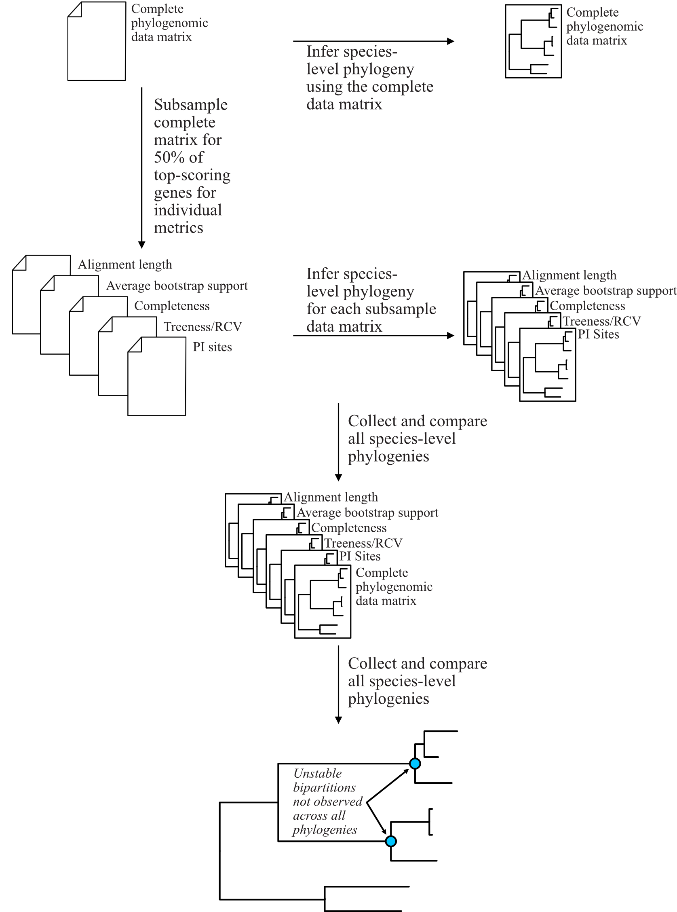

.. _tutorials:

Tutorials
=========

^^^^^

PhyKIT can be used for a multitude of different types of analyses. Documentation here 
provides a step-by-step outline for how to conduct three different types of analyses.

1. summarizing information content among multiple sequence alignments and phylogenies for diagnostic purposes,
2. evaluating gene-gene covariation to identify genes of shared function and screen for novel gene function, and
3. identify polytomies in species phylogenies, which are suggestive of rapid radiation or diversification events

|

1. Summarizing information content
##################################

^^^^^

PhyKIT implements numerous functions that can be used to examine the information content and help researchers 
summarize information content and identify potential biases in multiple sequence alignments and phylogenies.

Among other uses, one use of summarizing information content is to facilitate subsampling larger phylogenomic
data matrices to further explore tree space during species-level tree inference or for divergence time estimation.
(`Salichos and Rokas 2013 <https://www.nature.com/articles/nature12130>`_;
`Liu et al. 2017 <https://www.pnas.org/content/114/35/E7282>`_;
`Smith et al. 2018 <https://journals.plos.org/plosone/article?id=10.1371/journal.pone.0197433>`_;
`Shen et al. 2018 <https://www.cell.com/cell/fulltext/S0092-8674(18)31332-1?_returnURL=https%3A%2F%2Flinkinghub.elsevier.com%2Fretrieve%2Fpii%2FS0092867418313321%3Fshowall%3Dtrue>`_
& `2020 <https://www.biorxiv.org/content/10.1101/2020.05.11.088658v1>`_;
`Steenwyk et al. 2019 <https://mbio.asm.org/content/10/4/e00925-19>`_;
`Walker et al. 2019 <https://peerj.com/articles/7747/>`_;
`Li et al. 2020 <https://www.biorxiv.org/content/10.1101/2020.08.23.262857v1>`_)

The information content summarized in the remainder of this section are associated with strong phylogenetic signal
(or robust and accurate tree inference). When subsampling genes, a researcher could take a fraction of the best
scoring phylogenies to reinfer species-level relationships or divergence times (e.g., robustly supported phylogenies
and genes that do not violate clock-like patterns of evolution).

For example, in `Steenwyk et al. 2019 <https://mbio.asm.org/content/10/4/e00925-19>`_, we subsampled the complete
phylogenomic data matrix for 50% of genes that had the best score for various matrices. Using the subsampled matrices,
we reinferred species trees and compared the topologies across all species-level phylogenies. Bipartitions that were
not recovered in all analyses were considered unstable. The following figure depicts the general pipeline we used (note,
some of the metrics have been modified following newer insights).

In this tutorial, we will use the following test multiple sequence alignment and phylogenetic tree, which came
from `Steenwyk et al. 2019 <https://mbio.asm.org/content/10/4/e00925-19>`_. |br|

.. centered::
   Download test data:
   :download:`Multiple sequence alignment </data/Steenwyk_etal_mBio_2019_EOG091N44MS.aln.fa>`;
   :download:`Single-gene phylogeny </data/Steenwyk_etal_mBio_2019_EOG091N44MS.tre>`

|

Alignment length
****************

Alignment length and the length of an alignment excluding sites with gaps is associated with
robust and accurate tree inferences
(`Shen et al. 2016 <https://academic.oup.com/gbe/article/8/8/2565/2198327>`_).
Calculate alignment length with the following command:

.. code-block:: shell

   phykit aln_len Steenwyk_etal_mBio_2019_EOG091N44MS.aln.fa 
   624

to exclude alignment gaps, use the following option

.. code-block:: shell

   phykit aln_len_no_gaps Steenwyk_etal_mBio_2019_EOG091N44MS.aln.fa 
   321     624     51.4423

col1: number of sites without gaps |br|
col2: total number of sites |br|
col3: percentage of sites without gaps

|

Bipartition support statistics
******************************

High average bipartition in a phylogeny is associated with robust bipartition support
(`Salichos and Rokas 2013 <https://www.nature.com/articles/nature12130>`_;
`Shen et al. 2016 <https://academic.oup.com/gbe/article/8/8/2565/2198327>`_). Thus,
genes with high bipartition support values have greater certainty among bipartitions.
Calculate bipartition support summary statistics with the following command:

.. code-block:: shell

   phykit bss Steenwyk_etal_mBio_2019_EOG091N44MS.tre 
   mean: 88.6437
   median: 99
   25th percentile: 83.0
   75th percentile: 100.0
   minimum: 28
   maximum: 100
   standard deviation: 18.5504
   variance: 344.1157

|

Long branch score
*****************

Long branch scores (or LB scores) help determine taxa that may be contributing to long-branch
problems
(`Struck 2014 <https://journals.sagepub.com/doi/10.4137/EBO.S14239>`_;). 
Similarly, the standard deviation of LB scores among taxa can be used as a measure of heterogeneity.
To calculate summary statistics of LB scores for all taxa in a given phylogeny, use the following command:

.. code-block:: shell

   phykit lb_score Steenwyk_etal_mBio_2019_EOG091N44MS.tre 
   mean: -1.1111
   median: -14.4566
   25th percentile: -17.8686
   75th percentile: -3.4048
   minimum: -23.7982
   maximum: 211.1845
   standard deviation: 39.1931
   variance: 1536.0987

LB scores of individual taxa are also information to diagnose taxa driving long-branch problems. 
The lower the values, the less susceptible the taxon is to long-branch problems. To get 
the LB score of each taxa, use the verbose option: 

.. code-block:: shell

   phykit lb_score Steenwyk_etal_mBio_2019_EOG091N44MS.tre --verbose
   Aspergillus_aculeatus   -13.7403
   Aspergillus_arachidicola        -15.382
   Aspergillus_parasiticus -15.2214
   Aspergillus_sojae       -15.2627
   Aspergillus_flavus      -14.7755
   Aspergillus_oryzae      -14.7755
   Aspergillus_bombycis    -11.1987
   ...                     ...

|

Parsimony informative sites
***************************

The number of parsimony informative sites in an alignment is associated with strong phylogenetic signal.
(`Shen et al. 2016 <https://academic.oup.com/gbe/article/8/8/2565/2198327>`_;
`Steenwyk et al. 2020 <https://www.biorxiv.org/content/10.1101/2020.06.08.140384v1>`_).
Calculate the number of parsimony informative sites in an alignment with the following command:

.. code-block:: shell

   phykit pis Steenwyk_etal_mBio_2019_EOG091N44MS.aln.fa
   517     624     82.8526

col1: number of parsimony informative sites |br|
col2: total number of sites |br|
col3: percentage of parsimony informative sites

|

Saturation
**********

Saturation in a multiple sequence alignments is driven by sites with multiple substitutions and results in 
the alignment underestimating real genetic distances among taxa. Values of 1 have no saturation and values 
of 0 are completely saturated by multiple substitutions
(`Philippe et al. 2011 <https://journals.plos.org/plosbiology/article?id=10.1371/journal.pbio.1000602>`_).
Estimate saturation with the following command:

.. code-block:: shell

   phykit sat -a Steenwyk_etal_mBio_2019_EOG091N44MS.aln.fa -t Steenwyk_etal_mBio_2019_EOG091N44MS.tre
   0.6835

|

Treeness divided by relative composition variability
****************************************************

Treeness divided by relative composition variability (treeness/RCV) is associated with strong
phylogenetic signal. Higher treeness and lower RCV values are indicative of a lower potential for
bias (composition-based or otherwise) and a lower degree of composition bias. Thus, higher treeness/RCV
values are indicative of genes less susceptible to composition and other biases.
(`Lanyon 1988 <https://academic.oup.com/auk/article-abstract/105/3/565/5193152?redirectedFrom=fulltext>`_;
`Phillips and Penny 2003 <http://people.bu.edu/msoren/Phillips.pdf>`_;
`Shen et al. 2016 <https://academic.oup.com/gbe/article/8/8/2565/2198327>`_).
Calculate treeness/RCV using the following command:

.. code-block:: shell

   phykit toverr -a Steenwyk_etal_mBio_2019_EOG091N44MS.aln.fa -t Steenwyk_etal_mBio_2019_EOG091N44MS.tre 
   3.9773  0.5136  0.1291

col1: treeness/RCV |br|
col2: treeness |br|
col3: RCV

To individually calculate treeness, a measure of signal-to-noise among branch lengths
(`Lanyon 1988 <https://academic.oup.com/auk/article-abstract/105/3/565/5193152?redirectedFrom=fulltext>`_;
`Phillips and Penny 2003 <http://people.bu.edu/msoren/Phillips.pdf>`_),
and RCV, a measure of composition bias (`Phillips and Penny 2003 <http://people.bu.edu/msoren/Phillips.pdf>`_),
use the following commands:

.. code-block:: shell

   # calculate treeness
   phykit tness Steenwyk_etal_mBio_2019_EOG091N44MS.tre 
   0.5136

   # calculate RCV
   phykit rcv Steenwyk_etal_mBio_2019_EOG091N44MS.aln.fa 
   0.1291

|

Variable sites
**************

The number of variable sites in an alignment is associated with strong phylogenetic signal.
(`Shen et al. 2016 <https://academic.oup.com/gbe/article/8/8/2565/2198327>`_).
Calculate the number of variable sites with the following command:

.. code-block:: shell

   phykit vs Steenwyk_etal_mBio_2019_EOG091N44MS.aln.fa 
   555     624     88.9423

col1: number of variable sites |br|
col2: total number of sites |br|
col3: percentage of variable sites

|

2. Evaluating gene-gene covariation
###################################

^^^^^

Identifying genes that significantly covary (or coevolve) with one another is known to accurately and sensitively 
identify genes with shared functions, are coexpressed, and/or are part of the same multimeric complexes 
(`Sato et al. 2005 <https://academic.oup.com/bioinformatics/article/21/17/3482/212654>`_; 
`Clark et al. 2012 <https://genome.cshlp.org/content/22/4/714.full>`_).
Furthermore, gene-gene covariation serves as a powerful evolution-based genetic screen for predicting gene function
(`Brunette et al. 2019 <https://www.pnas.org/content/116/39/19593>`_).

PhyKIT implements a mirror-tree-based method to identify genes that covary with one another. In principle, PhyKIT
determines if two trees have similar branch length properties throughout the phylogeny. Thus, each input phylogeny
must have the same topology. However, there are other steps that must be done prior to evaluating covariation
between two genes. 

To provide a comprehensive tutorial, we will start with the sequence alignments for three genes and their constrained 
tree topologies that match the putative species tree from `Shen et al. 2020
<https://www.biorxiv.org/content/10.1101/2020.05.11.088658v1.abstract>`_. 

.. centered::
   Download test data:
   :download:`gene_gene_covariation_tutorial.tar.gz </data/gene_gene_covariation_tutorial.tar.gz>`

|

Step 0: Prepare data
********************
The mirror tree method for determining significant gene-gene covariation requires that both input phylogenies have the same topology.
As a result, gene trees must be constrained to the species tree, which is typically inferred from whole genome or proteome data.
In the present tutorial, the species tree has already been inferred. Additionally, the guide trees used to constrain the gene trees
have been generated. These trees were generated by pruning the species tree to match the taxon representation of the sequences in
the multiple sequence alignment.

Step 1: Estimate gene tree branch lengths
*****************************************
To infer the constrained tree, we will use `IQ-TREE2 <http://www.iqtree.org/>`_. The species tree (or guide tree) is specified
with the *-g* argument. Lastly, the best-fitting substitution model was specified according to what was reported in 
`Shen et al. 2020 <https://www.biorxiv.org/content/10.1101/2020.05.11.088658v1.abstract>`_ supplementary data; however,
if the best-fitting model is unknown, this will have to be determined prior to estimating gene tree branch lengths.

Estimate the gene tree branch lengths using the following commands:

.. code-block:: shell

   # infer constrain trees
   iqtree2 -s Shen_etal_SciAdv_2020_NDC80.fa -g Shen_etal_SciAdv_2020_NDC80.constrained.tre -pre Shen_etal_SciAdv_2020_NDC80 -m JTT+G4+F
   iqtree2 -s Shen_etal_SciAdv_2020_NUF2.fa -g Shen_etal_SciAdv_2020_NUF2.constrained.tre -pre Shen_etal_SciAdv_2020_NUF2 -m LG+G4
   iqtree2 -s Shen_etal_SciAdv_2020_SEC7.fa -g Shen_etal_SciAdv_2020_SEC7.constrained.tre -pre Shen_etal_SciAdv_2020_SEC7 -m LG+G4

Step 2: Evaluate gene-gene covariation
**************************************
When determining gene-gene covariation, it is best to use a high significance threshold for correlation coefficients.
I consider a threshold of 0.825 to be very conservative and that 0.8 is often sufficiently conservative. I like to be cautious
so I recommend using a threshold of 0.825. 

To evaluate gene-gene covariation, execute the following commands:

.. code-block:: shell

   # Evaluate gene-gene covariation between NUF2 and SEC7
   phykit cover Shen_etal_SciAdv_2020_NUF2.treefile Shen_etal_SciAdv_2020_SEC7.treefile -r Shen_etal_SciAdv_2020_species_tree.tre
   0.7496  0.0

   # Evaluate gene-gene covariation between NDC80 and SEC7
   phykit cover Shen_etal_SciAdv_2020_NDC80.treefile Shen_etal_SciAdv_2020_SEC7.treefile -r Shen_etal_SciAdv_2020_species_tree.tre
   0.763   0.0

Given our thresholds, neither *NUF2* nor *NDC80* significantly covary with *SEC7*. Next, evaluate gene-gene covariation between
*NUF2* and *NDC80*.

.. code-block:: shell

   # Evaluate gene-gene covariation between NUF2 and NDC80
   phykit cover Shen_etal_SciAdv_2020_NUF2.treefile Shen_etal_SciAdv_2020_NDC80.treefile -r Shen_etal_SciAdv_2020_species_tree.tre
   0.8448  0.0

These two genes significantly covary with one another. This raises the hypothesis that these two genes have shared function. A literature-
based examination of these genes reveals the encoded proteins are part of the same kinetochore-associated complex termed the 
`NDC80 complex <https://www.yeastgenome.org/complex/CPX-548>`_. Thus, PhyKIT is useful for determining gene-gene covariation, which can be 
driven by shared function, coexpression, and/or are part of the same multimeric complexes.

|

3. Identifying signatures of rapid radiations
#############################################

^^^^^

Signatures of rapid radiations or diversification events can be identified by pinpointing polytomies in a putative species tree
(`Sayyari and Mirarab 2018 <https://www.mdpi.com/2073-4425/9/3/132>`_;
`One Thousand Plant Transcriptomes Initiative 2019 <https://www.nature.com/articles/s41586-019-1693-2>`_;
`Li et al. 2020 <https://www.biorxiv.org/content/10.1101/2020.08.23.262857v1>`_). 

PhyKIT uses a gene-based approach to evaluate polytomies. In other words, PhyKIT will determine what topology each gene supports.
Thereafter, PhyKIT will conduct a chi-squared test to determine if there is equal support among gene trees for the various topologies.
In the chi-squared test, the null hypothesis is that there is equal support among gene trees for the various topologies and the
alternative hypothesis is that there is unequal support for the various topologies. Thus, failing to reject the null hypothesis
would indicate that there is a polytomy where as rejecting the null hypothesis would indicate there is no polytomy.
The various topologies examined by PhyKIT are determined by the groups file. Formatting this file will be explained later. 

To demonstrate how to identify polytomies, we will use a subset of 250 gene phylogenies from 
`Steenwyk et al. 2019 <https://mbio.asm.org/content/10/4/e00925-19>`_. 

.. centered::
   Download test data:
   :download:`polytomy_tutorial.tar.gz </data/polytomy_tutorial.tar.gz>`

|

Step 0: Prepare data
********************

For this tutorial, the data has already been formatted for the user. There are two input files for the polytomy testing function:

1. a file that specifies the location of gene trees
2. a file that specifies the groups to test

Thus, this tutorial assumes that gene phylogenies have already been inferred and the area of the phylogeny that the user wishes to
test for a polytomy has already been identified.

Examination of the first file reveals that that it is a single column file that specifies the pathing of gene phylogenies to use
during polytomy testing. Examination of the second file reveals that groups are specified using a tab-separated five column file.

*column 1:* an identifier for the test, which is not used by PhyKIT. Instead, this column is intended to be for the user to write any
keywords or notes that can help remind them of what they were testing.

*column 2-4:* the tip names in the groups. Each column represents a single group to conduct polytomy testing for. If a group has multiple
taxa, separate each tip name using a semi-colon ';'. For example, in *groups_file0.txt* there is one group with *Aspergillus_persii;Aspergillus_sclerotiorum*
wherein this group has two taxa, *Aspergillus_persii* and *Aspergillus_sclerotiorum*.

*column 5:* the outgroup taxa. This column specifies the name of outgroup taxa, which are used to root the gene trees prior to 
determining what topology they support.

Step 1: Conduct polytomy test
*****************************
Among the groups that have already been predetermined for the user, we will first conduct a polytomy test for *groups_file0.txt*. To 
execute the polytomy test, use the following command:

.. code-block:: shell

   phykit ptt -t filamentous_fungi_250_trees.txt -g groups_file0.txt 
   Gene Support Frequency Results
   ==============================
   chi-squared: 19.425
   p-value: 6.1e-05
   total genes: 240
   0-1: 103
   0-2: 49
   1-2: 88

*Note,* if you are getting an error, it may be due to improper pathing in *filamentous_fungi_250_trees.txt.* Please check this file and
modify it accordingly.

We will now go over the output of PhyKIT. PhyKIT will report the *chi-squared* value, the *p* value, the total number of genes used, followed
by the support of sister relationships examined. Here, the *chi-squared* value is very high and the *p* value is very low indicating
that the null hypothesis was rejected and that there is no evidence of a polytomy. The total number of genes used during the polytomy
test was 240. However, you may have noticed that there were 250 genes used as input. This discrepancy is not an error but may be caused by 
two different reasons. (1) 10 genes were unable to be used due to incomplete taxon representation in the groups and (2) PhyKIT can account
for gene phylogenies uncertainty (i.e., gene phylogenies with collapsed bipartitions), which may render the support of a given gene tree
to be uncertain and therefore not be used during polytomy testing.

Next, the section *0-1, 0-2,* and *1-2* refers to the sister relationships between the groups. Group 0 is specified in column 2 of the 
groups file while group 1 and group 2 are specified in columns 3 and 4, respectively. Thus, *0-1* refers to the following topology 
*(((0,1),2),outgroup);* whereas *0-2* and *1-2* refers to the following topologies *(((0,2),1),outgroup);* and *(((1,2),0),outgroup);*,
respectively. PhyKIT identified that 103 gene phylogenies support *(((0,1),2),outgroup);* whereas 49 and 88 gene phylogenies support 
the topologies *(((0,2),1),outgroup);* and *(((1,2),0),outgroup);*, respectively.

|

Next, conduct a polytomy test using the other group file using the following command:

.. code-block:: shell

   phykit ptt -t filamentous_fungi_250_trees.txt -g groups_file1.txt 
   Gene Support Frequency Results
   ==============================
   chi-squared: 0.129
   p-value: 0.937521
   total genes: 248
   0-1: 84
   0-2: 84
   1-2: 80

In contrast to the previous test, the *chi-squared* value is very low and the *p* value is very high indicating a failure to reject the null
hypothesis. Thus, there is a signature of rapid radiation or diversification event for these groups. Additional details provided by PhyKIT
reveal 248 genes were used during the polytomy test and that there is nearly equal support for the various topologies. 

Taken together, this tutorial reveals how to identify signatures of rapid radiation or diversification events in phylogenomic data.

|

4. Evaluating the accuracy of a multiple sequence alignment
###########################################################

^^^^^

Evaluating the accuracy of multiple sequence alignments is an appropriate way to benchmark multiple sequence alignment strategies.
Two popular methods to assess multiple sequence alignment accuracy are sum-of-pairs score and column score, which were introduced by
Thompson et al., Nucleic Acids Research (1999), doi: 10.1093/nar/27.13.2682. Sum-of-pairs is calculated by summing the correctly
aligned residue pairs over all pairs of sequences. Column score is calculated by summing the correctly aligned columns over all 
columns in an alignment. Both metrics range from 0 to 1 and higher values indicate more accurate alignments. Correctly aligned
pairs or columns require knowing some ground truth of what the correct alignment is. Thus, a reference alignment that is 
perfectly (or near-perfectly) aligned is required. A reference alignment can be generated using simulations or be obtained from
publicly available databases such as BAliBASE 4 (http://www.lbgi.fr/balibase/). For this tutorial we will use a reference alignment
from BAliBASE.

.. centered::
   Download test data:
   :download:`msa_accuracy.tar.gz </data/msa_accuracy.tar.gz>`

|

Step 0: Generate query alignments
*********************************
In the *msa_accuracy* directory, there are two fasta files: *BBA0001_query.faa*, an unaligned set of sequences and *BBA0001_reference.faa*,
the reference alignment. We will align *BBA0001_query.faa* using three different strategies implemented in Mafft, v.7.475
(https://mafft.cbrc.jp/alignment/software/), and evaluate the accuracy of each strategy.

To do so, please ensure Mafft is installed and then execute the following commands:

.. code-block:: shell

   # first alignment
   mafft --localpair BBA0001_query.faa > BBA0001_query.localpair.faa

   # second alignment
   mafft --genafpair BBA0001_query.faa > BBA0001_query.genafpair.faa

   # third alignment
   mafft --globalpair BBA0001_query.faa > BBA0001_query.globalpair.faa

To gain some initial insight as to whether the alignments differ, we can look at the length
of each alignment using the *aln_len* function

.. code-block:: shell

   for i in $(ls *pair.faa) ; do phykit aln_len $i ; done
   1560
   1464
   1497

However, alignment length is not a measurement of accuracy. Thus, we will score each alignment
using the *sum_of_pairs_score* and *column_score* functions. 

|

Step 1: Score each alignment
****************************
For both functions, the first argument is the query alignment and the *-r/\\-\\-reference* argument specifies the reference alignment.
We will programmatically score each alignment using the same for loop that was used to calculate alignment length.

.. code-block:: shell

   echo -e "BAliBASE_id_and_aln_strategy\tsop\tcs"
   for i in $(ls *pair.faa)
   do
      sop=$(phykit sum_of_pairs_score $i -r BBA0001_reference.faa)
      cs=$(phykit column_score $i -r BBA0001_reference.faa)
      echo -e "$i\t$sop\t$cs"
   done
   BAliBASE_id_and_aln_strategy	sop	cs
   BBA0001_query.genafpair.faa	0.8964	0.2943
   BBA0001_query.globalpair.faa	0.9025	0.292
   BBA0001_query.localpair.faa	0.8992	0.2959

Examination of the output reveals that the *globalpair* strategy has more correctly aligned pairs because it has a higher sum-of-pairs
score whereas the *localpair* strategy has more correctly aligned columns. Of note, the column scores are generally low, which 
reflects a potential limitation of column score wherein column score is sensitive to alignment errors.

In summary, calculating sum-of-pairs score and column score can help assess the accuracy of multiple sequence alignment strategies.

|

.. |br| raw:: html

   

img.align-center {
    margin-left: auto;
    margin-right: auto;
    display: block;
}