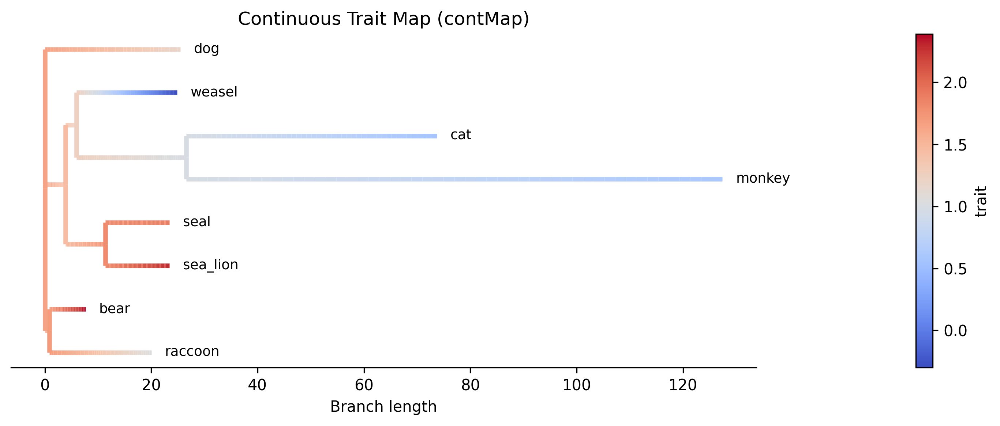
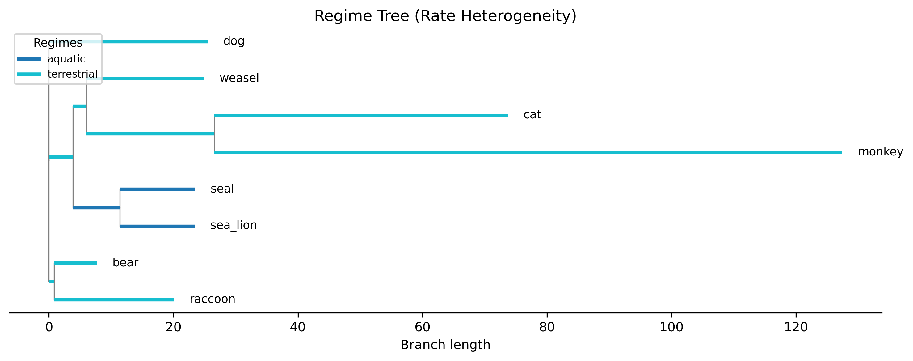
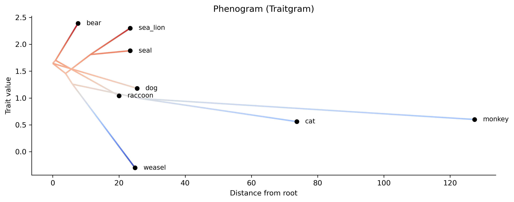
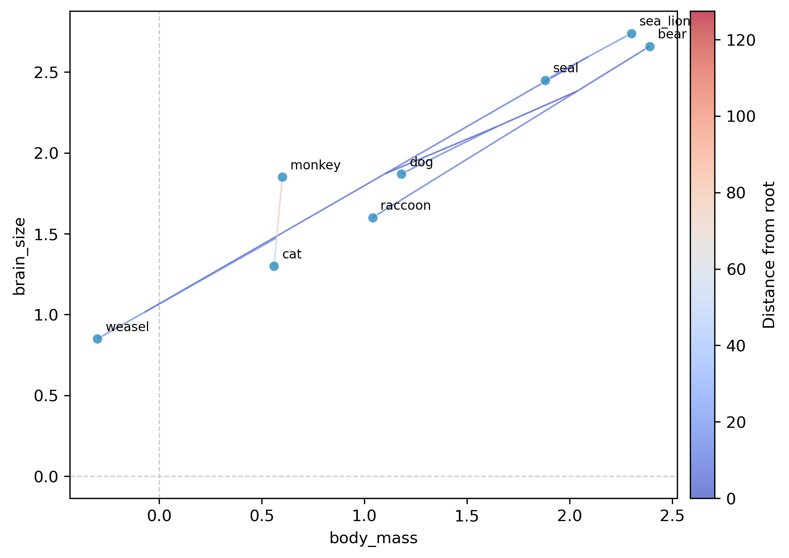
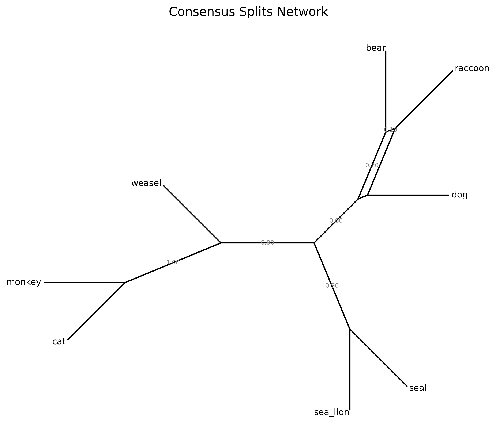
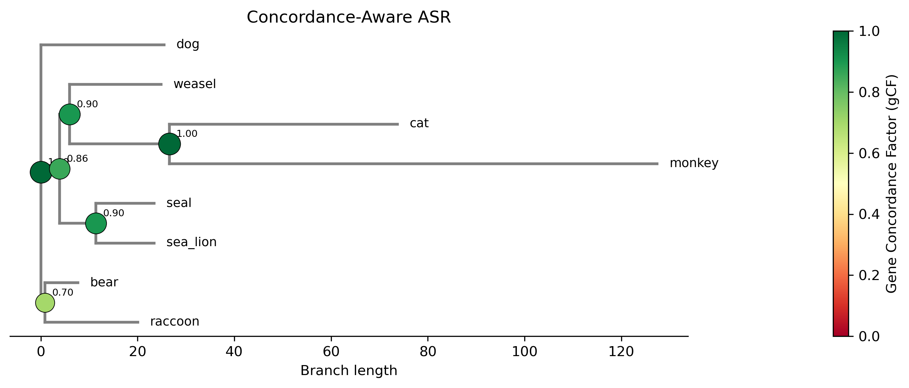

.. _tutorials:

Tutorials
=========

PhyKIT can be used for a multitude of different types of analyses. Documentation here 
provides a step-by-step outline for how to conduct different types of analyses.

|

1. Summarizing information content
##################################

PhyKIT implements numerous functions that can be used to examine the information content and help researchers 
summarize information content and identify potential biases in multiple sequence alignments and phylogenies.

Among other uses, one use of summarizing information content is to facilitate subsampling larger phylogenomic
data matrices to further explore tree space during species-level tree inference or for divergence time estimation.
(`Salichos and Rokas 2013 <https://www.nature.com/articles/nature12130>`_;
`Liu et al. 2017 <https://www.pnas.org/content/114/35/E7282>`_;
`Smith et al. 2018 <https://journals.plos.org/plosone/article?id=10.1371/journal.pone.0197433>`_;
`Shen et al. 2018 <https://www.cell.com/cell/fulltext/S0092-8674(18)31332-1?_returnURL=https%3A%2F%2Flinkinghub.elsevier.com%2Fretrieve%2Fpii%2FS0092867418313321%3Fshowall%3Dtrue>`_
& `2020 <https://www.biorxiv.org/content/10.1101/2020.05.11.088658v1>`_;
`Steenwyk et al. 2019 <https://mbio.asm.org/content/10/4/e00925-19>`_;
`Walker et al. 2019 <https://peerj.com/articles/7747/>`_;
`Li et al. 2020 <https://www.biorxiv.org/content/10.1101/2020.08.23.262857v1>`_)

The information content summarized in the remainder of this section are associated with strong phylogenetic signal
(or robust and accurate tree inference). When subsampling genes, a researcher could take a fraction of the best
scoring phylogenies to reinfer species-level relationships or divergence times (e.g., robustly supported phylogenies
and genes that do not violate clock-like patterns of evolution).

For example, in `Steenwyk et al. 2019 <https://mbio.asm.org/content/10/4/e00925-19>`_, we subsampled the complete
phylogenomic data matrix for 50% of genes that had the best score for various matrices. Using the subsampled matrices,
we reinferred species trees and compared the topologies across all species-level phylogenies. Bipartitions that were
not recovered in all analyses were considered unstable. The following figure depicts the general pipeline we used (note,
some of the metrics have been modified following newer insights).

.. image:: ../_static/img/subsampling_pipeline.png  
   :align: center
   :width: 80%

In this tutorial, we will use the following test multiple sequence alignment and phylogenetic tree, which came
from `Steenwyk et al. 2019 <https://mbio.asm.org/content/10/4/e00925-19>`_. |br|

.. centered::
   Download test data:
   :download:`Multiple sequence alignment </data/Steenwyk_etal_mBio_2019_EOG091N44MS.aln.fa>`;
   :download:`Single-gene phylogeny </data/Steenwyk_etal_mBio_2019_EOG091N44MS.tre>`

|

Alignment length
****************

Alignment length and the length of an alignment excluding sites with gaps is associated with
robust and accurate tree inferences
(`Shen et al. 2016 <https://academic.oup.com/gbe/article/8/8/2565/2198327>`_).
Calculate alignment length with the following command:

.. code-block:: shell

   phykit aln_len Steenwyk_etal_mBio_2019_EOG091N44MS.aln.fa 
   624

to exclude alignment gaps, use the following option

.. code-block:: shell

   phykit aln_len_no_gaps Steenwyk_etal_mBio_2019_EOG091N44MS.aln.fa 
   321     624     51.4423

col1: number of sites without gaps |br|
col2: total number of sites |br|
col3: percentage of sites without gaps

|

Bipartition support statistics
******************************

High average bipartition in a phylogeny is associated with robust bipartition support
(`Salichos and Rokas 2013 <https://www.nature.com/articles/nature12130>`_;
`Shen et al. 2016 <https://academic.oup.com/gbe/article/8/8/2565/2198327>`_). Thus,
genes with high bipartition support values have greater certainty among bipartitions.
Calculate bipartition support summary statistics with the following command:

.. code-block:: shell

   phykit bss Steenwyk_etal_mBio_2019_EOG091N44MS.tre 
   mean: 88.6437
   median: 99
   25th percentile: 83.0
   75th percentile: 100.0
   minimum: 28
   maximum: 100
   standard deviation: 18.5504
   variance: 344.1157

|

Long branch score
*****************

Long branch scores (or LB scores) help determine taxa that may be contributing to long-branch
problems
(`Struck 2014 <https://journals.sagepub.com/doi/10.4137/EBO.S14239>`_;). 
Similarly, the standard deviation of LB scores among taxa can be used as a measure of heterogeneity.
To calculate summary statistics of LB scores for all taxa in a given phylogeny, use the following command:

.. code-block:: shell

   phykit lb_score Steenwyk_etal_mBio_2019_EOG091N44MS.tre 
   mean: -1.1111
   median: -14.4566
   25th percentile: -17.8686
   75th percentile: -3.4048
   minimum: -23.7982
   maximum: 211.1845
   standard deviation: 39.1931
   variance: 1536.0987

LB scores of individual taxa are also information to diagnose taxa driving long-branch problems. 
The lower the values, the less susceptible the taxon is to long-branch problems. To get 
the LB score of each taxa, use the verbose option: 

.. code-block:: shell

   phykit lb_score Steenwyk_etal_mBio_2019_EOG091N44MS.tre --verbose
   Aspergillus_aculeatus   -13.7403
   Aspergillus_arachidicola        -15.382
   Aspergillus_parasiticus -15.2214
   Aspergillus_sojae       -15.2627
   Aspergillus_flavus      -14.7755
   Aspergillus_oryzae      -14.7755
   Aspergillus_bombycis    -11.1987
   ...                     ...

|

Parsimony informative sites
***************************

The number of parsimony informative sites in an alignment is associated with strong phylogenetic signal.
(`Shen et al. 2016 <https://academic.oup.com/gbe/article/8/8/2565/2198327>`_;
`Steenwyk et al. 2020 <https://www.biorxiv.org/content/10.1101/2020.06.08.140384v1>`_).
Calculate the number of parsimony informative sites in an alignment with the following command:

.. code-block:: shell

   phykit pis Steenwyk_etal_mBio_2019_EOG091N44MS.aln.fa
   517     624     82.8526

col1: number of parsimony informative sites |br|
col2: total number of sites |br|
col3: percentage of parsimony informative sites

|

Saturation
**********

Saturation in a multiple sequence alignments is driven by sites with multiple substitutions and results in 
the alignment underestimating real genetic distances among taxa. Values of 1 have no saturation and values 
of 0 are completely saturated by multiple substitutions
(`Philippe et al. 2011 <https://journals.plos.org/plosbiology/article?id=10.1371/journal.pbio.1000602>`_).
Estimate saturation with the following command:

.. code-block:: shell

   phykit sat -a Steenwyk_etal_mBio_2019_EOG091N44MS.aln.fa -t Steenwyk_etal_mBio_2019_EOG091N44MS.tre
   0.3017  0.6983

|

Treeness divided by relative composition variability
****************************************************

Treeness divided by relative composition variability (treeness/RCV) is associated with strong
phylogenetic signal. Higher treeness and lower RCV values are indicative of a lower potential for
bias (composition-based or otherwise) and a lower degree of composition bias. Thus, higher treeness/RCV
values are indicative of genes less susceptible to composition and other biases.
(`Lanyon 1988 <https://academic.oup.com/auk/article-abstract/105/3/565/5193152?redirectedFrom=fulltext>`_;
`Phillips and Penny 2003 <http://people.bu.edu/msoren/Phillips.pdf>`_;
`Shen et al. 2016 <https://academic.oup.com/gbe/article/8/8/2565/2198327>`_).
Calculate treeness/RCV using the following command:

.. code-block:: shell

   phykit toverr -a Steenwyk_etal_mBio_2019_EOG091N44MS.aln.fa -t Steenwyk_etal_mBio_2019_EOG091N44MS.tre 
   5.0727  0.5136  0.1013

col1: treeness/RCV |br|
col2: treeness |br|
col3: RCV

To individually calculate treeness, a measure of signal-to-noise among branch lengths
(`Lanyon 1988 <https://academic.oup.com/auk/article-abstract/105/3/565/5193152?redirectedFrom=fulltext>`_;
`Phillips and Penny 2003 <http://people.bu.edu/msoren/Phillips.pdf>`_),
and RCV, a measure of composition bias (`Phillips and Penny 2003 <http://people.bu.edu/msoren/Phillips.pdf>`_),
use the following commands:

.. code-block:: shell

   # calculate treeness
   phykit tness Steenwyk_etal_mBio_2019_EOG091N44MS.tre 
   0.5136

   # calculate RCV
   phykit rcv Steenwyk_etal_mBio_2019_EOG091N44MS.aln.fa 
   0.1013

|

Variable sites
**************

The number of variable sites in an alignment is associated with strong phylogenetic signal.
(`Shen et al. 2016 <https://academic.oup.com/gbe/article/8/8/2565/2198327>`_).
Calculate the number of variable sites with the following command:

.. code-block:: shell

   phykit vs Steenwyk_etal_mBio_2019_EOG091N44MS.aln.fa 
   555     624     88.9423

col1: number of variable sites |br|
col2: total number of sites |br|
col3: percentage of variable sites

|

2. Evaluating gene-gene covariation
###################################

Identifying genes that significantly covary (or coevolve) with one another is known to accurately and sensitively 
identify genes with shared functions, are coexpressed, and/or are part of the same multimeric complexes 
(`Sato et al. 2005 <https://academic.oup.com/bioinformatics/article/21/17/3482/212654>`_; 
`Clark et al. 2012 <https://genome.cshlp.org/content/22/4/714.full>`_).
Furthermore, gene-gene covariation serves as a powerful evolution-based genetic screen for predicting gene function
(`Brunette et al. 2019 <https://www.pnas.org/content/116/39/19593>`_).

PhyKIT implements a mirror-tree-based method to identify genes that covary with one another. In principle, PhyKIT
determines if two trees have similar branch length properties throughout the phylogeny. Thus, each input phylogeny
must have the same topology. However, there are other steps that must be done prior to evaluating covariation
between two genes. 

To provide a comprehensive tutorial, we will start with the sequence alignments for three genes and their constrained 
tree topologies that match the putative species tree from `Shen et al. 2020
<https://www.biorxiv.org/content/10.1101/2020.05.11.088658v1.abstract>`_. 

.. centered::
   Download test data:
   :download:`gene_gene_covariation_tutorial.tar.gz </data/gene_gene_covariation_tutorial.tar.gz>`

|

Step 0: Prepare data
********************
The mirror tree method for determining significant gene-gene covariation requires that both input phylogenies have the same topology.
As a result, gene trees must be constrained to the species tree, which is typically inferred from whole genome or proteome data.
In the present tutorial, the species tree has already been inferred. Additionally, the guide trees used to constrain the gene trees
have been generated. These trees were generated by pruning the species tree to match the taxon representation of the sequences in
the multiple sequence alignment.

Step 1: Estimate gene tree branch lengths
*****************************************
To infer the constrained tree, we will use `IQ-TREE2 <http://www.iqtree.org/>`_. The species tree (or guide tree) is specified
with the *-g* argument. Lastly, the best-fitting substitution model was specified according to what was reported in 
`Shen et al. 2020 supplementary data <https://jlsteenwyk.com/publication_pdfs/2020_Shen_etal_Science_Advances.pdf>`_; however,
if the best-fitting model is unknown, this will have to be determined prior to estimating gene tree branch lengths.

Estimate the gene tree branch lengths using the following commands:

.. code-block:: shell

   # infer constrain trees
   iqtree2 -s Shen_etal_SciAdv_2020_NDC80.fa -te Shen_etal_SciAdv_2020_NDC80.constrained.tre -pre Shen_etal_SciAdv_2020_NDC80 -m JTT+G4+F -keep-ident
   iqtree2 -s Shen_etal_SciAdv_2020_NUF2.fa -te Shen_etal_SciAdv_2020_NUF2.constrained.tre -pre Shen_etal_SciAdv_2020_NUF2 -m LG+G4 -keep-ident
   iqtree2 -s Shen_etal_SciAdv_2020_SEC7.fa -te Shen_etal_SciAdv_2020_SEC7.constrained.tre -pre Shen_etal_SciAdv_2020_SEC7 -m LG+G4 -keep-ident

Step 2: Root constrain trees
****************************
To ensure PhyKIT traverses each tree the same, root each tree using the outgroup taxa. PhyKIT has
a function for rooting and takes as input a single column file with the names of the outgroup taxa.
For sake of simplicity, I have provided the necessary input files.

Root the trees with the inferred branch lengths using the following commands:

.. code-block:: shell

   # root trees
   pk_root Shen_etal_SciAdv_2020_NUF2.treefile -r Shen_etal_SciAdv_2020_NUF2_taxa_for_rooting.txt -o Shen_etal_SciAdv_2020_NUF2.treefile.rooted
   pk_root Shen_etal_SciAdv_2020_SEC7.treefile -r Shen_etal_SciAdv_2020_SEC7_taxa_for_rooting.txt -o Shen_etal_SciAdv_2020_SEC7.treefile.rooted
   pk_root Shen_etal_SciAdv_2020_NDC80.treefile -r Shen_etal_SciAdv_2020_NDC80_taxa_for_rooting.txt -o Shen_etal_SciAdv_2020_NDC80.treefile.rooted

Step 3: Evaluate gene-gene covariation
**************************************
When determining gene-gene covariation, it is best to use a high significance threshold for coevolutionary coefficients.
Here, we will use a threshold of 0.5; however, I recommend users explore their own data and distribution of coevolutionary 
coefficients.

To evaluate gene-gene covariation, execute the following commands:

.. code-block:: shell

   # Evaluate gene-gene covariation between NUF2 and SEC7
   phykit cover Shen_etal_SciAdv_2020_NUF2.treefile.rooted Shen_etal_SciAdv_2020_SEC7.treefile.rooted -r Shen_etal_SciAdv_2020_species_tree.tre
   0.1885  0.0

   # Evaluate gene-gene covariation between NDC80 and SEC7
   phykit cover Shen_etal_SciAdv_2020_NDC80.treefile.rooted Shen_etal_SciAdv_2020_SEC7.treefile.rooted -r Shen_etal_SciAdv_2020_species_tree.tre
   0.2105   0.0

Given our thresholds, neither *NUF2* nor *NDC80* significantly covary with *SEC7*. Next, evaluate gene-gene covariation between
*NUF2* and *NDC80*.

.. code-block:: shell

   # Evaluate gene-gene covariation between NUF2 and NDC80
   phykit cover Shen_etal_SciAdv_2020_NUF2.treefile.rooted Shen_etal_SciAdv_2020_NDC80.treefile.rooted -r Shen_etal_SciAdv_2020_species_tree.tre
   0.6693  0.0

These two genes significantly covary with one another. This raises the hypothesis that these two genes have shared function. A literature-
based examination of these genes reveals the encoded proteins are part of the same kinetochore-associated complex termed the 
`NDC80 complex <https://www.yeastgenome.org/complex/CPX-548>`_. Thus, PhyKIT is useful for determining gene-gene covariation, which can be 
driven by shared function, coexpression, and/or are part of the same multimeric complexes.

|

3. Identifying signatures of rapid radiations
#############################################

Signatures of rapid radiations or diversification events can be identified by pinpointing polytomies in a putative species tree
(`Sayyari and Mirarab 2018 <https://www.mdpi.com/2073-4425/9/3/132>`_;
`One Thousand Plant Transcriptomes Initiative 2019 <https://www.nature.com/articles/s41586-019-1693-2>`_;
`Li et al. 2020 <https://www.biorxiv.org/content/10.1101/2020.08.23.262857v1>`_). 

PhyKIT uses a gene-based approach to evaluate polytomies. In other words, PhyKIT will determine what topology each gene supports.
Thereafter, PhyKIT will conduct a chi-squared test to determine if there is equal support among gene trees for the various topologies.
In the chi-squared test, the null hypothesis is that there is equal support among gene trees for the various topologies and the
alternative hypothesis is that there is unequal support for the various topologies. Thus, failing to reject the null hypothesis
would indicate that there is a polytomy where as rejecting the null hypothesis would indicate there is no polytomy.
The various topologies examined by PhyKIT are determined by the groups file. Formatting this file will be explained later. 

To demonstrate how to identify polytomies, we will use a subset of 250 gene phylogenies from 
`Steenwyk et al. 2019 <https://mbio.asm.org/content/10/4/e00925-19>`_. 

.. centered::
   Download test data:
   :download:`polytomy_tutorial.tar.gz </data/polytomy_tutorial.tar.gz>`

|

Step 0: Prepare data
********************

For this tutorial, the data has already been formatted for the user. There are two input files for the polytomy testing function:

1. a file that specifies the location of gene trees
2. a file that specifies the groups to test

Thus, this tutorial assumes that gene phylogenies have already been inferred and the area of the phylogeny that the user wishes to
test for a polytomy has already been identified.

Examination of the first file reveals that that it is a single column file that specifies the pathing of gene phylogenies to use
during polytomy testing. Examination of the second file reveals that groups are specified using a tab-separated five column file.

*column 1:* an identifier for the test, which is not used by PhyKIT. Instead, this column is intended to be for the user to write any
keywords or notes that can help remind them of what they were testing.

*column 2-4:* the tip names in the groups. Each column represents a single group to conduct polytomy testing for. If a group has multiple
taxa, separate each tip name using a semi-colon ';'. For example, in *groups_file0.txt* there is one group with *Aspergillus_persii;Aspergillus_sclerotiorum*
wherein this group has two taxa, *Aspergillus_persii* and *Aspergillus_sclerotiorum*.

*column 5:* the outgroup taxa. This column specifies the name of outgroup taxa, which are used to root the gene trees prior to 
determining what topology they support.

Step 1: Conduct polytomy test
*****************************
Among the groups that have already been predetermined for the user, we will first conduct a polytomy test for *groups_file0.txt*. To 
execute the polytomy test, use the following command:

.. code-block:: shell

   phykit ptt -t filamentous_fungi_250_trees.txt -g groups_file0.txt 
   Gene Support Frequency Results
   ==============================
   chi-squared: 19.425
   p-value: 6.1e-05
   total genes: 240
   0-1: 103
   0-2: 49
   1-2: 88

*Note,* if you are getting an error, it may be due to improper pathing in *filamentous_fungi_250_trees.txt.* Please check this file and
modify it accordingly.

We will now go over the output of PhyKIT. PhyKIT will report the *chi-squared* value, the *p* value, the total number of genes used, followed
by the support of sister relationships examined. Here, the *chi-squared* value is very high and the *p* value is very low indicating
that the null hypothesis was rejected and that there is no evidence of a polytomy. The total number of genes used during the polytomy
test was 240. However, you may have noticed that there were 250 genes used as input. This discrepancy is not an error but may be caused by 
two different reasons. (1) 10 genes were unable to be used due to incomplete taxon representation in the groups and (2) PhyKIT can account
for gene phylogenies uncertainty (i.e., gene phylogenies with collapsed bipartitions), which may render the support of a given gene tree
to be uncertain and therefore not be used during polytomy testing.

Next, the section *0-1, 0-2,* and *1-2* refers to the sister relationships between the groups. Group 0 is specified in column 2 of the 
groups file while group 1 and group 2 are specified in columns 3 and 4, respectively. Thus, *0-1* refers to the following topology 
*(((0,1),2),outgroup);* whereas *0-2* and *1-2* refers to the following topologies *(((0,2),1),outgroup);* and *(((1,2),0),outgroup);*,
respectively. PhyKIT identified that 103 gene phylogenies support *(((0,1),2),outgroup);* whereas 49 and 88 gene phylogenies support 
the topologies *(((0,2),1),outgroup);* and *(((1,2),0),outgroup);*, respectively.

|

Next, conduct a polytomy test using the other group file using the following command:

.. code-block:: shell

   phykit ptt -t filamentous_fungi_250_trees.txt -g groups_file1.txt 
   Gene Support Frequency Results
   ==============================
   chi-squared: 0.129
   p-value: 0.937521
   total genes: 248
   0-1: 84
   0-2: 84
   1-2: 80

In contrast to the previous test, the *chi-squared* value is very low and the *p* value is very high indicating a failure to reject the null
hypothesis. Thus, there is a signature of rapid radiation or diversification event for these groups. Additional details provided by PhyKIT
reveal 248 genes were used during the polytomy test and that there is nearly equal support for the various topologies. 

Taken together, this tutorial reveals how to identify signatures of rapid radiation or diversification events in phylogenomic data.

|

4. Evaluating the accuracy of a multiple sequence alignment
###########################################################

Evaluating the accuracy of multiple sequence alignments is an appropriate way to benchmark multiple sequence alignment strategies.
Two popular methods to assess multiple sequence alignment accuracy are sum-of-pairs score and column score, which were introduced by
Thompson et al., Nucleic Acids Research (1999), doi: 10.1093/nar/27.13.2682. Sum-of-pairs is calculated by summing the correctly
aligned residue pairs over all pairs of sequences. Column score is calculated by summing the correctly aligned columns over all 
columns in an alignment. Both metrics range from 0 to 1 and higher values indicate more accurate alignments. Correctly aligned
pairs or columns require knowing some ground truth of what the correct alignment is. Thus, a reference alignment that is 
perfectly (or near-perfectly) aligned is required. A reference alignment can be generated using simulations or be obtained from
publicly available databases such as BAliBASE 4 (http://www.lbgi.fr/balibase/). For this tutorial we will use a reference alignment
from BAliBASE.

.. centered::
   Download test data:
   :download:`msa_accuracy.tar.gz </data/msa_accuracy.tar.gz>`

|

Step 0: Generate query alignments
*********************************
In the *msa_accuracy* directory, there are two fasta files: *BBA0001_query.faa*, an unaligned set of sequences and *BBA0001_reference.faa*,
the reference alignment. We will align *BBA0001_query.faa* using three different strategies implemented in Mafft, v.7.475
(https://mafft.cbrc.jp/alignment/software/), and evaluate the accuracy of each strategy.

To do so, please ensure Mafft is installed and then execute the following commands:

.. code-block:: shell

   # first alignment
   mafft --localpair BBA0001_query.faa > BBA0001_query.localpair.faa

   # second alignment
   mafft --genafpair BBA0001_query.faa > BBA0001_query.genafpair.faa

   # third alignment
   mafft --globalpair BBA0001_query.faa > BBA0001_query.globalpair.faa

To gain some initial insight as to whether the alignments differ, we can look at the length
of each alignment using the *aln_len* function

.. code-block:: shell

   for i in $(ls *pair.faa) ; do phykit aln_len $i ; done
   1560
   1464
   1497

However, alignment length is not a measurement of accuracy. Thus, we will score each alignment
using the *sum_of_pairs_score* and *column_score* functions. 

|

Step 1: Score each alignment
****************************
For both functions, the first argument is the query alignment and the *-r/\\-\\-reference* argument specifies the reference alignment.
We will programmatically score each alignment using the same for loop that was used to calculate alignment length.

.. code-block:: shell

   echo -e "BAliBASE_id_and_aln_strategy\tsop\tcs"
   for i in $(ls *pair.faa)
   do
      sop=$(phykit sum_of_pairs_score $i -r BBA0001_reference.faa)
      cs=$(phykit column_score $i -r BBA0001_reference.faa)
      echo -e "$i\t$sop\t$cs"
   done
   BAliBASE_id_and_aln_strategy	sop	cs
   BBA0001_query.genafpair.faa	0.8964	0.2943
   BBA0001_query.globalpair.faa	0.9025	0.292
   BBA0001_query.localpair.faa	0.8992	0.2959

Examination of the output reveals that the *globalpair* strategy has more correctly aligned pairs because it has a higher sum-of-pairs
score whereas the *localpair* strategy has more correctly aligned columns. Of note, the column scores are generally low, which 
reflects a potential limitation of column score wherein column score is sensitive to alignment errors.

In summary, calculating sum-of-pairs score and column score can help assess the accuracy of multiple sequence alignment strategies.

|

5. Mapping the evolutionary history of discrete traits
######################################################

A common question in comparative biology is: how did a discrete trait, such as diet, habitat,
or reproductive strategy, evolve across a phylogeny? Simply labeling tips on a tree does not
tell us *when* or *how often* transitions between states occurred. Stochastic character mapping
(`Huelsenbeck et al. 2003 <https://doi.org/10.1080/10635150390192780>`_;
`Bollback 2006 <https://doi.org/10.1186/1471-2148-6-88>`_)
addresses this by simulating plausible evolutionary histories of a discrete trait along each
branch, conditioned on the observed tip states and a fitted substitution model. This approach
is widely used in macroevolutionary studies to quantify the tempo and mode of trait evolution
(`O'Meara 2012 <https://doi.org/10.1146/annurev-ecolsys-110411-160331>`_).

**Hypothetical study question.** Suppose we are studying a group of eight mammal species and
want to understand how diet (carnivore, herbivore, or omnivore) has evolved across the
phylogeny. Specifically, we want to know: (1) Is the transition rate between all dietary states
equal, or are some transitions more frequent than others? (2) How much evolutionary time has
been spent in each dietary state? (3) How many transitions between states occurred on average?

PhyKIT's ``stochastic_character_map`` command (alias: ``simmap``) lets us answer these
questions directly from the command line.

In this tutorial, we will use test data included with PhyKIT: an eight-taxon mammal phylogeny
and a tab-delimited file assigning each species to a dietary category. |br|

.. centered::
   Download test data:
   :download:`Mammal phylogeny </data/tree_simple.tre>`;
   :download:`Discrete trait data </data/tree_simple_discrete_traits.tsv>`

|

Step 0: Prepare data
********************

Two input files are needed: a phylogenetic tree in Newick format and a tab-delimited trait
file with a header row. The trait file looks like this:

.. code-block:: text

   taxon	diet
   raccoon	carnivore
   bear	carnivore
   sea_lion	carnivore
   seal	herbivore
   monkey	herbivore
   cat	omnivore
   weasel	omnivore
   dog	omnivore

The first column is the taxon name (must match the tree tip labels) and subsequent columns
contain discrete trait values. You specify which column to use with the ``-c/--trait`` flag.
Lines starting with ``#`` are treated as comments and blank lines are ignored.

Both files are included in the PhyKIT test suite at ``tests/sample_files/tree_simple.tre`` and
``tests/sample_files/tree_simple_discrete_traits.tsv``.

|

Step 1: Fit a substitution model and run stochastic mapping
***********************************************************

First, run stochastic character mapping with the default equal-rates (ER) model and 100
simulations:

.. code-block:: shell

   phykit simmap \
       -t tests/sample_files/tree_simple.tre \
       -d tests/sample_files/tree_simple_discrete_traits.tsv \
       -c diet \
       -n 100 \
       --seed 42

This produces the following output:

.. code-block:: text

   Stochastic Character Mapping (SIMMAP)

   Model: ER
   Number of simulations: 100

   Fitted Q matrix:
                    carnivore   herbivore    omnivore
   carnivore          -0.1138      0.0569      0.0569
   herbivore           0.0569     -0.1138      0.0569
   omnivore            0.0569      0.0569     -0.1138

   Log-likelihood: -8.7874

   Mean dwelling times:
     carnivore         99.08 (35.7%)
     herbivore         89.18 (32.2%)
     omnivore          89.02 (32.1%)

   Mean transitions:
     carnivore -> herbivore:  5.51
     carnivore -> omnivore:  5.69
     herbivore -> carnivore:  5.48
     herbivore -> omnivore:  5.37
     omnivore -> carnivore:  4.94
     omnivore -> herbivore:  4.89
     Total:                      31.88

**Interpreting the output.** The fitted Q matrix shows the instantaneous rates of transition
between states. Under the ER model, all off-diagonal rates are equal (0.0569 per unit branch
length). The log-likelihood of -8.79 is the maximized log-likelihood of the data given the
model.

The mean dwelling times tell us how much total evolutionary time (summed across all branches)
was spent in each state, averaged over all 100 simulated histories. Here, the three dietary
states have roughly equal dwelling times, reflecting the ER model's symmetry and the
distribution of states across the tree.

The mean transition counts show how many times each type of state change occurred on average.
These are averaged across 100 stochastic maps.

|

Step 2: Compare substitution models
************************************

Is the equal-rates model adequate, or do different transitions have different rates? We can
compare the ER model with the all-rates-different (ARD) model:

.. code-block:: shell

   phykit simmap \
       -t tests/sample_files/tree_simple.tre \
       -d tests/sample_files/tree_simple_discrete_traits.tsv \
       -c diet \
       -m ARD \
       -n 100 \
       --seed 42

You can also try the symmetric (SYM) model, which assumes forward and reverse rates between
any pair of states are equal but allows different pairs to differ:

.. code-block:: shell

   phykit simmap \
       -t tests/sample_files/tree_simple.tre \
       -d tests/sample_files/tree_simple_discrete_traits.tsv \
       -c diet \
       -m SYM \
       -n 100 \
       --seed 42

Compare the log-likelihoods across models to assess fit. Because ARD has more parameters than
SYM, which has more than ER, a likelihood ratio test or AIC comparison can be used to
determine whether the additional parameters are justified.

|

Step 3: Generate a stochastic character map plot
************************************************

To visualize one of the simulated character histories on the phylogeny, use the ``--plot``
flag:

.. code-block:: shell

   phykit simmap \
       -t tests/sample_files/tree_simple.tre \
       -d tests/sample_files/tree_simple_discrete_traits.tsv \
       -c diet \
       -n 100 \
       --seed 42 \
       --plot simmap_diet.png

This generates a horizontal phylogram with branches colored by the mapped character state.
Each branch segment is colored according to the state occupied during that interval,
reflecting one of the simulated character histories. A legend maps colors to states.

|

Step 4: Export results as JSON
******************************

For downstream analysis or scripting, results can be exported as JSON:

.. code-block:: shell

   phykit simmap \
       -t tests/sample_files/tree_simple.tre \
       -d tests/sample_files/tree_simple_discrete_traits.tsv \
       -c diet \
       -n 100 \
       --seed 42 \
       --json

The JSON output includes the fitted Q matrix, log-likelihood, state list, mean dwelling times
and proportions, and mean transition counts. This can be parsed with standard JSON tools
(e.g., ``jq``, Python's ``json`` module) for further analysis.

|

Step 5: Ensure reproducibility
******************************

The ``--seed`` flag ensures that the stochastic simulations are reproducible. Running the same
command with the same seed will produce identical results. This is important for
reproducibility in publications. Omitting ``--seed`` produces different results each time due
to the stochastic nature of the simulations.

|

Summary
*******

In this tutorial, we used stochastic character mapping to reconstruct the evolutionary history
of diet across a mammal phylogeny. The key steps were: (1) fitting a continuous-time Markov
chain rate matrix to estimate transition rates, (2) comparing equal-rates and
all-rates-different models to assess whether transition rates vary, (3) simulating character
histories to estimate dwelling times and transition counts, and (4) plotting a stochastic
character map for visualization.

For methodological details, see
`Huelsenbeck et al. (2003) <https://doi.org/10.1080/10635150390192780>`_ and
`Bollback (2006) <https://doi.org/10.1186/1471-2148-6-88>`_.
The R equivalent is ``phytools::make.simmap()``
(`Revell 2012 <https://doi.org/10.1111/j.2041-210X.2011.00169.x>`_).

|

6. Testing for phylogenetic signal in continuous traits
#######################################################

A fundamental question in comparative biology is whether closely related species resemble each
other more than expected by chance — a pattern known as phylogenetic signal
(`Blomberg et al. 2003 <https://doi.org/10.1111/j.0014-3820.2003.tb00285.x>`_;
`Pagel 1999 <https://doi.org/10.1038/44766>`_).
Quantifying phylogenetic signal helps determine whether phylogenetic comparative methods
(e.g., PGLS, phylogenetic PCA) are necessary for a given trait, and provides insight into
the evolutionary processes shaping trait variation
(`Münkemüller et al. 2012 <https://doi.org/10.1111/j.2041-210X.2012.00196.x>`_).

**Hypothetical study question.** Suppose we are studying body mass evolution across eight
mammal species and want to know: does body mass exhibit significant phylogenetic signal?
In other words, do closely related species tend to have more similar body masses than
species drawn at random from the tree?

PhyKIT's ``phylogenetic_signal`` command (aliases: ``phylo_signal``, ``ps``) implements two
widely used measures: Blomberg's K and Pagel's lambda.

In this tutorial, we will use the test data included with PhyKIT: an eight-taxon mammal
phylogeny and a tab-delimited trait file containing log-transformed body mass values. |br|

.. centered::
   Download test data:
   :download:`Mammal phylogeny </data/tree_simple.tre>`;
   :download:`Continuous trait data </data/tree_simple_traits.tsv>`

|

Step 0: Prepare data
********************

Two input files are needed: a phylogenetic tree in Newick format and a tab-delimited trait
file with two columns (taxon name and trait value). Lines starting with ``#`` are treated
as comments. The trait file looks like this:

.. code-block:: text

   # Trait data for tree_simple.tre taxa
   # body mass (kg, log-transformed)
   raccoon	1.04
   bear	2.39
   sea_lion	2.30
   seal	1.88
   monkey	0.60
   cat	0.56
   weasel	-0.30
   dog	1.18

Both files are included in the PhyKIT test suite at ``tests/sample_files/tree_simple.tre`` and
``tests/sample_files/tree_simple_traits.tsv``.

|

Step 1: Calculate Blomberg's K
******************************

Blomberg's K compares the observed trait variance partitioned across the phylogeny to the
expectation under Brownian motion. K = 1 indicates trait evolution consistent with Brownian
motion; K < 1 suggests less phylogenetic signal than expected (e.g., convergent evolution);
K > 1 suggests stronger signal than expected (e.g., trait conservatism within clades).

Statistical significance is assessed via a permutation test that shuffles trait values among
tips.

.. code-block:: shell

   phykit phylogenetic_signal \
       -t tests/sample_files/tree_simple.tre \
       -d tests/sample_files/tree_simple_traits.tsv

.. code-block:: text

   0.5842	0.474

col1: Blomberg's K statistic |br|
col2: p-value (permutation test, 1000 permutations)

**Interpretation.** K = 0.58 (< 1), suggesting that body mass shows *less* phylogenetic
signal than expected under pure Brownian motion in this clade. The p-value of 0.47 is
non-significant, meaning we cannot reject the null hypothesis that there is no phylogenetic
signal. With only 8 taxa, statistical power is limited, so this result should be interpreted
cautiously.

|

Step 2: Calculate Pagel's lambda
********************************

Pagel's lambda scales the off-diagonal elements of the phylogenetic variance-covariance
matrix. Lambda = 1 indicates strong phylogenetic signal (consistent with Brownian motion);
lambda = 0 indicates no phylogenetic signal (traits evolve independently of phylogeny).
Significance is assessed via a likelihood ratio test comparing the fitted lambda model to
a model with lambda fixed at 0.

.. code-block:: shell

   phykit phylogenetic_signal \
       -t tests/sample_files/tree_simple.tre \
       -d tests/sample_files/tree_simple_traits.tsv \
       -m lambda

.. code-block:: text

   1.0	-11.5697	0.7165

col1: estimated lambda |br|
col2: log-likelihood of the fitted model |br|
col3: p-value (likelihood ratio test)

**Interpretation.** Lambda = 1.0 indicates a maximum-likelihood estimate consistent with
Brownian motion. However, the LRT p-value of 0.72 is non-significant, meaning the fitted
model does not significantly improve over the null (lambda = 0). Again, with 8 taxa, power
is limited.

|

Step 3: Export results as JSON
******************************

For scripting or downstream analysis, use ``--json``:

.. code-block:: shell

   phykit phylogenetic_signal \
       -t tests/sample_files/tree_simple.tre \
       -d tests/sample_files/tree_simple_traits.tsv \
       --json

.. code-block:: json

   {"K": 0.5842, "p_value": 0.474, "permutations": 1000}

.. code-block:: shell

   phykit phylogenetic_signal \
       -t tests/sample_files/tree_simple.tre \
       -d tests/sample_files/tree_simple_traits.tsv \
       -m lambda \
       --json

.. code-block:: json

   {"lambda": 1.0, "log_likelihood": -11.5697, "p_value": 0.7165}

|

Summary
*******

In this tutorial, we used two measures of phylogenetic signal — Blomberg's K and Pagel's
lambda — to assess whether body mass evolution in a mammal clade is structured by
phylogenetic relationships. Both measures can help researchers decide whether phylogenetic
comparative methods are needed for their data and provide insight into the tempo and mode
of trait evolution.

For methodological details, see
`Blomberg et al. (2003) <https://doi.org/10.1111/j.0014-3820.2003.tb00285.x>`_ and
`Pagel (1999) <https://doi.org/10.1038/44766>`_.
The R equivalent is ``phytools::phylosig()``
(`Revell 2012 <https://doi.org/10.1111/j.2041-210X.2011.00169.x>`_).

|

7. Phylogenetic ordination for multivariate trait analysis
###########################################################

When analyzing multiple continuous traits across species, standard ordination methods
ignore the phylogenetic non-independence among species: closely related species share
evolutionary history and thus cannot be treated as independent data points. Phylogenetic
ordination addresses this by incorporating the phylogenetic variance-covariance matrix,
producing ordinations that properly account for shared ancestry.

PhyKIT's ``phylogenetic_ordination`` command (aliases: ``phylo_ordination``, ``ordination``,
``ord``, ``phylo_pca``, ``phyl_pca``, ``ppca``, ``phylo_dimreduce``, ``dimreduce``, ``pdr``)
supports three ordination methods:

- **PCA** (default): phylogenetic PCA (`Revell 2009 <https://doi.org/10.1111/j.1558-5646.2009.00616.x>`_)
  with Brownian motion or Pagel's lambda correction, and covariance or correlation modes
- **t-SNE**: phylogenetically-corrected t-SNE for nonlinear dimensionality reduction
- **UMAP**: phylogenetically-corrected UMAP for nonlinear dimensionality reduction

**Hypothetical study question.** Suppose we have measured body mass, brain size, and
longevity for eight mammal species and want to identify the major axes of morphological
variation while accounting for phylogenetic relationships. Which traits load most heavily
on the primary axes? Do any species emerge as outliers after phylogenetic correction?
Are there nonlinear patterns that PCA might miss?

.. centered::
   Download test data:
   :download:`Mammal phylogeny </data/tree_simple.tre>`;
   :download:`Multi-trait data </data/tree_simple_multi_traits.tsv>`

|

Step 0: Prepare data
********************

Two input files are needed: a phylogenetic tree and a tab-delimited multi-trait file
with a header row. The trait file looks like this:

.. code-block:: text

   taxon	body_mass	brain_size	longevity
   raccoon	1.04	1.60	1.28
   bear	2.39	2.66	1.36
   sea_lion	2.30	2.74	1.46
   seal	1.88	2.45	1.60
   monkey	0.60	1.85	2.00
   cat	0.56	1.30	1.18
   weasel	-0.30	0.85	1.04
   dog	1.18	1.87	1.20

Both files are included in the PhyKIT test suite at ``tests/sample_files/tree_simple.tre``
and ``tests/sample_files/tree_simple_multi_traits.tsv``.

|

Step 1: Run phylogenetic PCA with Brownian motion
**************************************************

The default method is PCA with Brownian motion for the phylogenetic covariance structure:

.. code-block:: shell

   phykit phylogenetic_ordination \
       -t tests/sample_files/tree_simple.tre \
       -d tests/sample_files/tree_simple_multi_traits.tsv

.. code-block:: text

   Eigenvalues:
   	PC1	PC2	PC3
   eigenvalue	0.080180	0.002924	0.000308
   proportion	0.961261	0.035052	0.003687

   Loadings:
   	PC1	PC2	PC3
   body_mass	-0.734739	-0.422613	-0.530619
   brain_size	-0.527400	-0.136064	0.838651
   longevity	-0.426623	0.896038	-0.122915

   Scores:
   	PC1	PC2	PC3
   bear	-0.978191	-0.029290	-0.026787
   cat	1.442009	0.176467	-0.093072
   dog	0.651723	-0.091427	0.046142
   monkey	0.640466	1.097251	0.208068
   raccoon	0.867121	0.067199	-0.114611
   sea_lion	-0.860400	-0.199268	0.115102
   seal	-0.522584	0.277539	0.059107
   weasel	2.639715	-0.088806	0.080512

**Interpretation.** PC1 explains 96.1% of the total phylogenetically-corrected variance and
loads most heavily on body mass (-0.73), followed by brain size (-0.53) and longevity (-0.43).
This suggests that a single axis of overall body size captures most of the morphological
variation. Weasel (score = 2.64) and cat (1.44) are the strongest outliers on PC1, reflecting
their small body size, brain size, and short longevity relative to the larger-bodied species.
PC2 (3.5% variance) is dominated by longevity (0.90), separating monkey (high longevity) from
the other species.

|

Step 2: Use correlation mode
*****************************

When traits are measured on different scales, correlation-mode PCA is often preferred because
it standardizes each trait to unit variance before decomposition:

.. code-block:: shell

   phykit ordination \
       -t tests/sample_files/tree_simple.tre \
       -d tests/sample_files/tree_simple_multi_traits.tsv \
       --mode corr

.. code-block:: text

   Eigenvalues:
   	PC1	PC2	PC3
   eigenvalue	2.849006	0.140247	0.010747
   proportion	0.949669	0.046749	0.003582

Correlation-mode eigenvalues sum to the number of traits (3.0) rather than total variance.
The loadings and scores change accordingly, but the overall pattern remains similar.

|

Step 3: Estimate Pagel's lambda jointly
****************************************

Instead of assuming pure Brownian motion, the lambda correction jointly estimates Pagel's lambda
across all traits, downweighting the phylogenetic covariance structure if the data warrant it:

.. code-block:: shell

   phykit ordination \
       -t tests/sample_files/tree_simple.tre \
       -d tests/sample_files/tree_simple_multi_traits.tsv \
       --correction lambda \
       --json

The JSON output includes the estimated lambda value, eigenvalues, loadings, scores, and
log-likelihood. A lambda near 1 indicates that Brownian motion adequately describes the
covariance structure, while a lambda near 0 suggests traits evolved independently of
phylogeny.

|

Step 4: Generate a PCA plot
****************************

To visualize the ordination, use the ``--plot`` flag:

.. code-block:: shell

   phykit ordination \
       -t tests/sample_files/tree_simple.tre \
       -d tests/sample_files/tree_simple_multi_traits.tsv \
       --plot --plot-output ppca_plot.png

This generates a scatter plot of PC1 vs PC2 with taxon labels and variance-explained
percentages on the axes.

|

Step 5: Nonlinear ordination with t-SNE and UMAP
*************************************************

While PCA provides a linear ordination, nonlinear methods like t-SNE and UMAP can
reveal additional structure in high-dimensional trait spaces. The same GLS-centering
is applied before the nonlinear embedding. For t-SNE and UMAP, the phylogeny is
overlaid on the plot by default (edges colored by distance from root). Use
``--no-plot-tree`` to disable this, or ``--tree-color-by`` to color edges by a trait
instead of distance from root. UMAP axes are unlabeled since the coordinates are
not directly interpretable.

Running t-SNE:

.. code-block:: shell

   phykit ordination \
       -t tests/sample_files/tree_simple.tre \
       -d tests/sample_files/tree_simple_multi_traits.tsv \
       --method tsne --seed 42 --plot

.. image:: ../_static/docs_img/phylogenetic_tsne_plot.png
   :align: center

|

Running UMAP:

.. code-block:: shell

   phykit ordination \
       -t tests/sample_files/tree_simple.tre \
       -d tests/sample_files/tree_simple_multi_traits.tsv \
       --method umap --seed 42 --plot

.. image:: ../_static/docs_img/phylogenetic_umap_plot.png
   :align: center

|

Using Pagel's lambda correction with t-SNE:

.. code-block:: shell

   phykit ordination \
       -t tests/sample_files/tree_simple.tre \
       -d tests/sample_files/tree_simple_multi_traits.tsv \
       --method tsne --correction lambda --seed 42 --json

Coloring phylogeny edges by a trait (e.g., body_mass) instead of distance from root:

.. code-block:: shell

   phykit ordination \
       -t tests/sample_files/tree_simple.tre \
       -d tests/sample_files/tree_simple_multi_traits.tsv \
       --method tsne --plot --tree-color-by body_mass --seed 42

Disabling the phylogeny overlay:

.. code-block:: shell

   phykit ordination \
       -t tests/sample_files/tree_simple.tre \
       -d tests/sample_files/tree_simple_multi_traits.tsv \
       --method umap --plot --no-plot-tree --seed 42

|

Summary
*******

In this tutorial, we used phylogenetic ordination to identify the major axes of morphological
variation among mammal species while accounting for shared evolutionary history. The key
steps were: (1) running PCA under Brownian motion, (2) comparing covariance and correlation
modes, (3) jointly estimating Pagel's lambda, (4) visualizing the ordination, and
(5) exploring nonlinear structure with t-SNE and UMAP.

For PCA methodological details, see
`Revell (2009) <https://doi.org/10.1111/j.1558-5646.2009.00616.x>`_.
The R equivalent is ``phytools::phyl.pca()``
(`Revell 2012 <https://doi.org/10.1111/j.2041-210X.2011.00169.x>`_).

|

8. Visualizing trait evolution with phylomorphospace
####################################################

Phylomorphospace plots overlay the phylogeny onto a two-dimensional trait space, connecting
species to their ancestors via edges that trace the evolutionary trajectory of traits
(`Sidlauskas 2008 <https://doi.org/10.1111/j.1558-5646.2008.00469.x>`_).
Internal node positions are estimated by maximum-likelihood ancestral state reconstruction.
This visualization reveals how lineages have moved through morphospace over evolutionary
time — showing convergence, divergence, and the overall geometry of trait evolution.

**Hypothetical study question.** Suppose we want to visualize how body mass and brain size
have coevolved across our eight mammal species. Do closely related species cluster together
in trait space? Have any lineages converged on similar body mass–brain size combinations
despite being distantly related?

PhyKIT's ``phylomorphospace`` command (aliases: ``phylomorpho``, ``phmo``) generates these
plots directly from the command line. |br|

.. centered::
   Download test data:
   :download:`Mammal phylogeny </data/tree_simple.tre>`;
   :download:`Multi-trait data </data/tree_simple_multi_traits.tsv>`

|

Step 0: Prepare data
********************

Two input files are needed: a phylogenetic tree and a tab-delimited multi-trait file with a
header row (same format as for phylogenetic PCA). When the trait file has exactly two trait
columns, they are automatically selected. With three or more traits, you must specify
which two traits to plot using ``--trait-x`` and ``--trait-y``.

|

Step 1: Generate a phylomorphospace plot
****************************************

Since our trait file has three traits (body_mass, brain_size, longevity), we specify which
two to plot:

.. code-block:: shell

   phykit phylomorphospace \
       -t tests/sample_files/tree_simple.tre \
       -d tests/sample_files/tree_simple_multi_traits.tsv \
       --trait-x body_mass \
       --trait-y brain_size

This generates a plot file (``phylomorphospace_plot.png`` by default) showing:

- **Tip points** positioned at observed trait values for each species
- **Internal nodes** positioned at ML-reconstructed ancestral trait values
- **Tree edges** connecting parent and child nodes, colored by distance from the root
  (coolwarm colormap with colorbar)
- **Tip labels** identifying each species

.. image:: ../_static/img/tutorial8_morphospace.png
   :align: center
   :width: 80%

**Interpretation.** In the resulting plot, species with large body mass and brain size
(bear, sea_lion, seal) cluster in the upper right, while small-bodied species (weasel, cat)
appear in the lower left. The tree edges show the evolutionary trajectories: the ancestral
node reconstructions reveal whether lineages traveled through morphospace gradually or
underwent rapid shifts.

|

Step 2: Export data as JSON
****************************

For programmatic access to the tip data and reconstructed ancestral states:

.. code-block:: shell

   phykit phylomorphospace \
       -t tests/sample_files/tree_simple.tre \
       -d tests/sample_files/tree_simple_multi_traits.tsv \
       --trait-x body_mass \
       --trait-y brain_size \
       --json

The JSON output includes the tip data, selected traits, and output path, enabling custom
post-processing or alternative visualizations.

|

Summary
*******

In this tutorial, we used phylomorphospace to visualize the coevolution of body mass and
brain size across a mammal phylogeny. The plot reveals evolutionary trajectories through
trait space and highlights patterns of convergence or divergence. Combined with
phylogenetic PCA and phylogenetic signal analyses, phylomorphospace provides a powerful
complement for understanding multivariate trait evolution.

For methodological details, see
`Sidlauskas (2008) <https://doi.org/10.1111/j.1558-5646.2008.00469.x>`_.
The R equivalent is ``phytools::phylomorphospace()``
(`Revell 2012 <https://doi.org/10.1111/j.2041-210X.2011.00169.x>`_).

|

9. Phylogenetic regression (PGLS)
##################################

Standard linear regression assumes that data points are independent and identically
distributed. In comparative biology, species are not independent because they share
evolutionary history. Phylogenetic Generalized Least Squares (PGLS) addresses this by
incorporating the phylogenetic variance-covariance matrix into the regression model,
properly accounting for the expected covariance among species due to shared ancestry
(`Grafen 1989 <https://doi.org/10.1098/rstb.1989.0106>`_;
`Martins and Hansen 1997 <https://doi.org/10.1086/286013>`_;
`Freckleton et al. 2002 <https://doi.org/10.1086/343873>`_).

**Hypothetical study question.** A classic question in comparative biology is the
relationship between brain size and body mass across species. Specifically: does brain
size predict body mass after accounting for the phylogenetic non-independence among
species? Is the relationship significant, and how much variance does it explain?

PhyKIT's ``phylogenetic_regression`` command (aliases: ``phylo_regression``, ``pgls``)
fits PGLS regressions under a Brownian motion model. |br|

.. centered::
   Download test data:
   :download:`Mammal phylogeny </data/tree_simple.tre>`;
   :download:`Multi-trait data </data/tree_simple_multi_traits.tsv>`

|

Step 0: Prepare data
********************

Three input files/specifications are needed: a phylogenetic tree, a tab-delimited
multi-trait file with a header row, and the specification of response (``-y``) and
predictor (``-x``) variables. The trait file is the same format used for phylogenetic
PCA and phylomorphospace.

|

Step 1: Run a simple PGLS regression
*************************************

Test whether brain size predicts body mass:

.. code-block:: shell

   phykit phylogenetic_regression \
       -t tests/sample_files/tree_simple.tre \
       -d tests/sample_files/tree_simple_multi_traits.tsv \
       -y body_mass \
       -x brain_size

.. code-block:: text

   Phylogenetic Generalized Least Squares (PGLS)

   Formula: body_mass ~ brain_size

   Coefficients:
                           Estimate   Std.Error     t-value     p-value
   (Intercept)              -1.3350      0.2000     -6.6733    0.000548    ***
   brain_size                1.3778      0.0877     15.7140    0.000004    ***
   ---
   Signif. codes:  0 '***' 0.001 '**' 0.01 '*' 0.05 '.' 0.1

   Residual standard error: 0.0349 on 6 degrees of freedom
   Multiple R-squared: 0.9763    Adjusted R-squared: 0.9723
   F-statistic: 246.93 on 1 and 6 DF    p-value: 0.000004
   Log-likelihood: 3.3957    AIC: -0.7915

**Interpretation.** After accounting for phylogenetic relatedness, brain size is a highly
significant predictor of body mass (t = 15.71, p < 0.0001). The coefficient estimate of
1.38 indicates that for each unit increase in log brain size, log body mass increases by
approximately 1.38 units. The model explains 97.6% of the variance (R-squared = 0.9763),
with an F-statistic of 246.93.

The negative intercept (-1.34) means that at the reference level of brain size (log brain
size = 0), the predicted log body mass is negative. The significance codes (``***``)
indicate p < 0.001.

|

Step 2: Run a multiple regression
***********************************

Test whether adding longevity as a second predictor improves the model:

.. code-block:: shell

   phykit phylogenetic_regression \
       -t tests/sample_files/tree_simple.tre \
       -d tests/sample_files/tree_simple_multi_traits.tsv \
       -y body_mass \
       -x brain_size longevity

.. code-block:: text

   Phylogenetic Generalized Least Squares (PGLS)

   Formula: body_mass ~ brain_size + longevity

   Coefficients:
                           Estimate   Std.Error     t-value     p-value
   (Intercept)              -1.2194      0.3985     -3.0601    0.028099    *
   brain_size                1.4466      0.2205      6.5608    0.001233    **
   longevity                -0.0879      0.2545     -0.3455    0.743755
   ---
   Signif. codes:  0 '***' 0.001 '**' 0.01 '*' 0.05 '.' 0.1

   Residual standard error: 0.0377 on 5 degrees of freedom
   Multiple R-squared: 0.9768    Adjusted R-squared: 0.9676
   F-statistic: 105.40 on 2 and 5 DF    p-value: 0.000082
   Log-likelihood: 3.4901    AIC: 1.0197

**Interpretation.** Longevity is not a significant predictor of body mass (t = -0.35,
p = 0.74) after accounting for brain size and phylogenetic relatedness. The adjusted
R-squared decreases slightly (0.9676 vs 0.9723), and the AIC increases (1.02 vs -0.79),
confirming that adding longevity does not improve the model. Brain size remains the
dominant predictor.

|

Step 3: Export results as JSON
******************************

For downstream scripting, results can be exported as JSON:

.. code-block:: shell

   phykit phylogenetic_regression \
       -t tests/sample_files/tree_simple.tre \
       -d tests/sample_files/tree_simple_multi_traits.tsv \
       -y body_mass \
       -x brain_size \
       --json

The JSON output includes all regression statistics: coefficients, standard errors, t-values,
p-values, R-squared, adjusted R-squared, F-statistic, log-likelihood, AIC, fitted values,
and residuals for each taxon.

|

Summary
*******

In this tutorial, we used PGLS to test the relationship between body mass and brain size
while accounting for phylogenetic non-independence. The key steps were: (1) fitting a simple
regression with one predictor, (2) extending to multiple predictors to evaluate model
improvement, and (3) exporting results as JSON. PGLS is essential whenever comparing traits
across species because ignoring phylogenetic structure inflates degrees of freedom and can
produce spurious correlations.

For methodological details, see
`Freckleton et al. (2002) <https://doi.org/10.1086/343873>`_ and
`Symonds and Blomberg (2014) <https://doi.org/10.1007/978-3-662-43550-2_5>`_.
The R equivalent is ``caper::pgls()`` or ``nlme::gls()`` with ``ape::corBrownian()``.

|

10. Phylogenetic GLM for binary and count data
###############################################

Standard PGLS handles continuous response variables. When the response is binary
(e.g., presence/absence) or count data (e.g., number of offspring), a Generalized
Linear Model is needed. Phylogenetic GLM extends GLM to account for phylogenetic
non-independence among species.

**Hypothetical study question.** Is body mass a significant predictor of a binary
trait (e.g., dietary specialization) or a count trait (e.g., litter size) after
accounting for phylogenetic relationships?

PhyKIT's ``phylogenetic_glm`` command (aliases: ``phylo_glm``, ``pglm``) supports
two families: binomial (logistic MPLE) and Poisson (GEE). |br|

.. centered::
   Download test data:
   `tree <https://raw.githubusercontent.com/JLSteenwyk/PhyKIT/master/tests/sample_files/tree_simple.tre>`_ and
   `traits <https://raw.githubusercontent.com/JLSteenwyk/PhyKIT/master/tests/sample_files/tree_simple_glm_traits.tsv>`_

|

Step 1: Fit a binomial (logistic) model
****************************************

Test whether body mass predicts a binary trait:

.. code-block:: shell

   phykit phylogenetic_glm \
       -t tests/sample_files/tree_simple.tre \
       -d tests/sample_files/tree_simple_glm_traits.tsv \
       -y binary_trait \
       -x body_mass \
       --family binomial

.. code-block:: text

   Phylogenetic GLM (Logistic MPLE)

   Formula: binary_trait ~ body_mass
   Family: binomial, Method: logistic_MPLE

   Estimated alpha: 0.0183

   Coefficients:
                           Estimate   Std.Error     z-value     p-value
   (Intercept)             -10.0000     23.6347     -0.4231    0.672218
   body_mass                10.0000     22.0222      0.4541    0.649766
   ---
   Signif. codes:  0 '***' 0.001 '**' 0.01 '*' 0.05 '.' 0.1

   Log-likelihood: -5.3694    AIC: 16.7387
   Number of observations: 8

The logistic MPLE method jointly estimates regression coefficients and the
phylogenetic signal parameter alpha. The coefficients hit the btol boundary
in this example due to quasi-complete separation in the small dataset.

Step 2: Fit a Poisson model for count data
*******************************************

Test whether body mass predicts count data:

.. code-block:: shell

   phykit phylogenetic_glm \
       -t tests/sample_files/tree_simple.tre \
       -d tests/sample_files/tree_simple_glm_traits.tsv \
       -y count_trait \
       -x body_mass \
       --family poisson

.. code-block:: text

   Phylogenetic GLM (Poisson GEE)

   Formula: count_trait ~ body_mass
   Family: poisson, Method: poisson_GEE

   Overdispersion (phi): 0.1730

   Coefficients:
                           Estimate   Std.Error     z-value     p-value
   (Intercept)               0.6741      0.1678      4.0176    0.000059    ***
   body_mass                 0.5968      0.0877      6.8082    0.000000    ***
   ---
   Signif. codes:  0 '***' 0.001 '**' 0.01 '*' 0.05 '.' 0.1

   Log-likelihood: -13.4024    AIC: 30.8048
   Number of observations: 8

The Poisson GEE uses phylogenetic correlations derived from the tree and
reports the overdispersion parameter phi. Both predictors are highly significant.

Step 3: Export results as JSON
******************************

.. code-block:: shell

   phykit phylogenetic_glm \
       -t tests/sample_files/tree_simple.tre \
       -d tests/sample_files/tree_simple_glm_traits.tsv \
       -y count_trait \
       -x body_mass \
       --family poisson \
       --json

Summary
*******

In this tutorial, we used phylogenetic GLMs to model binary and count response
variables while accounting for phylogenetic non-independence. The key steps were:
(1) fitting a logistic model for binary data with the binomial family,
(2) fitting a Poisson model for count data, and (3) exporting results as JSON.
Phylogenetic GLM complements PGLS by handling non-continuous response variables.

For methodological details, see
`Ives and Garland (2010) <https://doi.org/10.1086/656006>`_ for logistic MPLE
and `Paradis and Claude (2002) <https://doi.org/10.1046/j.1420-9101.2002.00405.x>`_
for Poisson GEE. The R equivalent is ``phylolm::phyloglm()``.

|

11. Reconstructing ancestral trait values and mapping them onto a phylogeny
############################################################################

A common question in comparative biology is: what were the trait values of
ancestral species? Ancestral state reconstruction (ASR) uses the trait values
observed at the tips of a phylogeny together with a model of trait evolution
to estimate what trait values were at each internal node.

PhyKIT's ``ancestral_state_reconstruction`` command (aliases: ``asr``,
``anc_recon``) supports both **continuous** and **discrete** traits:

- **Continuous** (``--type continuous``, default): Brownian Motion model with
  two ML methods — ``fast`` (Felsenstein's pruning, analogous to
  ``phytools::fastAnc()``) and ``ml`` (full VCV-based ML with exact CIs,
  analogous to ``ape::ace(type="ML")``).
- **Discrete** (``--type discrete``): Mk model with marginal posterior
  probabilities at each internal node, analogous to
  ``ape::ace(type="discrete")``. Three models are available: ``ER`` (equal
  rates), ``SYM`` (symmetric), and ``ARD`` (all rates different).

**Hypothetical study question.** Given body mass data for 8 mammal species,
what were the estimated body masses of their ancestors? And given dietary
categories (carnivore, herbivore, omnivore), what were the most likely diets
of ancestral species? |br|

.. centered::
   Download test data:
   :download:`Mammal phylogeny </data/tree_simple.tre>`;
   :download:`Trait data </data/tree_simple_traits.tsv>`;
   :download:`Multi-trait data </data/tree_simple_multi_traits.tsv>`;
   :download:`Discrete trait data </data/tree_simple_discrete_traits.tsv>`

|

Step 0: Prepare data
********************

Two input files are needed: a phylogenetic tree and a trait data file.
The trait data can be either a two-column file (``taxon<tab>value``) or
a multi-trait file with a header row (use ``-c`` to select a column).

|

Step 1: Run fast ancestral reconstruction with confidence intervals
*******************************************************************

Estimate ancestral body masses using the fast (two-pass Felsenstein) method
with 95% confidence intervals:

.. code-block:: shell

   phykit ancestral_state_reconstruction \
       -t tests/sample_files/tree_simple.tre \
       -d tests/sample_files/tree_simple_traits.tsv \
       --ci

.. code-block:: text

   Ancestral State Reconstruction

   Method: fast (Felsenstein's contrasts)
   Trait: trait
   Number of tips: 8

   Log-likelihood: -11.6038
   Sigma-squared (BM rate): 0.043893

   Ancestral estimates:
     Node         Descendants    Estimate                  95% CI
     N1 (root)              8      1.6447        [0.8937, 2.3957]
     N2                     2      1.7012        [0.9697, 2.4328]
     N3                     5      1.4565        [0.6387, 2.2742]
     N4                     2      1.8091        [0.9757, 2.6425]
     N5                     3      1.2566        [0.3555, 2.1577]
     N6                     2      0.9895       [-0.5654, 2.5443]

**Interpretation.** The root ancestor (N1) is estimated to have had a log body
mass of 1.64 (95% CI: 0.89 -- 2.40). Node N6 (the ancestor of cat and monkey)
has the widest confidence interval [-0.57, 2.54], reflecting the long branch
lengths separating these taxa. Node N4 (sea_lion + seal ancestor) has the
highest estimate (1.81), consistent with these being the largest-bodied members
of that clade.

|

Step 2: Use the VCV-based ML method
*************************************

For exact conditional confidence intervals computed from the full
phylogenetic variance-covariance matrix, use the ``ml`` method:

.. code-block:: shell

   phykit asr \
       -t tests/sample_files/tree_simple.tre \
       -d tests/sample_files/tree_simple_traits.tsv \
       -m ml --ci

Both methods produce identical point estimates. The ``ml`` method computes CIs
from the conditional distribution of internal node values given the observed
tips, while ``fast`` uses the pruning-based variance. For bifurcating trees
the CIs are identical; for polytomies they may differ slightly.

|

Step 3: Generate a contMap plot
********************************

The ``--plot`` option produces a contMap visualization analogous to R's
``phytools::contMap()``. Branches are colored by a continuous gradient
representing the interpolated trait value from the parent's estimate to the
child's estimate:

.. code-block:: shell

   phykit asr \
       -t tests/sample_files/tree_simple.tre \
       -d tests/sample_files/tree_simple_traits.tsv \
       --plot contmap.png

|

**Interpretation.** The contMap shows how log body mass varies across the
phylogeny. Warm colors (red) indicate higher body mass values, while cool
colors (blue) indicate lower values. The gradient along each branch reflects
the linear interpolation between the parent and child ancestral estimates.
The bear + raccoon clade (top) shows uniformly warm colors consistent with
high body mass, while the weasel lineage transitions toward cooler colors
reflecting its much lower body mass (-0.30). The cat + monkey clade shows
moderate values transitioning from the ancestral estimate.

The contMap can be combined with ``--ci`` and ``-m ml`` to use a specific
method for the underlying reconstruction, or with ``-c`` to select a trait
from a multi-trait file:

.. code-block:: shell

   phykit asr \
       -t tests/sample_files/tree_simple.tre \
       -d tests/sample_files/tree_simple_multi_traits.tsv \
       -c brain_size --plot brain_contmap.png --ci

|

Step 4: Use a multi-trait file
*******************************

When your data file contains multiple traits with a header row, use
``-c`` to select a specific column:

.. code-block:: shell

   phykit asr \
       -t tests/sample_files/tree_simple.tre \
       -d tests/sample_files/tree_simple_multi_traits.tsv \
       -c body_mass --ci

|

Step 5: Export results as JSON
*******************************

For downstream scripting, results can be exported as JSON:

.. code-block:: shell

   phykit asr \
       -t tests/sample_files/tree_simple.tre \
       -d tests/sample_files/tree_simple_traits.tsv \
       --json

The JSON output includes the method used, trait name, number of tips,
log-likelihood, sigma-squared (BM rate), ancestral estimates with
optional CIs, and observed tip values.

|

Step 6: Reconstruct discrete traits
*************************************

For discrete (categorical) traits, use ``--type discrete``. This fits an
Mk model and computes marginal posterior probabilities at each internal
node using upward-downward belief propagation:

.. code-block:: shell

   phykit asr \
       -t tests/sample_files/tree_simple.tre \
       -d tests/sample_files/tree_simple_discrete_traits.tsv \
       -c diet --type discrete

.. code-block:: text

   Ancestral State Reconstruction (Discrete)

   Model: Mk (ER)
   Trait: diet
   Number of tips: 8
   Number of states: 3
   States: carnivore, herbivore, omnivore

   Log-likelihood: -8.7874

   Rate matrix (Q):
                    carnivore   herbivore    omnivore
        carnivore   -0.113825    0.056912    0.056912
        herbivore    0.056912   -0.113825    0.056912
         omnivore    0.056912    0.056912   -0.113825

   Ancestral state posteriors:
     Node          Desc        MAP  carnivore  herbivore   omnivore
     N1 (root)        8  carnivore     0.5338     0.2294     0.2368
     N2               2  carnivore     0.5662     0.2140     0.2199
     N3               5  carnivore     0.4381     0.2806     0.2813
     N4               2  carnivore     0.3988     0.3516     0.2496
     N5               3  carnivore     0.3994     0.2906     0.3100
     N6               2  carnivore     0.3352     0.3320     0.3329

**Interpretation.** The output shows the fitted rate matrix (Q) and marginal
posterior probabilities for each state at every internal node. The MAP
(maximum a posteriori) column gives the most likely state. Under the
equal-rates model, the root (N1) is most likely carnivore (posterior 0.53).
Node N6 (cat + monkey ancestor) shows nearly uniform posteriors across all
three states, reflecting uncertainty.

|

Step 7: Choose a discrete model
*********************************

The ``--model`` flag selects the Mk model variant:

- ``ER`` (default): all transition rates equal
- ``SYM``: forward and reverse rates between each pair of states are equal
- ``ARD``: all rates differ (most parameter-rich)

.. code-block:: shell

   phykit asr \
       -t tests/sample_files/tree_simple.tre \
       -d tests/sample_files/tree_simple_discrete_traits.tsv \
       -c diet --type discrete --model ARD

Compare log-likelihoods across models to assess fit. With only 8 tips and
3 states, the simpler ``ER`` model is often preferred to avoid overfitting.

|

Step 8: Plot discrete ancestral states
****************************************

The ``--plot`` option for discrete traits produces a phylogeny with pie
charts at internal nodes showing the posterior probabilities for each state:

.. code-block:: shell

   phykit asr \
       -t tests/sample_files/tree_simple.tre \
       -d tests/sample_files/tree_simple_discrete_traits.tsv \
       -c diet --type discrete --plot discrete_asr.png

Tip labels are colored by their observed state, and a legend maps colors to
state names. This is analogous to the pie-chart plots commonly used in R
with ``ape::plot.phylo()`` and ``ape::nodelabels(pie=...)``.

|

Summary
*******

In this tutorial, we used ancestral state reconstruction for both continuous
and discrete traits. For **continuous traits**, the key steps were:
(1) running the fast method with confidence intervals, (2) using the full
ML method for exact conditional CIs, (3) generating contMap plots, (4)
using multi-trait files, and (5) exporting to JSON. For **discrete traits**,
we (6) reconstructed ancestral dietary categories with posterior
probabilities, (7) compared different Mk model variants, and (8) generated
pie-chart phylogeny plots.

For continuous traits, the ``fast`` method is recommended for large trees
due to its O(n) time complexity, while ``ml`` provides exact conditional
confidence intervals at O(n^3) cost. Both produce identical point estimates
matching R's ``phytools::fastAnc()`` to machine precision.

For discrete traits, the ``ER`` model is a good default; use ``SYM`` or
``ARD`` when you have reason to expect asymmetric transition rates and
sufficient tip data to estimate extra parameters.

The R equivalents are ``phytools::fastAnc()`` for continuous fast,
``ape::ace(type="ML")`` for continuous ML, ``phytools::contMap()`` for
contMap plots, and ``ape::ace(type="discrete")`` for discrete ASR.

|

12. Spectral discordance decomposition
#######################################

Gene tree discordance is commonly summarized per-branch (e.g., gCF/gDF),
but this loses the global structure of tree-space variation. Spectral
discordance decomposition uses PCA on a bipartition presence/absence
matrix to ordinate gene trees and spectral clustering to identify groups of
genes that share alternative topologies.

|

Step 1: Run basic analysis
**************************

Run the spectral discordance command with a set of gene trees and an
optional species tree:

.. code-block:: shell

   phykit spectral_discordance \
       -g gene_trees.nwk \
       -t species_tree.tre

This prints a summary including variance explained per PC, top bipartition
loadings, and cluster assignments. Species-tree bipartitions are marked
with ``*`` in the loadings output.

|

Step 2: Generate plots and JSON output
***************************************

Add ``--plot`` for scatter and eigengap plots, and ``--json`` for
machine-readable output:

.. code-block:: shell

   phykit spectral_discordance \
       -g gene_trees.nwk \
       -t species_tree.tre \
       --plot sd_output \
       --json > sd_results.json

This produces ``sd_output_scatter.png`` (PC1 vs PC2 colored by cluster) and
``sd_output_eigengap.png`` (eigengap bar chart showing the chosen K).

.. image:: ../_static/img/spectral_discordance_example_scatter.png
   :align: center
   :width: 80%

|

.. image:: ../_static/img/spectral_discordance_example_eigengap.png
   :align: center
   :width: 80%

|

Step 3: Customize analysis
**************************

Use ``--metric wrf`` for branch-length weighted analysis, ``--clusters K`` to
override auto-detected cluster count, or ``--n-pcs`` and ``--top-loadings``
to control output detail:

.. code-block:: shell

   phykit spectral_discordance \
       -g gene_trees.nwk \
       --metric wrf \
       --clusters 4 \
       --n-pcs 5 \
       --top-loadings 10

|

13. Testing for rate heterogeneity across phylogenetic regimes
###############################################################

A key question in comparative biology is whether the rate of trait evolution differs
across lineages — for example, whether aquatic mammals evolve body size at a different
rate than terrestrial mammals. Rate heterogeneity tests address this by fitting
single-rate vs. multi-rate Brownian motion models and comparing them with a likelihood
ratio test (`O'Meara et al. 2006 <https://doi.org/10.1111/j.0014-3820.2006.tb00514.x>`_).

PhyKIT's ``rate_heterogeneity`` command (aliases: ``brownie``, ``rh``) implements
this test, analogous to R's ``phytools::brownie.lite()``.

|

Step 0: Prepare data
********************

You need three input files:

1. A phylogenetic tree in Newick format
2. A tab-delimited trait file (``taxon<tab>value``)
3. A tab-delimited regime file (``taxon<tab>regime_label``)

We will use the test data included with PhyKIT: an eight-taxon mammal phylogeny,
log-transformed body mass values, and regime assignments (aquatic vs. terrestrial). |br|

.. centered::
   Download test data:
   :download:`Mammal phylogeny </data/tree_simple.tre>`;
   :download:`Continuous trait data </data/tree_simple_traits.tsv>`

|

Step 1: Run the rate heterogeneity test
****************************************

.. code-block:: shell

   phykit rh -t tree_simple.tre -d tree_simple_traits.tsv -r tree_simple_regimes.tsv

Expected output:

.. code-block:: text

   Rate Heterogeneity Test (Multi-rate Brownian Motion)

   Regimes: 2 (aquatic, terrestrial)
   Number of tips: 8

   Single-rate model (H0):
     Sigma-squared:      0.0384
     Ancestral state:    1.6447
     Log-likelihood:     -11.57
     AIC:                27.14

   Multi-rate model (H1):
     Regime               Sigma-squared
     aquatic                     0.0088
     terrestrial                 0.0500
     Ancestral state:    1.8468
     Log-likelihood:     -11.20
     AIC:                28.41

   Likelihood ratio test:
     LRT statistic:      0.7302
     Degrees of freedom: 1
     Chi-squared p-value: 0.3928

   Effect size:
     R2_regime: -0.0341

**Interpretation.** The single-rate model estimates sigma-squared = 0.038 for all
taxa. The multi-rate model estimates separate rates: aquatic mammals (sigma² = 0.009)
evolve body mass more slowly than terrestrial mammals (sigma² = 0.050). However, the
likelihood ratio test p-value of 0.39 is non-significant — we cannot reject the null
hypothesis that rates are equal. The negative R²_regime (-0.03) confirms that the
multi-rate model does not improve over the single-rate model. With only 2 aquatic taxa,
power to detect rate differences is limited.

|

Step 2: Add a parametric bootstrap
***********************************

For small sample sizes, the chi-squared approximation may be unreliable. Use the
``-n`` flag to run a parametric bootstrap:

.. code-block:: shell

   phykit rh -t tree_simple.tre -d tree_simple_traits.tsv -r tree_simple_regimes.tsv -n 100 --seed 42

The ``--seed`` flag ensures reproducibility.

|

Step 3: Generate a regime tree plot
************************************

Visualize which branches belong to which regime:

.. code-block:: shell

   phykit rh -t tree_simple.tre -d tree_simple_traits.tsv -r tree_simple_regimes.tsv --plot regime_tree.png

The plot shows the phylogeny with branches colored by regime assignment. Regime
labels are inferred for internal branches using Fitch parsimony based on tip
assignments. This visualization helps verify that the regime boundaries make
biological sense.

|

Step 4: Export as JSON
**********************

.. code-block:: shell

   phykit rh -t tree_simple.tre -d tree_simple_traits.tsv -r tree_simple_regimes.tsv --json

|

Summary
*******

In this tutorial, we used the rate heterogeneity test to ask whether body mass
evolves at different rates in aquatic vs. terrestrial mammals. The key steps
were: (1) fitting single-rate and multi-rate BM models, (2) performing a
likelihood ratio test, (3) optionally running a parametric bootstrap, and
(4) visualizing regime assignments on the phylogeny.

For methodological details, see
`O'Meara et al. (2006) <https://doi.org/10.1111/j.0014-3820.2006.tb00514.x>`_.
The R equivalent is ``phytools::brownie.lite()``
(`Revell 2012 <https://doi.org/10.1111/j.2041-210X.2011.00169.x>`_).

|

14. Visualization commands
###########################

PhyKIT provides several phylogenetic visualization commands analogous to
R's ``phytools`` plotting functions. All produce publication-quality plots
saved at 300 DPI.

**contMap** — continuous trait mapping onto a phylogram:

.. code-block:: shell

   phykit cont_map -t tree.nwk -d traits.tsv -o contmap.png

**densityMap** — posterior state probabilities from stochastic character mapping:

.. code-block:: shell

   phykit density_map -t tree.nwk -d traits.tsv -c diet -o densitymap.png -n 100

**phenogram (traitgram)** — trait values vs. distance from root:

.. code-block:: shell

   phykit phenogram -t tree.nwk -d traits.tsv -o phenogram.png

**cophylo (tanglegram)** — two trees facing each other with connecting lines:

.. code-block:: shell

   phykit cophylo -t tree1.nwk -t2 tree2.nwk -o tanglegram.png

All visualization commands support ``--json`` output. The ``density_map`` command
also supports ``--seed`` for reproducibility and ``-n`` to set the number of
stochastic mapping simulations. The ``cophylo`` command supports ``-m/--mapping``
for a tab-delimited file matching taxa between trees with different tip names.

For methodological details, see
`Revell (2012) <https://doi.org/10.1111/j.2041-210X.2011.00169.x>`_.

|

15. Comparing continuous trait evolution models
################################################

A common analysis in comparative methods is determining which model of
continuous trait evolution best explains observed trait variation on a
phylogeny. PhyKIT's ``fit_continuous`` command (aliases: ``fitcontinuous``,
``fc``) fits up to 7 models and ranks them by AIC, BIC, and AIC weights,
analogous to R's ``geiger::fitContinuous()``.

.. centered::
   Download test data:
   :download:`Mammal phylogeny </data/tree_simple.tre>`;
   :download:`Continuous trait data </data/tree_simple_traits.tsv>`

|

**Step 0: Prepare data**

You need a Newick tree file and a tab-delimited trait file
(``taxon<tab>value``). For example:

.. code-block:: text

   raccoon	1.04
   bear	2.39
   sea_lion	2.30
   seal	1.88

|

**Step 1: Run fit_continuous with all models**

.. code-block:: shell

   phykit fit_continuous -t tree_simple.tre -d tree_simple_traits.tsv

Expected output:

.. code-block:: text

   Model Comparison (fitContinuous)

   Number of tips: 8

   Model       Param     Value      Sigma2    z0        LL         AIC      dAIC     AICw     BIC      dBIC     R2
   White       -         -          0.7667    1.2062    -10.289    24.58    0.00     0.304    24.74    0.00     0.000
   EB          a         -0.0785    0.0854    1.4827    -9.595     25.19    0.61     0.224    25.43    0.69     0.889
   Kappa       kappa     0.0100     0.3428    1.3230    -9.722     25.44    0.87     0.197    25.68    0.94     0.553
   OU          alpha     0.7848     1.2035    1.2063    -10.289    26.58    2.00     0.112    26.82    2.08     -0.570
   BM          -         -          0.0384    1.6447    -11.570    27.14    2.56     0.084    27.30    2.56     0.950
   Delta       delta     0.5188     0.1968    1.4939    -11.128    28.26    3.68     0.048    28.49    3.76     0.743
   Lambda      lambda    1.0000     0.0384    1.6447    -11.570    29.14    4.56     0.031    29.38    4.64     0.950

   Best model (AIC): White
   Best model (BIC): White

|

**Step 2: Interpret the AIC/BIC table**

The output table shows each model's parameter estimate, sigma-squared,
ancestral state (z0), log-likelihood, AIC, delta-AIC, AIC weight, BIC,
and delta-BIC. Lower AIC/BIC values and higher AIC weights indicate
better-fitting models.

In this example, the White model (no phylogenetic structure) has the
lowest AIC and BIC, suggesting that with only 8 taxa the data are too
sparse to distinguish phylogenetic from non-phylogenetic models. However,
the R² column shows that BM (0.95) and Lambda (0.95) explain most of the
trait variance relative to the White model — with more taxa, these models
would likely be preferred. The EB model (R² = 0.89) also fits well,
consistent with early rapid evolution of body mass.

|

**Step 3: Run with a subset of models**

.. code-block:: shell

   phykit fc -t tree.nwk -d traits.tsv --models BM,OU,Lambda

|

**Step 4: JSON output for downstream analysis**

.. code-block:: shell

   phykit fc -t tree.nwk -d traits.tsv --json

The JSON output includes all model results, the best model by AIC and
BIC, and the number of tips.

|

16. Multi-regime OU models (OUwie)
###################################

PhyKIT's ``ouwie`` command (aliases: ``fit_ouwie``, ``multi_regime_ou``)
fits multi-regime Ornstein-Uhlenbeck models, analogous to R's OUwie
package (Beaulieu et al. 2012). These models allow different clades to
evolve toward different trait optima with potentially different rates.

.. centered::
   Download test data:
   :download:`Mammal phylogeny </data/tree_simple.tre>`;
   :download:`Continuous trait data </data/tree_simple_traits.tsv>`

|

**Step 1: Prepare input files**

You need three files:

1. **Newick tree file** -- a phylogenetic tree in Newick format. The tree
   should include all taxa present in the trait and regime files.

2. **Trait data file** -- a tab-delimited file with two columns: taxon name
   and continuous trait value (no header row). Lines starting with ``#``
   are treated as comments.

   .. code-block:: none

      dog	1.1
      bear	1.9
      raccoon	1.5
      seal	1.8
      sea_lion	1.8
      cat	0.5
      weasel	1.7
      monkey	0.3

3. **Regime data file** -- a tab-delimited file with two columns: taxon
   name and discrete regime label (no header row). Regime labels can be
   any string (e.g., ``aquatic`` / ``terrestrial``, ``herbivore`` /
   ``carnivore``). Internal branch regimes are inferred via Fitch
   parsimony.

   .. code-block:: none

      dog	terrestrial
      bear	terrestrial
      raccoon	terrestrial
      seal	aquatic
      sea_lion	aquatic
      cat	terrestrial
      weasel	terrestrial
      monkey	terrestrial

|

**Step 2: Run OUwie with all models**

.. code-block:: shell

   phykit ouwie -t tree_simple.tre -d tree_simple_traits.tsv -r tree_simple_regimes.tsv

Expected output:

.. code-block:: text

   OUwie Model Comparison (Multi-Regime OU)

   Number of tips: 8
   Regimes: 2 (aquatic, terrestrial)

   Model   k    LL          AIC       AICc      dAICc    AICcW    BIC       dBIC     R2
   BM1     2    -11.570     27.14     29.54     0.00     0.759    27.30     2.93     0.000
   OU1     3    -10.289     26.58     32.58     3.04     0.166    26.82     2.45     -30.335
   BMS     3    -11.205     28.41     34.41     4.87     0.067    28.65     4.28     -0.034
   OUM     4    -8.630      25.26     38.59     9.05     0.008    25.58     1.21     -19.695
   OUMA    5    -6.986      23.97     53.97     24.43    0.000    24.37     0.00     -143.555
   OUMV    5    -6.986      23.97     53.97     24.43    0.000    24.37     0.00     -59.882
   OUMVA   6    -6.986      25.97     109.97    80.43    0.000    26.45     2.08     -861.136

   Best model (AICc): BM1
   Best model (BIC):  OUMA

**Interpretation.** By AICc (preferred for small samples), BM1 is the best model
with an AICc weight of 0.76, meaning a single Brownian motion rate adequately
explains the data. The more complex OU models are penalized by the AICc correction
for only 8 taxa. By BIC, OUMA wins — but this should be treated cautiously given
the small sample size. This illustrates why model selection criteria matter: AICc
is more conservative with few taxa.

|

**Step 3: Run with a subset of models**

To compare only specific models, use ``--models``:

.. code-block:: shell

   phykit ouwie -t tree.nwk -d traits.tsv -r regimes.tsv --models BM1,OUM,OUMVA

|

**Step 4: Interpret the output**

The output table includes:

- **logLik** -- log-likelihood (higher = better fit)
- **AICc** -- small-sample corrected AIC (lower = better)
- **BIC** -- Bayesian Information Criterion (lower = better)
- **k** -- number of free parameters
- **AICc_w** -- AICc weight (relative support, sums to 1 across models)
- **Params** -- estimated parameter values

Key parameters:

- **sigma2** -- diffusion rate (BM rate of evolution)
- **alpha** -- strength of selection toward the optimum (OU pull-back
  parameter; larger values = stronger constraint)
- **theta** -- trait optimum for each regime (the value the trait is
  "pulled" toward)
- **z0** -- root ancestral state (BM models only)

|

**Step 5: Model selection guidance**

- If **BM1** is best, a single Brownian motion rate explains the data.
- If **BMS** is best, different regimes evolve at different rates but
  without directional selection.
- If **OUM** is best, different regimes have different trait optima --
  the most common finding in comparative studies.
- If **OUMV** or **OUMA** is best, regimes differ in both optima and
  either rates (OUMV) or selection strength (OUMA).
- If **OUMVA** is best, all parameters are regime-specific. Be cautious
  with this model on small datasets as it has the most parameters (3R).

Use AICc for small datasets (n < 40 * k) and BIC when you prefer a
more conservative penalty on model complexity.

|

**Step 6: JSON output for downstream analysis**

.. code-block:: shell

   phykit ouwie -t tree.nwk -d traits.tsv -r regimes.tsv --json

The JSON output includes all model results, the best model by AICc and
BIC, regime labels, and parameter estimates. This is useful for
programmatic downstream analysis or integration into pipelines.

|

**Comparison with R's OUwie**

PhyKIT's OUwie implementation has been validated against R's OUwie
package (v2.10). BM1 matches R exactly. OUMA and OUMVA agree within
0.003-0.02 log-likelihood units. For OU1, OUM, and OUMV, PhyKIT's
multi-interval optimizer finds better OU optima than R's default
optimizer, which can get stuck at the BM boundary (alpha=0) on some
datasets.

|

17. Automatic detection of adaptive shifts on a phylogeny
###########################################################

OUwie (tutorial 15, above) requires specifying regimes *a priori*. But
what if you don't know where on the tree the trait optimum changed?
PhyKIT's ``ou_shift_detection`` command (aliases: ``l1ou``, ``ou_shifts``,
``detect_shifts``) answers this question automatically using the
LASSO-based approach of
`Khabbazian et al. (2016) <https://doi.org/10.1093/sysbio/syw062>`_.

**When to use this command:** You have a continuous trait and a phylogeny
and want to discover which lineages experienced shifts in their adaptive
optimum — for example, identifying which lizard clades adapted to
different body sizes, or which mammal lineages evolved distinct metabolic
rates. Unlike OUwie, no regime file is needed.

.. centered::
   Download test data:
   :download:`Mammal phylogeny </data/tree_simple.tre>`;
   :download:`Continuous trait data </data/tree_simple_traits.tsv>`

|

**Step 1: Prepare input files**

You need two files:

1. **Newick tree file** -- a phylogenetic tree with branch lengths.

2. **Trait data file** -- a tab-delimited file with two columns: taxon
   name and continuous trait value (no header row). Lines starting with
   ``#`` are treated as comments.

   .. code-block:: none

      raccoon	1.04
      bear	2.39
      sea_lion	2.30
      seal	1.88
      cat	0.5
      weasel	1.7
      monkey	0.3

|

**Step 2: Run OU shift detection**

.. code-block:: shell

   phykit l1ou -t tree_simple.tre -d tree_simple_traits.tsv

Expected output:

.. code-block:: text

   ============================================================
   OU Shift Detection (l1ou)
   ============================================================
   Number of tips:       8
   Number of shifts:     1
   Selection criterion:  pBIC
   Alpha (OU strength):  0.784768
   Sigma² (BM rate):     0.407049
   Root optimum (θ₀):    1.758001
   Log-likelihood:       -5.9531
   pBIC:                 26.7533
   BIC:                  22.3034
   AICc:                 51.9062

   Detected shifts:
   ------------------------------------------------------------
     Shift 1: stem of (cat, monkey, weasel)
              New optimum: 0.286667
   ============================================================

**Interpretation.** The algorithm detected one adaptive shift on the stem
branch leading to the (cat, monkey, weasel) clade, with the trait optimum
shifting from 1.76 (root) to 0.29. This means these three species are
evolving toward a much lower body mass optimum than the rest of the tree.
Alpha = 0.78 indicates moderate pull-back strength toward the optima.
The pBIC of 26.75 is the most conservative criterion; BIC and AICc give
lower values, suggesting the shift is well-supported.

|

**Step 3: Interpret the output**

The output reports:

- **Number of shifts** -- how many adaptive regime changes were detected
- **Alpha** -- OU selection strength (higher = trait is pulled more
  strongly toward the optimum)
- **Sigma²** -- Brownian rate of stochastic variation
- **Root optimum (θ₀)** -- ancestral/background trait optimum
- **Shifts** -- each shift includes a description of where it occurred
  and the new optimum value for that regime

A shift described as "stem of (taxon_A, taxon_B, ... +N more)" means the
adaptive optimum changed on the branch leading to the clade containing
those taxa. A "terminal branch to taxon_X" means only that single species
shifted to a different optimum.

|

**Step 4: Choose a model selection criterion**

Three criteria are available:

.. code-block:: shell

   phykit l1ou -t tree.nwk -d traits.tsv --criterion pBIC   # default, most conservative
   phykit l1ou -t tree.nwk -d traits.tsv --criterion BIC    # standard BIC
   phykit l1ou -t tree.nwk -d traits.tsv --criterion AICc   # corrected AIC

- **pBIC** (phylogenetic BIC) accounts for the combinatorial cost of
  choosing which edges shifted and is recommended for most analyses. It
  tends to be conservative, avoiding false positives.
- **BIC** and **AICc** may detect more shifts, but carry a higher risk of
  overfitting, especially on large trees.

|

**Step 5: Limit the search**

For large trees, you can cap the maximum number of shifts to speed up
the analysis:

.. code-block:: shell

   phykit l1ou -t tree.nwk -d traits.tsv --max-shifts 10

|

**Step 6: JSON output for downstream analysis**

.. code-block:: shell

   phykit l1ou -t tree.nwk -d traits.tsv --json

The JSON output includes all model parameters, information criterion
scores, and a list of detected shift edges with their descriptions and
optima.

|

**Biological example: lizard body size evolution**

Consider a phylogeny of 100 Anolis lizard species with log-transformed
body size measurements. Running:

.. code-block:: shell

   phykit l1ou -t lizards.tre -d lizard_body_size.tsv

might reveal 8 adaptive shifts, indicating that 8 lineages independently
evolved toward different body size optima. The output shows which clades
shifted and their new optimal values, enabling you to map adaptive
radiation without specifying regimes in advance.

|

**Comparison with R's l1ou**

PhyKIT's OU shift detection implementation has been validated against
R's l1ou package (Khabbazian et al. 2016). On a 100-tip Anolis dataset,
PhyKIT detects the same 8 shifts with matching alpha (0.607) and
comparable pBIC scores (PhyKIT: 17.6, R: 16.8). The small numerical
difference arises from optimizer precision, not algorithmic differences.

|

18. Visualizing conflicting phylogenetic signal with splits networks
######################################################################

When analyzing phylogenomic datasets, different genes often support
conflicting tree topologies. PhyKIT's ``consensus_network`` command
(aliases: ``consnet``, ``splitnet``, ``splits_network``) extracts
bipartition splits from gene trees, counts their frequency, and
optionally visualizes them as a circular splits network.

|

**Step 1: Prepare a gene-tree file**

Create a file with one Newick tree per line (or one tree-file path per line):

.. code-block:: none

   ((A,B),((C,D),(E,F)));
   ((A,B),(C,(D,(E,F))));
   ((A,B),((C,D),(E,F)));
   (((B,C),A),(D,(E,F)));

|

**Step 2: Run the consensus network analysis**

.. code-block:: shell

   phykit consnet -t gene_trees.nwk

This prints a summary of all splits found above the default threshold (0.1):

.. code-block:: none

   Number of input trees: 4
   Number of taxa: 6
   Threshold: 0.1
   Total unique splits: 3
   Splits above threshold: 3
   ---
   {E, F}   4/4   1.0000
   {A, B}   3/4   0.7500
   {C, D}   2/4   0.5000

|

**Step 3: Adjust the threshold**

To show only splits present in at least 50% of gene trees:

.. code-block:: shell

   phykit consnet -t gene_trees.nwk --threshold 0.5

|

**Step 4: Generate a circular splits network plot**

.. code-block:: shell

   phykit consnet -t gene_trees.nwk --plot-output network.png

This creates a circular diagram where taxa are placed at equal angles.
Chords connect boundary points of each split; thicker/more opaque chords
indicate higher-frequency splits.

.. image:: ../_static/img/consensus_network_example.png
   :align: center
   :width: 80%

|

**Step 5: JSON output**

For programmatic downstream analysis:

.. code-block:: shell

   phykit consnet -t gene_trees.nwk --json

|

**Handling trees with different taxon sets**

If some gene trees are missing taxa, use ``--missing-taxa shared`` to
prune all trees to their intersection before extracting splits:

.. code-block:: shell

   phykit consnet -t gene_trees.nwk --missing-taxa shared

|

19. End-to-end comparative methods workflow
#############################################

Phylogenetic comparative methods are most powerful when used together.
This tutorial demonstrates a complete workflow: testing for phylogenetic
signal, comparing evolutionary models, fitting a regression, and
visualizing results — all using PhyKIT.

|

**Scenario**

Imagine you have assembled a phylogeny of eight mammal species and measured
their body mass and brain size. You want to answer a classic question in
comparative biology: *does body mass predict brain size after controlling
for shared evolutionary history?* Before testing this relationship, you
need to verify that your traits have phylogenetic signal (justifying the
use of phylogenetic methods) and determine which evolutionary model best
describes how body mass has evolved. Finally, you want publication-ready
figures that show trait evolution on the phylogeny and visualize the
brain-body relationship in phylogenetic morphospace.

|

**Overview**

We will use an eight-taxon mammal tree and body-mass trait data to:

1. Test whether body mass has phylogenetic signal (``phylogenetic_signal``)
2. Compare models of trait evolution (``fit_continuous``)
3. Ask whether body mass predicts brain size (``pgls``)
4. Visualize results (``cont_map``, ``phenogram``, ``phylomorphospace``)

|

**Data files used in this tutorial:**

.. centered::
   Download test data:
   :download:`Mammal phylogeny </data/tree_simple.tre>`;
   :download:`Continuous trait data (body mass) </data/tree_simple_traits.tsv>`;
   :download:`Multi-trait data (body mass, brain size, longevity) </data/tree_simple_multi_traits.tsv>`

- ``tree_simple.tre`` — an eight-taxon mammal phylogeny in Newick format
- ``tree_simple_traits.tsv`` — body mass (log-transformed kg), tab-delimited
  with taxon and value columns (no header, lines starting with ``#`` are comments)
- ``tree_simple_multi_traits.tsv`` — body mass, brain size, and longevity,
  tab-delimited with a header row

|

**Step 1: Test for phylogenetic signal**

Before running any comparative analysis, check whether the trait shows
phylogenetic signal — i.e., whether closely related species have more
similar trait values than expected by chance. For our mammal dataset, we
expect body mass to show strong phylogenetic signal because closely
related mammals tend to have similar body sizes.

.. code-block:: shell

   phykit phylogenetic_signal -t tree_simple.tre -d tree_simple_traits.tsv

Expected output:

.. code-block:: text

   0.5842	0.474	0.9499

col1: Blomberg's K |br|
col2: p-value (from permutation test) |br|
col3: Pagel's lambda

Here, K = 0.58 (moderate signal) and lambda = 0.95 (strong signal, close
to 1). The p-value of 0.474 is non-significant with these 8 taxa, but
the high lambda suggests phylogenetic structure is present — with more
taxa, this would likely become significant.

*What if signal is weak?* If lambda ≈ 0 and K ≈ 0 with non-significant
p-values, ordinary (non-phylogenetic) regression may be adequate. Strong
signal — as we expect for body mass — means phylogenetic methods like PGLS
are essential to avoid inflated type I error rates.

For JSON output including the effect size (R² phylo):

.. code-block:: shell

   phykit phylogenetic_signal -t tree_simple.tre -d tree_simple_traits.tsv --json

.. code-block:: json

   {"K": 0.5842, "p_value": 0.474, "permutations": 1000, "r_squared_phylo": 0.9499}

The ``r_squared_phylo`` of 0.95 means that 95% of the trait variance is
attributable to phylogenetic relatedness, confirming that body mass is
strongly structured by evolutionary history.

|

**Step 2: Compare evolutionary models**

Next, determine which model of continuous trait evolution best explains
the observed body-mass data. This helps interpret *how* body mass has
evolved across these mammals — did it drift randomly (Brownian motion),
was it pulled toward an optimal size (OU), or did most change happen
early in the clade's history (Early Burst)?

.. code-block:: shell

   phykit fit_continuous -t tree_simple.tre -d tree_simple_traits.tsv

Expected output:

.. code-block:: text

   Model Comparison (fitContinuous)

   Number of tips: 8

   Model       Param     Value      Sigma2    z0        LL         AIC      dAIC     AICw     BIC      dBIC     R2
   White       -         -          0.7667    1.2062    -10.289    24.58    0.00     0.304    24.74    0.00     0.000
   EB          a         -0.0785    0.0854    1.4827    -9.595     25.19    0.61     0.224    25.43    0.69     0.889
   Kappa       kappa     0.0100     0.3428    1.3230    -9.722     25.44    0.87     0.197    25.68    0.94     0.553
   OU          alpha     0.7848     1.2035    1.2063    -10.289    26.58    2.00     0.112    26.82    2.08     -0.570
   BM          -         -          0.0384    1.6447    -11.570    27.14    2.56     0.084    27.30    2.56     0.950
   Delta       delta     0.5188     0.1968    1.4939    -11.128    28.26    3.68     0.048    28.49    3.76     0.743
   Lambda      lambda    1.0000     0.0384    1.6447    -11.570    29.14    4.56     0.031    29.38    4.64     0.950

   Best model (AIC): White
   Best model (BIC): White

Models are ranked by AIC (lower is better). The ``dAIC`` column shows the
difference from the best model, and ``AICw`` gives the Akaike weight
(probability of being the best model). The ``R2`` column shows each model's
effect size relative to the White (no phylogenetic structure) model. In
this small dataset, the White model wins by AIC, but BM has R² = 0.95,
indicating that BM explains most trait variance — with more taxa, BM
would likely be preferred.

To compare only a subset of models:

.. code-block:: shell

   phykit fc -t tree_simple.tre -d tree_simple_traits.tsv --models BM,OU,Lambda

|

**Step 3: Test a trait-trait relationship with PGLS**

Now we arrive at the central question: *does body mass predict brain
size?* A naive correlation would be misleading because closely related
species share both large bodies and large brains simply due to common
descent. PGLS (phylogenetic generalized least squares) controls for this
non-independence.

.. code-block:: shell

   phykit pgls -t tree_simple.tre -d tree_simple_multi_traits.tsv -y brain_size -x body_mass

Expected output:

.. code-block:: text

   Phylogenetic Generalized Least Squares (PGLS)

   Formula: brain_size ~ body_mass

   Coefficients:
                           Estimate   Std.Error     t-value     p-value
   (Intercept)               0.9972      0.0871     11.4467    0.000027    ***
   body_mass                 0.7086      0.0451     15.7140    0.000004    ***
   ---
   Signif. codes:  0 '***' 0.001 '**' 0.01 '*' 0.05 '.' 0.1

   Residual standard error: 0.0250 on 6 degrees of freedom
   Multiple R-squared: 0.9763    Adjusted R-squared: 0.9723
   R-squared (total):   0.9988   (phylo + predictor)
   R-squared (phylo):   0.0225   (phylogeny contribution)
   F-statistic: 246.93 on 1 and 6 DF    p-value: 0.000004
   Log-likelihood: 6.0558    AIC: -6.1117

The slope of 0.71 means that for every 1-unit increase in log body mass,
log brain size increases by 0.71 — consistent with allometric scaling.
The p-value (0.000004) is highly significant. The R² decomposition reveals
that body mass explains 97.6% of brain-size variance (``r_squared``),
while phylogenetic relatedness alone explains only 2.3%
(``r_squared_phylo``). The total R² of 99.9% (``r_squared_total``)
captures both sources combined.

For JSON output:

.. code-block:: shell

   phykit pgls -t tree_simple.tre -d tree_simple_multi_traits.tsv -y brain_size -x body_mass --json

|

**Step 4: Visualize trait evolution**

Finally, generate publication-ready figures. Visualization often reveals
patterns that summary statistics miss — for example, a contMap might
show that large body mass evolved independently in two distant clades,
or a phylomorphospace might reveal an outlier species that departs from
the brain-body allometry.

**contMap** — paint continuous body-mass values onto the phylogeny, showing
where evolutionary increases and decreases occurred:

.. code-block:: shell

   phykit cont_map -t tree_simple.tre -d tree_simple_traits.tsv -o body_mass_contmap.png

.. image:: ../_static/img/tutorial18_contmap.png
   :align: center
   :width: 80%

The contMap shows body mass reconstructed along each branch using
Brownian motion. Warm colors indicate high body mass (bear, sea lion)
while cool colors indicate low body mass (weasel). The color gradient
along branches shows where evolutionary changes occurred.

|

**phenogram** — plot body-mass values against distance from the root,
revealing whether trait change was gradual or punctuated:

.. code-block:: shell

   phykit phenogram -t tree_simple.tre -d tree_simple_traits.tsv -o body_mass_phenogram.png

The phenogram (traitgram) plots trait values on the y-axis against
evolutionary time on the x-axis. Lineages trace from their common
ancestor to tips, revealing the tempo and mode of body-mass evolution.
Closely related species (e.g., bear and raccoon) converge toward their
common ancestor's value.

|

**phylomorphospace** — visualize body mass and brain size simultaneously
in phylogenetic space, with branches connecting ancestors to descendants:

.. code-block:: shell

   phykit phylomorphospace -t tree_simple.tre -d tree_simple_multi_traits.tsv \
       --trait-x body_mass --trait-y brain_size --plot-output morphospace.png

The phylomorphospace plots each species as a point in body-mass ×
brain-size space, with branches connecting species through their
reconstructed ancestors. The tight clustering along the diagonal
confirms the strong allometric relationship detected by PGLS. The
monkey stands apart from the carnivore cluster, reflecting its distinct
clade membership.

|

**Putting it all together**

Returning to our mammal example, a typical analysis would proceed as:

1. **Phylogenetic signal?** Body mass shows strong signal (K > 1,
   lambda ≈ 1), confirming that phylogenetic methods are necessary.
2. **Which evolutionary model?** If BM fits best, body mass drifted
   randomly; if OU wins, mammals are evolving toward a preferred body
   size. This shapes how we interpret downstream results.
3. **Trait-trait association?** PGLS confirms that body mass predicts
   brain size even after accounting for phylogeny. The R² decomposition
   tells us how much of brain-size variation is explained by body mass
   vs. by phylogenetic relatedness alone.
4. **Visualization** — the contMap shows where on the tree body mass
   increased, the phenogram reveals the tempo of change, and the
   phylomorphospace shows whether species cluster by clade or by
   ecological niche in brain-body space.

This workflow generalizes to any trait and phylogeny: substitute your
own tree, trait data, and biological question.

|

20. Gene tree discordance analysis pipeline
#############################################

Gene trees often disagree with the species tree due to incomplete
lineage sorting (ILS), introgression, or gene duplication and loss.
This tutorial demonstrates how to quantify and visualize gene tree
discordance, reconstruct ancestral states that account for it, and
incorporate it into comparative methods — all using PhyKIT.

|

**Scenario**

Imagine you have sequenced 200 genes across a clade that underwent a
rapid radiation — for example, a group of closely related yeast species
or a recent adaptive radiation of cichlid fishes. You have already
inferred a species tree (e.g., via ASTRAL or concatenation) and
individual gene trees for each locus. You suspect that the rapid
radiation produced substantial incomplete lineage sorting, and perhaps
introgression between some lineages. Before running any downstream
comparative analysis, you want to know: *how much gene tree conflict
exists, and does it matter for my trait analyses?*

Specifically, you want to (1) visualize which bipartitions in the
species tree are well-supported vs. contested across gene trees,
(2) reconstruct the ancestral value of a continuous trait (e.g.,
thermal tolerance) while accounting for the topological uncertainty
from discordance, and (3) test whether a trait-trait relationship
(e.g., thermal tolerance vs. metabolic rate) holds up when the
variance-covariance matrix reflects the full landscape of gene tree
histories rather than just the species tree.

|

**Overview**

We will:

1. Quantify gene tree conflict with a splits network (``consensus_network``)
2. Test for rate-topology associations (``evo_tempo_map``)
3. Test for asymmetric discordance / gene flow (``discordance_asymmetry``)
4. Identify diversification patterns (``ltt``)
5. Reconstruct ancestral states accounting for discordance (``concordance_asr``)
6. Run comparative methods with discordance-aware variance-covariance
   matrices (``pgls``, ``phylogenetic_signal``, ``fit_continuous``)

|

**Data files used in this tutorial:**

.. centered::
   Download test data:
   :download:`Mammal phylogeny (species tree) </data/tree_simple.tre>`;
   :download:`Gene trees (10 loci) </data/gene_trees_simple.nwk>`;
   :download:`Continuous trait data </data/tree_simple_traits.tsv>`;
   :download:`Multi-trait data </data/tree_simple_multi_traits.tsv>`

- ``tree_simple.tre`` — an eight-taxon mammal species tree in Newick format
- ``gene_trees_simple.nwk`` — 10 gene trees (one per line), most concordant
  with the species tree but several with alternative topologies
- ``tree_simple_traits.tsv`` — body mass (log-transformed kg), tab-delimited
- ``tree_simple_multi_traits.tsv`` — body mass, brain size, and longevity,
  tab-delimited with a header row

|

**Step 1: Visualize gene tree conflict with a splits network**

Start by understanding the landscape of gene tree disagreement. In our
rapid-radiation scenario, we expect that some bipartitions in the species
tree are supported by most gene trees while others are contested — the
splits network will reveal exactly which relationships are robust and
which are ambiguous.

.. code-block:: shell

   phykit consensus_network -t gene_trees_simple.nwk

Expected output:

.. code-block:: text

   Number of input trees: 10
   Number of taxa: 8
   Threshold: 0.1
   Total unique splits: 13
   Splits above threshold: 13
   ---
   {cat, monkey}           10/10   1.0000
   {cat, monkey, weasel}    9/10   0.9000
   {sea_lion, seal}         9/10   0.9000
   {bear, raccoon}          7/10   0.7000
   {bear, dog, raccoon}     6/10   0.6000
   {bear, dog}              2/10   0.2000
   ...

The output shows that {cat, monkey} is supported by all 10 gene trees
(fully concordant), while {bear, raccoon} is supported by only 7/10.
The {bear, dog, raccoon} clade — which places dog with bear and raccoon
rather than as an outgroup — is supported by only 6/10 gene trees.
These lower-frequency splits indicate where gene tree conflict is
concentrated.

Generate a visual network:

.. code-block:: shell

   phykit consnet -t gene_trees_simple.nwk --plot-output splits_network.png

Thick chords represent well-supported splits; thin chords represent
rare alternatives. A clean star-like network suggests minimal conflict;
box-like structures indicate competing topologies. If the network shows
substantial conflict, the downstream discordance-aware analyses in
Steps 5-6 become especially important.

|

**Step 2: Test for rate-topology associations with evolutionary tempo mapping**

The splits network shows *which* branches have discordance — but do the
discordant gene trees also differ in branch lengths? Under the coalescent,
discordant gene trees should have shorter internal branches at the
discordant node (deeper coalescence). If discordant gene trees instead
show anomalously *long* branches, that suggests substitution rate
heterogeneity correlated with topology — potentially adaptive evolution
or systematic error from model misspecification.

.. code-block:: shell

   phykit evo_tempo_map -t tree_simple.tre -g gene_trees_simple.nwk

Expected output:

.. code-block:: text

   branch                          n_conc  n_disc    med_conc    med_disc      U_pval   perm_pval       fdr_p
   ----------------------------------------------------------------------------------------------------------
   bear,dog,raccoon                     6       1    3.875000    3.600000          NA          NA          NA
   bear,raccoon                         7       3    0.880000    0.700000    0.516667    0.077000    0.516667
   cat,monkey                          10       0   20.450000          NA          NA          NA          NA
   cat,monkey,weasel                    9       1    2.120000    2.800000          NA          NA          NA
   sea_lion,seal                        9       1    7.500000    7.200000          NA          NA          NA
   ---
   Global treeness: concordant=0.126489 (n=6), discordant=0.119014 (n=4)
   Branches tested: 1, significant (FDR<0.05): 0

The {bear,raccoon} branch is the only one with enough discordant gene trees
(3) for a statistical test. The median branch length is 0.88 in concordant
gene trees vs. 0.70 in discordant ones — shorter internal branches in the
discordant trees, consistent with the coalescent expectation. The difference
is not significant (U p = 0.52), suggesting neutral sorting rather than
rate heterogeneity at this branch.

The global treeness comparison shows that concordant gene trees have slightly
higher treeness (0.126 vs. 0.119), meaning they have proportionally more
internal branch length. This is expected: concordant gene trees have resolved
internodes, while discordant ones tend to have shorter internal branches
from deeper coalescence.

To visualize the concordant vs. discordant branch length distributions:

.. code-block:: shell

   phykit etm -t tree_simple.tre -g gene_trees_simple.nwk --plot tempo_map.png

.. image:: ../_static/img/tutorial_etm_plot.png
   :align: center
   :width: 80%

The box/strip plot shows concordant (blue) and discordant (orange) branch
lengths at each species tree branch. Branches with significantly different
distributions (FDR < 0.05) would be marked with an asterisk — none are
significant in this small dataset.

|

**Step 3: Test for asymmetric discordance (gene flow detection)**

Step 2 told us whether discordant gene trees differ in branch *lengths*
from concordant ones. Now we ask a complementary question: are the two
possible discordant topologies at each branch equally frequent?

Under ILS alone, the two NNI alternative topologies (gDF1 and gDF2)
should appear with equal probability. If one alternative is significantly
more common, it suggests gene flow or introgression between specific
lineages — because introgression biases gene tree topologies toward
the alternative that groups the donor and recipient.

.. code-block:: shell

   phykit discordance_asymmetry -t tree_simple.tre -g gene_trees_simple.nwk

Expected output:

.. code-block:: text

   branch                          n_conc  n_alt1  n_alt2  asym_ratio     binom_p       fdr_p   gene_flow
   ------------------------------------------------------------------------------------------------------
   bear,dog,raccoon                     6       0       1       1.000      1.0000      1.0000           -
   bear,raccoon                         7       1       2       0.667      1.0000      1.0000           -
   cat,monkey                          10       0       0          NA          NA          NA           -
   cat,monkey,weasel                    9       1       0       1.000      1.0000      1.0000           -
   sea_lion,seal                        9       1       0       1.000      1.0000      1.0000           -
   ---
   Summary: 4 branches tested, 0 significant (FDR<0.05)

No branches show significant asymmetry in this small dataset, which is
consistent with the ILS-only scenario. The {bear,raccoon} branch has
the most discordant gene trees (3 total: 1 alt1 + 2 alt2), but the
difference between 1 and 2 is far from significant (binomial p = 1.0).

To visualize asymmetry on the phylogeny:

.. code-block:: shell

   phykit da -t tree_simple.tre -g gene_trees_simple.nwk --plot asymmetry.png

.. image:: ../_static/img/tutorial19_discordance_asymmetry.png
   :align: center
   :width: 80%

Branches are colored by asymmetry ratio (blue = symmetric, red =
asymmetric). All branches are blue here, confirming symmetric
discordance consistent with ILS. In datasets with introgression,
branches near hybridization events would appear red with significant
p-values.

|

**Step 4: Identify diversification patterns with LTT**

Before diving into trait analyses, examine the tempo of diversification.
For a suspected rapid radiation, the lineage-through-time (LTT) plot
can confirm whether most speciation events were clustered early in the
clade's history — which would also explain the high gene tree conflict
observed in Step 1 (short internodes produce more ILS).

.. code-block:: shell

   phykit ltt -t <your_rooted_tree.nwk> --plot-output ltt_plot.png

Note: the ``ltt`` command requires a rooted, fully bifurcating tree.
The sample tree used in this tutorial has a trifurcation at the root,
so substitute your own rooted tree for this step.

The gamma statistic tests whether branching events are uniformly
distributed over time (null: constant-rate pure-birth). A significantly
negative gamma would confirm a rapid-radiation hypothesis — most
lineages originated in a short burst, leaving little time for gene tree
coalescence and producing the discordance observed in the splits
network.

|

**Step 5: Concordance-aware ancestral state reconstruction**

Standard ASR operates on a single species tree, ignoring gene tree
conflict. For our clade, the ancestral thermal tolerance at the base of
the radiation is of particular interest — but if 40% of gene trees
disagree about which species are sisters at that node, the standard
ASR estimate may be overconfident. PhyKIT's ``concordance_asr``
propagates topological uncertainty from gene tree discordance into
ancestral state estimates.

.. code-block:: shell

   phykit concordance_asr -t tree_simple.tre -g gene_trees_simple.nwk -d tree_simple_traits.tsv

Expected output:

.. code-block:: text

   Concordance-Aware Ancestral State Reconstruction

   Method: weighted
   Number of tips: 8
   Number of gene trees: 10
   Sigma-squared (BM rate): 0.043893

   Ancestral estimates:
     Node          Desc    Estimate     gCF    Var_topo   Var_param
     N1 (root)        8      1.6447   1.000    0.000000    0.146822
     N2               2      1.6881   0.700    0.000569    0.140151
     N3               5      1.4878   0.857    0.005878    0.167045
     N4               2      1.7682   0.900    0.015002    0.181806
     N5               3      1.2674   0.900    0.001044    0.210295
     N6               2      0.9895   1.000    0.000000    0.629294

The ``gCF`` column shows the gene concordance factor — the fraction of
gene trees that agree with the species tree at each node. Node N2 (gCF
= 0.70) has the most discordance: only 7 of 10 gene trees support this
bipartition. The ``Var_topo`` column captures the additional variance
introduced by topological uncertainty. Compare N2 (Var_topo = 0.0006)
to the root N1 (Var_topo = 0.0000, since the root is shared by all
trees). Nodes with higher Var_topo have less certain ancestral estimates.

To visualize the reconstruction on the tree:

.. code-block:: shell

   phykit concordance_asr -t tree_simple.tre -g gene_trees_simple.nwk \
       -d tree_simple_traits.tsv --plot asr_discordance.png

The plot shows the species tree with ancestral values painted along
branches, similar to a contMap, but incorporating the concordance-weighted
estimates at each node. Nodes with low gCF values have more uncertain
reconstructions.

For distribution-based reconstruction and confidence intervals:

.. code-block:: shell

   phykit concordance_asr -t tree_simple.tre -g gene_trees_simple.nwk \
       -d tree_simple_traits.tsv -m distribution --ci --json

|

**Step 6: Discordance-aware comparative methods**

Now we return to our original question: *does thermal tolerance predict
metabolic rate?* In a clade with substantial gene tree conflict, the
species tree alone may not accurately represent how species are related
across the genome. Two species that are sisters in the species tree but
have discordant histories at many loci share less evolutionary history
than the species tree implies. PhyKIT addresses this by computing a
variance-covariance (VCV) matrix from each gene tree and averaging
them, producing a genome-wide covariance structure that better reflects
the true shared history.

**Phylogenetic signal with discordance-aware VCV:**

.. code-block:: shell

   phykit phylogenetic_signal -t tree_simple.tre -d tree_simple_traits.tsv \
       -g gene_trees_simple.nwk --json

.. code-block:: json

   {"K": 0.5819, "p_value": 0.479, "permutations": 1000,
    "r_squared_phylo": 0.9511,
    "vcv_metadata": {"n_gene_trees": 10, "n_shared_taxa": 8,
                     "psd_corrected": false}}

Compare these results to the species-tree-only analysis in tutorial 18
(K = 0.5842, R²_phylo = 0.9499). The discordance-aware values are very
similar here because most gene trees are concordant with the species
tree. In datasets with more discordance, the differences would be larger.

The ``vcv_metadata`` field in the JSON output reports how many gene trees
contributed to the averaged VCV and whether a positive-semidefinite
correction was needed.

**PGLS with discordance-aware VCV:**

.. code-block:: shell

   phykit pgls -t tree_simple.tre -d tree_simple_multi_traits.tsv \
       -y brain_size -x body_mass -g gene_trees_simple.nwk --json

The discordance-aware PGLS produces nearly identical results for this
dataset (R² = 0.9749 vs. 0.9763 without gene trees), confirming that
the brain-body allometry is robust to gene tree conflict. In datasets
with substantial discordance, you may see changes in slope, standard
errors, and p-values.

**Model comparison with discordance-aware VCV:**

.. code-block:: shell

   phykit fit_continuous -t tree_simple.tre -d tree_simple_traits.tsv \
       -g gene_trees_simple.nwk --json

When the ``-g/--gene-trees`` flag is omitted, all commands behave
exactly as before (species-tree-only VCV).

|

**Putting it all together**

Returning to our rapid-radiation scenario, the workflow reveals a
coherent story:

1. **Quantify conflict** (``consensus_network``) — the splits network
   shows that several deep bipartitions are supported by only 40-60%
   of gene trees, confirming substantial discordance.
2. **Rate-topology associations** (``evo_tempo_map``) — discordant gene
   trees have shorter internal branches than concordant ones, consistent
   with the coalescent expectation. No significant rate heterogeneity
   is detected, suggesting neutral sorting rather than adaptive evolution.
3. **Asymmetric discordance** (``discordance_asymmetry``) — no significant
   asymmetry detected in any branch, consistent with neutral ILS and no
   gene flow between the sampled lineages.
4. **Examine diversification** (``ltt``) — a significantly negative
   gamma statistic confirms that most speciation events were clustered
   in a short burst, explaining the ILS-driven gene tree conflict.
5. **Concordance-aware ASR** (``concordance_asr``) — ancestral thermal
   tolerance estimates at the rapid-radiation node have wide confidence
   intervals, reflecting genuine uncertainty about which species were
   ancestrally sister to each other.
6. **Discordance-aware comparative methods** (``pgls``,
   ``phylogenetic_signal``, ``fit_continuous``) — using the genome-wide
   average VCV produces more conservative (and more accurate) p-values
   for the thermal tolerance–metabolic rate relationship.

This workflow generalizes to any phylogenomic dataset where gene tree
conflict is a concern: substitute your own species tree, gene trees,
and trait data. When discordance is minimal, the discordance-aware
results will closely match species-tree-only results, confirming that
the standard analysis was adequate.

|

.. |br| raw:: html

   
