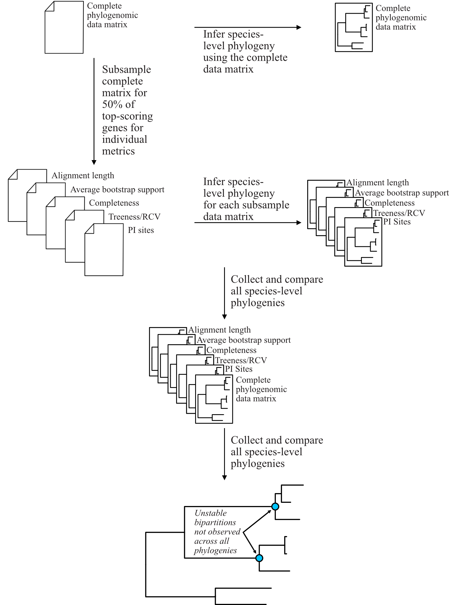

.. _tutorials:

Tutorials
=========

PhyKIT can be used for a multitude of different types of analyses. Documentation here 
provides a step-by-step outline for how to conduct different types of analyses.

|

1. Summarizing information content
##################################

PhyKIT implements numerous functions that can be used to examine the information content and help researchers 
summarize information content and identify potential biases in multiple sequence alignments and phylogenies.

Among other uses, one use of summarizing information content is to facilitate subsampling larger phylogenomic
data matrices to further explore tree space during species-level tree inference or for divergence time estimation.
(`Salichos and Rokas 2013 <https://www.nature.com/articles/nature12130>`_;
`Liu et al. 2017 <https://www.pnas.org/content/114/35/E7282>`_;
`Smith et al. 2018 <https://journals.plos.org/plosone/article?id=10.1371/journal.pone.0197433>`_;
`Shen et al. 2018 <https://www.cell.com/cell/fulltext/S0092-8674(18)31332-1?_returnURL=https%3A%2F%2Flinkinghub.elsevier.com%2Fretrieve%2Fpii%2FS0092867418313321%3Fshowall%3Dtrue>`_
& `2020 <https://www.biorxiv.org/content/10.1101/2020.05.11.088658v1>`_;
`Steenwyk et al. 2019 <https://mbio.asm.org/content/10/4/e00925-19>`_;
`Walker et al. 2019 <https://peerj.com/articles/7747/>`_;
`Li et al. 2020 <https://www.biorxiv.org/content/10.1101/2020.08.23.262857v1>`_)

The information content summarized in the remainder of this section are associated with strong phylogenetic signal
(or robust and accurate tree inference). When subsampling genes, a researcher could take a fraction of the best
scoring phylogenies to reinfer species-level relationships or divergence times (e.g., robustly supported phylogenies
and genes that do not violate clock-like patterns of evolution).

For example, in `Steenwyk et al. 2019 <https://mbio.asm.org/content/10/4/e00925-19>`_, we subsampled the complete
phylogenomic data matrix for 50% of genes that had the best score for various matrices. Using the subsampled matrices,
we reinferred species trees and compared the topologies across all species-level phylogenies. Bipartitions that were
not recovered in all analyses were considered unstable. The following figure depicts the general pipeline we used (note,
some of the metrics have been modified following newer insights).

In this tutorial, we will use the following test multiple sequence alignment and phylogenetic tree, which came
from `Steenwyk et al. 2019 <https://mbio.asm.org/content/10/4/e00925-19>`_. |br|

.. centered::
   Download test data:
   :download:`Multiple sequence alignment </data/Steenwyk_etal_mBio_2019_EOG091N44MS.aln.fa>`;
   :download:`Single-gene phylogeny </data/Steenwyk_etal_mBio_2019_EOG091N44MS.tre>`

|

Alignment length
****************

Alignment length and the length of an alignment excluding sites with gaps is associated with
robust and accurate tree inferences
(`Shen et al. 2016 <https://academic.oup.com/gbe/article/8/8/2565/2198327>`_).
Calculate alignment length with the following command:

.. code-block:: shell

   phykit aln_len Steenwyk_etal_mBio_2019_EOG091N44MS.aln.fa 
   624

to exclude alignment gaps, use the following option

.. code-block:: shell

   phykit aln_len_no_gaps Steenwyk_etal_mBio_2019_EOG091N44MS.aln.fa 
   321     624     51.4423

col1: number of sites without gaps |br|
col2: total number of sites |br|
col3: percentage of sites without gaps

|

Bipartition support statistics
******************************

High average bipartition in a phylogeny is associated with robust bipartition support
(`Salichos and Rokas 2013 <https://www.nature.com/articles/nature12130>`_;
`Shen et al. 2016 <https://academic.oup.com/gbe/article/8/8/2565/2198327>`_). Thus,
genes with high bipartition support values have greater certainty among bipartitions.
Calculate bipartition support summary statistics with the following command:

.. code-block:: shell

   phykit bss Steenwyk_etal_mBio_2019_EOG091N44MS.tre 
   mean: 88.6437
   median: 99
   25th percentile: 83.0
   75th percentile: 100.0
   minimum: 28
   maximum: 100
   standard deviation: 18.5504
   variance: 344.1157

|

Long branch score
*****************

Long branch scores (or LB scores) help determine taxa that may be contributing to long-branch
problems
(`Struck 2014 <https://journals.sagepub.com/doi/10.4137/EBO.S14239>`_;). 
Similarly, the standard deviation of LB scores among taxa can be used as a measure of heterogeneity.
To calculate summary statistics of LB scores for all taxa in a given phylogeny, use the following command:

.. code-block:: shell

   phykit lb_score Steenwyk_etal_mBio_2019_EOG091N44MS.tre 
   mean: -1.1111
   median: -14.4566
   25th percentile: -17.8686
   75th percentile: -3.4048
   minimum: -23.7982
   maximum: 211.1845
   standard deviation: 39.1931
   variance: 1536.0987

LB scores of individual taxa are also information to diagnose taxa driving long-branch problems. 
The lower the values, the less susceptible the taxon is to long-branch problems. To get 
the LB score of each taxa, use the verbose option: 

.. code-block:: shell

   phykit lb_score Steenwyk_etal_mBio_2019_EOG091N44MS.tre --verbose
   Aspergillus_aculeatus   -13.7403
   Aspergillus_arachidicola        -15.382
   Aspergillus_parasiticus -15.2214
   Aspergillus_sojae       -15.2627
   Aspergillus_flavus      -14.7755
   Aspergillus_oryzae      -14.7755
   Aspergillus_bombycis    -11.1987
   ...                     ...

|

Parsimony informative sites
***************************

The number of parsimony informative sites in an alignment is associated with strong phylogenetic signal.
(`Shen et al. 2016 <https://academic.oup.com/gbe/article/8/8/2565/2198327>`_;
`Steenwyk et al. 2020 <https://www.biorxiv.org/content/10.1101/2020.06.08.140384v1>`_).
Calculate the number of parsimony informative sites in an alignment with the following command:

.. code-block:: shell

   phykit pis Steenwyk_etal_mBio_2019_EOG091N44MS.aln.fa
   517     624     82.8526

col1: number of parsimony informative sites |br|
col2: total number of sites |br|
col3: percentage of parsimony informative sites

|

Saturation
**********

Saturation in a multiple sequence alignments is driven by sites with multiple substitutions and results in 
the alignment underestimating real genetic distances among taxa. Values of 1 have no saturation and values 
of 0 are completely saturated by multiple substitutions
(`Philippe et al. 2011 <https://journals.plos.org/plosbiology/article?id=10.1371/journal.pbio.1000602>`_).
Estimate saturation with the following command:

.. code-block:: shell

   phykit sat -a Steenwyk_etal_mBio_2019_EOG091N44MS.aln.fa -t Steenwyk_etal_mBio_2019_EOG091N44MS.tre
   0.3017  0.6983

|

Treeness divided by relative composition variability
****************************************************

Treeness divided by relative composition variability (treeness/RCV) is associated with strong
phylogenetic signal. Higher treeness and lower RCV values are indicative of a lower potential for
bias (composition-based or otherwise) and a lower degree of composition bias. Thus, higher treeness/RCV
values are indicative of genes less susceptible to composition and other biases.
(`Lanyon 1988 <https://academic.oup.com/auk/article-abstract/105/3/565/5193152?redirectedFrom=fulltext>`_;
`Phillips and Penny 2003 <http://people.bu.edu/msoren/Phillips.pdf>`_;
`Shen et al. 2016 <https://academic.oup.com/gbe/article/8/8/2565/2198327>`_).
Calculate treeness/RCV using the following command:

.. code-block:: shell

   phykit toverr -a Steenwyk_etal_mBio_2019_EOG091N44MS.aln.fa -t Steenwyk_etal_mBio_2019_EOG091N44MS.tre 
   5.0727  0.5136  0.1013

col1: treeness/RCV |br|
col2: treeness |br|
col3: RCV

To individually calculate treeness, a measure of signal-to-noise among branch lengths
(`Lanyon 1988 <https://academic.oup.com/auk/article-abstract/105/3/565/5193152?redirectedFrom=fulltext>`_;
`Phillips and Penny 2003 <http://people.bu.edu/msoren/Phillips.pdf>`_),
and RCV, a measure of composition bias (`Phillips and Penny 2003 <http://people.bu.edu/msoren/Phillips.pdf>`_),
use the following commands:

.. code-block:: shell

   # calculate treeness
   phykit tness Steenwyk_etal_mBio_2019_EOG091N44MS.tre 
   0.5136

   # calculate RCV
   phykit rcv Steenwyk_etal_mBio_2019_EOG091N44MS.aln.fa 
   0.1013

|

Variable sites
**************

The number of variable sites in an alignment is associated with strong phylogenetic signal.
(`Shen et al. 2016 <https://academic.oup.com/gbe/article/8/8/2565/2198327>`_).
Calculate the number of variable sites with the following command:

.. code-block:: shell

   phykit vs Steenwyk_etal_mBio_2019_EOG091N44MS.aln.fa 
   555     624     88.9423

col1: number of variable sites |br|
col2: total number of sites |br|
col3: percentage of variable sites

|

2. Evaluating gene-gene covariation
###################################

Identifying genes that significantly covary (or coevolve) with one another is known to accurately and sensitively 
identify genes with shared functions, are coexpressed, and/or are part of the same multimeric complexes 
(`Sato et al. 2005 <https://academic.oup.com/bioinformatics/article/21/17/3482/212654>`_; 
`Clark et al. 2012 <https://genome.cshlp.org/content/22/4/714.full>`_).
Furthermore, gene-gene covariation serves as a powerful evolution-based genetic screen for predicting gene function
(`Brunette et al. 2019 <https://www.pnas.org/content/116/39/19593>`_).

PhyKIT implements a mirror-tree-based method to identify genes that covary with one another. In principle, PhyKIT
determines if two trees have similar branch length properties throughout the phylogeny. Thus, each input phylogeny
must have the same topology. However, there are other steps that must be done prior to evaluating covariation
between two genes. 

To provide a comprehensive tutorial, we will start with the sequence alignments for three genes and their constrained 
tree topologies that match the putative species tree from `Shen et al. 2020
<https://www.biorxiv.org/content/10.1101/2020.05.11.088658v1.abstract>`_. 

.. centered::
   Download test data:
   :download:`gene_gene_covariation_tutorial.tar.gz </data/gene_gene_covariation_tutorial.tar.gz>`

|

Step 0: Prepare data
********************
The mirror tree method for determining significant gene-gene covariation requires that both input phylogenies have the same topology.
As a result, gene trees must be constrained to the species tree, which is typically inferred from whole genome or proteome data.
In the present tutorial, the species tree has already been inferred. Additionally, the guide trees used to constrain the gene trees
have been generated. These trees were generated by pruning the species tree to match the taxon representation of the sequences in
the multiple sequence alignment.

Step 1: Estimate gene tree branch lengths
*****************************************
To infer the constrained tree, we will use `IQ-TREE2 <http://www.iqtree.org/>`_. The species tree (or guide tree) is specified
with the *-g* argument. Lastly, the best-fitting substitution model was specified according to what was reported in 
`Shen et al. 2020 supplementary data <https://jlsteenwyk.com/publication_pdfs/2020_Shen_etal_Science_Advances.pdf>`_; however,
if the best-fitting model is unknown, this will have to be determined prior to estimating gene tree branch lengths.

Estimate the gene tree branch lengths using the following commands:

.. code-block:: shell

   # infer constrain trees
   iqtree2 -s Shen_etal_SciAdv_2020_NDC80.fa -te Shen_etal_SciAdv_2020_NDC80.constrained.tre -pre Shen_etal_SciAdv_2020_NDC80 -m JTT+G4+F -keep-ident
   iqtree2 -s Shen_etal_SciAdv_2020_NUF2.fa -te Shen_etal_SciAdv_2020_NUF2.constrained.tre -pre Shen_etal_SciAdv_2020_NUF2 -m LG+G4 -keep-ident
   iqtree2 -s Shen_etal_SciAdv_2020_SEC7.fa -te Shen_etal_SciAdv_2020_SEC7.constrained.tre -pre Shen_etal_SciAdv_2020_SEC7 -m LG+G4 -keep-ident

Step 2: Root constrain trees
****************************
To ensure PhyKIT traverses each tree the same, root each tree using the outgroup taxa. PhyKIT has
a function for rooting and takes as input a single column file with the names of the outgroup taxa.
For sake of simplicity, I have provided the necessary input files.

Root the trees with the inferred branch lengths using the following commands:

.. code-block:: shell

   # root trees
   pk_root Shen_etal_SciAdv_2020_NUF2.treefile -r Shen_etal_SciAdv_2020_NUF2_taxa_for_rooting.txt -o Shen_etal_SciAdv_2020_NUF2.treefile.rooted
   pk_root Shen_etal_SciAdv_2020_SEC7.treefile -r Shen_etal_SciAdv_2020_SEC7_taxa_for_rooting.txt -o Shen_etal_SciAdv_2020_SEC7.treefile.rooted
   pk_root Shen_etal_SciAdv_2020_NDC80.treefile -r Shen_etal_SciAdv_2020_NDC80_taxa_for_rooting.txt -o Shen_etal_SciAdv_2020_NDC80.treefile.rooted

Step 3: Evaluate gene-gene covariation
**************************************
When determining gene-gene covariation, it is best to use a high significance threshold for coevolutionary coefficients.
Here, we will use a threshold of 0.5; however, I recommend users explore their own data and distribution of coevolutionary 
coefficients.

To evaluate gene-gene covariation, execute the following commands:

.. code-block:: shell

   # Evaluate gene-gene covariation between NUF2 and SEC7
   phykit cover Shen_etal_SciAdv_2020_NUF2.treefile.rooted Shen_etal_SciAdv_2020_SEC7.treefile.rooted -r Shen_etal_SciAdv_2020_species_tree.tre
   0.1885  0.0

   # Evaluate gene-gene covariation between NDC80 and SEC7
   phykit cover Shen_etal_SciAdv_2020_NDC80.treefile.rooted Shen_etal_SciAdv_2020_SEC7.treefile.rooted -r Shen_etal_SciAdv_2020_species_tree.tre
   0.2105   0.0

Given our thresholds, neither *NUF2* nor *NDC80* significantly covary with *SEC7*. Next, evaluate gene-gene covariation between
*NUF2* and *NDC80*.

.. code-block:: shell

   # Evaluate gene-gene covariation between NUF2 and NDC80
   phykit cover Shen_etal_SciAdv_2020_NUF2.treefile.rooted Shen_etal_SciAdv_2020_NDC80.treefile.rooted -r Shen_etal_SciAdv_2020_species_tree.tre
   0.6693  0.0

These two genes significantly covary with one another. This raises the hypothesis that these two genes have shared function. A literature-
based examination of these genes reveals the encoded proteins are part of the same kinetochore-associated complex termed the 
`NDC80 complex <https://www.yeastgenome.org/complex/CPX-548>`_. Thus, PhyKIT is useful for determining gene-gene covariation, which can be 
driven by shared function, coexpression, and/or are part of the same multimeric complexes.

|

3. Identifying signatures of rapid radiations
#############################################

Signatures of rapid radiations or diversification events can be identified by pinpointing polytomies in a putative species tree
(`Sayyari and Mirarab 2018 <https://www.mdpi.com/2073-4425/9/3/132>`_;
`One Thousand Plant Transcriptomes Initiative 2019 <https://www.nature.com/articles/s41586-019-1693-2>`_;
`Li et al. 2020 <https://www.biorxiv.org/content/10.1101/2020.08.23.262857v1>`_). 

PhyKIT uses a gene-based approach to evaluate polytomies. In other words, PhyKIT will determine what topology each gene supports.
Thereafter, PhyKIT will conduct a chi-squared test to determine if there is equal support among gene trees for the various topologies.
In the chi-squared test, the null hypothesis is that there is equal support among gene trees for the various topologies and the
alternative hypothesis is that there is unequal support for the various topologies. Thus, failing to reject the null hypothesis
would indicate that there is a polytomy where as rejecting the null hypothesis would indicate there is no polytomy.
The various topologies examined by PhyKIT are determined by the groups file. Formatting this file will be explained later. 

To demonstrate how to identify polytomies, we will use a subset of 250 gene phylogenies from 
`Steenwyk et al. 2019 <https://mbio.asm.org/content/10/4/e00925-19>`_. 

.. centered::
   Download test data:
   :download:`polytomy_tutorial.tar.gz </data/polytomy_tutorial.tar.gz>`

|

Step 0: Prepare data
********************

For this tutorial, the data has already been formatted for the user. There are two input files for the polytomy testing function:

1. a file that specifies the location of gene trees
2. a file that specifies the groups to test

Thus, this tutorial assumes that gene phylogenies have already been inferred and the area of the phylogeny that the user wishes to
test for a polytomy has already been identified.

Examination of the first file reveals that that it is a single column file that specifies the pathing of gene phylogenies to use
during polytomy testing. Examination of the second file reveals that groups are specified using a tab-separated five column file.

*column 1:* an identifier for the test, which is not used by PhyKIT. Instead, this column is intended to be for the user to write any
keywords or notes that can help remind them of what they were testing.

*column 2-4:* the tip names in the groups. Each column represents a single group to conduct polytomy testing for. If a group has multiple
taxa, separate each tip name using a semi-colon ';'. For example, in *groups_file0.txt* there is one group with *Aspergillus_persii;Aspergillus_sclerotiorum*
wherein this group has two taxa, *Aspergillus_persii* and *Aspergillus_sclerotiorum*.

*column 5:* the outgroup taxa. This column specifies the name of outgroup taxa, which are used to root the gene trees prior to 
determining what topology they support.

Step 1: Conduct polytomy test
*****************************
Among the groups that have already been predetermined for the user, we will first conduct a polytomy test for *groups_file0.txt*. To 
execute the polytomy test, use the following command:

.. code-block:: shell

   phykit ptt -t filamentous_fungi_250_trees.txt -g groups_file0.txt 
   Gene Support Frequency Results
   ==============================
   chi-squared: 19.425
   p-value: 6.1e-05
   total genes: 240
   0-1: 103
   0-2: 49
   1-2: 88

*Note,* if you are getting an error, it may be due to improper pathing in *filamentous_fungi_250_trees.txt.* Please check this file and
modify it accordingly.

We will now go over the output of PhyKIT. PhyKIT will report the *chi-squared* value, the *p* value, the total number of genes used, followed
by the support of sister relationships examined. Here, the *chi-squared* value is very high and the *p* value is very low indicating
that the null hypothesis was rejected and that there is no evidence of a polytomy. The total number of genes used during the polytomy
test was 240. However, you may have noticed that there were 250 genes used as input. This discrepancy is not an error but may be caused by 
two different reasons. (1) 10 genes were unable to be used due to incomplete taxon representation in the groups and (2) PhyKIT can account
for gene phylogenies uncertainty (i.e., gene phylogenies with collapsed bipartitions), which may render the support of a given gene tree
to be uncertain and therefore not be used during polytomy testing.

Next, the section *0-1, 0-2,* and *1-2* refers to the sister relationships between the groups. Group 0 is specified in column 2 of the 
groups file while group 1 and group 2 are specified in columns 3 and 4, respectively. Thus, *0-1* refers to the following topology 
*(((0,1),2),outgroup);* whereas *0-2* and *1-2* refers to the following topologies *(((0,2),1),outgroup);* and *(((1,2),0),outgroup);*,
respectively. PhyKIT identified that 103 gene phylogenies support *(((0,1),2),outgroup);* whereas 49 and 88 gene phylogenies support 
the topologies *(((0,2),1),outgroup);* and *(((1,2),0),outgroup);*, respectively.

|

Next, conduct a polytomy test using the other group file using the following command:

.. code-block:: shell

   phykit ptt -t filamentous_fungi_250_trees.txt -g groups_file1.txt 
   Gene Support Frequency Results
   ==============================
   chi-squared: 0.129
   p-value: 0.937521
   total genes: 248
   0-1: 84
   0-2: 84
   1-2: 80

In contrast to the previous test, the *chi-squared* value is very low and the *p* value is very high indicating a failure to reject the null
hypothesis. Thus, there is a signature of rapid radiation or diversification event for these groups. Additional details provided by PhyKIT
reveal 248 genes were used during the polytomy test and that there is nearly equal support for the various topologies. 

Taken together, this tutorial reveals how to identify signatures of rapid radiation or diversification events in phylogenomic data.

|

4. Evaluating the accuracy of a multiple sequence alignment
###########################################################

Evaluating the accuracy of multiple sequence alignments is an appropriate way to benchmark multiple sequence alignment strategies.
Two popular methods to assess multiple sequence alignment accuracy are sum-of-pairs score and column score, which were introduced by
Thompson et al., Nucleic Acids Research (1999), doi: 10.1093/nar/27.13.2682. Sum-of-pairs is calculated by summing the correctly
aligned residue pairs over all pairs of sequences. Column score is calculated by summing the correctly aligned columns over all 
columns in an alignment. Both metrics range from 0 to 1 and higher values indicate more accurate alignments. Correctly aligned
pairs or columns require knowing some ground truth of what the correct alignment is. Thus, a reference alignment that is 
perfectly (or near-perfectly) aligned is required. A reference alignment can be generated using simulations or be obtained from
publicly available databases such as BAliBASE 4 (http://www.lbgi.fr/balibase/). For this tutorial we will use a reference alignment
from BAliBASE.

.. centered::
   Download test data:
   :download:`msa_accuracy.tar.gz </data/msa_accuracy.tar.gz>`

|

Step 0: Generate query alignments
*********************************
In the *msa_accuracy* directory, there are two fasta files: *BBA0001_query.faa*, an unaligned set of sequences and *BBA0001_reference.faa*,
the reference alignment. We will align *BBA0001_query.faa* using three different strategies implemented in Mafft, v.7.475
(https://mafft.cbrc.jp/alignment/software/), and evaluate the accuracy of each strategy.

To do so, please ensure Mafft is installed and then execute the following commands:

.. code-block:: shell

   # first alignment
   mafft --localpair BBA0001_query.faa > BBA0001_query.localpair.faa

   # second alignment
   mafft --genafpair BBA0001_query.faa > BBA0001_query.genafpair.faa

   # third alignment
   mafft --globalpair BBA0001_query.faa > BBA0001_query.globalpair.faa

To gain some initial insight as to whether the alignments differ, we can look at the length
of each alignment using the *aln_len* function

.. code-block:: shell

   for i in $(ls *pair.faa) ; do phykit aln_len $i ; done
   1560
   1464
   1497

However, alignment length is not a measurement of accuracy. Thus, we will score each alignment
using the *sum_of_pairs_score* and *column_score* functions. 

|

Step 1: Score each alignment
****************************
For both functions, the first argument is the query alignment and the *-r/\\-\\-reference* argument specifies the reference alignment.
We will programmatically score each alignment using the same for loop that was used to calculate alignment length.

.. code-block:: shell

   echo -e "BAliBASE_id_and_aln_strategy\tsop\tcs"
   for i in $(ls *pair.faa)
   do
      sop=$(phykit sum_of_pairs_score $i -r BBA0001_reference.faa)
      cs=$(phykit column_score $i -r BBA0001_reference.faa)
      echo -e "$i\t$sop\t$cs"
   done
   BAliBASE_id_and_aln_strategy	sop	cs
   BBA0001_query.genafpair.faa	0.8964	0.2943
   BBA0001_query.globalpair.faa	0.9025	0.292
   BBA0001_query.localpair.faa	0.8992	0.2959

Examination of the output reveals that the *globalpair* strategy has more correctly aligned pairs because it has a higher sum-of-pairs
score whereas the *localpair* strategy has more correctly aligned columns. Of note, the column scores are generally low, which 
reflects a potential limitation of column score wherein column score is sensitive to alignment errors.

In summary, calculating sum-of-pairs score and column score can help assess the accuracy of multiple sequence alignment strategies.

|

5. Mapping the evolutionary history of discrete traits
######################################################

A common question in comparative biology is: how did a discrete trait, such as diet, habitat,
or reproductive strategy, evolve across a phylogeny? Simply labeling tips on a tree does not
tell us *when* or *how often* transitions between states occurred. Stochastic character mapping
(`Huelsenbeck et al. 2003 <https://doi.org/10.1080/10635150390192780>`_;
`Bollback 2006 <https://doi.org/10.1186/1471-2148-6-88>`_)
addresses this by simulating plausible evolutionary histories of a discrete trait along each
branch, conditioned on the observed tip states and a fitted substitution model. This approach
is widely used in macroevolutionary studies to quantify the tempo and mode of trait evolution
(`O'Meara 2012 <https://doi.org/10.1146/annurev-ecolsys-110411-160331>`_).

**Hypothetical study question.** Suppose we are studying a group of eight mammal species and
want to understand how diet (carnivore, herbivore, or omnivore) has evolved across the
phylogeny. Specifically, we want to know: (1) Is the transition rate between all dietary states
equal, or are some transitions more frequent than others? (2) How much evolutionary time has
been spent in each dietary state? (3) How many transitions between states occurred on average?

PhyKIT's ``stochastic_character_map`` command (alias: ``simmap``) lets us answer these
questions directly from the command line.

In this tutorial, we will use test data included with PhyKIT: an eight-taxon mammal phylogeny
and a tab-delimited file assigning each species to a dietary category. |br|

.. centered::
   Download test data:
   :download:`Mammal phylogeny </data/tree_simple.tre>`;
   :download:`Discrete trait data </data/tree_simple_discrete_traits.tsv>`

|

Step 0: Prepare data
********************

Two input files are needed: a phylogenetic tree in Newick format and a tab-delimited trait
file with a header row. The trait file looks like this:

.. code-block:: text

   taxon	diet
   raccoon	carnivore
   bear	carnivore
   sea_lion	carnivore
   seal	herbivore
   monkey	herbivore
   cat	omnivore
   weasel	omnivore
   dog	omnivore

The first column is the taxon name (must match the tree tip labels) and subsequent columns
contain discrete trait values. You specify which column to use with the ``-c/--trait`` flag.
Lines starting with ``#`` are treated as comments and blank lines are ignored.

Both files are included in the PhyKIT test suite at ``tests/sample_files/tree_simple.tre`` and
``tests/sample_files/tree_simple_discrete_traits.tsv``.

|

Step 1: Fit a substitution model and run stochastic mapping
***********************************************************

First, run stochastic character mapping with the default equal-rates (ER) model and 100
simulations:

.. code-block:: shell

   phykit simmap \
       -t tests/sample_files/tree_simple.tre \
       -d tests/sample_files/tree_simple_discrete_traits.tsv \
       -c diet \
       -n 100 \
       --seed 42

This produces the following output:

.. code-block:: text

   Stochastic Character Mapping (SIMMAP)

   Model: ER
   Number of simulations: 100

   Fitted Q matrix:
                    carnivore   herbivore    omnivore
   carnivore          -0.1138      0.0569      0.0569
   herbivore           0.0569     -0.1138      0.0569
   omnivore            0.0569      0.0569     -0.1138

   Log-likelihood: -8.7874

   Mean dwelling times:
     carnivore         99.08 (35.7%)
     herbivore         89.18 (32.2%)
     omnivore          89.02 (32.1%)

   Mean transitions:
     carnivore -> herbivore:  5.51
     carnivore -> omnivore:  5.69
     herbivore -> carnivore:  5.48
     herbivore -> omnivore:  5.37
     omnivore -> carnivore:  4.94
     omnivore -> herbivore:  4.89
     Total:                      31.88

**Interpreting the output.** The fitted Q matrix shows the instantaneous rates of transition
between states. Under the ER model, all off-diagonal rates are equal (0.0569 per unit branch
length). The log-likelihood of -8.79 is the maximized log-likelihood of the data given the
model.

The mean dwelling times tell us how much total evolutionary time (summed across all branches)
was spent in each state, averaged over all 100 simulated histories. Here, the three dietary
states have roughly equal dwelling times, reflecting the ER model's symmetry and the
distribution of states across the tree.

The mean transition counts show how many times each type of state change occurred on average.
These are averaged across 100 stochastic maps.

|

Step 2: Compare substitution models
************************************

Is the equal-rates model adequate, or do different transitions have different rates? We can
compare the ER model with the all-rates-different (ARD) model:

.. code-block:: shell

   phykit simmap \
       -t tests/sample_files/tree_simple.tre \
       -d tests/sample_files/tree_simple_discrete_traits.tsv \
       -c diet \
       -m ARD \
       -n 100 \
       --seed 42

You can also try the symmetric (SYM) model, which assumes forward and reverse rates between
any pair of states are equal but allows different pairs to differ:

.. code-block:: shell

   phykit simmap \
       -t tests/sample_files/tree_simple.tre \
       -d tests/sample_files/tree_simple_discrete_traits.tsv \
       -c diet \
       -m SYM \
       -n 100 \
       --seed 42

Compare the log-likelihoods across models to assess fit. Because ARD has more parameters than
SYM, which has more than ER, a likelihood ratio test or AIC comparison can be used to
determine whether the additional parameters are justified.

|

Step 3: Generate a stochastic character map plot
************************************************

To visualize one of the simulated character histories on the phylogeny, use the ``--plot``
flag:

.. code-block:: shell

   phykit simmap \
       -t tests/sample_files/tree_simple.tre \
       -d tests/sample_files/tree_simple_discrete_traits.tsv \
       -c diet \
       -n 100 \
       --seed 42 \
       --plot simmap_diet.png

This generates a horizontal phylogram with branches colored by the mapped character state.
Each branch segment is colored according to the state occupied during that interval,
reflecting one of the simulated character histories. A legend maps colors to states.

|

Step 4: Export results as JSON
******************************

For downstream analysis or scripting, results can be exported as JSON:

.. code-block:: shell

   phykit simmap \
       -t tests/sample_files/tree_simple.tre \
       -d tests/sample_files/tree_simple_discrete_traits.tsv \
       -c diet \
       -n 100 \
       --seed 42 \
       --json

The JSON output includes the fitted Q matrix, log-likelihood, state list, mean dwelling times
and proportions, and mean transition counts. This can be parsed with standard JSON tools
(e.g., ``jq``, Python's ``json`` module) for further analysis.

|

Step 5: Ensure reproducibility
******************************

The ``--seed`` flag ensures that the stochastic simulations are reproducible. Running the same
command with the same seed will produce identical results. This is important for
reproducibility in publications. Omitting ``--seed`` produces different results each time due
to the stochastic nature of the simulations.

|

Summary
*******

In this tutorial, we used stochastic character mapping to reconstruct the evolutionary history
of diet across a mammal phylogeny. The key steps were: (1) fitting a continuous-time Markov
chain rate matrix to estimate transition rates, (2) comparing equal-rates and
all-rates-different models to assess whether transition rates vary, (3) simulating character
histories to estimate dwelling times and transition counts, and (4) plotting a stochastic
character map for visualization.

For methodological details, see
`Huelsenbeck et al. (2003) <https://doi.org/10.1080/10635150390192780>`_ and
`Bollback (2006) <https://doi.org/10.1186/1471-2148-6-88>`_.
The R equivalent is ``phytools::make.simmap()``
(`Revell 2012 <https://doi.org/10.1111/j.2041-210X.2011.00169.x>`_).

|

6. Testing for phylogenetic signal in continuous traits
#######################################################

A fundamental question in comparative biology is whether closely related species resemble each
other more than expected by chance — a pattern known as phylogenetic signal
(`Blomberg et al. 2003 <https://doi.org/10.1111/j.0014-3820.2003.tb00285.x>`_;
`Pagel 1999 <https://doi.org/10.1038/44766>`_).
Quantifying phylogenetic signal helps determine whether phylogenetic comparative methods
(e.g., PGLS, phylogenetic PCA) are necessary for a given trait, and provides insight into
the evolutionary processes shaping trait variation
(`Münkemüller et al. 2012 <https://doi.org/10.1111/j.2041-210X.2012.00196.x>`_).

**Hypothetical study question.** Suppose we are studying body mass evolution across eight
mammal species and want to know: does body mass exhibit significant phylogenetic signal?
In other words, do closely related species tend to have more similar body masses than
species drawn at random from the tree?

PhyKIT's ``phylogenetic_signal`` command (aliases: ``phylo_signal``, ``ps``) implements two
widely used measures: Blomberg's K and Pagel's lambda.

In this tutorial, we will use the test data included with PhyKIT: an eight-taxon mammal
phylogeny and a tab-delimited trait file containing log-transformed body mass values. |br|

.. centered::
   Download test data:
   :download:`Mammal phylogeny </data/tree_simple.tre>`;
   :download:`Continuous trait data </data/tree_simple_traits.tsv>`

|

Step 0: Prepare data
********************

Two input files are needed: a phylogenetic tree in Newick format and a tab-delimited trait
file with two columns (taxon name and trait value). Lines starting with ``#`` are treated
as comments. The trait file looks like this:

.. code-block:: text

   # Trait data for tree_simple.tre taxa
   # body mass (kg, log-transformed)
   raccoon	1.04
   bear	2.39
   sea_lion	2.30
   seal	1.88
   monkey	0.60
   cat	0.56
   weasel	-0.30
   dog	1.18

Both files are included in the PhyKIT test suite at ``tests/sample_files/tree_simple.tre`` and
``tests/sample_files/tree_simple_traits.tsv``.

|

Step 1: Calculate Blomberg's K
******************************

Blomberg's K compares the observed trait variance partitioned across the phylogeny to the
expectation under Brownian motion. K = 1 indicates trait evolution consistent with Brownian
motion; K < 1 suggests less phylogenetic signal than expected (e.g., convergent evolution);
K > 1 suggests stronger signal than expected (e.g., trait conservatism within clades).

Statistical significance is assessed via a permutation test that shuffles trait values among
tips.

.. code-block:: shell

   phykit phylogenetic_signal \
       -t tests/sample_files/tree_simple.tre \
       -d tests/sample_files/tree_simple_traits.tsv

.. code-block:: text

   0.5842	0.474

col1: Blomberg's K statistic |br|
col2: p-value (permutation test, 1000 permutations)

**Interpretation.** K = 0.58 (< 1), suggesting that body mass shows *less* phylogenetic
signal than expected under pure Brownian motion in this clade. The p-value of 0.47 is
non-significant, meaning we cannot reject the null hypothesis that there is no phylogenetic
signal. With only 8 taxa, statistical power is limited, so this result should be interpreted
cautiously.

|

Step 2: Calculate Pagel's lambda
********************************

Pagel's lambda scales the off-diagonal elements of the phylogenetic variance-covariance
matrix. Lambda = 1 indicates strong phylogenetic signal (consistent with Brownian motion);
lambda = 0 indicates no phylogenetic signal (traits evolve independently of phylogeny).
Significance is assessed via a likelihood ratio test comparing the fitted lambda model to
a model with lambda fixed at 0.

.. code-block:: shell

   phykit phylogenetic_signal \
       -t tests/sample_files/tree_simple.tre \
       -d tests/sample_files/tree_simple_traits.tsv \
       -m lambda

.. code-block:: text

   1.0	-11.5697	0.7165

col1: estimated lambda |br|
col2: log-likelihood of the fitted model |br|
col3: p-value (likelihood ratio test)

**Interpretation.** Lambda = 1.0 indicates a maximum-likelihood estimate consistent with
Brownian motion. However, the LRT p-value of 0.72 is non-significant, meaning the fitted
model does not significantly improve over the null (lambda = 0). Again, with 8 taxa, power
is limited.

|

Step 3: Export results as JSON
******************************

For scripting or downstream analysis, use ``--json``:

.. code-block:: shell

   phykit phylogenetic_signal \
       -t tests/sample_files/tree_simple.tre \
       -d tests/sample_files/tree_simple_traits.tsv \
       --json

.. code-block:: json

   {"K": 0.5842, "p_value": 0.474, "permutations": 1000}

.. code-block:: shell

   phykit phylogenetic_signal \
       -t tests/sample_files/tree_simple.tre \
       -d tests/sample_files/tree_simple_traits.tsv \
       -m lambda \
       --json

.. code-block:: json

   {"lambda": 1.0, "log_likelihood": -11.5697, "p_value": 0.7165}

|

Summary
*******

In this tutorial, we used two measures of phylogenetic signal — Blomberg's K and Pagel's
lambda — to assess whether body mass evolution in a mammal clade is structured by
phylogenetic relationships. Both measures can help researchers decide whether phylogenetic
comparative methods are needed for their data and provide insight into the tempo and mode
of trait evolution.

For methodological details, see
`Blomberg et al. (2003) <https://doi.org/10.1111/j.0014-3820.2003.tb00285.x>`_ and
`Pagel (1999) <https://doi.org/10.1038/44766>`_.
The R equivalent is ``phytools::phylosig()``
(`Revell 2012 <https://doi.org/10.1111/j.2041-210X.2011.00169.x>`_).

|

7. Phylogenetic PCA for multivariate trait analysis
###################################################

When analyzing multiple continuous traits across species, standard PCA ignores the
phylogenetic non-independence among species: closely related species share evolutionary
history and thus cannot be treated as independent data points. Phylogenetic PCA
(`Revell 2009 <https://doi.org/10.1111/j.1558-5646.2009.00616.x>`_)
addresses this by incorporating the phylogenetic variance-covariance matrix into the PCA,
producing ordinations that properly account for shared ancestry.

**Hypothetical study question.** Suppose we have measured body mass, brain size, and
longevity for eight mammal species and want to identify the major axes of morphological
variation while accounting for phylogenetic relationships. Which traits load most heavily
on the primary axes? Do any species emerge as outliers after phylogenetic correction?

PhyKIT's ``phylogenetic_pca`` command (aliases: ``phylo_pca``, ``phyl_pca``, ``ppca``)
implements Revell's (2009) phylogenetic PCA with support for Brownian motion and
Pagel's lambda estimation methods, and both covariance and correlation modes. |br|

.. centered::
   Download test data:
   :download:`Mammal phylogeny </data/tree_simple.tre>`;
   :download:`Multi-trait data </data/tree_simple_multi_traits.tsv>`

|

Step 0: Prepare data
********************

Two input files are needed: a phylogenetic tree and a tab-delimited multi-trait file
with a header row. The trait file looks like this:

.. code-block:: text

   taxon	body_mass	brain_size	longevity
   raccoon	1.04	1.60	1.28
   bear	2.39	2.66	1.36
   sea_lion	2.30	2.74	1.46
   seal	1.88	2.45	1.60
   monkey	0.60	1.85	2.00
   cat	0.56	1.30	1.18
   weasel	-0.30	0.85	1.04
   dog	1.18	1.87	1.20

Both files are included in the PhyKIT test suite at ``tests/sample_files/tree_simple.tre``
and ``tests/sample_files/tree_simple_multi_traits.tsv``.

|

Step 1: Run phylogenetic PCA with Brownian motion
**************************************************

The default method uses a Brownian motion model for the phylogenetic covariance structure:

.. code-block:: shell

   phykit phylogenetic_pca \
       -t tests/sample_files/tree_simple.tre \
       -d tests/sample_files/tree_simple_multi_traits.tsv

.. code-block:: text

   Eigenvalues:
   	PC1	PC2	PC3
   eigenvalue	0.080180	0.002924	0.000308
   proportion	0.961261	0.035052	0.003687

   Loadings:
   	PC1	PC2	PC3
   body_mass	-0.734739	-0.422613	-0.530619
   brain_size	-0.527400	-0.136064	0.838651
   longevity	-0.426623	0.896038	-0.122915

   Scores:
   	PC1	PC2	PC3
   bear	-0.978191	-0.029290	-0.026787
   cat	1.442009	0.176467	-0.093072
   dog	0.651723	-0.091427	0.046142
   monkey	0.640466	1.097251	0.208068
   raccoon	0.867121	0.067199	-0.114611
   sea_lion	-0.860400	-0.199268	0.115102
   seal	-0.522584	0.277539	0.059107
   weasel	2.639715	-0.088806	0.080512

**Interpretation.** PC1 explains 96.1% of the total phylogenetically-corrected variance and
loads most heavily on body mass (-0.73), followed by brain size (-0.53) and longevity (-0.43).
This suggests that a single axis of overall body size captures most of the morphological
variation. Weasel (score = 2.64) and cat (1.44) are the strongest outliers on PC1, reflecting
their small body size, brain size, and short longevity relative to the larger-bodied species.
PC2 (3.5% variance) is dominated by longevity (0.90), separating monkey (high longevity) from
the other species.

|

Step 2: Use correlation mode
*****************************

When traits are measured on different scales, correlation-mode PCA is often preferred because
it standardizes each trait to unit variance before decomposition:

.. code-block:: shell

   phykit phylogenetic_pca \
       -t tests/sample_files/tree_simple.tre \
       -d tests/sample_files/tree_simple_multi_traits.tsv \
       --mode corr

.. code-block:: text

   Eigenvalues:
   	PC1	PC2	PC3
   eigenvalue	2.849006	0.140247	0.010747
   proportion	0.949669	0.046749	0.003582

Correlation-mode eigenvalues sum to the number of traits (3.0) rather than total variance.
The loadings and scores change accordingly, but the overall pattern remains similar.

|

Step 3: Estimate Pagel's lambda jointly
****************************************

Instead of assuming pure Brownian motion, the lambda method jointly estimates Pagel's lambda
across all traits, downweighting the phylogenetic covariance structure if the data warrant it:

.. code-block:: shell

   phykit phylogenetic_pca \
       -t tests/sample_files/tree_simple.tre \
       -d tests/sample_files/tree_simple_multi_traits.tsv \
       -m lambda \
       --json

The JSON output includes the estimated lambda value, eigenvalues, loadings, scores, and
log-likelihood. A lambda near 1 indicates that Brownian motion adequately describes the
covariance structure, while a lambda near 0 suggests traits evolved independently of
phylogeny.

|

Step 4: Generate a PCA plot
****************************

To visualize the ordination, use the ``--plot`` flag:

.. code-block:: shell

   phykit phylogenetic_pca \
       -t tests/sample_files/tree_simple.tre \
       -d tests/sample_files/tree_simple_multi_traits.tsv \
       --plot ppca_plot.png

This generates a scatter plot of PC1 vs PC2 with taxon labels and variance-explained
percentages on the axes.

|

Summary
*******

In this tutorial, we used phylogenetic PCA to identify the major axes of morphological
variation among mammal species while accounting for shared evolutionary history. The key
steps were: (1) running PCA under Brownian motion, (2) comparing covariance and correlation
modes, (3) jointly estimating Pagel's lambda, and (4) visualizing the ordination.

For methodological details, see
`Revell (2009) <https://doi.org/10.1111/j.1558-5646.2009.00616.x>`_.
The R equivalent is ``phytools::phyl.pca()``
(`Revell 2012 <https://doi.org/10.1111/j.2041-210X.2011.00169.x>`_).

|

8. Visualizing trait evolution with phylomorphospace
####################################################

Phylomorphospace plots overlay the phylogeny onto a two-dimensional trait space, connecting
species to their ancestors via edges that trace the evolutionary trajectory of traits
(`Sidlauskas 2008 <https://doi.org/10.1111/j.1558-5646.2008.00469.x>`_).
Internal node positions are estimated by maximum-likelihood ancestral state reconstruction.
This visualization reveals how lineages have moved through morphospace over evolutionary
time — showing convergence, divergence, and the overall geometry of trait evolution.

**Hypothetical study question.** Suppose we want to visualize how body mass and brain size
have coevolved across our eight mammal species. Do closely related species cluster together
in trait space? Have any lineages converged on similar body mass–brain size combinations
despite being distantly related?

PhyKIT's ``phylomorphospace`` command (aliases: ``phylomorpho``, ``phmo``) generates these
plots directly from the command line. |br|

.. centered::
   Download test data:
   :download:`Mammal phylogeny </data/tree_simple.tre>`;
   :download:`Multi-trait data </data/tree_simple_multi_traits.tsv>`

|

Step 0: Prepare data
********************

Two input files are needed: a phylogenetic tree and a tab-delimited multi-trait file with a
header row (same format as for phylogenetic PCA). When the trait file has exactly two trait
columns, they are automatically selected. With three or more traits, you must specify
which two traits to plot using ``--trait-x`` and ``--trait-y``.

|

Step 1: Generate a phylomorphospace plot
****************************************

Since our trait file has three traits (body_mass, brain_size, longevity), we specify which
two to plot:

.. code-block:: shell

   phykit phylomorphospace \
       -t tests/sample_files/tree_simple.tre \
       -d tests/sample_files/tree_simple_multi_traits.tsv \
       --trait-x body_mass \
       --trait-y brain_size

This generates a plot file (``phylomorphospace_plot.png`` by default) showing:

- **Tip points** positioned at observed trait values for each species
- **Internal nodes** positioned at ML-reconstructed ancestral trait values
- **Tree edges** connecting parent and child nodes, colored by distance from the root
  (coolwarm colormap with colorbar)
- **Tip labels** identifying each species

**Interpretation.** In the resulting plot, species with large body mass and brain size
(bear, sea_lion, seal) cluster in the upper right, while small-bodied species (weasel, cat)
appear in the lower left. The tree edges show the evolutionary trajectories: the ancestral
node reconstructions reveal whether lineages traveled through morphospace gradually or
underwent rapid shifts.

|

Step 2: Export data as JSON
****************************

For programmatic access to the tip data and reconstructed ancestral states:

.. code-block:: shell

   phykit phylomorphospace \
       -t tests/sample_files/tree_simple.tre \
       -d tests/sample_files/tree_simple_multi_traits.tsv \
       --trait-x body_mass \
       --trait-y brain_size \
       --json

The JSON output includes the tip data, selected traits, and output path, enabling custom
post-processing or alternative visualizations.

|

Summary
*******

In this tutorial, we used phylomorphospace to visualize the coevolution of body mass and
brain size across a mammal phylogeny. The plot reveals evolutionary trajectories through
trait space and highlights patterns of convergence or divergence. Combined with
phylogenetic PCA and phylogenetic signal analyses, phylomorphospace provides a powerful
complement for understanding multivariate trait evolution.

For methodological details, see
`Sidlauskas (2008) <https://doi.org/10.1111/j.1558-5646.2008.00469.x>`_.
The R equivalent is ``phytools::phylomorphospace()``
(`Revell 2012 <https://doi.org/10.1111/j.2041-210X.2011.00169.x>`_).

|

9. Phylogenetic regression (PGLS)
##################################

Standard linear regression assumes that data points are independent and identically
distributed. In comparative biology, species are not independent because they share
evolutionary history. Phylogenetic Generalized Least Squares (PGLS) addresses this by
incorporating the phylogenetic variance-covariance matrix into the regression model,
properly accounting for the expected covariance among species due to shared ancestry
(`Grafen 1989 <https://doi.org/10.1098/rstb.1989.0106>`_;
`Martins and Hansen 1997 <https://doi.org/10.1086/286013>`_;
`Freckleton et al. 2002 <https://doi.org/10.1086/343873>`_).

**Hypothetical study question.** A classic question in comparative biology is the
relationship between brain size and body mass across species. Specifically: does brain
size predict body mass after accounting for the phylogenetic non-independence among
species? Is the relationship significant, and how much variance does it explain?

PhyKIT's ``phylogenetic_regression`` command (aliases: ``phylo_regression``, ``pgls``)
fits PGLS regressions under a Brownian motion model. |br|

.. centered::
   Download test data:
   :download:`Mammal phylogeny </data/tree_simple.tre>`;
   :download:`Multi-trait data </data/tree_simple_multi_traits.tsv>`

|

Step 0: Prepare data
********************

Three input files/specifications are needed: a phylogenetic tree, a tab-delimited
multi-trait file with a header row, and the specification of response (``-y``) and
predictor (``-x``) variables. The trait file is the same format used for phylogenetic
PCA and phylomorphospace.

|

Step 1: Run a simple PGLS regression
*************************************

Test whether brain size predicts body mass:

.. code-block:: shell

   phykit phylogenetic_regression \
       -t tests/sample_files/tree_simple.tre \
       -d tests/sample_files/tree_simple_multi_traits.tsv \
       -y body_mass \
       -x brain_size

.. code-block:: text

   Phylogenetic Generalized Least Squares (PGLS)

   Formula: body_mass ~ brain_size

   Coefficients:
                           Estimate   Std.Error     t-value     p-value
   (Intercept)              -1.3350      0.2000     -6.6733    0.000548    ***
   brain_size                1.3778      0.0877     15.7140    0.000004    ***
   ---
   Signif. codes:  0 '***' 0.001 '**' 0.01 '*' 0.05 '.' 0.1

   Residual standard error: 0.0349 on 6 degrees of freedom
   Multiple R-squared: 0.9763    Adjusted R-squared: 0.9723
   F-statistic: 246.93 on 1 and 6 DF    p-value: 0.000004
   Log-likelihood: 3.3957    AIC: -0.7915

**Interpretation.** After accounting for phylogenetic relatedness, brain size is a highly
significant predictor of body mass (t = 15.71, p < 0.0001). The coefficient estimate of
1.38 indicates that for each unit increase in log brain size, log body mass increases by
approximately 1.38 units. The model explains 97.6% of the variance (R-squared = 0.9763),
with an F-statistic of 246.93.

The negative intercept (-1.34) means that at the reference level of brain size (log brain
size = 0), the predicted log body mass is negative. The significance codes (``***``)
indicate p < 0.001.

|

Step 2: Run a multiple regression
***********************************

Test whether adding longevity as a second predictor improves the model:

.. code-block:: shell

   phykit phylogenetic_regression \
       -t tests/sample_files/tree_simple.tre \
       -d tests/sample_files/tree_simple_multi_traits.tsv \
       -y body_mass \
       -x brain_size longevity

.. code-block:: text

   Phylogenetic Generalized Least Squares (PGLS)

   Formula: body_mass ~ brain_size + longevity

   Coefficients:
                           Estimate   Std.Error     t-value     p-value
   (Intercept)              -1.2194      0.3985     -3.0601    0.028099    *
   brain_size                1.4466      0.2205      6.5608    0.001233    **
   longevity                -0.0879      0.2545     -0.3455    0.743755
   ---
   Signif. codes:  0 '***' 0.001 '**' 0.01 '*' 0.05 '.' 0.1

   Residual standard error: 0.0377 on 5 degrees of freedom
   Multiple R-squared: 0.9768    Adjusted R-squared: 0.9676
   F-statistic: 105.40 on 2 and 5 DF    p-value: 0.000082
   Log-likelihood: 3.4901    AIC: 1.0197

**Interpretation.** Longevity is not a significant predictor of body mass (t = -0.35,
p = 0.74) after accounting for brain size and phylogenetic relatedness. The adjusted
R-squared decreases slightly (0.9676 vs 0.9723), and the AIC increases (1.02 vs -0.79),
confirming that adding longevity does not improve the model. Brain size remains the
dominant predictor.

|

Step 3: Export results as JSON
******************************

For downstream scripting, results can be exported as JSON:

.. code-block:: shell

   phykit phylogenetic_regression \
       -t tests/sample_files/tree_simple.tre \
       -d tests/sample_files/tree_simple_multi_traits.tsv \
       -y body_mass \
       -x brain_size \
       --json

The JSON output includes all regression statistics: coefficients, standard errors, t-values,
p-values, R-squared, adjusted R-squared, F-statistic, log-likelihood, AIC, fitted values,
and residuals for each taxon.

|

Summary
*******

In this tutorial, we used PGLS to test the relationship between body mass and brain size
while accounting for phylogenetic non-independence. The key steps were: (1) fitting a simple
regression with one predictor, (2) extending to multiple predictors to evaluate model
improvement, and (3) exporting results as JSON. PGLS is essential whenever comparing traits
across species because ignoring phylogenetic structure inflates degrees of freedom and can
produce spurious correlations.

For methodological details, see
`Freckleton et al. (2002) <https://doi.org/10.1086/343873>`_ and
`Symonds and Blomberg (2014) <https://doi.org/10.1007/978-3-662-43550-2_5>`_.
The R equivalent is ``caper::pgls()`` or ``nlme::gls()`` with ``ape::corBrownian()``.

|

10. Reconstructing ancestral trait values and mapping them onto a phylogeny
###########################################################################

A common question in comparative biology is: what were the trait values of
ancestral species? Ancestral state reconstruction (ASR) uses the trait values
observed at the tips of a phylogeny together with a model of trait evolution
(Brownian motion) to estimate what trait values were at each internal node.

**Hypothetical study question.** Given body mass data for 8 mammal species,
what were the estimated body masses of their ancestors, and how do trait
values change along branches of the phylogeny?

PhyKIT's ``ancestral_state_reconstruction`` command (aliases: ``asr``,
``anc_recon``) implements two ML methods: ``fast`` (Felsenstein's pruning
algorithm, analogous to ``phytools::fastAnc()``) and ``ml`` (full VCV-based
ML with exact conditional CIs, analogous to ``ape::ace()``). |br|

.. centered::
   Download test data:
   :download:`Mammal phylogeny </data/tree_simple.tre>`;
   :download:`Trait data </data/tree_simple_traits.tsv>`;
   :download:`Multi-trait data </data/tree_simple_multi_traits.tsv>`

|

Step 0: Prepare data
********************

Two input files are needed: a phylogenetic tree and a trait data file.
The trait data can be either a two-column file (``taxon<tab>value``) or
a multi-trait file with a header row (use ``-c`` to select a column).

|

Step 1: Run fast ancestral reconstruction
******************************************

Estimate ancestral body masses using the fast (pruning) method:

.. code-block:: shell

   phykit ancestral_state_reconstruction \
       -t tests/sample_files/tree_simple.tre \
       -d tests/sample_files/tree_simple_traits.tsv

|

Step 2: Run with confidence intervals
***************************************

Add the ``--ci`` flag for 95% confidence intervals:

.. code-block:: shell

   phykit asr \
       -t tests/sample_files/tree_simple.tre \
       -d tests/sample_files/tree_simple_traits.tsv \
       --ci

|

Step 3: Use the VCV-based ML method
*************************************

For exact conditional confidence intervals, use the ``ml`` method:

.. code-block:: shell

   phykit asr \
       -t tests/sample_files/tree_simple.tre \
       -d tests/sample_files/tree_simple_traits.tsv \
       -m ml --ci

|

Step 4: Generate a contMap plot
********************************

Visualize trait values mapped onto the phylogeny with a continuous
color gradient:

.. code-block:: shell

   phykit asr \
       -t tests/sample_files/tree_simple.tre \
       -d tests/sample_files/tree_simple_traits.tsv \
       --plot contmap.png

|

Step 5: Use a multi-trait file
*******************************

When your data file contains multiple traits with a header row, use
``-c`` to select a specific column:

.. code-block:: shell

   phykit asr \
       -t tests/sample_files/tree_simple.tre \
       -d tests/sample_files/tree_simple_multi_traits.tsv \
       -c body_mass --ci

|

Step 6: Export results as JSON
*******************************

For downstream scripting, results can be exported as JSON:

.. code-block:: shell

   phykit asr \
       -t tests/sample_files/tree_simple.tre \
       -d tests/sample_files/tree_simple_traits.tsv \
       --json

The JSON output includes the method used, trait name, number of tips,
log-likelihood, sigma-squared (BM rate), ancestral estimates with
optional CIs, and observed tip values.

|

Summary
*******

In this tutorial, we used ancestral state reconstruction to estimate
ancestral body mass values for 8 mammal species. The key steps were:
(1) running the fast method for quick estimates, (2) adding confidence
intervals, (3) using the full ML method for exact CIs, (4) generating
contMap plots, (5) using multi-trait files, and (6) exporting to JSON.

The ``fast`` method is recommended for large trees due to its O(n) time
complexity, while the ``ml`` method provides exact conditional confidence
intervals at O(n^3) cost.

The R equivalents are ``phytools::fastAnc()`` for the fast method,
``ape::ace(type="ML")`` for the ML method, and ``phytools::contMap()``
for the contMap visualization.

|

.. |br| raw:: html

   
