.. _usage:

Usage
=====

PhyKIT helps process and analyze multiple sequence alignments and phylogenies.

Generally, all functions are designed to help understand the contents of alignments
(e.g., gc content or the number of parsimony informative sites) and the shape
of trees (e.g., treeness, degree of violation of a molecular clock).

Some help messages indicate that summary statistics are reported (e.g., 
bipartition_support_stats). Summary statistics include mean, median, 25th percentile,
75th percentile, minimum, maximum, standard deviation, and variance. These functions
typically have a verbose option that allows users to get the underlying data
used to calculate summary statistics. 

|

General usage
-------------

Calling functions
#################

.. code-block:: shell

   phykit <command> [optional command arguments]

Command specific help messages can be viewed by adding a 
-h/--help argument after the command. For example, to see the help message
for the command 'treeness', execute:

.. code-block:: shell

   phykit treeness -h 
   # or
   phykit treeness --help

|

Function aliases
################

Each function comes with aliases to save the user some
key strokes. For example, to get the help message for the 'treeness'
function, you can type:

.. code-block:: shell

   phykit tness -h

|

Command line interfaces
#######################

As of version 1.2.0, all functions (including aliases) can be executed using
a command line interface that starts with *pk_*. For example, instead of typing
the previous command to get the help message of the treeness function, you can type:

.. code-block:: shell

   pk_treeness -h
   # or
   pk_tness -h

All possible function names are specified at the top of each function section. 

|

Functions by analytical category
--------------------------------

The functions above are organized by input type. Below, the same functions
are grouped by analytical purpose to help you find the right tool for your analysis.

Alignment quality & statistics
##############################

- :ref:`Alignment entropy <cmd-alignment_entropy>`: Shannon entropy across alignment sites
- :ref:`Alignment length <cmd-alignment_length>`: Length of an input alignment
- :ref:`Alignment length no gaps <cmd-alignment_length_no_gaps>`: Alignment length excluding gapped sites
- :ref:`Alignment outlier taxa <cmd-alignment_outlier_taxa>`: Identify outlier taxa in alignments
- :ref:`Column score <cmd-column_score>`: Column score for alignment quality
- :ref:`Compositional bias per site <cmd-compositional_bias_per_site>`: Detect compositional bias across sites
- :ref:`Composition per taxon <cmd-composition_per_taxon>`: Nucleotide or amino acid composition per taxon
- :ref:`Evolutionary Rate per Site <cmd-evolutionary_rate_per_site>`: Site-specific evolutionary rate estimation
- :ref:`Guanine-cytosine (GC) content <cmd-gc_content>`: GC content of an alignment
- :ref:`Occupancy per taxon <cmd-occupancy_per_taxon>`: Taxon occupancy in alignment columns
- :ref:`Pairwise identity <cmd-pairwise_identity>`: Pairwise sequence identity in an alignment
- :ref:`Identity matrix <cmd-identity_matrix>`: Pairwise sequence identity heatmap
- :ref:`Parsimony informative sites <cmd-parsimony_informative_sites>`: Count parsimony informative sites
- :ref:`Plot alignment QC <cmd-plot_alignment_qc>`: Visual quality control plots for alignments
- :ref:`Relative composition variability <cmd-relative_composition_variability>`: Composition variability across taxa
- :ref:`Relative composition variability, taxon <cmd-relative_composition_variability_taxon>`: Per-taxon relative composition variability
- :ref:`Sum-of-pairs score <cmd-sum_of_pairs_score>`: Sum-of-pairs alignment quality score
- :ref:`Phylo GWAS <cmd-phylo_gwas>`: Phylogenetic genome-wide association study
- :ref:`Variable sites <cmd-variable_sites>`: Count variable sites in an alignment

Alignment manipulation
######################

- :ref:`Alignment recoding <cmd-alignment_recoding>`: Recode alignment into reduced alphabets
- :ref:`Alignment subsampling <cmd-alignment_subsample>`: Randomly subsample genes, partitions, or sites
- :ref:`Create concatenation matrix <cmd-create_concatenation_matrix>`: Concatenate multiple alignments into a supermatrix
- :ref:`Faidx <cmd-faidx>`: Extract entries from FASTA files
- :ref:`Mask alignment <cmd-mask_alignment>`: Mask sites in an alignment
- :ref:`Rename FASTA entries <cmd-rename_fasta_entries>`: Rename entries in a FASTA file
- :ref:`Protein-to-nucleotide alignment <cmd-thread_dna>`: Thread nucleotide onto protein alignment

Tree summary statistics
#######################

- :ref:`Bipartition support statistics <cmd-bipartition_support_stats>`: Summary statistics of bipartition support values
- :ref:`Degree of violation of the molecular clock <cmd-degree_of_violation_of_a_molecular_clock>`: Measure molecular clock violation
- :ref:`Evolutionary rate <cmd-evolutionary_rate>`: Calculate tree-based evolutionary rate
- :ref:`Internal branch statistics <cmd-internal_branch_stats>`: Summary statistics of internal branch lengths
- :ref:`Lineage-through-time plot and gamma statistic <cmd-ltt>`: Lineage-through-time analysis and gamma statistic
- :ref:`Long branch score <cmd-long_branch_score>`: Identify long branches in a tree
- :ref:`Patristic distances <cmd-patristic_distances>`: Pairwise patristic distances between taxa
- :ref:`Terminal branch statistics <cmd-terminal_branch_stats>`: Summary statistics of terminal branch lengths
- :ref:`Tip-to-tip distance <cmd-tip_to_tip_distance>`: Distance between two tips in a tree
- :ref:`Tip-to-tip node distance <cmd-tip_to_tip_node_distance>`: Node distance between two tips
- :ref:`Total tree length <cmd-total_tree_length>`: Sum of all branch lengths
- :ref:`Treeness <cmd-treeness>`: Ratio of internal to total branch lengths

Tree manipulation & utilities
#############################

- :ref:`Branch length multiplier <cmd-branch_length_multiplier>`: Multiply branch lengths by a factor
- :ref:`Collapse bipartitions <cmd-collapse_branches>`: Collapse low-support bipartitions
- :ref:`Internode labeler <cmd-internode_labeler>`: Label internal nodes of a tree
- :ref:`Last common ancestor subtree <cmd-last_common_ancestor_subtree>`: Extract subtree from LCA of specified taxa
- :ref:`Monophyly check <cmd-monophyly_check>`: Test monophyly of a group of taxa
- :ref:`Nearest neighbor interchange <cmd-nearest_neighbor_interchange>`: Generate NNI tree rearrangements
- :ref:`Print tree <cmd-print_tree>`: Print ASCII representation of a tree
- :ref:`Prune tree <cmd-prune_tree>`: Prune taxa from a tree
- :ref:`Rename tree tips <cmd-rename_tree_tips>`: Rename tip labels in a tree
- :ref:`Root tree <cmd-root_tree>`: Root or reroot a tree
- :ref:`Tip labels <cmd-tip_labels>`: Print tip labels of a tree

Tree comparison & consensus
###########################

- :ref:`Consensus network <cmd-consensus_network>`: Consensus network from multiple trees
- :ref:`Consensus tree <cmd-consensus_tree>`: Consensus tree from multiple trees
- :ref:`Cophylogenetic plot (tanglegram) <cmd-cophylo>`: Tanglegram for comparing two trees
- :ref:`D-statistic (ABBA-BABA) <cmd-dstatistic>`: Patterson's D-statistic for detecting introgression
- :ref:`DFOIL test <cmd-dfoil>`: DFOIL test for detecting and polarizing introgression in a 5-taxon symmetric phylogeny
- :ref:`Discordance asymmetry <cmd-discordance_asymmetry>`: Test for asymmetric discordance (gene flow detection)
- :ref:`Evolutionary tempo mapping <cmd-evo_tempo_map>`: Detect rate-topology associations in gene trees
- :ref:`Polytomy testing <cmd-polytomy_test>`: Test for polytomies in a tree
- :ref:`Spectral discordance decomposition <cmd-spectral_discordance>`: PCA ordination and clustering of gene tree topologies
- :ref:`Tree space <cmd-tree_space>`: Visualize gene tree topology space via MDS, t-SNE, UMAP, or clustered distance heatmap
- :ref:`Quartet network <cmd-quartet_network>`: Quartet-based network visualization
- :ref:`Quartet pie chart <cmd-quartet_pie>`: Phylogram with quartet concordance pie charts at internal nodes
- :ref:`Kuhner-Felsenstein distance <cmd-kf_distance>`: Branch score distance between trees (topology + branch lengths)
- :ref:`Robinson-Foulds distance <cmd-robinson_foulds_distance>`: Topological distance between trees

Phylogenetic signal
###################

- :ref:`Network signal <cmd-network_signal>`: Phylogenetic signal on networks
- :ref:`Phylogenetic signal <cmd-phylogenetic_signal>`: Test for phylogenetic signal in traits (supports discordance-aware VCV with ``-g``)
- :ref:`Trait correlation <cmd-trait_correlation>`: Phylogenetic correlations between all pairs of traits with heatmap visualization

Trait evolution
###############

- :ref:`Ancestral state reconstruction <cmd-ancestral_state_reconstruction>`: Reconstruct ancestral character states
- :ref:`Character map <cmd-character_map>`: Map synapomorphies and homoplasies onto a phylogeny
- :ref:`Independent contrasts (PIC) <cmd-independent_contrasts>`: Felsenstein's phylogenetically independent contrasts
- :ref:`Parsimony score <cmd-parsimony_score>`: Fitch parsimony score of a tree given an alignment
- :ref:`Concordance-aware ASR <cmd-concordance_asr>`: ASR incorporating gene tree discordance
- :ref:`Continuous trait mapping (contMap) <cmd-cont_map>`: Map continuous traits onto a phylogeny
- :ref:`Trait rate map <cmd-trait_rate_map>`: Per-branch evolutionary rate map for a continuous trait
- :ref:`Density map <cmd-density_map>`: Posterior density of stochastic character maps
- :ref:`Continuous trait evolution model comparison (fitContinuous) <cmd-fit_continuous>`: Compare continuous trait evolution models (supports discordance-aware VCV with ``-g``)
- :ref:`Discrete trait evolution model comparison (fitDiscrete) <cmd-fit_discrete>`: Compare ER, SYM, ARD Mk models
- :ref:`OU shift detection (l1ou) <cmd-ou_shift_detection>`: Detect OU regime shifts on a phylogeny
- :ref:`Multi-regime OU models (OUwie) <cmd-ouwie>`: Multi-regime Ornstein-Uhlenbeck models
- :ref:`Phenogram (traitgram) <cmd-phenogram>`: Phenogram visualizing trait evolution
- :ref:`Phylogenetic imputation <cmd-phylo_impute>`: Impute missing trait values using phylogenetic relationships
- :ref:`Phylogenetic heatmap <cmd-phylo_heatmap>`: Phylogeny alongside a heatmap of numeric trait values
- :ref:`Rate heterogeneity test (multi-rate Brownian motion) <cmd-rate_heterogeneity>`: Test for rate heterogeneity in trait evolution
- :ref:`Stochastic character mapping (SIMMAP) <cmd-stochastic_character_map>`: Stochastic character mapping on a phylogeny
- :ref:`Threshold model <cmd-threshold_model>`: Felsenstein threshold model for trait correlation

Phylogenetic comparative methods
################################

- :ref:`Phylogenetic GLM <cmd-phylogenetic_glm>`: Phylogenetic generalized linear model (supports discordance-aware VCV with ``-g``)
- :ref:`Phylogenetic Logistic Regression <cmd-phylo_logistic>`: Phylogenetic logistic regression for binary traits (Ives & Garland 2010)
- :ref:`Phylogenetic Ordination <cmd-phylogenetic_ordination>`: Ordination incorporating phylogenetic structure (supports discordance-aware VCV with ``-g``)
- :ref:`Phylogenetic regression (PGLS) <cmd-phylogenetic_regression>`: Phylogenetic generalized least squares regression (supports discordance-aware VCV with ``-g``)
- :ref:`Phylomorphospace <cmd-phylomorphospace>`: Phylomorphospace visualization

Evolutionary rate analysis
##########################

- :ref:`Covarying evolutionary rates <cmd-covarying_evolutionary_rates>`: Detect covariation in evolutionary rates
- :ref:`Relative rate test <cmd-relative_rate_test>`: Relative rate test between lineages

Homology assessment
###################

- :ref:`Hidden paralogy check <cmd-hidden_paralogy_check>`: Check for hidden paralogy in gene trees
- :ref:`Spurious homolog identification <cmd-spurious_sequence>`: Identify spurious sequences in alignments

Saturation & model adequacy
############################

- :ref:`Saturation <cmd-saturation>`: Test for substitution saturation
- :ref:`Treeness over RCV <cmd-treeness_over_rcv>`: Treeness over relative composition variability

|

Alignment-based functions
-------------------------

.. _cmd-alignment_entropy:

Alignment entropy
#################
Function names: alignment_entropy; aln_entropy; entropy |br|
Command line interface: pk_alignment_entropy; pk_aln_entropy; pk_entropy

Calculate alignment entropy.

Site-wise entropy is calculated using Shannon entropy. By default,
PhyKIT reports the mean entropy across all sites in the alignment.
With the `-v/--verbose` option, PhyKIT reports entropy for each site.

.. code-block:: shell

	phykit alignment_entropy <alignment> [-v/--verbose] [--plot] [--plot-output <path>]
		[--fig-width <float>] [--fig-height <float>] [--dpi <int>] [--no-title] [--title <str>]
		[--legend-position <str>] [--ylabel-fontsize <float>] [--xlabel-fontsize <float>]
		[--title-fontsize <float>] [--axis-fontsize <float>] [--colors <str>] [--ladderize] [--cladogram] [--circular] [--color-file <file>] [--json]

Example output (default):

.. code-block:: shell

	0.657

Example output (`-v`):

.. code-block:: shell

	1	0.0
	2	1.0
	3	0.971

Options: |br|
*<alignment>*: first argument after function name should be an alignment file |br|
*-v/--verbose*: optional argument to print entropy for each site |br|
*--plot*: save a per-site alignment entropy plot |br|
*--plot-output*: output path for plot (default: ``alignment_entropy_plot.png``) |br|
*--fig-width*: figure width in inches (auto-scaled if omitted) |br|
*--fig-height*: figure height in inches (auto-scaled if omitted) |br|
*--dpi*: resolution in DPI (default: 300) |br|
*--no-title*: hide the plot title |br|
*--title*: custom title text |br|
*--legend-position*: legend location (e.g., "upper right", "none" to hide) |br|
*--ylabel-fontsize*: font size for y-axis labels; 0 to hide |br|
*--xlabel-fontsize*: font size for x-axis labels; 0 to hide |br|
*--title-fontsize*: font size for the title |br|
*--axis-fontsize*: font size for axis labels |br|
*--colors*: comma-separated colors (hex or named) |br|
*--ladderize*: ladderize (sort) the tree before plotting |br|
*--cladogram*: draw cladogram (equal branch lengths, tips aligned) instead of phylogram |br|
*--circular*: draw circular (radial/fan) phylogram instead of rectangular |br|
*--color-file*: color annotation file for tip labels, clade ranges, and branch colors (iTOL-inspired TSV format) |br|
*--json*: optional argument to print results as JSON

|

.. _cmd-alignment_length:

Alignment length
################

Function names: alignment_length; aln_len; al |br|
Command line interface: pk_alignment_length; pk_aln_len; pk_al

Length of an input alignment is calculated using this function.

Longer alignments are associated with a strong phylogenetic signal.
   
The association between alignment length and phylogenetic signal
was determined by Shen et al., Genome Biology and Evolution (2016),
doi: 10.1093/gbe/evw179.

.. code-block:: shell

		phykit aln_len <alignment> [--json]

Options: |br|
*<alignment>*: first argument after function name should be an alignment file |br|
*--json*: optional argument to print results as JSON

|

.. _cmd-alignment_length_no_gaps:

Alignment length no gaps
########################

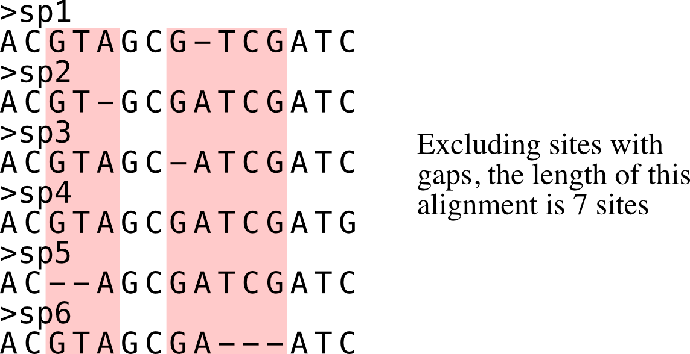

Function names: alignment_length_no_gaps; aln_len_no_gaps; alng |br|
Command line interface: pk_alignment_length_no_gaps; pk_aln_len_no_gaps; pk_alng

Calculate alignment length excluding sites with gaps.

Longer alignments when excluding sites with gaps are
associated with a strong phylogenetic signal.

PhyKIT reports three tab delimited values:
col1: number of sites without gaps
col2: total number of sites
col3: percentage of sites without gaps

The association between alignment length when excluding sites
with gaps and phylogenetic signal was determined by Shen 
et al., Genome Biology and Evolution (2016), 
doi: 10.1093/gbe/evw179.

.. code-block:: shell

		phykit aln_len_no_gaps <alignment> [--json]

Options: |br|
*<alignment>*: first argument after function name should be an alignment file |br|
*--json*: optional argument to print results as JSON

|

.. _cmd-alignment_outlier_taxa:

Alignment outlier taxa
######################
Function names: alignment_outlier_taxa; outlier_taxa; aot |br|
Command line interface: pk_alignment_outlier_taxa; pk_outlier_taxa; pk_aot

Identify potential outlier taxa in an alignment and explicitly report why each taxon was flagged.

The following features are evaluated per taxon:
1) ``gap_rate``: fraction of gap/ambiguous symbols |br|
2) ``occupancy``: fraction of valid symbols |br|
3) ``composition_distance``: Euclidean distance from the median composition profile |br|
4) ``long_branch_proxy``: mean pairwise sequence distance to other taxa |br|
5) ``rcvt``: relative composition variability per taxon |br|
6) ``entropy_burden``: average site entropy over this taxon's valid positions

If a taxon exceeds one or more feature-specific thresholds, PhyKIT reports the exact
feature(s), observed value(s), threshold(s), and explanation(s) for the flag.

.. code-block:: shell

	phykit alignment_outlier_taxa <alignment> [--gap-z <float>] [--composition-z <float>] [--distance-z <float>] [--rcvt-z <float>] [--occupancy-z <float>] [--entropy-z <float>] [--json]

Example output:

.. code-block:: shell

	features_evaluated	gap_rate,occupancy,composition_distance,long_branch_proxy,rcvt,entropy_burden
	thresholds	gap_rate>0.0;occupancy<0.4;composition_distance>0.1;long_branch_proxy>0.4181;rcvt>0.0095;entropy_burden>0.35
	taxon_d	composition_distance=1.3454>0.1;long_branch_proxy=1.0>0.4181	Unusual sequence composition profile relative to other taxa. | High mean pairwise sequence distance to other taxa.
	taxon_e	gap_rate=0.6>0.0;occupancy=0.4<0.4	High fraction of gap/ambiguous symbols compared to other taxa. | Low fraction of valid symbols compared to other taxa.

Options: |br|
*<alignment>*: first argument after function name should be an alignment file |br|
*--gap-z*: z-threshold used for high-gap outlier detection (default: 3.0) |br|
*--composition-z*: z-threshold used for composition-distance outlier detection (default: 3.0) |br|
*--distance-z*: z-threshold used for long-branch-proxy outlier detection (default: 3.0) |br|
*--rcvt-z*: z-threshold used for RCVT outlier detection (default: 3.0) |br|
*--occupancy-z*: z-threshold used for low-occupancy outlier detection (default: 3.0) |br|
*--entropy-z*: z-threshold used for entropy-burden outlier detection (default: 3.0) |br|
*--json*: optional argument to print results as JSON

|

.. _cmd-alignment_subsample:

Alignment subsampling
#####################
Function names: alignment_subsample; aln_subsample; subsample |br|
Command line interface: pk_alignment_subsample; pk_aln_subsample; pk_subsample

Randomly subsample genes, partitions, or sites from phylogenomic datasets.
Supports three modes:

- **genes**: Given a file listing alignment paths, randomly select N of them.
- **partitions**: Given a supermatrix + RAxML-style partition file, randomly
  select N partitions and extract their columns into a new alignment.
- **sites**: Given a single alignment, randomly select N columns.

Sampling can be without replacement (default, for jackknife-style tests) or
with replacement using ``--bootstrap`` (for gene/site bootstrapping).
Use ``--seed`` for reproducibility.

.. code-block:: shell

   # Subsample 50 genes from a list of 200
   phykit alignment_subsample --mode genes -l gene_list.txt --number 50 -o sub50

   # Subsample 50% of partitions from a supermatrix
   phykit alignment_subsample --mode partitions -a concat.fa -p concat.partition \
       --fraction 0.5 --seed 42 -o sub50pct

   # Bootstrap-resample sites from an alignment
   phykit alignment_subsample --mode sites -a alignment.fa \
       --number 500 --bootstrap --seed 1 -o boot1

Options: |br|
*--mode*: subsampling mode: genes, partitions, or sites (required) |br|
*-a/--alignment*: input alignment file in FASTA format (required for partitions and sites modes) |br|
*-l/--list*: file listing alignment paths, one per line (required for genes mode) |br|
*-p/--partition*: RAxML-style partition file (required for partitions mode) |br|
*--number*: exact number of items to select (mutually exclusive with --fraction) |br|
*--fraction*: fraction of items to select, 0.0 to 1.0 (mutually exclusive with --number) |br|
*--bootstrap*: sample with replacement (default: without replacement) |br|
*--seed*: random seed for reproducibility |br|
*-o/--output*: output file prefix (default: subsampled) |br|
*--json*: optional argument to print results as JSON

|

.. _cmd-alignment_recoding:

Alignment recoding
##################
Function names: alignment_recoding; aln_recoding; recode |br|
Command line interface: pk_alignment_recoding; pk_aln_recoding; pk_recode

Recode alignments using reduced character states.

Alignments can be recoded using established or
custom recoding schemes. Recoding schemes are
specified using the -c/--code argument. Custom
recoding schemes can be used and should be formatted
as a two column file wherein the first column is the
recoded character and the second column is the character
in the alignment.

.. code-block:: shell

	phykit alignment_recoding <fasta> [-c/--code <code>] [--json]

Codes for which recoding scheme to use: |br|
**RY-nucleotide** |br|
R = purines (i.e., A and G) |br|
Y = pyrimidines (i.e., T and C) |br|

**SandR-6** |br|
0 = A, P, S, and T |br|
1 = D, E, N, and G |br|
2 = Q, K, and R |br|
3 = M, I, V, and L |br|
4 = W and C |br|
5 = F, Y, and H |br|

**KGB-6** |br|
0 = A, G, P, and S |br|
1 = D, E, N, Q, H, K, R, and T |br|
2 = M, I, and L |br|
3 = W |br|
4 = F and Y |br|
5 = C and V |br|

**Dayhoff-6** |br|
0 = A, G, P, S, and T |br|
1 = D, E, N, and Q |br|
2 = H, K, and R |br|
3 = I, L, M, and V |br|
4 = F, W, and Y |br|
5 = C |br|

**Dayhoff-9** |br|
0 = D, E, H, N, and Q |br|
1 = I, L, M, and V |br|
2 = F and Y |br|
3 = A, S, and T |br|
4 = K and R |br|
5 = G |br|
6 = P |br|
7 = C |br|
8 = W |br|

**Dayhoff-12** |br|
0 = D, E, and Q |br|
1 = M, L, I, and V |br|
2 = F and Y |br|
3 = K, H, and R |br|
4 = G |br|
5 = A |br|
6 = P |br|
7 = S |br|
8 = T |br|
9 = N |br|
A = W |br|
B = C |br|

**Dayhoff-15** |br|
0 = D, E, and Q |br|
1 = M and L |br|
2 = I and V |br|
3 = F and Y |br|
4 = G |br|
5 = A |br|
6 = P |br|
7 = S |br|
8 = T |br|
9 = N |br|
A = K |br|
B = H |br|
C = R |br|
D = W |br|
E = C |br|

**Dayhoff-18** |br|
0 = F and Y |br|
1 = M and L |br|
2 = I |br|
3 = V |br|
4 = G |br|
5 = A |br|
6 = P |br|
7 = S |br|
8 = T |br|
9 = D |br|
A = E |br|
B = Q |br|
C = N |br|
D = K |br|
E = H |br|
F = R |br|
G = W |br|
H = C |br|

Options: |br|
*<alignment>*: first argument after function name should be an alignment file |br|
*-c/--code*: argument to specify the recoding scheme to use |br|
*--json*: optional argument to print results as JSON

|

.. _cmd-column_score:

Column score
############

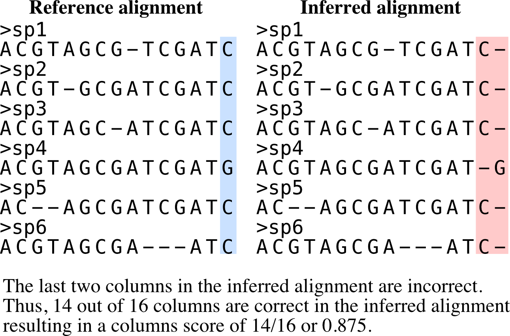

Function names: column_score; cs |br|
Command line interface: pk_column_score; pk_cs

Calculates column score.

Column score is an accuracy metric for a multiple alignment relative
to a reference alignment. It is calculated by summing the correctly
aligned columns over all columns in an alignment. Thus, values range
from 0 to 1 and higher values indicate more accurate alignments.

Column score is calculated following Thompson et al., Nucleic
Acids Research (1999), doi: 10.1093/nar/27.13.2682.

.. code-block:: shell

	phykit column_score <alignment> --reference <reference_alignment> [--json]

Options: |br|
*<alignment>*: first argument after function name should be a query
fasta alignment file to be scored for accuracy |br|
*-r/--reference*: reference alignment to compare the query alignment
to |br|
*--json*: optional argument to print results as JSON

|

.. _cmd-composition_per_taxon:

Composition per taxon
#####################
Function names: composition_per_taxon; comp_taxon; comp_tax |br|
Command line interface: pk_composition_per_taxon; pk_comp_taxon; pk_comp_tax

Calculate sequence composition per taxon in an alignment.

Composition is reported as semicolon-separated `symbol:frequency` pairs
for each taxon. Frequencies are calculated from valid (non-gap/non-ambiguous)
characters. Symbol order is alphabetical.

.. code-block:: shell

	phykit composition_per_taxon <alignment> [--json]

Example output:

.. code-block:: shell

	1	A:0.4;C:0.0;G:0.2;T:0.4
	2	A:0.5;C:0.0;G:0.25;T:0.25

Options: |br|
*<alignment>*: first argument after function name should be an alignment file |br|
*--json*: optional argument to print results as JSON

|

.. _cmd-compositional_bias_per_site:

Compositional bias per site
###########################

Function names: compositional_bias_per_site; comp_bias_per_site; cbps |br|
Command line interface: pk_compositional_bias_per_site; pk_comp_bias_per_site; pk_cbps

Calculates compositional bias per site in an alignment.

Site-wise chi-squared tests are conducted in an alignment to
detect compositional biases. PhyKIT outputs four columns: |br|
col 1: index in alignment |br|
col 2: chi-squared statistic (higher values indicate greater bias) |br|
col 3: multi-test corrected p-value (Benjamini-Hochberg false discovery rate procedure) |br|
col 4: uncorrected p-value

.. code-block:: shell

	phykit comp_bias_per_site <alignment> [--plot] [--plot-output <path>]
		[--fig-width <float>] [--fig-height <float>] [--dpi <int>] [--no-title] [--title <str>]
		[--legend-position <str>] [--ylabel-fontsize <float>] [--xlabel-fontsize <float>]
		[--title-fontsize <float>] [--axis-fontsize <float>] [--colors <str>] [--ladderize] [--cladogram] [--circular] [--color-file <file>] [--json]

Options: |br|
*<alignment>*: first argument after function name should be a query
fasta alignment to calculate the site-wise compositional bias of |br|
*--plot*: save a Manhattan-style plot of site-wise compositional bias |br|
*--plot-output*: output path for plot (default: ``compositional_bias_per_site_plot.png``) |br|
*--fig-width*: figure width in inches (auto-scaled if omitted) |br|
*--fig-height*: figure height in inches (auto-scaled if omitted) |br|
*--dpi*: resolution in DPI (default: 300) |br|
*--no-title*: hide the plot title |br|
*--title*: custom title text |br|
*--legend-position*: legend location (e.g., "upper right", "none" to hide) |br|
*--ylabel-fontsize*: font size for y-axis labels; 0 to hide |br|
*--xlabel-fontsize*: font size for x-axis labels; 0 to hide |br|
*--title-fontsize*: font size for the title |br|
*--axis-fontsize*: font size for axis labels |br|
*--colors*: comma-separated colors (hex or named) |br|
*--ladderize*: ladderize (sort) the tree before plotting |br|
*--cladogram*: draw cladogram (equal branch lengths, tips aligned) instead of phylogram |br|
*--circular*: draw circular (radial/fan) phylogram instead of rectangular |br|
*--color-file*: color annotation file for tip labels, clade ranges, and branch colors (iTOL-inspired TSV format) |br|
*--json*: optional argument to print results as JSON

|

.. _cmd-create_concatenation_matrix:

Create concatenation matrix
###########################

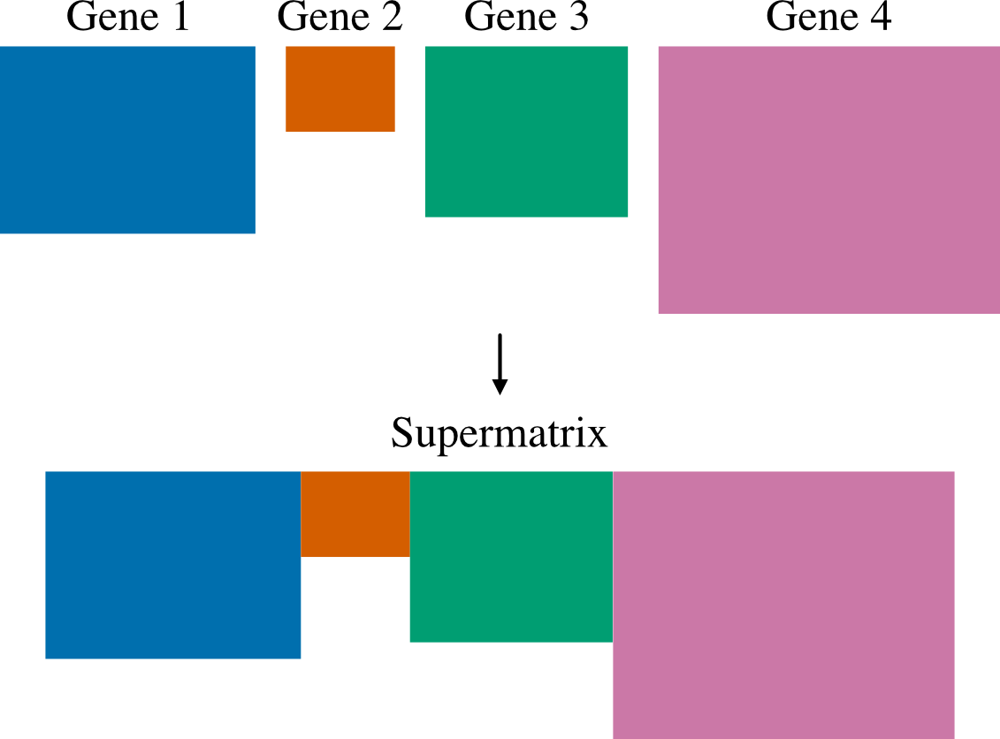

Function names: create_concatenation_matrix; create_concat; cc |br|
Command line interface: pk_create_concatenation_matrix; pk_create_concat; pk_cc

Create a concatenated alignment file. This function is 
used to help in the construction of multi-locus data
matrices.

PhyKIT will output three files:
1) A fasta file with '.fa' appended to the prefix specified with the -p/--prefix parameter.
2) A partition file ready for input into RAxML or IQ-tree.
3) An occupancy file that summarizes the taxon occupancy per sequence.

.. code-block:: shell

	phykit create_concat -a <file> -p <string> [--threshold <float>] [--plot-occupancy] [--plot-output <path>]
		[--fig-width <float>] [--fig-height <float>] [--dpi <int>] [--no-title] [--title <str>]
		[--legend-position <str>] [--ylabel-fontsize <float>] [--xlabel-fontsize <float>]
		[--title-fontsize <float>] [--axis-fontsize <float>] [--colors <str>] [--ladderize] [--cladogram] [--circular] [--color-file <file>] [--json]

Options: |br|
*-a/--alignment*: alignment list file. File should contain a single column list of alignment
sequence files to concatenate into a single matrix. Provide path to files relative to
working directory or provide absolute path. |br|
*-p/--prefix*: prefix of output files |br|
*--threshold*: minimum fraction of informative (non-gap, non-ambiguous) sites across the
concatenated alignment for a taxon to be included. Taxa whose effective occupancy falls
below this value are excluded from the output. Set to 0 to disable filtering
(default: 0). |br|
*--plot-occupancy*: optional argument to output an occupancy map figure where
x-axis shows concatenated positions with gene boundaries and y-axis shows taxa
sorted by total occupancy. Colors denote represented characters, gap/ambiguous
characters in present genes, and fully absent gene blocks. |br|
*--plot-output*: optional custom output path for occupancy map figure
(default: ``<prefix>.occupancy.png``). |br|
*--fig-width*: figure width in inches (auto-scaled if omitted) |br|
*--fig-height*: figure height in inches (auto-scaled if omitted) |br|
*--dpi*: resolution in DPI (default: 300) |br|
*--no-title*: hide the plot title |br|
*--title*: custom title text |br|
*--legend-position*: legend location (e.g., "upper right", "none" to hide) |br|
*--ylabel-fontsize*: font size for y-axis labels; 0 to hide |br|
*--xlabel-fontsize*: font size for x-axis labels; 0 to hide |br|
*--title-fontsize*: font size for the title |br|
*--axis-fontsize*: font size for axis labels |br|
*--colors*: comma-separated colors (hex or named) |br|
*--ladderize*: ladderize (sort) the tree before plotting |br|
*--cladogram*: draw cladogram (equal branch lengths, tips aligned) instead of phylogram |br|
*--circular*: draw circular (radial/fan) phylogram instead of rectangular |br|
*--color-file*: color annotation file for tip labels, clade ranges, and branch colors (iTOL-inspired TSV format) |br|
*--json*: optional argument to print summary metadata as JSON

|

.. _cmd-evolutionary_rate_per_site:

Evolutionary Rate per Site
##########################

Function names: evolutionary_rate_per_site; evo_rate_per_site; erps |br|
Command line interface: pk_evolutionary_rate_per_site; pk_evo_rate_per_site; pk_erps

Estimate evolutionary rate per site.

Evolutionary rate per site is one minus the sum of squared frequency of different
characters at a given site. Values may range from 0 (slow evolving; no diversity
at the given site) to 1 (fast evolving; all characters appear only once).

.. code-block:: shell

	phykit evo_rate_per_site <alignment> [--plot] [--plot-output <path>]
		[--fig-width <float>] [--fig-height <float>] [--dpi <int>] [--no-title] [--title <str>]
		[--legend-position <str>] [--ylabel-fontsize <float>] [--xlabel-fontsize <float>]
		[--title-fontsize <float>] [--axis-fontsize <float>] [--colors <str>] [--ladderize] [--cladogram] [--circular] [--color-file <file>] [--json]

Options: |br|
*<alignment>*: first argument after function name should be a query
fasta alignment to calculate the site-wise evolutionary rate of |br|
*--plot*: save a per-site evolutionary-rate plot |br|
*--plot-output*: output path for plot (default: ``evolutionary_rate_per_site_plot.png``) |br|
*--fig-width*: figure width in inches (auto-scaled if omitted) |br|
*--fig-height*: figure height in inches (auto-scaled if omitted) |br|
*--dpi*: resolution in DPI (default: 300) |br|
*--no-title*: hide the plot title |br|
*--title*: custom title text |br|
*--legend-position*: legend location (e.g., "upper right", "none" to hide) |br|
*--ylabel-fontsize*: font size for y-axis labels; 0 to hide |br|
*--xlabel-fontsize*: font size for x-axis labels; 0 to hide |br|
*--title-fontsize*: font size for the title |br|
*--axis-fontsize*: font size for axis labels |br|
*--colors*: comma-separated colors (hex or named) |br|
*--ladderize*: ladderize (sort) the tree before plotting |br|
*--cladogram*: draw cladogram (equal branch lengths, tips aligned) instead of phylogram |br|
*--circular*: draw circular (radial/fan) phylogram instead of rectangular |br|
*--color-file*: color annotation file for tip labels, clade ranges, and branch colors (iTOL-inspired TSV format) |br|
*--json*: optional argument to print results as JSON

|

.. _cmd-faidx:

Faidx
#####

Function names: faidx; get_entry; ge |br|
Command line interface: pk_faidx; pk_get_entry; pk_ge

Extracts a sequence entry from a fasta file.

This function works similarly to the faidx function 
in samtools, but does not require an indexing step.

To obtain multiple entries, input multiple entries separated
by a comma (,). For example, if you want entries 
named "seq_0" and "seq_1", the string "seq_0,seq_1"
should be associated with the -e argument.

.. code-block:: shell

	phykit faidx <fasta> -e/--entry <fasta entry> [--json]

Options: |br|
*<fasta>*: first argument after function name should be a fasta file |br|
*-e/--entry*: entry name to be extracted from the inputted fasta file |br|
*--json*: optional argument to print results as JSON

|

.. _cmd-gc_content:

Guanine-cytosine (GC) content
#############################

Function names: gc_content; gc |br|
Command line interface: pk_gc_content; pk_gc

Calculate GC content of a fasta file.

GC content is negatively correlated with phylogenetic signal.

If there are multiple entries, use the -v/--verbose option
to determine the GC content of each fasta entry separately.
The association between GC content and phylogenetic signal was
determined by Shen et al., Genome Biology and Evolution (2016), 
doi: 10.1093/gbe/evw179.

.. code-block:: shell

		phykit gc_content <fasta> [-v/--verbose] [--json]

Options: |br|
*<fasta>*: first argument after function name should be a fasta file |br|
*-v/--verbose*: optional argument to print the GC content of each fasta
entry |br|
*--json*: optional argument to print results as JSON

|

.. _cmd-mask_alignment:

Mask alignment
##############
Function names: mask_alignment; mask_aln; mask |br|
Command line interface: pk_mask_alignment; pk_mask_aln; pk_mask

Mask alignment sites based on threshold criteria.

Sites are retained when they pass all active thresholds:
maximum gap fraction, minimum occupancy, and maximum site entropy.

.. code-block:: shell

	phykit mask_alignment <alignment> [-g/--max_gap <float>] [-o/--min_occupancy <float>] [-e/--max_entropy <float>] [--json]

Options: |br|
*<alignment>*: first argument after function name should be an alignment file |br|
*-g/--max_gap*: maximum allowed fraction of missing/invalid characters at a site (default: 1.0) |br|
*-o/--min_occupancy*: minimum required occupancy at a site (default: 0.0) |br|
*-e/--max_entropy*: maximum allowed site entropy (default: no filter) |br|
*--json*: optional argument to print results as JSON

|

.. _cmd-occupancy_per_taxon:

Occupancy per taxon
###################
Function names: occupancy_per_taxon; occupancy_taxon; occ_tax |br|
Command line interface: pk_occupancy_per_taxon; pk_occupancy_taxon; pk_occ_tax

Calculate occupancy per taxon in an alignment.

Occupancy is the fraction of valid (non-gap/non-ambiguous) characters
for each taxon.

.. code-block:: shell

	phykit occupancy_per_taxon <alignment> [--json]

Example output:

.. code-block:: shell

	1	0.8333
	2	0.6667

Options: |br|
*<alignment>*: first argument after function name should be an alignment file |br|
*--json*: optional argument to print results as JSON

|

.. _cmd-pairwise_identity:

Pairwise identity
#################

Function names: pairwise_identity; pairwise_id; pi |br|
Command line interface: pk_pairwise_identity; pk_pairwise_id; pk_pi

Calculate the average pairwise identity among sequences.

Pairwise identities can be used as proxies for the evolutionary rate of sequences.

Pairwise identity is defined as the number of identical
columns (including gaps) between two aligned sequences divided
by the number of columns in the alignment. Summary statistics
are reported unless used with the verbose option in which
all pairwise identities will be reported.

An example of pairwise identities being used as a proxy
for evolutionary rate can be found here: Chen et al. 
Genome Biology and Evolution (2017), doi: 10.1093/gbe/evx147.

.. code-block:: shell

	phykit pairwise_identity <alignment> [-v/--verbose] [-e/--exclude_gaps] [--plot] [--plot-output <file>]
		[--fig-width <float>] [--fig-height <float>] [--dpi <int>] [--no-title] [--title <str>]
		[--legend-position <str>] [--ylabel-fontsize <float>] [--xlabel-fontsize <float>]
		[--title-fontsize <float>] [--axis-fontsize <float>] [--colors <str>] [--ladderize] [--cladogram] [--circular] [--color-file <file>] [--json]

Options: |br|
*<alignment>*: first argument after function name should be an alignment file |br|
*-v/--verbose*: optional argument to print identity per pair |br|
*-e/--exclude_gaps*: if a site has a gap, ignore it |br|
*--plot*: save a clustered pairwise-identity heatmap |br|
*--plot-output*: output path for heatmap (default: pairwise_identity_heatmap.png) |br|
*--fig-width*: figure width in inches (auto-scaled if omitted) |br|
*--fig-height*: figure height in inches (auto-scaled if omitted) |br|
*--dpi*: resolution in DPI (default: 300) |br|
*--no-title*: hide the plot title |br|
*--title*: custom title text |br|
*--legend-position*: legend location (e.g., "upper right", "none" to hide) |br|
*--ylabel-fontsize*: font size for y-axis labels; 0 to hide |br|
*--xlabel-fontsize*: font size for x-axis labels; 0 to hide |br|
*--title-fontsize*: font size for the title |br|
*--axis-fontsize*: font size for axis labels |br|
*--colors*: comma-separated colors (hex or named) |br|
*--ladderize*: ladderize (sort) the tree before plotting |br|
*--cladogram*: draw cladogram (equal branch lengths, tips aligned) instead of phylogram |br|
*--circular*: draw circular (radial/fan) phylogram instead of rectangular |br|
*--color-file*: color annotation file for tip labels, clade ranges, and branch colors (iTOL-inspired TSV format) |br|
*--json*: optional argument to print results as JSON

|

.. _cmd-identity_matrix:

Identity matrix
###############

Function names: identity_matrix; id_matrix; seqid |br|
Command line interface: pk_identity_matrix; pk_id_matrix; pk_seqid

Compute a pairwise sequence identity matrix from an alignment and plot it as a
clustered heatmap.

For each pair of taxa, identity is defined as the fraction of non-gap,
non-ambiguous columns that are identical. Gaps, '?', 'N', 'X', and '*' in
either sequence cause a column to be skipped.

The matrix can be displayed as identity (default) or p-distance (1 - identity)
using --metric. Ordering can be by hierarchical clustering (default), tree tip
order (--sort tree --tree <file>), or alphabetical (--sort alpha).

.. code-block:: shell

	phykit identity_matrix -a <alignment> -o <output>
		[--metric identity|p-distance] [--tree <file>]
		[--sort alpha|cluster|tree] [--partition <file>] [--json]
		[--fig-width <float>] [--fig-height <float>] [--dpi <int>]
		[--no-title] [--title <str>]
		[--ylabel-fontsize <float>] [--xlabel-fontsize <float>]
		[--title-fontsize <float>] [--axis-fontsize <float>]

Options: |br|
*-a/--alignment*: alignment file (FASTA or other supported format) |br|
*-o/--output*: output figure path (.png, .pdf, .svg) |br|
*--metric*: 'identity' (fraction matching) or 'p-distance' (1 - identity); default: identity |br|
*--tree*: tree file for tree-guided ordering (Newick format) |br|
*--sort*: ordering method: 'cluster' (hierarchical), 'tree' (requires --tree), or 'alpha' (alphabetical); default: cluster |br|
*--partition*: RAxML-style partition file (reserved for future use) |br|
*--json*: output structured JSON instead of plain text |br|
*--fig-width*: figure width in inches (auto-scaled if omitted) |br|
*--fig-height*: figure height in inches (auto-scaled if omitted) |br|
*--dpi*: resolution in DPI (default: 300) |br|
*--no-title*: hide the plot title |br|
*--title*: custom title text |br|
*--ylabel-fontsize*: font size for y-axis labels; 0 to hide |br|
*--xlabel-fontsize*: font size for x-axis labels; 0 to hide |br|
*--title-fontsize*: font size for the title |br|
*--axis-fontsize*: font size for axis labels

|

.. _cmd-parsimony_informative_sites:

Parsimony informative sites
###########################
Function names: parsimony_informative_sites; pis |br|
Command line interface: pk_parsimony_informative_sites; pk_pis

Calculate the number and percentage of parsimony
informative sites in an alignment.

The number of parsimony informative sites in an alignment
is associated with a strong phylogenetic signal.

PhyKIT reports three tab delimited values:
col1: number of parsimony informative sites
col2: total number of sites
col3: percentage of parsimony informative sites

The association between the number of parsimony informative
sites and phylogenetic signal was determined by Shen 
et al., Genome Biology and Evolution (2016), 
doi: 10.1093/gbe/evw179 and Steenwyk et al., PLOS Biology
(2020), doi: 10.1371/journal.pbio.3001007.

.. code-block:: shell

		phykit parsimony_informative_sites <alignment> [--json]

Options: |br|
*<alignment>*: first argument after function name should be an alignment file |br|
*--json*: optional argument to print results as JSON

|

.. _cmd-plot_alignment_qc:

Plot alignment QC
#################
Function names: plot_alignment_qc; plot_qc; paqc |br|
Command line interface: pk_plot_alignment_qc; pk_plot_qc; pk_paqc

Generate a multi-panel alignment quality-control plot.

The figure includes:
1) occupancy per taxon |br|
2) gap rate per taxon |br|
3) composition distance vs long-branch proxy scatter |br|
4) count of flagged outliers by feature

Outlier evaluation uses the same features as ``alignment_outlier_taxa``:
``gap_rate``, ``occupancy``, ``composition_distance``, ``long_branch_proxy``,
``rcvt``, and ``entropy_burden``.

.. code-block:: shell

	phykit plot_alignment_qc <alignment> [-o/--output <path>] [--width <float>] [--height <float>] [--dpi <int>] [--gap-z <float>] [--composition-z <float>] [--distance-z <float>] [--rcvt-z <float>] [--occupancy-z <float>] [--entropy-z <float>] [--json]

Options: |br|
*<alignment>*: first argument after function name should be an alignment file |br|
*-o/--output*: output image path (default: ``alignment_qc.png``) |br|
*--width*: figure width in inches (default: ``14.0``) |br|
*--height*: figure height in inches (default: ``10.0``) |br|
*--dpi*: output image DPI (default: ``300``) |br|
*--gap-z*: z-threshold for gap-rate outliers (default: ``3.0``) |br|
*--composition-z*: z-threshold for composition-distance outliers (default: ``3.0``) |br|
*--distance-z*: z-threshold for long-branch-proxy outliers (default: ``3.0``) |br|
*--rcvt-z*: z-threshold for RCVT outliers (default: ``3.0``) |br|
*--occupancy-z*: z-threshold for low-occupancy outliers (default: ``3.0``) |br|
*--entropy-z*: z-threshold for entropy-burden outliers (default: ``3.0``) |br|
*--json*: optional argument to print plot metadata and outlier summary as JSON

|

.. _cmd-thread_dna:

Protein-to-nucleotide alignment
###############################
Function names: thread_dna; pal2nal; p2n |br|
Command line interface: pk_thread_dna; pk_pal2nal; pk_p2n

Thread DNA sequence onto a protein alignment to create a
codon-based alignment. 

This function requires that input alignments be in fasta format.
Codon alignments are then printed to stdout. Note, paired
sequences are assumed to have the same name between the 
protein and nucleotide file. The order does not matter.

To thread nucleotide sequences over a trimmed amino acid
alignment, provide PhyKIT with a log file specifying which
sites have been trimmed and which have been kept. The log
file must be formatted the same as the log files outputted
by the alignment trimming toolkit ClipKIT (see -l in ClipKIT
documentation.) Details about ClipKIT can be seen here:
https://github.com/JLSteenwyk/ClipKIT.

If using a ClipKIT log file, the untrimmed protein alignment
should be provided in the -p/--protein argument.

.. code-block:: shell

   phykit thread_dna -p <file> -n <file> [-s] [--json]

Options: |br|
*-p/--protein*: protein alignment file |br|
*-n/--nucleotide*: nucleotide sequence file |br|
*-c/--clipkit_log*: clipkit outputted log file |br|
*-s/--stop*: if used, stop codons will be removed from the output |br|
*--json*: optional argument to print results as JSON

|

.. _cmd-relative_composition_variability:

Relative composition variability
################################
Function names: relative_composition_variability; rel_comp_var; rcv |br|
Command line interface: pk_relative_composition_variability; pk_rel_comp_var; pk_rcv

Calculate RCV (relative composition variability) for an alignment.

Lower RCV values are thought to be desirable because they represent
a lower composition bias in an alignment. Statistically, RCV describes
the average variability in sequence composition among taxa. 

RCV is calculated following Phillips and Penny, Molecular Phylogenetics
and Evolution (2003), doi: 10.1016/S1055-7903(03)00057-5.

RCV calculations are case-insensitive. Gap and ambiguous characters are
excluded from composition counts and correction terms, and each taxon is
normalized by its valid (non-excluded) sequence length.

.. code-block:: shell

		phykit relative_composition_variability <alignment> [--json]

Options: |br|
*<alignment>*: first argument after function name should be an alignment file |br|
*--json*: optional argument to print results as JSON

|

.. _cmd-relative_composition_variability_taxon:

Relative composition variability, taxon
#######################################
Function names: relative_composition_variability_taxon; rel_comp_var_taxon; rcvt |br|
Command line interface: pk_relative_composition_variability_taxon; pk_rel_comp_var_taxon; pk_rcvt

Calculate RCVT (relative composition variability, taxon) for an alignment.

RCVT is the relative composition variability metric for individual taxa.
This facilitates identifying specific taxa that may have compositional
biases. Lower RCVT values are more desirable because they indicate
a lower composition bias for a given taxon in an alignment.

RCVT calculations are case-insensitive and exclude gap/ambiguous symbols
from composition counts and normalization.

.. code-block:: shell

	phykit relative_composition_variability_taxon <alignment> [--plot] [--plot-output <path>]
		[--fig-width <float>] [--fig-height <float>] [--dpi <int>] [--no-title] [--title <str>]
		[--legend-position <str>] [--ylabel-fontsize <float>] [--xlabel-fontsize <float>]
		[--title-fontsize <float>] [--axis-fontsize <float>] [--colors <str>] [--ladderize] [--cladogram] [--circular] [--color-file <file>] [--json]

Options: |br|
*<alignment>*: first argument after function name should be an alignment file |br|
*--plot*: optional argument to generate an RCVT per-taxon barplot |br|
*--plot-output*: output path for the RCVT plot (default: ``rcvt_plot.png``) |br|
*--fig-width*: figure width in inches (auto-scaled if omitted) |br|
*--fig-height*: figure height in inches (auto-scaled if omitted) |br|
*--dpi*: resolution in DPI (default: 300) |br|
*--no-title*: hide the plot title |br|
*--title*: custom title text |br|
*--legend-position*: legend location (e.g., "upper right", "none" to hide) |br|
*--ylabel-fontsize*: font size for y-axis labels; 0 to hide |br|
*--xlabel-fontsize*: font size for x-axis labels; 0 to hide |br|
*--title-fontsize*: font size for the title |br|
*--axis-fontsize*: font size for axis labels |br|
*--colors*: comma-separated colors (hex or named) |br|
*--ladderize*: ladderize (sort) the tree before plotting |br|
*--cladogram*: draw cladogram (equal branch lengths, tips aligned) instead of phylogram |br|
*--circular*: draw circular (radial/fan) phylogram instead of rectangular |br|
*--color-file*: color annotation file for tip labels, clade ranges, and branch colors (iTOL-inspired TSV format) |br|
*--json*: optional argument to print results as JSON

|

.. _cmd-rename_fasta_entries:

Rename FASTA entries
####################
Function names: rename_fasta_entries; rename_fasta |br|
Command line interface: pk_rename_fasta_entries; pk_rename_fasta

Renames fasta entries.

Renaming fasta entries will follow the scheme of a tab-delimited
file wherein the first column is the current fasta entry name and
the second column is the new fasta entry name in the resulting 
output alignment. Note, the input fasta file does not need to be
an alignment file.

.. code-block:: shell

	phykit rename_fasta_entries <fasta> -i/--idmap <idmap> [-o/--output <output_file>] [--json]

Options: |br|
*<fasta>*: first argument after function name should be a FASTA file |br|
*-i/--idmap*: identifier map of current FASTA names (col1) and desired FASTA names (col2) |br|
*--json*: optional argument to print results as JSON

|

.. _cmd-sum_of_pairs_score:

Sum-of-pairs score
##################
Function names: sum_of_pairs_score; sops; sop |br|
Command line interface: pk_sum_of_pairs_score; pk_sops; pk_sop

Calculates sum-of-pairs score.

Sum-of-pairs is an accuracy metric for a multiple alignment relative
to a reference alignment. It is calculated by summing the correctly
aligned residue pairs over all pairs of sequences. Thus, values range
from 0 to 1 and higher values indicate more accurate alignments.

Sum-of-pairs score is calculated following Thompson et al., Nucleic
Acids Research (1999), doi: 10.1093/nar/27.13.2682.

.. code-block:: shell

	phykit sum_of_pairs_score <alignment> --reference <reference_alignment> [--json]

Options: |br|
*<alignment>*: first argument after function name should be a query
fasta alignment file to be scored for accuracy |br|
*-r/--reference*: reference alignment to compare the query alignment
to |br|
*--json*: optional argument to print results as JSON

|

.. _cmd-phylo_gwas:

Phylo GWAS
##########
Function names: phylo_gwas; pgwas |br|
Command line interface: pk_phylo_gwas; pk_pgwas

Phylogenetic genome-wide association study following the Pease et al.
(2016) approach. Performs per-site association tests between alignment
columns and a phenotype, applies Benjamini-Hochberg FDR correction,
optionally classifies significant associations as monophyletic or
polyphyletic using a phylogenetic tree, and produces a Manhattan plot.

Categorical phenotypes use Fisher's exact test (2 groups) or chi-squared
test (>2 groups). Continuous phenotypes use point-biserial correlation.
Only biallelic sites are tested; invariant and multiallelic sites are
skipped. Sites with gaps or ambiguous characters are also skipped.

.. code-block:: shell

   phykit phylo_gwas -a <alignment> -d <phenotype> -o <output>
     [-t <tree>] [-p <partition>] [--alpha 0.05]
     [--exclude-monophyletic] [--csv <file>] [--json]

Options: |br|
*-a/--alignment*: FASTA alignment file |br|
*-d/--phenotype*: two-column TSV file (taxon<tab>phenotype) |br|
*-o/--output*: output Manhattan plot path |br|
*-t/--tree*: optional Newick tree for monophyletic/polyphyletic classification |br|
*-p/--partition*: optional RAxML-style partition file for gene annotations |br|
*--alpha*: FDR significance threshold (default: 0.05) |br|
*--exclude-monophyletic*: exclude monophyletic associations from results |br|
*--dot-size*: scale factor for dot size in the Manhattan plot (default: 1.0; use 2.0 for double, 0.5 for half) |br|
*--csv*: output per-site results as CSV to the specified file |br|
*--fig-width*: figure width in inches (auto-scaled if omitted) |br|
*--fig-height*: figure height in inches (auto-scaled if omitted) |br|
*--dpi*: resolution in DPI (default: 300) |br|
*--no-title*: hide the plot title |br|
*--title*: custom title text |br|
*--legend-position*: legend location (e.g., "upper right", "none") |br|
*--colors*: comma-separated colors (hex or named) |br|
*--json*: optional argument to print results as JSON

|

.. _cmd-variable_sites:

Variable sites
##############
Function names: variable_sites; vs |br|
Command line interface: pk_variable_sites; pk_vs

Calculate the number of variable sites in an alignment.

The number of variable sites in an alignment is
associated with a strong phylogenetic signal.

PhyKIT reports three tab delimited values:
col1: number of variable sites
col2: total number of sites
col3: percentage of variable sites

The association between the number of variable sites and
phylogenetic signal was determined by Shen et al.,
Genome Biology and Evolution (2016), 
doi: 10.1093/gbe/evw179.

.. code-block:: shell

   phykit variable_sites <alignment> [--json]

Options: |br|
*<alignment>*: first argument after function name should be an alignment file |br|
*--json*: optional argument to print results as JSON

|

Tree-based functions
--------------------

.. _cmd-parsimony_score:

Parsimony score
###############
Function names: parsimony_score; parsimony; pars |br|
Command line interface: pk_parsimony_score; pk_parsimony; pk_pars

Compute the Fitch (1971) maximum parsimony score of a tree given an
alignment. The parsimony score is the minimum number of character state
changes required to explain the alignment on the given tree topology.
Gap characters (-, N, X, ?) are treated as wildcards.

Cross-validated against R's phangorn::parsimony(method="fitch").

.. code-block:: shell

	phykit parsimony_score -t <tree> -a <alignment> [-v/--verbose] [--json]

Options: |br|
*-t/--tree*: tree file (required) |br|
*-a/--alignment*: alignment file in FASTA format (required) |br|
*-v/--verbose*: print per-site parsimony scores |br|
*--json*: optional argument to print results as JSON

|

.. _cmd-character_map:

Character map (synapomorphy/homoplasy mapping)
##############################################
Function names: character_map; charmap; synapomorphy_map |br|
Command line interface: pk_character_map; pk_charmap; pk_synapomorphy_map

Map character state changes onto a phylogeny using Fitch parsimony with
ACCTRAN (default) or DELTRAN optimization. Produces a cladogram (default)
or phylogram with color-coded circles on each branch showing where
character state changes occur. This is useful for visualizing
synapomorphies and homoplasies in morphological datasets, similar to
the classic Winclada software.

Each circle on a branch represents a character state change. The
**number above** the circle is the character index (matching the column
in the input matrix). The **transition below** shows the old and new
state (e.g., ``0→1``). Circle color indicates the type of change:

- **Blue** circles: synapomorphies — this character changed to this
  state only once on the entire tree, uniquely supporting the clade
- **Red** circles: convergences — this character independently gained
  the same state on two or more branches
- **Gray** circles: reversals — the character returned to a state
  previously seen at an ancestor

Note that the same state transition (e.g., ``0→1``) may appear in
different colors because the color reflects how many times *that
particular character* underwent that transition across the tree, not the
state values themselves.

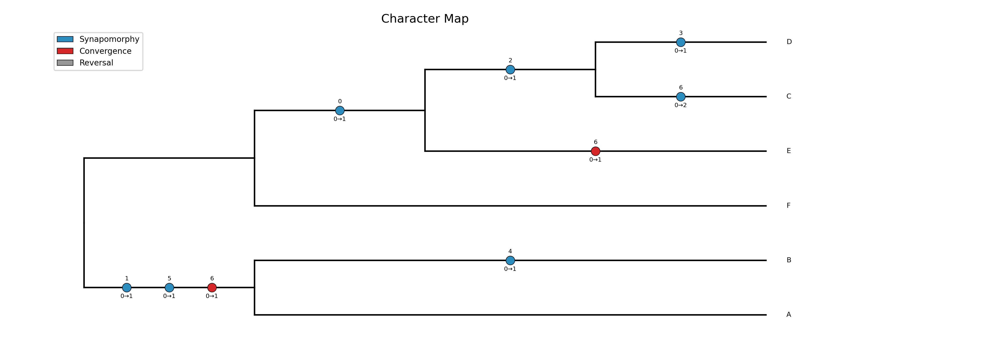

Input: a Newick tree file and a TSV character matrix (header row with
character names, one row per taxon with discrete states). Missing data
(``?`` or ``-``) is treated as a wildcard.

Reports the consistency index (CI), retention index (RI), and total tree
length (parsimony steps). CI and RI cross-validated against R's phangorn.

Polytomies are automatically resolved by inserting zero-length branches.

**Example usage:**

.. code-block:: shell

   # Basic usage with default ACCTRAN optimization and cladogram layout
   phykit character_map -t species.tre -d morphology.tsv -o charmap.png

   # Use DELTRAN optimization and ladderize the tree
   phykit character_map -t species.tre -d morphology.tsv -o charmap.png \
       --optimization deltran --ladderize

   # Show only specific characters of interest
   phykit character_map -t species.tre -d morphology.tsv -o charmap.png \
       --characters 0,3,7,12

   # Phylogram layout with JSON output
   phykit character_map -t species.tre -d morphology.tsv -o charmap.png \
       --phylogram --json

**Input format** — the character matrix is a tab-separated file where
the first row is a header with character names, and each subsequent row
has a taxon name followed by the character states:

.. code-block:: text

   taxon	char0	char1	char2	char3
   Taxon_A	0	1	0	2
   Taxon_B	0	1	1	0
   Taxon_C	1	0	0	2
   Taxon_D	1	0	1	1

**Full usage:**

.. code-block:: shell

   phykit character_map -t <tree> -d <data> -o <output>
       [--optimization acctran|deltran] [--phylogram]
       [--characters 0,1,3] [--verbose] [--json]
       [--fig-width <float>] [--fig-height <float>] [--dpi <int>] [--no-title] [--title <str>]
       [--legend-position <str>] [--ylabel-fontsize <float>] [--xlabel-fontsize <float>]
       [--title-fontsize <float>] [--axis-fontsize <float>] [--colors <str>] [--ladderize]

Options: |br|
*-t/--tree*: tree file in Newick format (required) |br|
*-d/--data*: TSV character matrix with header row (required) |br|
*-o/--output*: output figure path (.png, .pdf, .svg) (required) |br|
*--optimization*: ancestral state optimization: acctran (default) or deltran |br|
*--phylogram*: draw phylogram instead of cladogram |br|
*--characters*: comma-separated character indices to display (0-based; all characters are still used for CI/RI) |br|
*--verbose*: print per-character detail |br|
*--colors*: comma-separated colors for synapomorphy, convergence, reversal (default: blue, red, gray) |br|
*--ladderize*: ladderize (sort) the tree before plotting |br|
*--cladogram*: draw cladogram (equal branch lengths, tips aligned) instead of phylogram |br|
*--circular*: draw circular (radial/fan) phylogram instead of rectangular |br|
*--color-file*: color annotation file for tip labels, clade ranges, and branch colors (iTOL-inspired TSV format) |br|
*--json*: optional argument to print results as JSON

|

.. _cmd-independent_contrasts:

Independent contrasts (PIC)
###########################
Function names: independent_contrasts; pic; phylo_contrasts |br|
Command line interface: pk_independent_contrasts; pk_pic; pk_phylo_contrasts

Compute Felsenstein's (1985) phylogenetically independent contrasts for a
continuous trait on a phylogeny. Each internal node yields one standardized
contrast, producing n-1 contrasts for n tips. Multifurcations are
automatically resolved.

Cross-validated against R's ape::pic(). The sum of squared contrasts
matches R exactly.

.. code-block:: shell

	phykit independent_contrasts -t <tree> -d <trait_data> [--json]

Options: |br|
*-t/--tree*: tree file (required) |br|
*-d/--trait_data*: trait data file, two columns: taxon<tab>value (required) |br|
*--json*: optional argument to print results as JSON

|

.. _cmd-ancestral_state_reconstruction:

Ancestral state reconstruction
##############################
Function names: ancestral_state_reconstruction; asr; anc_recon |br|
Command line interface: pk_ancestral_state_reconstruction; pk_asr; pk_anc_recon

Estimate ancestral states using maximum likelihood. Supports both
continuous and discrete traits.

**Continuous traits** (``--type continuous``, default): Brownian Motion
model, analogous to R's ``phytools::fastAnc()`` and
``ape::ace(type="ML")``. Optionally produce a contMap plot.

Two methods are available for continuous traits:

- **fast** (default): Felsenstein's pruning/contrasts shortcut, O(n) time
- **ml**: full VCV-based ML with exact conditional CIs, O(n^3)

Both methods produce identical point estimates; ``ml`` gives exact
conditional confidence intervals.

**Discrete traits** (``--type discrete``): Mk model with marginal
posterior probabilities at each internal node, analogous to
``ape::ace(type="discrete")``. Optionally produce a pie-chart phylogeny
plot.

Three models are available for discrete traits:

- **ER** (default): equal rates
- **SYM**: symmetric rates
- **ARD**: all rates different

Input trait data can be either a two-column file (``taxon<tab>value``)
when ``-c`` is omitted, or a multi-trait file with header row when ``-c``
specifies which column to use.

.. code-block:: shell

   phykit ancestral_state_reconstruction -t <tree> -d <trait_data> [-c <trait>] [--type <type>] [-m <method>] [--model <model>] [--ci] [--plot <output>]
       [--fig-width <float>] [--fig-height <float>] [--dpi <int>] [--no-title] [--title <str>]
       [--legend-position <str>] [--ylabel-fontsize <float>] [--xlabel-fontsize <float>]
       [--title-fontsize <float>] [--axis-fontsize <float>] [--colors <str>] [--ladderize] [--cladogram] [--circular] [--color-file <file>] [--json]

Options: |br|
*-t/--tree*: a phylogenetic tree file |br|
*-d/--trait_data*: trait data file (two-column or multi-trait with header) |br|
*-c/--trait*: trait column name (required for multi-trait files) |br|
*--type*: trait type: ``continuous`` or ``discrete`` (default: ``continuous``) |br|
*-m/--method*: method to use: ``fast`` or ``ml`` (continuous only; default: ``fast``) |br|
*--model*: Mk model: ``ER``, ``SYM``, or ``ARD`` (discrete only; default: ``ER``) |br|
*--ci*: include 95% confidence intervals (continuous only) |br|
*--plot*: output path for plot (requires matplotlib) |br|
*--plot-ci*: draw confidence interval bars at internal nodes on the contMap plot (requires --ci and --plot) |br|
*--ci-size*: scale factor for CI bar size (default: 1.0; use 2.0 for larger, 0.5 for smaller) |br|
*--fig-width*: figure width in inches (auto-scaled if omitted) |br|
*--fig-height*: figure height in inches (auto-scaled if omitted) |br|
*--dpi*: resolution in DPI (default: 300) |br|
*--no-title*: hide the plot title |br|
*--title*: custom title text |br|
*--legend-position*: legend location (e.g., "upper right", "none" to hide) |br|
*--ylabel-fontsize*: font size for y-axis labels; 0 to hide |br|
*--xlabel-fontsize*: font size for x-axis labels; 0 to hide |br|
*--title-fontsize*: font size for the title |br|
*--axis-fontsize*: font size for axis labels |br|
*--colors*: comma-separated colors (hex or named) |br|
*--ladderize*: ladderize (sort) the tree before plotting |br|
*--cladogram*: draw cladogram (equal branch lengths, tips aligned) instead of phylogram |br|
*--circular*: draw circular (radial/fan) phylogram instead of rectangular |br|
*--color-file*: color annotation file for tip labels, clade ranges, and branch colors (iTOL-inspired TSV format) |br|
*--json*: output results as JSON

Example contMap plot generated with the ``--plot`` option. Branches are colored
by interpolated ancestral trait values:

.. image:: ../_static/img/asr_example.png
   :align: center
   :width: 80%

|

.. _cmd-tree_space:

Tree space visualization
########################
Function names: tree_space; tspace; tree_landscape |br|
Command line interface: pk_tree_space; pk_tspace; pk_tree_landscape

Visualize how gene trees cluster in topology space by computing pairwise
distances (Robinson-Foulds or Kuhner-Felsenstein) and projecting into
2D via MDS, t-SNE, or UMAP. Points are colored by spectral clustering
with automatic cluster detection via the eigengap heuristic.

Alternatively, use ``--heatmap`` to draw a clustered distance heatmap
with a dendrogram showing hierarchical relationships among gene trees.
Use ``--distance-matrix`` to export the raw pairwise distance matrix
as a CSV file.

Optionally highlight a species tree as a distinct marker to see where
it sits relative to the gene tree cloud.

.. code-block:: shell

   phykit tree_space -t <trees> -o <output>
       [--metric rf|kf] [--method mds|tsne|umap]
       [--species-tree <file>] [--k <int>] [--seed <int>]
       [--heatmap] [--distance-matrix <file>]
       [--fig-width <float>] [--fig-height <float>] [--dpi <int>] [--no-title] [--title <str>]
       [--legend-position <str>] [--ylabel-fontsize <float>] [--xlabel-fontsize <float>]
       [--title-fontsize <float>] [--axis-fontsize <float>] [--colors <str>] [--ladderize] [--cladogram] [--circular] [--color-file <file>] [--json]

Options: |br|
*-t/--trees*: file with gene trees (one Newick per line, or one file path per line) (required) |br|
*-o/--output*: output figure path (.png, .pdf, .svg) (required) |br|
*--metric*: distance metric: rf (normalized Robinson-Foulds, default) or kf (Kuhner-Felsenstein) |br|
*--method*: dimensionality reduction: mds (default), tsne, or umap |br|
*--species-tree*: optional species tree to highlight in the plot as a star marker |br|
*--k*: number of clusters (auto-detected via eigengap if omitted) |br|
*--seed*: random seed for reproducibility (t-SNE/UMAP) |br|
*--heatmap*: draw a clustered distance heatmap instead of a scatter plot |br|
*--distance-matrix*: output the pairwise distance matrix as a CSV file |br|
*--json*: optional argument to print results as JSON

|

.. _cmd-spectral_discordance:

Spectral discordance decomposition
###################################
Function names: spectral_discordance; spec_disc; sd |br|
Command line interface: pk_spectral_discordance; pk_spec_disc; pk_sd

Decompose gene tree space via PCA on a bipartition presence/absence (or
branch-length) matrix, with spectral clustering and automatic cluster
detection via the eigengap heuristic.

Each gene tree is encoded as a vector over the union of all observed
bipartitions. PCA reveals the axes of topological variation, with loading
vectors directly identifying which bipartitions drive each PC. Spectral
clustering groups genes sharing similar topologies; the number of clusters
is auto-detected from the eigengap of the graph Laplacian.

Two metrics are available:

- **nrf** (default): binary presence/absence, consistent with normalized Robinson-Foulds distance
- **wrf**: branch-length weighted

Polytomies (collapsed branches) in gene trees are handled conservatively:
splits from polytomous nodes are excluded from the bipartition matrix since
they represent unresolved relationships. Trifurcating roots (standard
unrooted Newick) are not affected. This allows gene trees with collapsed
low-support branches to be used directly as input.

.. code-block:: shell

   phykit spectral_discordance -g <gene_trees> [-t <tree>] [--metric nrf|wrf] [--clusters K] [--n-pcs N] [--top-loadings N] [--plot <prefix>]
       [--fig-width <float>] [--fig-height <float>] [--dpi <int>] [--no-title] [--title <str>]
       [--legend-position <str>] [--ylabel-fontsize <float>] [--xlabel-fontsize <float>]
       [--title-fontsize <float>] [--axis-fontsize <float>] [--colors <str>] [--ladderize] [--cladogram] [--circular] [--color-file <file>] [--json]

Options: |br|
*-g/--gene-trees*: file of gene trees (one Newick per line, or file of filenames) |br|
*-t/--tree*: species tree (optional; flags species-tree bipartitions in loadings) |br|
*--metric*: distance metric: ``nrf`` or ``wrf`` (default: ``nrf``) |br|
*--clusters*: override auto-detected number of clusters |br|
*--n-pcs*: number of PCs to report (default: min(10, G-1)) |br|
*--top-loadings*: top bipartitions per PC to display (default: 5) |br|
*--plot*: output prefix for plots (generates ``_scatter.png`` and ``_eigengap.png``) |br|
*--fig-width*: figure width in inches (auto-scaled if omitted) |br|
*--fig-height*: figure height in inches (auto-scaled if omitted) |br|
*--dpi*: resolution in DPI (default: 300) |br|
*--no-title*: hide the plot title |br|
*--title*: custom title text |br|
*--legend-position*: legend location (e.g., "upper right", "none" to hide) |br|
*--ylabel-fontsize*: font size for y-axis labels; 0 to hide |br|
*--xlabel-fontsize*: font size for x-axis labels; 0 to hide |br|
*--title-fontsize*: font size for the title |br|
*--axis-fontsize*: font size for axis labels |br|
*--colors*: comma-separated colors (hex or named) |br|
*--ladderize*: ladderize (sort) the tree before plotting |br|
*--cladogram*: draw cladogram (equal branch lengths, tips aligned) instead of phylogram |br|
*--circular*: draw circular (radial/fan) phylogram instead of rectangular |br|
*--color-file*: color annotation file for tip labels, clade ranges, and branch colors (iTOL-inspired TSV format) |br|
*--json*: output results as JSON

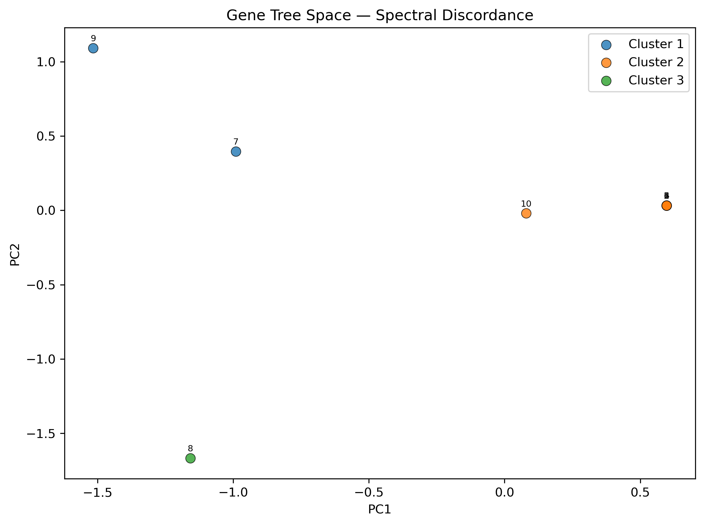

|

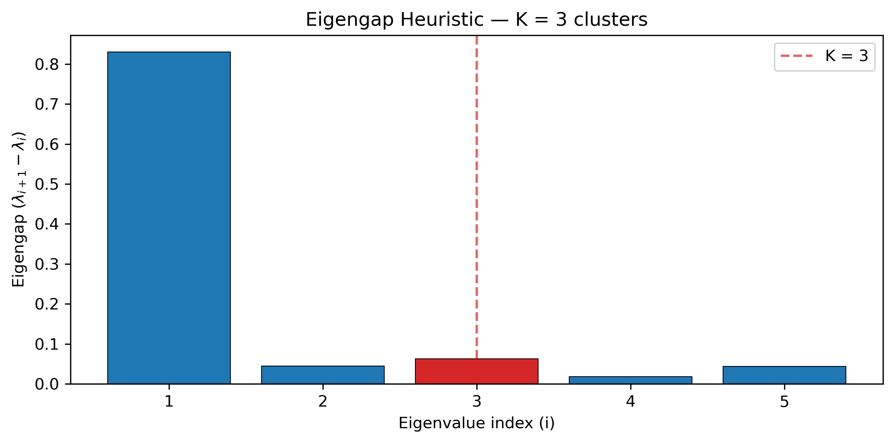

|

.. _cmd-concordance_asr:

Concordance-aware ancestral state reconstruction
#################################################
Function names: concordance_asr; conc_asr; casr |br|
Command line interface: pk_concordance_asr; pk_conc_asr; pk_casr

Concordance-aware ancestral state reconstruction that incorporates gene
tree discordance into ancestral estimates. Standard ASR operates on a
single species tree and ignores gene tree conflict. This command propagates
topological uncertainty from gene tree discordance into ancestral state
estimates using gene concordance factors (gCF).

Two strategies are available:

- **weighted** (default): For each internal node, compute gCF (fraction of
  gene trees supporting the species-tree bipartition) and gDF1, gDF2
  (fractions for NNI alternatives). Run ASR on the species tree and NNI
  alternative trees, then combine estimates weighted by concordance. Uses the
  law of total variance to separate topological vs parameter uncertainty.
- **distribution**: Run ASR independently on each gene tree, map nodes across
  trees by descendant-set identity, and report concordance-weighted means with
  percentile confidence intervals (2.5th--97.5th).

.. code-block:: shell

   phykit concordance_asr -t <species_tree> -g <gene_trees> -d <trait_data>
       [-c <trait>] [-m weighted|distribution] [--ci]
       [--plot <output>] [--missing-taxa error|shared]
       [--fig-width <float>] [--fig-height <float>] [--dpi <int>] [--no-title] [--title <str>]
       [--legend-position <str>] [--ylabel-fontsize <float>] [--xlabel-fontsize <float>]
       [--title-fontsize <float>] [--axis-fontsize <float>] [--colors <str>] [--ladderize] [--cladogram] [--circular] [--color-file <file>] [--json]

Options: |br|
*-t/--tree*: species tree file |br|
*-g/--gene-trees*: file with gene trees (multi-Newick, one per line) |br|
*-d/--trait_data*: trait data file (two-column or multi-trait with header) |br|
*-c/--trait*: trait column name (required for multi-trait files) |br|
*-m/--method*: method to use: ``weighted`` or ``distribution`` (default: ``weighted``) |br|
*--ci*: include 95% confidence intervals |br|
*--plot*: output path for concordance ASR plot |br|
*--missing-taxa*: how to handle taxa mismatches: ``shared`` (default, prune to intersection) or ``error`` (reject) |br|
*--fig-width*: figure width in inches (auto-scaled if omitted) |br|
*--fig-height*: figure height in inches (auto-scaled if omitted) |br|
*--dpi*: resolution in DPI (default: 300) |br|
*--no-title*: hide the plot title |br|
*--title*: custom title text |br|
*--legend-position*: legend location (e.g., "upper right", "none" to hide) |br|
*--ylabel-fontsize*: font size for y-axis labels; 0 to hide |br|
*--xlabel-fontsize*: font size for x-axis labels; 0 to hide |br|
*--title-fontsize*: font size for the title |br|
*--axis-fontsize*: font size for axis labels |br|
*--colors*: comma-separated colors (hex or named) |br|
*--ladderize*: ladderize (sort) the tree before plotting |br|
*--cladogram*: draw cladogram (equal branch lengths, tips aligned) instead of phylogram |br|
*--circular*: draw circular (radial/fan) phylogram instead of rectangular |br|
*--color-file*: color annotation file for tip labels, clade ranges, and branch colors (iTOL-inspired TSV format) |br|
*--json*: output results as JSON

Example output:

.. code-block:: none

   Concordance-Aware Ancestral State Reconstruction

   Method: weighted
   Number of tips: 8
   Number of gene trees: 10
   Sigma-squared (BM rate): 0.043893

   Ancestral estimates:
     Node          Desc    Estimate     gCF                  95% CI    Var_topo   Var_param
     N1 (root)        8      1.6447   1.000        [0.8937, 2.3957]    0.000000    0.146822
     N2               2      1.6881   0.700        [0.9529, 2.4234]    0.000569    0.140151
     N3               5      1.4878   0.857        [0.6727, 2.3028]    0.005878    0.167045
     N4               2      1.7682   0.900        [0.8987, 2.6378]    0.015002    0.181806
     N5               3      1.2674   0.900        [0.3663, 2.1684]    0.001044    0.210295
     N6               2      0.9895   1.000       [-0.5654, 2.5443]    0.000000    0.629294

Example plot generated with the ``--plot`` option. Internal nodes are sized
and colored by gene concordance factor (gCF):

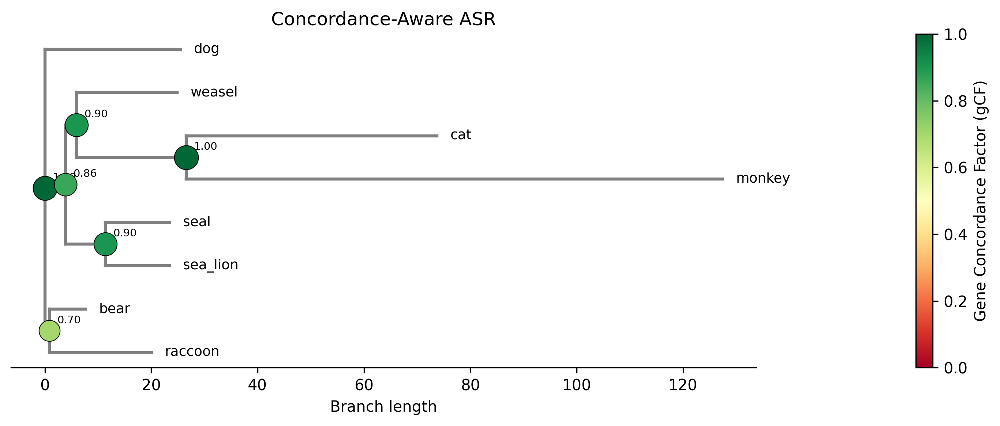

|

.. _cmd-bipartition_support_stats:

Bipartition support statistics
##############################
Function names: bipartition_support_stats; bss |br|
Command line interface: pk_bipartition_support_stats; pk_bss

Calculate summary statistics for bipartition support.

High bipartition support values are thought to be desirable because
they are indicative of greater certainty in tree topology.

To obtain all bipartition support values, use the -v/--verbose option.
In addition to support values for each node, the names of all terminal
branch tips are also included. Each terminal branch name is separated
with a semi-colon (;).

.. code-block:: shell

   phykit bipartition_support_stats <tree> [-v/--verbose]
       [--thresholds <comma-separated-floats>] [--json]

Options: |br|
*<tree>*: first argument after function name should be a tree file |br|
*-v/--verbose*: optional argument to print all bipartition support values |br|
*--thresholds*: optional comma-separated support cutoffs; prints count and
fraction of bipartitions below each cutoff |br|
*--json*: optional argument to print results as JSON

Example JSON output (summary mode):

.. code-block:: shell

   phykit bipartition_support_stats test.tre --thresholds 70,90 --json
   {"summary": {"maximum": 100, "mean": 95.71428571428571, "median": 100, "minimum": 85, "seventy_fifth": 100.0, "standard_deviation": 7.319250547113999, "twenty_fifth": 92.5, "variance": 53.57142857142857}, "thresholds": [{"count_below": 0, "fraction_below": 0.0, "threshold": 70.0}, {"count_below": 2, "fraction_below": 0.2857142857142857, "threshold": 90.0}], "verbose": false}

Example JSON output (verbose mode):

.. code-block:: shell

   phykit bipartition_support_stats test.tre -v --json
   {"bipartitions": [{"support": 85, "terminals": ["taxon_a", "taxon_b"]}, {"support": 100, "terminals": ["taxon_c", "taxon_d"]}], "thresholds": [], "verbose": true}

|

.. _cmd-branch_length_multiplier:

Branch length multiplier
########################
Function names: branch_length_multiplier; blm |br|
Command line interface: pk_branch_length_multiplier; pk_blm

Multiply branch lengths in a phylogeny by a given factor.
                
This can help modify reference trees when conducting simulations
or other analyses.  

.. code-block:: shell

   phykit branch_length_multiplier <tree> -f n [-o/--output <output_file>] [--json]

Options: |br|
*<tree>*: first argument after function name should be a tree file |br|
*-f/--factor*: factor to multiply branch lengths by |br|
*-o/--output*: optional argument to name the outputted tree file. Default 
output will have the same name as the input file but with the suffix ".factor_(n).tre" |br|
*--json*: optional argument to print results as JSON

|

.. _cmd-collapse_branches:

Collapse bipartitions
#####################
Function names: collapse_branches; collapse; cb |br|
Command line interface: pk_collapse_branches; pk_collapse; pk_cb

Collapse branches on a phylogeny according to bipartition support.

Bipartitions will be collapsed if they are less than the user specified
value.    

.. code-block:: shell

   phykit collapse_branches <tree> -s/--support n [-o/--output <output_file>] [--json]

Options: |br|
*<tree>*: first argument after function name should be a tree file |br|
*-s/--support*: bipartitions with support less than this value will be 
collapsed |br|
*-o/--output*: optional argument to name the outputted tree file. Default 
output will have the same name as the input file but with the suffix 
".collapsed_(support).tre" |br|
*--json*: optional argument to print results as JSON

|

.. _cmd-consensus_network:

Consensus network
#################
Function names: consensus_network; consnet; splitnet; splits_network |br|
Command line interface: pk_consensus_network; pk_consnet; pk_splitnet; pk_splits_network

Extract bipartition splits from a collection of gene trees and summarize
conflicting phylogenetic signal. Counts how frequently each non-trivial
bipartition appears across input trees and filters by a minimum frequency
threshold. Optionally draws a circular splits network diagram.

Polytomies (collapsed branches) in input trees are handled conservatively:
splits from polytomous nodes are excluded since they represent unresolved
relationships. Trifurcating roots (standard unrooted Newick) are not
affected. This allows gene trees with collapsed low-support branches to be
used directly as input.

Input can be either:
1) a file with one Newick tree per line, or
2) a file with one tree-file path per line.

.. code-block:: shell

   phykit consensus_network -t/--trees <trees> [--threshold 0.1] [--missing-taxa error|shared] [--plot-output <file>]
       [--fig-width <float>] [--fig-height <float>] [--dpi <int>] [--no-title] [--title <str>]
       [--legend-position <str>] [--ylabel-fontsize <float>] [--xlabel-fontsize <float>]
       [--title-fontsize <float>] [--axis-fontsize <float>] [--colors <str>] [--ladderize] [--cladogram] [--circular] [--color-file <file>] [--json]

Options: |br|
*-t/--trees*: file containing trees (one Newick per line) or tree-file paths (one per line) |br|
*--threshold*: minimum split frequency to include, between 0 and 1 (default: ``0.1``) |br|
*--missing-taxa*: handling strategy for mismatched taxa (``error`` or ``shared``; default: ``error``) |br|
*--plot-output*: output filename for the circular splits network plot (optional) |br|
*--fig-width*: figure width in inches (auto-scaled if omitted) |br|
*--fig-height*: figure height in inches (auto-scaled if omitted) |br|
*--dpi*: resolution in DPI (default: 300) |br|
*--no-title*: hide the plot title |br|
*--title*: custom title text |br|
*--legend-position*: legend location (e.g., "upper right", "none" to hide) |br|
*--ylabel-fontsize*: font size for y-axis labels; 0 to hide |br|
*--xlabel-fontsize*: font size for x-axis labels; 0 to hide |br|
*--title-fontsize*: font size for the title |br|
*--axis-fontsize*: font size for axis labels |br|
*--colors*: comma-separated colors (hex or named) |br|
*--ladderize*: ladderize (sort) the tree before plotting |br|
*--cladogram*: draw cladogram (equal branch lengths, tips aligned) instead of phylogram |br|
*--circular*: draw circular (radial/fan) phylogram instead of rectangular |br|
*--color-file*: color annotation file for tip labels, clade ranges, and branch colors (iTOL-inspired TSV format) |br|
*--json*: optional argument to print results as JSON

When ``--plot-output`` is specified, a circular splits network diagram is produced.
Taxa are arranged at equal angles around a circle. Each split is drawn as a chord
connecting the boundary points between the two sides of the bipartition. Chord
thickness and opacity scale with split frequency — thicker, darker lines indicate
splits supported by more gene trees.

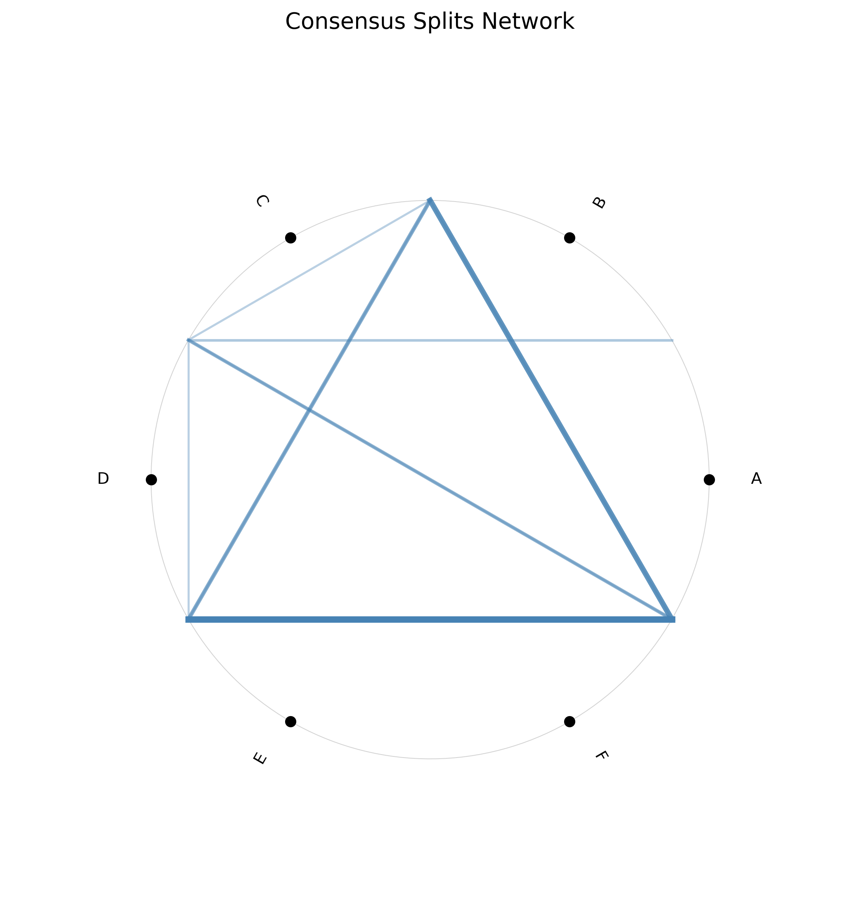

|

.. _cmd-consensus_tree:

Consensus tree
##############
Function names: consensus_tree; consensus; ctree |br|
Command line interface: pk_consensus_tree; pk_consensus; pk_ctree

Infer a consensus tree from a collection of trees.

Input can be either:
1) a file with one Newick tree per line, or
2) a file with one tree-file path per line.

Consensus methods:
* ``majority``: majority-rule consensus (default) |br|
* ``strict``: strict consensus

Missing taxa handling:
* ``--missing-taxa error`` (default): exits if trees do not share identical tip sets |br|
* ``--missing-taxa shared``: prunes all trees to the intersection of taxa before inferring consensus

.. code-block:: shell

   phykit consensus_tree -t/--trees <trees> [-m/--method strict|majority] [--missing-taxa error|shared] [--json]

Options: |br|
*-t/--trees*: file containing trees (one Newick per line) or tree-file paths (one per line) |br|
*-m/--method*: consensus method (``strict`` or ``majority``; default: ``majority``) |br|
*--missing-taxa*: handling strategy for mismatched taxa (``error`` or ``shared``; default: ``error``) |br|
*--json*: optional argument to print results as JSON

|

.. _cmd-fit_discrete:

Discrete trait evolution model comparison (fitDiscrete)
#######################################################
Function names: fit_discrete; fitdiscrete; fd |br|
Command line interface: pk_fit_discrete; pk_fitdiscrete; pk_fd

Compare models of discrete trait evolution on a phylogeny. Fits ER
(Equal Rates), SYM (Symmetric), and ARD (All Rates Different) Mk
models of discrete character evolution via maximum likelihood.
Compares models using AIC and BIC.

Analogous to R's geiger::fitDiscrete(). Cross-validated against R's
geiger package.

.. code-block:: shell

	phykit fit_discrete -t <tree> -d <trait_data> -c <trait>
		[--models ER,SYM,ARD] [--json]

Options: |br|
*-t/--tree*: tree file (required) |br|
*-d/--trait_data*: trait data file in TSV format (required) |br|
*-c/--trait*: column name for the discrete trait in the data file (required) |br|
*--models*: comma-separated list of models to fit (default: ``ER,SYM,ARD``) |br|
*--json*: optional argument to print results as JSON

|

.. _cmd-fit_continuous:

Continuous trait evolution model comparison (fitContinuous)
##########################################################
Function names: fit_continuous; fitcontinuous; fc |br|
Command line interface: pk_fit_continuous; pk_fitcontinuous; pk_fc

Compare models of continuous trait evolution on a phylogeny, analogous to
R's ``geiger::fitContinuous()``. Fits up to 7 models and ranks them by
AIC, BIC, and AIC weights.

Models:

- **BM** -- Brownian motion (baseline, 2 params)
- **OU** -- Ornstein-Uhlenbeck / stabilizing selection (3 params)
- **EB** -- Early Burst (Harmon et al. 2010) (3 params)
- **Lambda** -- Pagel's lambda / phylogenetic signal (3 params)
- **Delta** -- Pagel's delta / tempo of evolution (3 params)
- **Kappa** -- Pagel's kappa / punctuational vs gradual (3 params)
- **White** -- White noise / no phylogenetic signal (2 params)

Each model reports R² = 1 - (σ²_model / σ²_White), measuring how much
variance is explained relative to the white noise baseline. White serves
as the reference (R² = 0).

.. code-block:: shell

   phykit fit_continuous -t <tree> -d <trait_data> [--models BM,OU,Lambda] [-g <gene_trees>] [--json]

Options: |br|
*-t/--tree*: a tree file in Newick format |br|
*-d/--trait_data*: tab-delimited trait file (taxon<tab>value) |br|
*--models*: comma-separated list of models to fit (default: all 7) |br|
*-g/--gene-trees*: optional multi-Newick file of gene trees; when provided, uses a discordance-aware VCV (genome-wide average) instead of the species-tree VCV |br|
*--json*: optional argument to print results as JSON

Example output:

.. code-block:: text

   Model Comparison (fitContinuous)

   Number of tips: 8

   Model       Param     Value      Sigma2    z0        LL         AIC     dAIC    AICw    BIC     dBIC
   BM          -         -          0.0384    1.6447    -11.570    27.14   0.00    0.453   27.83   0.00
   OU          alpha     0.0012     0.0385    1.6420    -11.568    29.14   2.00    0.167   30.18   2.35
   ...

   Best model (AIC): BM
   Best model (BIC): BM

|

.. _cmd-cont_map:

Continuous trait mapping (contMap)
##################################
Function names: cont_map; contmap; cmap |br|
Command line interface: pk_cont_map; pk_contmap; pk_cmap

Plot a phylogram with branches colored by continuous trait values
(analogous to R's ``phytools::contMap()``). Ancestral states are
estimated via maximum-likelihood (two-pass Felsenstein algorithm)
and mapped onto branches using a color gradient (coolwarm colormap).

.. code-block:: shell

   phykit cont_map -t <tree> -d <trait_data> -o <output.png>
       [--fig-width <float>] [--fig-height <float>] [--dpi <int>] [--no-title] [--title <str>]
       [--legend-position <str>] [--ylabel-fontsize <float>] [--xlabel-fontsize <float>]
       [--title-fontsize <float>] [--axis-fontsize <float>] [--colors <str>] [--ladderize] [--cladogram] [--circular] [--color-file <file>] [--json]

Options: |br|
*-t/--tree*: a tree file in Newick format |br|
*-d/--trait_data*: tab-delimited trait file (taxon<tab>value) |br|
*-o/--output*: output plot file path (required) |br|
*--fig-width*: figure width in inches (auto-scaled if omitted) |br|
*--fig-height*: figure height in inches (auto-scaled if omitted) |br|
*--dpi*: resolution in DPI (default: 300) |br|
*--no-title*: hide the plot title |br|
*--title*: custom title text |br|
*--legend-position*: legend location (e.g., "upper right", "none" to hide) |br|
*--ylabel-fontsize*: font size for y-axis labels; 0 to hide |br|
*--xlabel-fontsize*: font size for x-axis labels; 0 to hide |br|
*--title-fontsize*: font size for the title |br|
*--axis-fontsize*: font size for axis labels |br|
*--colors*: comma-separated colors (hex or named) |br|
*--ladderize*: ladderize (sort) the tree before plotting |br|
*--cladogram*: draw cladogram (equal branch lengths, tips aligned) instead of phylogram |br|
*--circular*: draw circular (radial/fan) phylogram instead of rectangular |br|
*--color-file*: color annotation file for tip labels, clade ranges, and branch colors (iTOL-inspired TSV format) |br|
*--json*: optional argument to print results as JSON

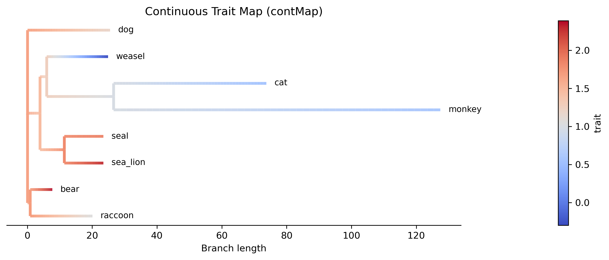

|

.. _cmd-trait_rate_map:

Trait rate map
##################################
Function names: trait_rate_map; rate_map; branch_rates |br|
Command line interface: pk_trait_rate_map; pk_rate_map; pk_branch_rates

Estimate per-branch evolutionary rates for a continuous trait and
display them as a branch-colored phylogram. Ancestral states are
reconstructed via Felsenstein's weighted-average method. Per-branch
rate is the squared standardized contrast (proportional to local
Brownian motion rate): ``rate = (child_val - parent_val)^2 / branch_length``.

.. code-block:: shell

   phykit trait_rate_map -t <tree> -d <trait_data> -o <output>
       [--trait <column>] [--json]
       [--fig-width <float>] [--fig-height <float>] [--dpi <int>] [--no-title] [--title <str>]
       [--legend-position <str>] [--ylabel-fontsize <float>] [--xlabel-fontsize <float>]
       [--title-fontsize <float>] [--axis-fontsize <float>] [--colors <str>] [--ladderize] [--cladogram] [--circular] [--color-file <file>]

Options: |br|
*-t/--tree*: a tree file in Newick format |br|
*-d/--trait_data*: tab-delimited trait file (two-column: taxon<tab>value with no header; or multi-column with header when --trait is used) |br|
*-o/--output*: output plot file path (required) |br|
*--trait*: column name to use from a multi-column trait file (if omitted, two-column format is expected) |br|
*--fig-width*: figure width in inches (auto-scaled if omitted) |br|
*--fig-height*: figure height in inches (auto-scaled if omitted) |br|
*--dpi*: resolution in DPI (default: 300) |br|
*--no-title*: hide the plot title |br|
*--title*: custom title text |br|
*--legend-position*: legend location (e.g., "upper right", "none" to hide) |br|
*--ylabel-fontsize*: font size for y-axis labels; 0 to hide |br|
*--xlabel-fontsize*: font size for x-axis labels; 0 to hide |br|
*--title-fontsize*: font size for the title |br|
*--axis-fontsize*: font size for axis labels |br|
*--colors*: comma-separated colors (hex or named) |br|
*--ladderize*: ladderize (sort) the tree before plotting |br|
*--cladogram*: draw cladogram (equal branch lengths, tips aligned) instead of phylogram |br|
*--circular*: draw circular (radial/fan) phylogram instead of rectangular |br|
*--color-file*: color annotation file for tip labels, clade ranges, and branch colors (iTOL-inspired TSV format) |br|
*--json*: optional argument to print results as JSON

|

.. _cmd-cophylo:

Cophylogenetic plot (tanglegram)
################################
Function names: cophylo; tanglegram; tangle |br|
Command line interface: pk_cophylo; pk_tanglegram; pk_tangle

Plot a cophylogenetic tanglegram of two phylogenies (analogous to R's
``phytools::cophylo()``). Draws two trees facing each other with
connecting lines between matching taxa. By default, taxa are matched
by identical tip names. Internal nodes of tree2 are rotated to minimize
line crossings.

.. code-block:: shell

   phykit cophylo -t <tree1> -t2 <tree2> -o <output.png> [-m <mapping>]
       [--fig-width <float>] [--fig-height <float>] [--dpi <int>] [--no-title] [--title <str>]
       [--legend-position <str>] [--ylabel-fontsize <float>] [--xlabel-fontsize <float>]
       [--title-fontsize <float>] [--axis-fontsize <float>] [--colors <str>] [--ladderize] [--cladogram] [--circular] [--color-file <file>] [--json]

Options: |br|
*-t/--tree1*: first tree file in Newick format |br|
*-t2/--tree2*: second tree file in Newick format |br|
*-o/--output*: output plot file path (required) |br|
*-m/--mapping*: optional tab-delimited mapping file (taxon1<tab>taxon2) |br|
*--fig-width*: figure width in inches (auto-scaled if omitted) |br|
*--fig-height*: figure height in inches (auto-scaled if omitted) |br|
*--dpi*: resolution in DPI (default: 300) |br|
*--no-title*: hide the plot title |br|
*--title*: custom title text |br|
*--legend-position*: legend location (e.g., "upper right", "none" to hide) |br|
*--ylabel-fontsize*: font size for y-axis labels; 0 to hide |br|
*--xlabel-fontsize*: font size for x-axis labels; 0 to hide |br|
*--title-fontsize*: font size for the title |br|
*--axis-fontsize*: font size for axis labels |br|
*--colors*: comma-separated colors (hex or named) |br|
*--ladderize*: ladderize (sort) the tree before plotting |br|
*--cladogram*: draw cladogram (equal branch lengths, tips aligned) instead of phylogram |br|
*--circular*: draw circular (radial/fan) phylogram instead of rectangular |br|
*--color-file*: color annotation file for tip labels, clade ranges, and branch colors (iTOL-inspired TSV format) |br|
*--json*: optional argument to print results as JSON

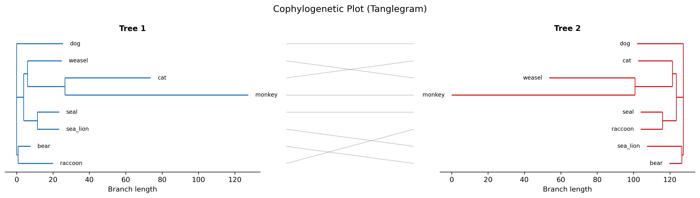

|

.. _cmd-covarying_evolutionary_rates:

Covarying evolutionary rates
############################
Function names: covarying_evolutionary_rates; cover |br|
Command line interface: pk_covarying_evolutionary_rates; pk_cover

Determine if two genes have a signature of covariation with one another.
Genes that have covarying evolutionary histories tend to have 
similar functions and expression levels.

Input two phylogenies and calculate the correlation among relative 
evolutionary rates between the two phylogenies. The two input trees 
do not have to have the same taxa. This function will first prune both
trees to have the same tips. To transform branch lengths into relative
rates, PhyKIT uses the putative species tree's branch lengths, which is
input by the user. As recommended by the original method developers,
outlier branch lengths are removed. Outlier branches have a relative 
evolutionary rate greater than five.

PhyKIT reports two tab delimited values:
col1: correlation coefficient
col2: p-value

Method is empirically evaluated by Clark et al., Genome Research
(2012), doi: 10.1101/gr.132647.111. Normalization method using a 
species tree follows Sato et al., Bioinformatics (2005), doi: 
10.1093/bioinformatics/bti564.  

.. code-block:: shell

   phykit covarying_evolutionary_rates <tree_file_zero> <tree_file_one> -r/--reference <reference_tree_file> [-v/--verbose] [--plot] [--plot-output <path>]
       [--fig-width <float>] [--fig-height <float>] [--dpi <int>] [--no-title] [--title <str>]
       [--legend-position <str>] [--ylabel-fontsize <float>] [--xlabel-fontsize <float>]
       [--title-fontsize <float>] [--axis-fontsize <float>] [--colors <str>] [--ladderize] [--cladogram] [--circular] [--color-file <file>] [--json]

Options: |br|
*<tree_file_zero>*: first argument after function name should be a tree file |br|
*<tree_file_one>*: second argument after function name should be a tree file |br| 
*-r/--reference*: a tree to correct branch lengths by in the two input trees. Typically, 
this is a putative species tree. |br|
*-v/--verbose*: print out corrected branch lengths shared between tree 0 and tree 1 |br|
*--plot*: save a covarying-rates scatter plot |br|
*--plot-output*: output path for plot (default: ``covarying_rates_plot.png``) |br|
*--fig-width*: figure width in inches (auto-scaled if omitted) |br|
*--fig-height*: figure height in inches (auto-scaled if omitted) |br|
*--dpi*: resolution in DPI (default: 300) |br|
*--no-title*: hide the plot title |br|
*--title*: custom title text |br|
*--legend-position*: legend location (e.g., "upper right", "none" to hide) |br|
*--ylabel-fontsize*: font size for y-axis labels; 0 to hide |br|
*--xlabel-fontsize*: font size for x-axis labels; 0 to hide |br|
*--title-fontsize*: font size for the title |br|
*--axis-fontsize*: font size for axis labels |br|
*--colors*: comma-separated colors (hex or named) |br|
*--ladderize*: ladderize (sort) the tree before plotting |br|
*--cladogram*: draw cladogram (equal branch lengths, tips aligned) instead of phylogram |br|
*--circular*: draw circular (radial/fan) phylogram instead of rectangular |br|
*--color-file*: color annotation file for tip labels, clade ranges, and branch colors (iTOL-inspired TSV format) |br|
*--json*: optional argument to print results as JSON

|

.. _cmd-degree_of_violation_of_a_molecular_clock:

Degree of violation of the molecular clock
##########################################
Function names: degree_of_violation_of_a_molecular_clock; dvmc |br|
Command line interface: pk_degree_of_violation_of_a_molecular_clock; pk_dvmc

Calculate degree of violation of a molecular clock (or DVMC) in a phylogeny.

Lower DVMC values are thought to be desirable because they are indicative
of a lower degree of violation in the molecular clock assumption.

Typically, outgroup taxa are not included in molecular clock analysis. Thus,
prior to calculating DVMC from a single gene tree, users may want to prune
outgroup taxa from the phylogeny. To prune tips from a phylogeny, see the 
prune_tree function. 

Calculate DVMC in a tree following Liu et al., PNAS (2017), doi: 10.1073/pnas.1616744114.

.. code-block:: shell

   phykit degree_of_violation_of_a_molecular_clock <tree> [--json]

Options: |br|
*<tree>*: input file tree name |br|
*--json*: optional argument to print results as JSON

|

.. _cmd-density_map:

Density map
###########
Function names: density_map; densitymap; dmap |br|
Command line interface: pk_density_map; pk_densitymap; pk_dmap

Plot a phylogram with branches colored by posterior probabilities of
discrete character states from stochastic character mapping (analogous
to R's ``phytools::densityMap()``). Runs N simulations of stochastic
character mapping internally and, for each point along each branch,
computes the fraction of simulations in each state.

.. code-block:: shell

   phykit density_map -t <tree> -d <trait_data> -c <trait_column> -o <output.png> [-n <nsim>] [--seed <seed>]
       [--fig-width <float>] [--fig-height <float>] [--dpi <int>] [--no-title] [--title <str>]
       [--legend-position <str>] [--ylabel-fontsize <float>] [--xlabel-fontsize <float>]
       [--title-fontsize <float>] [--axis-fontsize <float>] [--colors <str>] [--ladderize] [--cladogram] [--circular] [--color-file <file>] [--json]

Options: |br|
*-t/--tree*: a tree file in Newick format |br|
*-d/--trait_data*: tab-delimited trait file (taxon<tab>state) |br|
*-c/--trait*: column name of the trait to map |br|
*-o/--output*: output plot file path (required) |br|
*-n/--nsim*: number of stochastic mapping simulations (default: 100) |br|
*--seed*: random seed for reproducibility |br|
*--fig-width*: figure width in inches (auto-scaled if omitted) |br|
*--fig-height*: figure height in inches (auto-scaled if omitted) |br|
*--dpi*: resolution in DPI (default: 300) |br|
*--no-title*: hide the plot title |br|
*--title*: custom title text |br|
*--legend-position*: legend location (e.g., "upper right", "none" to hide) |br|
*--ylabel-fontsize*: font size for y-axis labels; 0 to hide |br|
*--xlabel-fontsize*: font size for x-axis labels; 0 to hide |br|
*--title-fontsize*: font size for the title |br|
*--axis-fontsize*: font size for axis labels |br|
*--colors*: comma-separated colors (hex or named) |br|
*--ladderize*: ladderize (sort) the tree before plotting |br|
*--cladogram*: draw cladogram (equal branch lengths, tips aligned) instead of phylogram |br|
*--circular*: draw circular (radial/fan) phylogram instead of rectangular |br|
*--color-file*: color annotation file for tip labels, clade ranges, and branch colors (iTOL-inspired TSV format) |br|
*--json*: optional argument to print results as JSON

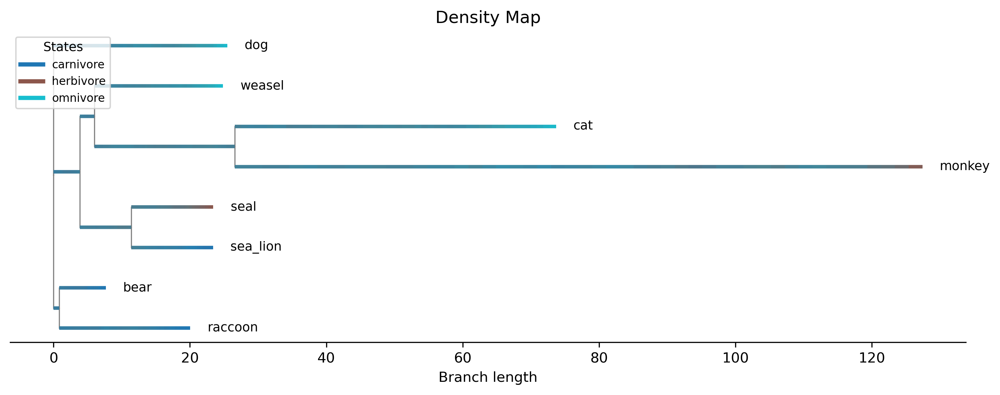

|

.. _cmd-evo_tempo_map:

Evolutionary tempo mapping
##########################
Function names: evo_tempo_map; etm |br|
Command line interface: pk_evo_tempo_map; pk_etm

Detect rate-topology associations by comparing branch length distributions
between concordant and discordant gene trees at each species tree branch.

Under the multispecies coalescent, discordant gene trees should have shorter
internal branches near the discordant node (because the coalescence happened
deeper, in the ancestral population). Deviations from this expectation suggest
substitution rate heterogeneity correlated with topology, which could indicate
adaptive evolution, different selective pressures in hybridizing lineages, or
systematic error from model misspecification.

For each internal branch of the species tree, gene trees are classified as
concordant or discordant via bipartition matching (same as gCF). The homologous
branch length is extracted from each gene tree and the two groups are compared
using a Mann-Whitney U test and a permutation test (1000 permutations). P-values
are corrected for multiple testing using Benjamini-Hochberg FDR.

A global treeness (internal/total branch length ratio) comparison between
concordant and discordant gene trees is also reported.

.. code-block:: shell

   phykit evo_tempo_map -t <species_tree> -g <gene_trees> [--plot <output>] [-v]
       [--fig-width <float>] [--fig-height <float>] [--dpi <int>] [--no-title] [--title <str>]
       [--legend-position <str>] [--ylabel-fontsize <float>] [--xlabel-fontsize <float>]
       [--title-fontsize <float>] [--axis-fontsize <float>] [--colors <str>] [--ladderize] [--cladogram] [--circular] [--color-file <file>] [--json]

Options: |br|
*-t/--tree*: a species tree file |br|
*-g/--gene-trees*: multi-Newick file of gene trees with branch lengths |br|
*--plot*: optional output path for box/strip plot (PNG) |br|
*-v/--verbose*: print per-gene-tree classification details |br|
*--fig-width*: figure width in inches (auto-scaled if omitted) |br|
*--fig-height*: figure height in inches (auto-scaled if omitted) |br|
*--dpi*: resolution in DPI (default: 300) |br|
*--no-title*: hide the plot title |br|
*--title*: custom title text |br|
*--legend-position*: legend location (e.g., "upper right", "none" to hide) |br|
*--ylabel-fontsize*: font size for y-axis labels; 0 to hide |br|
*--xlabel-fontsize*: font size for x-axis labels; 0 to hide |br|
*--title-fontsize*: font size for the title |br|
*--axis-fontsize*: font size for axis labels |br|
*--colors*: comma-separated colors (hex or named) |br|
*--ladderize*: ladderize (sort) the tree before plotting |br|
*--cladogram*: draw cladogram (equal branch lengths, tips aligned) instead of phylogram |br|
*--circular*: draw circular (radial/fan) phylogram instead of rectangular |br|
*--color-file*: color annotation file for tip labels, clade ranges, and branch colors (iTOL-inspired TSV format) |br|
*--json*: optional argument to print results as JSON

Example output:

.. code-block:: text

   branch                          n_conc  n_disc    med_conc    med_disc      U_pval   perm_pval       fdr_p
   ----------------------------------------------------------------------------------------------------------
   bear,dog,raccoon                     6       1    3.875000    3.600000          NA          NA          NA
   bear,raccoon                         7       3    0.880000    0.700000    0.516667    0.077000    0.516667
   cat,monkey                          10       0   20.450000          NA          NA          NA          NA
   cat,monkey,weasel                    9       1    2.120000    2.800000          NA          NA          NA
   sea_lion,seal                        9       1    7.500000    7.200000          NA          NA          NA
   ---
   Global treeness: concordant=0.126489 (n=6), discordant=0.119014 (n=4)
   Branches tested: 1, significant (FDR<0.05): 0

Each row corresponds to an internal branch of the species tree identified by the
smaller partition of taxa. The ``n_conc`` and ``n_disc`` columns show how many gene
trees are concordant or discordant at that branch. The ``med_conc`` and ``med_disc``
columns show the median branch length (in substitutions/site) for each group. The
``U_pval`` is the two-sided Mann-Whitney U test p-value, ``perm_pval`` is the
permutation test p-value (1000 permutations), and ``fdr_p`` is the
Benjamini-Hochberg corrected p-value. Branches with fewer than 2 gene trees
in either group show ``NA`` for p-values.

The global treeness comparison tests whether concordant gene trees have
systematically different ratios of internal to total branch lengths.

To generate a visualization:

.. code-block:: shell

   phykit evo_tempo_map -t <species_tree> -g <gene_trees> --plot tempo_map.png

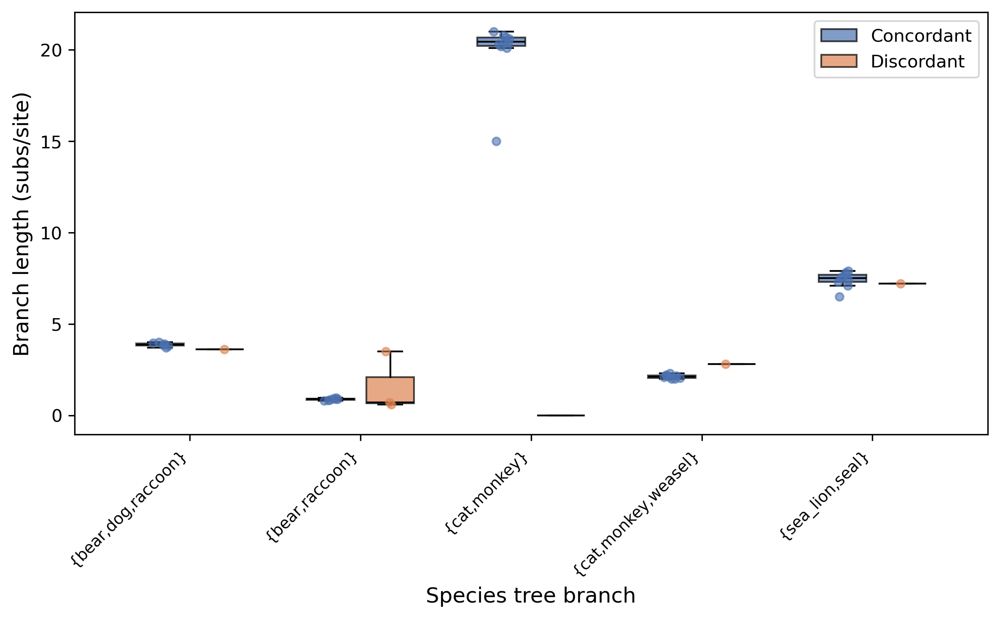

The plot shows grouped box plots with jittered data points for each species tree
branch, comparing branch lengths between concordant (blue) and discordant (orange)
gene trees. Branches where the FDR-corrected p-value is below 0.05 are marked
with an asterisk.

|

.. _cmd-dstatistic:

D-statistic (ABBA-BABA test)
############################
Function names: dstatistic; dstat; abba_baba |br|
Command line interface: pk_dstatistic; pk_dstat; pk_abba_baba

Compute Patterson's D-statistic (ABBA-BABA test) for detecting
introgression or gene flow between taxa. Given a four-taxon alignment
with topology ``(((P1, P2), P3), Outgroup)``, the test counts ABBA
and BABA site patterns:

- **ABBA**: P1 has the ancestral allele, P2 and P3 share the derived
  allele — suggests introgression between P2 and P3
- **BABA**: P2 has the ancestral allele, P1 and P3 share the derived
  allele — suggests introgression between P1 and P3
- **D = (ABBA - BABA) / (ABBA + BABA)**: D = 0 under ILS alone;
  D significantly different from 0 indicates introgression

Note: the D-statistic identifies which pair of lineages exchanged
genetic material but cannot determine the direction of gene flow
within that pair.

Significance is assessed via block jackknife (Green et al. 2010),
producing a Z-score and p-value.

Two input modes are supported:

1. **Site patterns** (``-a``): counts ABBA/BABA from a FASTA alignment.
   Only biallelic sites with no gaps or ambiguous characters are considered.
   Significance via block jackknife.

2. **Gene trees** (``-g``): counts discordant quartet topologies from gene
   trees. Gene trees can have any number of taxa; only the quartet induced
   by the four specified taxa is evaluated. Significance via chi-squared test.

.. code-block:: shell

   # Site-pattern mode
   phykit dstatistic -a <alignment> --p1 <taxon> --p2 <taxon> --p3 <taxon> \
       --outgroup <taxon> [--block-size 100] [--json]

   # Gene-tree mode
   phykit dstatistic -g <gene_trees> --p1 <taxon> --p2 <taxon> --p3 <taxon> \
       --outgroup <taxon> [--json]

Options: |br|
*-a/--alignment*: FASTA alignment file (site-pattern mode) |br|
*-g/--gene-trees*: gene trees file, one Newick per line (gene-tree mode; trees can have any number of taxa) |br|
*--p1*: taxon name for P1, sister to P2 (required) |br|
*--p2*: taxon name for P2, sister to P1, potential recipient of gene flow from P3 (required) |br|
*--p3*: taxon name for P3, donor lineage (required) |br|
*--outgroup*: outgroup taxon name, determines ancestral allele (required) |br|
*--block-size*: block size in sites for jackknife standard error estimation (default: 100; alignment mode only) |br|
*--support*: minimum branch support threshold; gene tree branches below this value are collapsed and treated as unresolved (gene-tree mode only) |br|
*--json*: optional argument to print results as JSON

|

.. _cmd-dfoil:

DFOIL test (Pease & Hahn 2015)
##############################
Function names: dfoil; dfoil_test |br|
Command line interface: pk_dfoil; pk_dfoil_test

Compute DFOIL statistics (Pease & Hahn 2015) for detecting and polarizing
introgression in a 5-taxon symmetric phylogeny with topology
``((P1, P2), (P3, P4), Outgroup)``.

P1 and P2 are sister taxa; P3 and P4 are sister taxa; the two pairs are
sister to each other, with an outgroup rooting the tree.

Four D-statistics are computed: DFO (far-outer), DIL (inner-left),
DFI (far-inner), and DOL (outer-left). Each is tested for significance
using a chi-squared test (1 df). The sign pattern of the four statistics
maps to a specific introgression scenario via the lookup table from
Pease & Hahn (2015).

.. code-block:: shell

   phykit dfoil -a <alignment> --p1 <taxon> --p2 <taxon> --p3 <taxon> \
       --p4 <taxon> --outgroup <taxon> [--json]

Options: |br|
*-a/--alignment*: FASTA alignment file (required) |br|
*--p1*: taxon name for P1, sister to P2 (required) |br|
*--p2*: taxon name for P2, sister to P1 (required) |br|
*--p3*: taxon name for P3, sister to P4 (required) |br|
*--p4*: taxon name for P4, sister to P3 (required) |br|
*--outgroup*: outgroup taxon name (required) |br|
*--json*: optional argument to print results as JSON

|

.. _cmd-discordance_asymmetry:

Discordance asymmetry
#####################
Function names: discordance_asymmetry; disc_asym; da |br|
Command line interface: pk_discordance_asymmetry; pk_disc_asym; pk_da

Test whether the two discordant NNI alternative topologies at each species tree
branch are equally frequent. Under incomplete lineage sorting (ILS) alone, the
two minor NNI alternatives (gDF1 and gDF2) should appear at equal frequency.
When they are significantly asymmetric, it suggests introgression or gene flow
between specific lineages.

For each internal branch of the species tree, a two-sided binomial test (H0:
P(alt1) = 0.5) is applied, and p-values are corrected for multiple testing
using Benjamini-Hochberg FDR.

**Interpreting the plot:** When ``--plot`` is used, branches are colored by
the **asymmetry ratio** = max(gDF1, gDF2) / (gDF1 + gDF2):

- **Blue/cool colors (ratio ~ 0.5):** The two discordant topologies are
  roughly equal, consistent with ILS alone — no evidence of gene flow.
- **Red/warm colors (ratio → 1.0):** One discordant topology is much more
  frequent than the other, suggesting introgression or gene flow.
- **Red stars:** Branches where the asymmetry is statistically significant
  (FDR < 0.05) — these are introgression candidates.

Use ``--annotate`` to display gCF values on each branch. Use
``--ylabel-fontsize 0`` to hide tip labels for large trees, and
``--legend-position none`` to hide both the legend and colorbar.

.. code-block:: shell

   phykit discordance_asymmetry -t <species_tree> -g <gene_trees> [--plot <output>] [-v]
       [--annotate]
       [--fig-width <float>] [--fig-height <float>] [--dpi <int>] [--no-title] [--title <str>]
       [--legend-position <str>] [--ylabel-fontsize <float>] [--xlabel-fontsize <float>]
       [--title-fontsize <float>] [--axis-fontsize <float>] [--colors <str>] [--ladderize] [--cladogram] [--circular] [--color-file <file>] [--json]

Options: |br|
*-t/--tree*: a species tree file |br|
*-g/--gene-trees*: multi-Newick file of gene trees (branch lengths not required) |br|
*--plot*: optional output path for asymmetry phylogram (PNG) |br|
*-v/--verbose*: print per-branch details |br|
*--fig-width*: figure width in inches (auto-scaled if omitted) |br|
*--fig-height*: figure height in inches (auto-scaled if omitted) |br|
*--dpi*: resolution in DPI (default: 300) |br|
*--no-title*: hide the plot title |br|
*--title*: custom title text |br|
*--legend-position*: legend location (e.g., "upper right", "none" to hide) |br|
*--ylabel-fontsize*: font size for y-axis labels; 0 to hide |br|
*--xlabel-fontsize*: font size for x-axis labels; 0 to hide |br|
*--title-fontsize*: font size for the title |br|
*--axis-fontsize*: font size for axis labels |br|
*--colors*: comma-separated colors (hex or named) |br|
*--ladderize*: ladderize (sort) the tree before plotting |br|
*--cladogram*: draw cladogram (equal branch lengths, tips aligned) instead of phylogram |br|
*--circular*: draw circular (radial/fan) phylogram instead of rectangular |br|
*--color-file*: color annotation file for tip labels, clade ranges, and branch colors (iTOL-inspired TSV format) |br|
*--json*: optional argument to print results as JSON

Example output:

.. code-block:: text

   branch                          n_conc  n_alt1  n_alt2  asym_ratio     binom_p       fdr_p   gene_flow
   ------------------------------------------------------------------------------------------------------
   bear,dog,raccoon                     6       0       1       1.000      1.0000      1.0000           -
   bear,raccoon                         7       1       2       0.667      1.0000      1.0000           -
   cat,monkey                          10       0       0          NA          NA          NA           -
   cat,monkey,weasel                    9       1       0       1.000      1.0000      1.0000           -
   sea_lion,seal                        9       1       0       1.000      1.0000      1.0000           -
   ---
   Summary: 4 branches tested, 0 significant (FDR<0.05)

Each row corresponds to an internal branch of the species tree identified by the
smaller partition of taxa. The ``n_conc`` column shows concordant gene trees, while
``n_alt1`` and ``n_alt2`` show the counts for the two NNI alternative topologies.
The ``asym_ratio`` is max(n_alt1, n_alt2) / (n_alt1 + n_alt2), ranging from 0.5
(perfectly symmetric) to 1.0 (maximally asymmetric). ``NA`` indicates no discordant
gene trees were observed. The ``binom_p`` is the two-sided binomial test p-value,
``fdr_p`` is the Benjamini-Hochberg corrected p-value, and ``gene_flow`` shows
which NNI alternative is favored when the result is significant (FDR < 0.05).

**Interpretation:**

- **Symmetric discordance** (asym_ratio near 0.5, not significant): Consistent with
  ILS alone — both NNI alternatives arise with equal frequency from random coalescent
  sorting.
- **Asymmetric discordance** (asym_ratio near 1.0, significant): Suggests gene flow
  or introgression. The favored NNI alternative indicates which lineages are exchanging
  genetic material. For alt1, gene flow is between the C1 lineage and the S (sibling)
  lineage; for alt2, gene flow is between C2 and S.

To generate a visualization:

.. code-block:: shell

   phykit discordance_asymmetry -t <species_tree> -g <gene_trees> --plot asymmetry.png

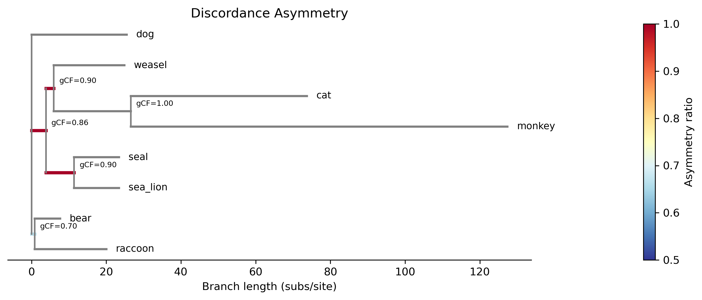

The plot shows a phylogram with internal branches colored by asymmetry ratio using
a diverging colormap (blue = symmetric/0.5, red = highly asymmetric/1.0). Significant
branches (FDR < 0.05) are marked with a red star. Internal nodes are annotated with
gCF values.

|

.. _cmd-evolutionary_rate:

Evolutionary rate
#################
Function names: evolutionary_rate; evo_rate |br|
Command line interface: pk_evolutionary_rate; pk_evo_rate

Calculate a tree-based estimation of the evolutionary rate of a gene.

Evolutionary rate is the total tree length divided by the number
of terminals.

Calculate evolutionary rate following Telford et al., Proceedings
of the Royal Society B (2014). 

.. code-block:: shell

   phykit evolutionary_rate <tree> [--json]

Options: |br|
*<tree>*: input file tree name |br|
*--json*: optional argument to print results as JSON

|

.. _cmd-hidden_paralogy_check:

Hidden paralogy check
#####################
Function names: hidden_paralogy_check; clan_check |br|
Command line interface: pk_hidden_paralogy_check; pk_clan_check

Scan tree for evidence of hidden paralogy.

This analysis can be used to identify hidden paralogy. 
Specifically, this method will examine if a set of
well known monophyletic taxa are, in fact, monophyletic.
If they are not, the evolutionary history of the gene may
be subject to hidden paralogy. This analysis is typically
done with single-copy orthologous genes.

Requires a clade file, which specifies which monophyletic
lineages to check for. Multiple monophyletic
lineages can be specified. Each lineage should
be specified on a single line and each tip name 
(or taxon name) should be separated by a space.
For example, if it is anticipated that tips
"A", "B", and "C" are monophyletic and "D",
"E", and "F" are expected to be monophyletic, the
clade file should be formatted as follows: |br|
" |br|
A B C |br|
D E F |br|
"

The output will report if the specified taxa were monophyletic
or not. The number of rows will reflect how many groups of taxa
were checked for monophyly. For example,
if there were three rows of clades in the -c file, there will be
three rows in the output
where the first row in the output corresponds to the 
results of the first row in the clade file. |br|

The concept behind this analysis follows
Siu-Ting et al., Molecular Biology and Evolution (2019),
doi: 10.1093/molbev/msz067.

.. code-block:: shell

   phykit hidden_paralogy_check <tree> -c/--clade <clade_file> [--json]

Options: |br|
*-t/--tree*: input file tree name |br|
*-c/--clade*: clade file detailing which monophyletic lineages should
be scanned for |br|
*--json*: optional argument to print results as JSON

|

.. _cmd-internal_branch_stats:

Internal branch statistics
##########################
Function names: internal_branch_stats; ibs |br|
Command line interface: pk_internal_branch_stats; pk_ibs

Calculate summary statistics for internal branch lengths in a phylogeny.

Internal branch lengths can be useful for phylogeny diagnostics.

To obtain all internal branch lengths, use the -v/--verbose option.   

.. code-block:: shell

   phykit internal_branch_stats <tree> [-v/--verbose] [--json]

Options: |br|
*<tree>*: first argument after function name should be a tree file |br|
*-v/--verbose*: optional argument to print all internal branch lengths |br|
*--json*: optional argument to print results as JSON

|

.. _cmd-internode_labeler:

Internode labeler
#################
Function names: internode_labeler; il |br|
Command line interface: pk_internode_labeler; pk_il

Appends numerical identifiers to bipartitions in place of support values.
This is helpful for pointing to specific internodes in supplementary files
or otherwise.  

.. code-block:: shell

   phykit internode_labeler <tree> [-o/--output <file>] [--json]

Options: |br|
*<tree>*: first argument after function name should be a tree file |br|
*-o/--output*: optional argument to name the outputted tree file |br|
*--json*: optional argument to print results as JSON

|

.. _cmd-last_common_ancestor_subtree:

Last common ancestor subtree
############################
Function names: last_common_ancestor_subtree; lca_subtree |br|
Command line interface: pk_last_common_ancestor_subtree; pk_lca_subtree

Obtains subtree from a phylogeny by getting the last common ancestor
from a list of taxa.

.. code-block:: shell

   phykit last_common_ancestor_subtree <tree> <list_of_taxa> [-o/--output <file>] [--json]

Options: |br|
*<tree>*: first argument after function name should be a tree file |br|
*<list_of_taxa>*: second argument after function name should be a single column
file with the list of taxa to get the last common ancestor subtree for |br|
*-o/--output*: optional argument to name the outputted tree file |br|
*--json*: optional argument to print results as JSON

|

.. _cmd-quartet_pie:

Quartet pie chart
#################
Function names: quartet_pie; qpie; quartet_pie_chart |br|
Command line interface: pk_quartet_pie; pk_qpie; pk_quartet_pie_chart

Draw a phylogram with pie charts at internal nodes showing quartet
concordance proportions. In native mode (-g provided), computes gene
concordance factors (gCF, gDF1, gDF2) from a species tree and gene trees
via bipartition matching. In ASTRAL mode (no -g), parses q1/q2/q3
annotations from ASTRAL ``-t 2`` or wASTRAL ``--support 3`` output.

Pie slices show concordant (blue), discordant alt 1 (red), and
discordant alt 2 (gray) proportions. Use ``--annotate`` to add numeric
values near each pie.

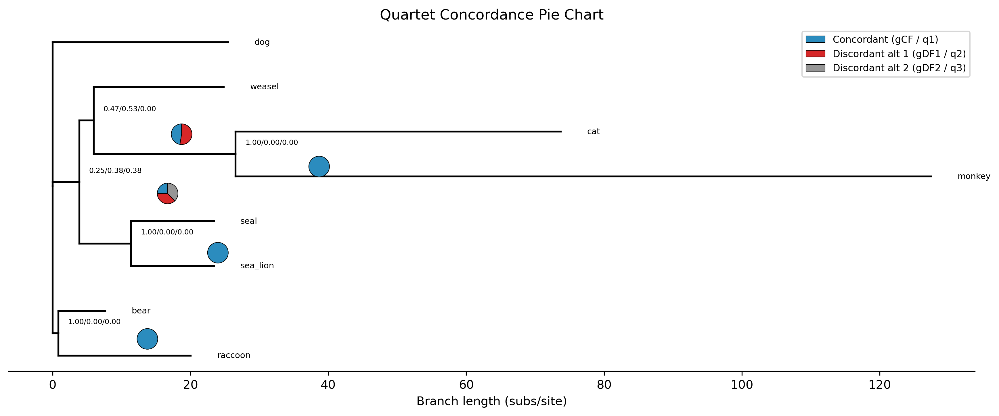

.. code-block:: shell

	phykit quartet_pie -t <species_tree> [-g <gene_trees>] -o <output>
		[--annotate] [--csv <file>] [--ladderize] [--cladogram] [--circular] [--color-file <file>] [--json]

Options: |br|
*-t/--tree*: species tree file (required) |br|
*-g/--gene-trees*: gene trees file, one Newick tree per line (optional; if omitted, ASTRAL ``-t 2`` or wASTRAL ``--support 3`` annotations are parsed) |br|
*-o/--output*: output figure path (required; supports .png, .pdf, .svg) |br|
*--annotate*: show gCF/gDF values as text near each pie chart |br|
*--csv*: output per-branch concordance values (gCF, gDF1, gDF2, counts) as a CSV file |br|
*--pie-size*: scale factor for pie chart size (default: 1.0; use 2.0 for double, 0.5 for half) |br|
*--colors*: comma-separated colors for concordant, disc1, disc2 (default: blue, red, gray) |br|
*--ladderize*: ladderize (sort) the tree before plotting |br|
*--cladogram*: draw cladogram (equal branch lengths, tips aligned) instead of phylogram |br|
*--circular*: draw circular (radial/fan) phylogram instead of rectangular |br|
*--color-file*: color annotation file for tip labels, clade ranges, and branch colors (iTOL-inspired TSV format) |br|
*--json*: optional argument to output per-node concordance values as JSON

|

.. _cmd-ltt:

Lineage-through-time plot and gamma statistic
##############################################
Function names: ltt; gamma_stat; gamma |br|
Command line interface: pk_ltt; pk_gamma_stat; pk_gamma

Compute the Pybus & Harvey (2000) gamma statistic and generate
lineage-through-time (LTT) plots to test for temporal variation
in diversification rates.

Under a constant-rate pure-birth (Yule) process, the gamma statistic
follows a standard normal distribution: gamma ~ N(0, 1).  Negative
values indicate early diversification (decelerating rates, consistent
with an adaptive radiation followed by niche filling), while positive
values indicate late diversification (accelerating rates, potentially
reflecting recent ecological opportunity or mass extinction recovery).

.. code-block:: shell

   phykit ltt -t <tree> [-v/--verbose] [--plot-output <file>]
       [--fig-width <float>] [--fig-height <float>] [--dpi <int>] [--no-title] [--title <str>]
       [--legend-position <str>] [--ylabel-fontsize <float>] [--xlabel-fontsize <float>]
       [--title-fontsize <float>] [--axis-fontsize <float>] [--colors <str>] [--ladderize] [--cladogram] [--circular] [--color-file <file>] [--json]

Options: |br|
*-t/--tree*: a rooted phylogeny file with branch lengths (required) |br|
*-v/--verbose*: print branching times and full LTT data points |br|
*--plot-output*: output filename for the LTT plot (PNG, PDF, SVG) |br|
*--fig-width*: figure width in inches (auto-scaled if omitted) |br|
*--fig-height*: figure height in inches (auto-scaled if omitted) |br|
*--dpi*: resolution in DPI (default: 300) |br|
*--no-title*: hide the plot title |br|
*--title*: custom title text |br|
*--legend-position*: legend location (e.g., "upper right", "none" to hide) |br|
*--ylabel-fontsize*: font size for y-axis labels; 0 to hide |br|
*--xlabel-fontsize*: font size for x-axis labels; 0 to hide |br|
*--title-fontsize*: font size for the title |br|
*--axis-fontsize*: font size for axis labels |br|
*--colors*: comma-separated colors (hex or named) |br|
*--ladderize*: ladderize (sort) the tree before plotting |br|
*--cladogram*: draw cladogram (equal branch lengths, tips aligned) instead of phylogram |br|
*--circular*: draw circular (radial/fan) phylogram instead of rectangular |br|
*--color-file*: color annotation file for tip labels, clade ranges, and branch colors (iTOL-inspired TSV format) |br|
*--json*: output results as JSON

**Default output**: tab-separated gamma statistic and two-tailed p-value.

.. code-block:: shell

   # Basic gamma statistic
   phykit ltt -t species.tre
   # -1.4142   0.1573

   # With LTT plot
   phykit ltt -t species.tre --plot-output ltt_plot.png

   # Full JSON output
   phykit ltt -t species.tre --json

**Tutorial: testing diversification tempo in a clade**

Suppose you have a dated phylogeny of 50 gecko species and want to
test whether speciation rates were constant or whether diversification
decelerated over time (consistent with ecological limits).

*Step 1: Compute the gamma statistic.*

.. code-block:: shell

   phykit ltt -t gecko_dated.tre --plot-output gecko_ltt.png
   # -2.8514   0.0043

A significantly negative gamma (p = 0.004) rejects the constant-rate
null, indicating that lineage accumulation was concentrated early in the
clade's history — consistent with an early burst of diversification
followed by a slowdown as niches filled.

*Step 2: Examine the LTT plot.*

The ``--plot-output`` option generates a step-function plot of lineage
count (log scale) vs. time from root.  Under constant-rate birth,
lineages accumulate exponentially (straight line on log-scale).  An
early burst appears as a curve that rises steeply then flattens.

**Example: early burst (decelerating diversification)**

Most branching events occur near the root, then the curve plateaus.
The significantly negative gamma (p < 0.001) rejects constant-rate birth.

.. image:: /_static/img/ltt_example_early_burst.png
   :align: center
   :width: 80%

|

**Example: recent burst (accelerating diversification)**

Lineage accumulation is concentrated near the present.
The significantly positive gamma (p = 0.022) indicates late diversification.

.. image:: /_static/img/ltt_example_recent_burst.png
   :align: center
   :width: 80%

|

*Step 3: Verbose output for downstream analysis.*

.. code-block:: shell

   phykit ltt -t gecko_dated.tre -v

Verbose mode prints branching times (node ages) and the full LTT data
table (time_from_root, n_lineages), which can be piped to custom
plotting or further analysis.

**Validation against R's ape::gammaStat()**

PhyKIT's gamma statistic was validated against R's ape package
(v5.8.1, R 4.4.0).  Results match to 10 decimal places:

.. list-table::
   :header-rows: 1
   :widths: 30 25 25

   * - Tree topology
     - PhyKIT gamma
     - R ape gamma
   * - Balanced 8-tip
     - -1.4142135624
     - -1.4142135624
   * - Ladder (caterpillar) 5-tip
     - -0.7142857143
     - -0.7142857143
   * - Recent burst 10-tip
     - 2.2824790785
     - 2.2824790785
   * - Early burst 7-tip
     - -3.5362021857
     - -3.5362021857

The algorithm replicates the exact formula from ape's ``gammaStat.R``
source, including the ``rev()`` step on internode intervals.

|

.. _cmd-long_branch_score:

Long branch score
#################
Function names: long_branch_score; lb_score; lbs |br|
Command line interface: pk_long_branch_score; pk_lb_score; pk_lbs

Calculate long branch (LB) scores in a phylogeny.

Lower LB scores are thought to be desirable because
they are indicative of taxa or trees that likely do
not have issues with long branch attraction.

LB score is the mean pairwise patristic distance of
taxon i compared to all other taxa divided by the average
pairwise patristic distance. 

PhyKIT reports summary statistics. To obtain LB scores
for each taxon, use the -v/--verbose option. 

LB scores are calculated following Struck, Evolutionary 
Bioinformatics (2014), doi: 10.4137/EBO.S14239.  

.. code-block:: shell

   phykit long_branch_score <tree> [-v/--verbose] [--json]

Options: |br|
*<tree>*: first argument after function name should be a tree file |br|
*-v/--verbose*: optional argument to print all LB score values |br|
*--json*: optional argument to print results as JSON

|

.. _cmd-monophyly_check:

Monophyly check
###############
Function names: monophyly_check; is_monophyletic |br|
Command line interface: pk_monophyly_check; pk_is_monophyletic

This analysis can be used to determine if a set of 
taxa are exclusively monophyletic. By exclusively monophyletic,
if other taxa are in the same clade, the lineage will not be
considered exclusively monophyletic.

Requires a taxa file, which specifies which tip names
are expected to be monophyletic. File format is a
single column file with tip names. Tip names not
present in the tree will not be considered when
examining monophyly.

The output will have six columns.
col 1: if the clade was or wasn't monophyletic
col 2: average bipartition support value in the clade of interest
col 3: maximum bipartition support value in the clade of interest
col 4: minimum bipartition support value in the clade of interest
col 5: standard deviation of bipartition support values in the clade of interest
col 6: tip names of taxa monophyletic with the lineage of interest excluding those that are listed in the taxa_of_interest file

.. code-block:: shell

   phykit monophyly_check <tree> <list_of_taxa> [--json]

Options: |br|
*<tree>*: first argument after function name should be a tree file |br|
*<list_of_taxa>*: single column file with list of tip names to 
examine the monophyly of |br|
*--json*: optional argument to print results as JSON

|

.. _cmd-ouwie:

Multi-regime OU models (OUwie)
##############################
Function names: ouwie; fit_ouwie; multi_regime_ou |br|
Command line interface: pk_ouwie; pk_fit_ouwie; pk_multi_regime_ou

Fit multi-regime Ornstein-Uhlenbeck models of continuous trait evolution,
analogous to R's ``OUwie`` package (Beaulieu et al. 2012). Fits up to 7
models and ranks them by AICc, BIC, and AICc weights. Regime assignments
to internal branches are inferred via Fitch parsimony.

Models:

- **BM1** -- single-rate Brownian motion (2 params)
- **BMS** -- multi-rate Brownian motion with per-regime sigma2 (R+1 params)
- **OU1** -- single-regime Ornstein-Uhlenbeck (3 params)
- **OUM** -- multi-regime OU with per-regime trait optima (R+2 params)
- **OUMV** -- OUM + per-regime sigma2 (2R+1 params)
- **OUMA** -- OUM + per-regime alpha (2R+1 params)
- **OUMVA** -- all parameters regime-specific (3R params)

Each model reports R² = 1 - (σ²_model / σ²_BM1), measuring improvement
over the simplest Brownian motion baseline. For multi-regime models with
per-regime σ² values, the average is used.

.. code-block:: shell

   phykit ouwie -t <tree> -d <trait_data> -r <regime_data> [--models BM1,OUM,OUMVA] [--json]

Options: |br|
*-t/--tree*: a tree file in Newick format |br|
*-d/--trait_data*: tab-delimited trait file (taxon<tab>value) |br|
*-r/--regime_data*: tab-delimited regime file (taxon<tab>regime_label) |br|
*--models*: comma-separated list of models to fit (default: all 7) |br|
*--json*: optional argument to print results as JSON

The trait data file is a two-column tab-delimited file mapping taxon names
to continuous trait values:

.. code-block:: none

   dog	1.1
   bear	1.9
   raccoon	1.5
   seal	1.8
   sea_lion	1.8
   cat	0.5
   weasel	1.7
   monkey	0.3

The regime data file is a two-column tab-delimited file mapping taxon names
to discrete regime labels (e.g., habitat, diet category):

.. code-block:: none

   dog	terrestrial
   bear	terrestrial
   raccoon	terrestrial
   seal	aquatic
   sea_lion	aquatic
   cat	terrestrial
   weasel	terrestrial
   monkey	terrestrial

Example output:

.. code-block:: none

   OUwie Model Comparison
   ======================
   Regimes: aquatic, terrestrial

   Model      logLik     AICc      BIC     k  AICc_w  Params
   -----  ----------  -------  -------  ----  ------  ------
   OUMVA     -6.9859  27.9717  29.5459     6  0.0040  alpha={aquatic:0.38, terrestrial:0.38}, sigma2={aquatic:0.01, terrestrial:0.05}, theta={aquatic:1.80, terrestrial:1.24}
   OUMA      -6.9859  27.9717  29.0119     5  0.0040  alpha={aquatic:0.38, terrestrial:0.38}, sigma2=0.0384, theta={aquatic:1.80, terrestrial:1.24}
   OUMV      -6.9859  27.9717  29.0119     5  0.0040  alpha=0.3849, sigma2={aquatic:0.01, terrestrial:0.05}, theta={aquatic:1.80, terrestrial:1.24}
   OUM       -8.6297  25.2594  26.3276     4  0.0488  alpha=0.0706, sigma2=0.0329, theta={aquatic:1.80, terrestrial:1.33}
   OU1      -10.2890  27.2447  28.0459     3  0.0063  alpha=0.0398, sigma2=0.0363, theta=1.64
   BMS      -11.2046  29.0759  29.8771     3  0.0024  sigma2={aquatic:0.01, terrestrial:0.05}, z0=1.64
   BM1      -11.5697  27.1393  27.6735     2  0.0073  sigma2=0.0384, z0=1.64

   Best model (AICc): OUM
   Best model (BIC): OUM

|

.. _cmd-nearest_neighbor_interchange:

Nearest neighbor interchange
############################
Function names: nearest_neighbor_interchange; nni |br|
Command line interface: pk_nearest_neighbor_interchange; pk_nni

Generate all nearest neighbor interchange moves for a binary
rooted tree.

By default, the output file will have the same name as the input
file but with the suffix ".nnis"

The output file will also include the original phylogeny.

.. code-block:: shell

   phykit nearest_neighbor_interchange <tree> [-o/--output <output_file>] [--json]

Options: |br|
*<tree>*: first argument after function name should be a tree file |br|
*-o/--output*: optional argument to specify output file name |br|
*--json*: optional argument to print summary metadata as JSON

|

.. _cmd-network_signal:

Network signal
##############
Function names: network_signal; netsig; net_signal |br|
Command line interface: pk_network_signal; pk_netsig; pk_net_signal

Compute phylogenetic signal (Blomberg's K and/or Pagel's lambda)
on a **phylogenetic network** rather than a tree. This accounts for
hybridization and introgression when estimating how strongly a
continuous trait tracks evolutionary history.

Standard phylogenetic signal methods assume a strictly bifurcating tree.
When the true history includes reticulation, the tree-based
variance-covariance (VCV) matrix is incorrect and signal estimates
may be biased. ``network_signal`` replaces the tree VCV with a
**network VCV** computed using the recursive algorithm of
Bastide et al. (*Systematic Biology*, 2018), which properly
weights shared ancestry through both tree-like and hybrid lineages.

Polytomies (collapsed branches) in the input tree are represented as star
topologies in the network VCV, which correctly models unresolved
relationships as equal covariance among all children.

Two signal metrics are available (same as ``phylogenetic_signal``):

- **Blomberg's K** (Blomberg et al. 2003): K = 1 under Brownian motion;
  K < 1 = less signal than expected; K > 1 = more. P-value via
  permutation test. Computing K on a network is a **novel capability**
  not available in any other tool.
- **Pagel's lambda** (Pagel 1999): lambda = 0 = no signal; lambda = 1 =
  full BM signal. P-value via likelihood ratio test.

**Network specification** — two options:

1. **Explicit hybrid edges** (``--hybrid``): specify one or more
   reticulation events as ``donor:recipient:gamma`` where gamma is
   the inheritance probability from the donor lineage (0 < gamma < 0.5).
2. **From quartet_network JSON** (``--quartet-json``): auto-infer
   hybrid edges from the output of ``phykit quartet_network --json``.
   The command identifies taxon pairs that swap across hybrid quartets
   and estimates gamma from concordance factor ratios.

.. code-block:: shell

   # With explicit hybrid edges
   phykit network_signal -t <tree> -d <trait_data> --hybrid <donor:recipient:gamma> [--method both|blombergs_k|lambda] [--permutations 1000] [--json]

   # With quartet_network JSON output
   phykit network_signal -t <tree> -d <trait_data> --quartet-json <quartets.json> [--method both|blombergs_k|lambda] [--permutations 1000] [--json]

Options: |br|
*-t/--tree*: a rooted species tree in Newick format (with branch lengths) |br|
*-d/--trait-data*: tab-delimited trait file (taxon_name<tab>trait_value) |br|
*--hybrid*: one or more hybrid edge specifications (donor:recipient:gamma); |br|
donor is the source lineage, recipient receives gene flow, gamma is the |br|
inheritance proportion from the donor (e.g., ``B:C:0.3``) |br|
*--quartet-json*: path to JSON output from ``phykit quartet_network --json`` |br|
*--method*: ``both`` (default), ``blombergs_k``, or ``lambda`` |br|
*--permutations*: number of permutations for K p-value (default: 1000) |br|
*-v/--verbose*: print network VCV matrix details |br|
*--json*: optional argument to print results as JSON

Output for default (both) mode: |br|
``Hybrid edge: B -> C (gamma=0.3000)`` |br|
``Network taxa: 5`` |br|
``---`` |br|
``Blomberg's K: 0.8234    p-value: 0.0320`` |br|
``Pagel's lambda: 0.7651    log-likelihood: -12.3456    p-value: 0.0012``

|

**Tutorial: Wing pattern evolution in** *Heliconius* **butterflies**

This example shows a realistic workflow for computing phylogenetic
signal on a network, starting from gene tree discordance analysis
through to signal estimation. The scenario is motivated by the
*Heliconius* butterfly system, where *H. melpomene* and *H. cydno*
are sister species that hybridize with *H. heurippa*, producing
introgression of wing pattern genes across species boundaries
(Mavárez et al., *Nature*, 2006).

*Step 1: Identify hybridization from gene trees.*

You have gene trees from 200 loci across 6 *Heliconius* species.
First, use ``quartet_network`` to test whether gene tree discordance
is due to ILS alone or also involves hybridization:

.. code-block:: shell

   phykit quartet_network -t gene_trees.nwk --json > quartets.json

Examine the output to see which quartets are classified as hybrid:

.. code-block:: shell

   # Quick summary
   python -c "
   import json
   data = json.load(open('quartets.json'))
   print(f'Tree-like: {data[\"tree_count\"]}')
   print(f'Hybrid: {data[\"hybrid_count\"]}')
   print(f'Unresolved: {data[\"unresolved_count\"]}')
   for q in data['quartets']:
       if q['classification'] == 'hybrid':
           print(f'  {q[\"dominant_topology\"]}  CFs: {q[\"cfs\"]}')
   "

Suppose the output shows that quartets involving *H. melpomene*
and *H. heurippa* are consistently classified as hybrid, with
asymmetric minor concordance factors — evidence of gene flow
between these lineages.

*Step 2a: Compute signal using quartet_network output directly.*

Feed the quartet JSON into ``network_signal`` along with a rooted
species tree and wing pattern measurements (e.g., forewing red band
area, log-transformed):

.. code-block:: shell

   phykit network_signal \
       -t species_tree.nwk \
       -d wing_pattern.tsv \
       --quartet-json quartets.json

The command automatically identifies the strongest hybrid signal
from the quartet classifications and estimates the inheritance
probability (gamma).

*Step 2b: Alternatively, specify hybrid edges explicitly.*

If you know the donor and recipient lineages (e.g., from prior
knowledge or external network inference), you can specify the
hybrid edge directly. Here, *H. melpomene* is the donor of wing
pattern alleles to *H. heurippa* with an estimated 25% introgression:

.. code-block:: shell

   phykit network_signal \
       -t species_tree.nwk \
       -d wing_pattern.tsv \
       --hybrid H_melpomene:H_heurippa:0.25

*Step 3: Interpret the results.*

Example output:

.. code-block:: text

   Hybrid edge: H_melpomene -> H_heurippa (gamma=0.2500)
   Network taxa: 6
   ---
   Blomberg's K: 0.6821    p-value: 0.0410
   Pagel's lambda: 0.5934    log-likelihood: -8.7231    p-value: 0.0085

Interpretation:

- **K = 0.68** (p = 0.04): significant phylogenetic signal, but less
  than expected under Brownian motion (K < 1). This is consistent with
  the wing pattern being phylogenetically conserved in most lineages but
  displaced in *H. heurippa* due to introgression from *H. melpomene*.
- **Lambda = 0.59** (p = 0.009): moderate phylogenetic signal. The
  trait is not evolving independently of the network (lambda > 0), but
  the fit is better with reduced covariance (lambda < 1).
- **Comparison with tree-based signal**: running ``phylogenetic_signal``
  on the species tree alone would likely produce a lower K value because
  the tree VCV does not account for the shared ancestry introduced by
  introgression. The network-based K is a more accurate estimate of how
  much evolutionary history explains trait variation.

*Why this matters*: Without accounting for the network, the tree
treats *H. heurippa*'s wing pattern as an independent observation. In
reality, its wing pattern was partly inherited from *H. melpomene*
through hybridization — the network VCV correctly reflects this shared
ancestry, producing a more accurate phylogenetic signal estimate.

|

**Algorithm — Bastide et al. 2018 network VCV**

For Brownian motion on a network, the trait at a hybrid node *h*
with parents *p1* and *p2* is:

``X_h = gamma * (X_p1 + noise_1) + (1-gamma) * (X_p2 + noise_2)``

The network VCV is computed recursively in topological order:

- Tree node *c* with parent *p*, edge length *l*: |br|
  ``V[c,c] = V[p,p] + l`` |br|
  ``V[c,j] = V[p,j]`` for all other nodes *j*
- Hybrid node *h* with parents *p1* (weight gamma) and *p2* (weight 1-gamma): |br|
  ``V[h,h] = gamma^2 * (V[p1,p1] + l1) + (1-gamma)^2 * (V[p2,p2] + l2) + 2*gamma*(1-gamma)*V[p1,p2]`` |br|
  ``V[h,j] = gamma * V[p1,j] + (1-gamma) * V[p2,j]``

The tip-by-tip submatrix is the VCV used for K and lambda.

|

.. _cmd-ou_shift_detection:

OU shift detection (l1ou)
#########################
Function names: ou_shift_detection; ou_shifts; l1ou; detect_shifts |br|
Command line interface: pk_ou_shift_detection; pk_ou_shifts; pk_l1ou; pk_detect_shifts

Automatic OU shift detection using the LASSO-based approach from
Khabbazian et al. (2016). Discovers where on the phylogeny the adaptive
optimum changed without requiring an a priori regime assignment. Only a
tree and continuous trait data are needed.

The algorithm:

1. Fits a single-regime OU model to estimate alpha (selection strength)
2. Builds a design matrix with one column per candidate shift edge
3. Uses Cholesky transformation to remove phylogenetic correlation
4. Runs a LASSO path to identify candidate shift configurations
5. Selects the best model using pBIC, BIC, or AICc

.. code-block:: shell

   phykit l1ou -t <tree> -d <trait_data> [--criterion pBIC] [--max-shifts N] [--json]

Options: |br|
*-t/--tree*: a tree file in Newick format |br|
*-d/--trait_data*: tab-delimited trait file (taxon<tab>value) |br|
*--criterion*: model selection criterion: pBIC (default), BIC, or AICc |br|
*--max-shifts*: maximum number of shifts to consider (default: n/2) |br|
*--json*: optional argument to print results as JSON

Example output (no shifts detected):

.. code-block:: none

   ============================================================
   OU Shift Detection (l1ou)
   ============================================================
   Number of tips:       8
   Number of shifts:     0
   Selection criterion:  pBIC
   Alpha (OU strength):  0.784803
   Sigma² (BM rate):     1.203455
   Root optimum (θ₀):    1.206251
   Log-likelihood:       -10.2890
   pBIC:                 26.8163
   BIC:                  26.8163
   AICc:                 32.5780

   No shifts detected — single-regime OU is best.
   ============================================================

Example output (shifts detected):

.. code-block:: none

   ============================================================
   OU Shift Detection (l1ou)
   ============================================================
   Number of tips:       100
   Number of shifts:     8
   Selection criterion:  pBIC
   Alpha (OU strength):  0.606894
   Sigma² (BM rate):     0.062519
   Root optimum (θ₀):    0.248810
   Log-likelihood:       48.6896
   pBIC:                 17.6266
   BIC:                  -9.8811
   AICc:                 -49.8793

   Detected shifts:
   ------------------------------------------------------------
     Shift 1: terminal branch to valencienni
              New optimum: -0.564678
     Shift 2: terminal branch to insolitus
              New optimum: -0.876398
     Shift 3: stem of (barbatus, porcus, ... +2 more)
              New optimum: -0.635087
     Shift 4: stem of (altitudinalis, oporinus, ... +13 more)
              New optimum: -0.462944
   ============================================================

Results have been validated against R's l1ou package
(`Khabbazian et al. 2016 <https://doi.org/10.1093/sysbio/syw062>`_).
On a 100-tip lizard dataset, PhyKIT recovers the same 8 adaptive shifts
with matching alpha (0.607) and pBIC (17.6 vs R's 16.8).

|

.. _cmd-patristic_distances:

Patristic distances
###################
Function names: patristic_distances; pd |br|
Command line interface: pk_patristic_distances; pk_pd

Calculate summary statistics among patristic distances in a phylogeny.

Patristic distances are all tip-to-tip distances in a phylogeny.

To obtain all patristic distances, use the -v/--verbose option.
With the -v option, the first column will have two taxon names
separated by a '-' followed by the patristic distance. Features
will be tab separated. 

.. code-block:: shell

   phykit patristic_distances <tree> [-v/--verbose] [--json]

Options: |br|
*<tree>*: first argument after function name should be a tree file |br|
*-v/--verbose*: optional argument to print all tip-to-tip distances |br|
*--json*: optional argument to print results as JSON

|

.. _cmd-phylo_heatmap:

Phylogenetic heatmap
####################
Function names: phylo_heatmap; pheatmap; ph |br|
Command line interface: pk_phylo_heatmap; pk_pheatmap; pk_ph

Draw a phylogenetic heatmap: a phylogeny alongside a color-coded matrix
of numeric trait values, with rows aligned to tree tips. Analogous to
R's phytools::phylo.heatmap().

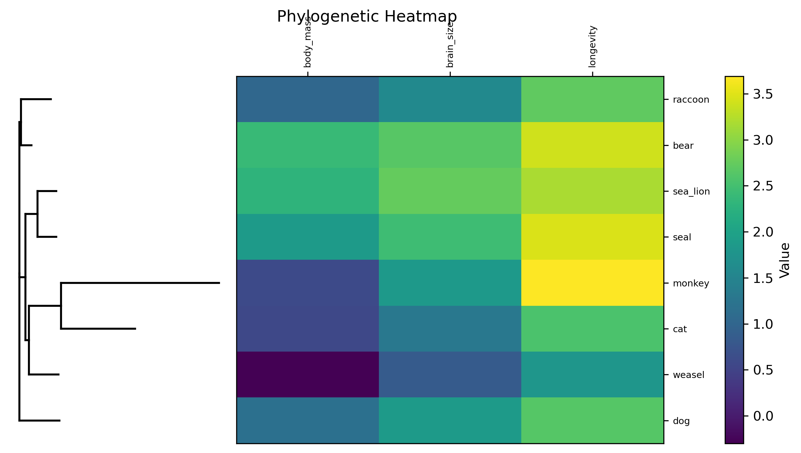

.. code-block:: shell

	phykit phylo_heatmap -t <tree> -d <data> -o <output>
		[--split 0.3] [--standardize] [--cmap viridis] [--cluster-columns] [--json]

Options: |br|
*-t/--tree*: tree file (required) |br|
*-d/--data*: numeric data matrix in TSV format with header row (required) |br|
*-o/--output*: output figure path (required; supports .png, .pdf, .svg) |br|
*--split*: fraction of figure width for the tree panel (default: 0.3) |br|
*--standardize*: z-score each column before coloring |br|
*--cmap*: matplotlib colormap name (default: ``viridis``) |br|
*--cluster-columns*: cluster trait columns by similarity and display a dendrogram at the top |br|
*--json*: optional argument to output metadata as JSON

|

.. _cmd-phylo_impute:

Phylogenetic imputation
#######################
Function names: phylo_impute; impute; phylo_imp |br|
Command line interface: pk_phylo_impute; pk_impute; pk_phylo_imp

Impute missing continuous trait values using phylogenetic relationships
and between-trait correlations under Brownian motion. Missing values
(``NA``, ``?``, or empty) in a multi-trait TSV are predicted from:

1. **Phylogenetic neighbors**: closely related species with observed
   values contribute more to the imputation via the phylogenetic VCV
2. **Trait correlations**: if a taxon has observed values for other
   traits, between-trait covariance improves the prediction

Reports imputed values with standard errors and 95% confidence
intervals. The output TSV is a drop-in replacement for the input with
all missing values filled in.

.. code-block:: shell

   phykit phylo_impute -t <tree> -d <trait_data> -o <output> [--json]
   phykit phylo_impute -t <tree> -d <trait_data> -o <output> -g <gene_trees>

Options: |br|
*-t/--tree*: tree file in Newick format (required) |br|
*-d/--trait-data*: multi-trait TSV with header; missing values as NA, ?, or empty (required) |br|
*-o/--output*: output TSV file with imputed values (required) |br|
*-g/--gene-trees*: gene trees for discordance-aware VCV |br|
*--json*: optional argument to print results as JSON

|

.. _cmd-phenogram:

Phenogram (traitgram)
#####################
Function names: phenogram; traitgram; tg |br|
Command line interface: pk_phenogram; pk_traitgram; pk_tg

Plot a phenogram (traitgram) showing trait evolution along a phylogeny
(analogous to R's ``phytools::phenogram()``). The X-axis represents
distance from the root and the Y-axis represents trait values.
Ancestral states are reconstructed via maximum-likelihood.

.. code-block:: shell

   phykit phenogram -t <tree> -d <trait_data> -o <output.png>
       [--fig-width <float>] [--fig-height <float>] [--dpi <int>] [--no-title] [--title <str>]
       [--legend-position <str>] [--ylabel-fontsize <float>] [--xlabel-fontsize <float>]
       [--title-fontsize <float>] [--axis-fontsize <float>] [--colors <str>] [--ladderize] [--cladogram] [--circular] [--color-file <file>] [--json]

Options: |br|
*-t/--tree*: a tree file in Newick format |br|
*-d/--trait_data*: tab-delimited trait file (taxon<tab>value) |br|
*-o/--output*: output plot file path (required) |br|
*--fig-width*: figure width in inches (auto-scaled if omitted) |br|
*--fig-height*: figure height in inches (auto-scaled if omitted) |br|
*--dpi*: resolution in DPI (default: 300) |br|
*--no-title*: hide the plot title |br|
*--title*: custom title text |br|
*--legend-position*: legend location (e.g., "upper right", "none" to hide) |br|
*--ylabel-fontsize*: font size for y-axis labels; 0 to hide |br|
*--xlabel-fontsize*: font size for x-axis labels; 0 to hide |br|
*--title-fontsize*: font size for the title |br|
*--axis-fontsize*: font size for axis labels |br|
*--colors*: comma-separated colors (hex or named) |br|
*--ladderize*: ladderize (sort) the tree before plotting |br|
*--cladogram*: draw cladogram (equal branch lengths, tips aligned) instead of phylogram |br|
*--circular*: draw circular (radial/fan) phylogram instead of rectangular |br|
*--color-file*: color annotation file for tip labels, clade ranges, and branch colors (iTOL-inspired TSV format) |br|
*--json*: optional argument to print results as JSON

.. image:: ../_static/img/phenogram_example.png
   :align: center
   :width: 80%

|

.. _cmd-phylogenetic_glm:

Phylogenetic GLM
################
Function names: phylogenetic_glm; phylo_glm; pglm |br|
Command line interface: pk_phylogenetic_glm; pk_phylo_glm; pk_pglm

Fit a Phylogenetic Generalized Linear Model (GLM) for binary or count
response data while accounting for phylogenetic non-independence among
species.

Two families are supported:

- **binomial**: logistic regression via Maximum Penalized Likelihood
  Estimation (logistic_MPLE; Ives & Garland 2010). Uses Firth's penalty
  to prevent bias from complete/quasi-complete separation, and jointly
  estimates the phylogenetic signal parameter alpha via a two-state
  continuous-time Markov chain on the tree.
- **poisson**: Poisson regression via Generalized Estimating Equations
  (poisson_GEE; Paradis & Claude 2002). Uses Fisher scoring with the
  phylogenetic correlation matrix and reports an overdispersion parameter.

The multi-trait input file should be tab-delimited with a header row:
``taxon<tab>trait1<tab>trait2<tab>...``

Output includes coefficient estimates, standard errors, z-values,
p-values, log-likelihood, AIC, and McFadden's pseudo-R² (computed from
full vs. intercept-only model log-likelihoods).

.. code-block:: shell

   phykit phylogenetic_glm -t <tree> -d <trait_data> -y <response> -x <predictor1> [predictor2 ...] --family <binomial|poisson> [-g <gene_trees>] [--json]

Options: |br|
*-t/--tree*: a tree file in Newick format |br|
*-d/--trait_data*: tab-delimited multi-trait file with header row |br|
*-y/--response*: response (dependent) variable column name |br|
*-x/--predictors*: one or more predictor column names |br|
*--family*: distribution family: binomial or poisson |br|
*--method*: estimation method: logistic_MPLE or poisson_GEE (auto from family) |br|
*--btol*: linear predictor bound for logistic model (default: 10) |br|
*--log-alpha-bound*: bound on log(alpha) for logistic model (default: 4) |br|
*-g/--gene-trees*: optional multi-Newick file of gene trees; when provided, uses a discordance-aware VCV (genome-wide average) instead of the species-tree VCV |br|
*--json*: optional argument to print results as JSON

|

.. _cmd-phylo_logistic:

Phylogenetic Logistic Regression
################################
Function names: phylo_logistic; phylo_logreg; plogreg |br|
Command line interface: pk_phylo_logistic; pk_phylo_logreg; pk_plogreg

Fit a Phylogenetic Logistic Regression for binary (0/1) response data while
accounting for phylogenetic non-independence among species (Ives & Garland 2010).

Uses Maximum Penalized Likelihood Estimation (logistic_MPLE) with Firth's
bias-correction penalty and jointly estimates the phylogenetic signal parameter
alpha via the OU-transformed variance-covariance matrix.

The multi-trait input file should be tab-delimited with a header row:
``taxon<tab>trait1<tab>trait2<tab>...``

Output includes coefficient estimates, standard errors, z-values,
p-values, alpha, log-likelihood, penalized log-likelihood, and AIC.

.. code-block:: shell

   phykit phylo_logistic -t <tree> -d <trait_data> --response <column> --predictor <column> [--method logistic_MPLE|logistic_IG10] [--json]

Options: |br|
*-t/--tree*: a tree file in Newick format |br|
*-d/--trait-data*: tab-delimited multi-trait file with header row |br|
*--response*: binary response column name (must contain only 0 and 1) |br|
*--predictor*: predictor column name(s), comma-separated for multiple |br|
*--method*: estimation method: logistic_MPLE or logistic_IG10 (default: logistic_MPLE) |br|
*--json*: optional argument to print results as JSON

|

.. _cmd-phylogenetic_ordination:

Phylogenetic Ordination
#######################
Function names: phylogenetic_ordination; phylo_ordination; ordination; ord;
phylo_pca; phyl_pca; ppca; phylo_dimreduce; dimreduce; pdr |br|
Command line interface: pk_phylogenetic_ordination; pk_phylo_ordination;
pk_ordination; pk_ord; pk_phylo_pca; pk_phyl_pca; pk_ppca;
pk_phylo_dimreduce; pk_dimreduce; pk_pdr

Perform phylogenetic ordination (PCA, t-SNE, or UMAP) on continuous multi-trait
data while accounting for phylogenetic non-independence among species.

All methods use GLS-centering via the phylogenetic variance-covariance matrix.
For PCA, eigendecomposition of the evolutionary rate matrix is performed to
extract principal components. For t-SNE and UMAP, nonlinear embedding is
applied to the GLS-centered data.

Three ordination methods are available via ``--method``:

- **pca** (default): phylogenetic PCA (Revell 2009). Performs eigendecomposition
  of the evolutionary rate matrix.
- **tsne**: t-SNE embedding of the GLS-centered data. Perplexity is auto-set
  to ``min(30, (n-1)/3)``; requires at least 4 taxa.
- **umap**: UMAP embedding of the GLS-centered data. n_neighbors is auto-set
  to ``min(15, n-1)``; requires at least 3 taxa.

Two phylogenetic correction modes are available via ``--correction``:

- **BM** (default): assumes traits evolved under Brownian motion. The
  phylogenetic VCV matrix is used directly.
- **lambda**: jointly estimates a single Pagel's lambda parameter across all
  traits by maximum likelihood, then rescales the off-diagonal elements of the
  VCV matrix. This accounts for deviations from Brownian motion.

For PCA, two modes are available via ``--mode``:

- **cov** (default): PCA on the evolutionary rate (covariance) matrix.
- **corr**: PCA on the evolutionary rate correlation matrix, which
  standardizes traits to equal variance before extracting components.

The multi-trait input file should be tab-delimited with a header row:
``taxon<tab>trait1<tab>trait2<tab>...``
Lines starting with '#' are treated as comments. If the tree and trait file
have different taxa, the intersection is used and warnings are printed to
stderr.

PCA output includes eigenvalues with proportion of variance explained, trait
loadings, and taxon scores for each principal component. t-SNE/UMAP output
includes method parameters and embedding coordinates. When ``correction=lambda``
is used, the estimated lambda and log-likelihood are also reported.

PCA results have been benchmarked against the R package
`phytools <https://cran.r-project.org/package=phytools>`_
(``phyl.pca`` function; Revell 2012). Eigenvalues, loadings, and scores match
phytools across all method/mode combinations (BM+cov, BM+corr, lambda+cov,
lambda+corr) within numerical tolerance (1e-4).

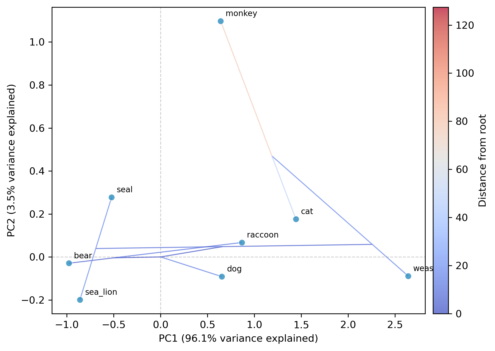

|

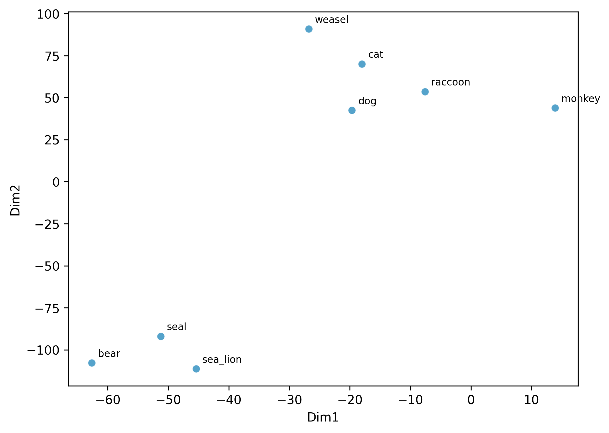

|

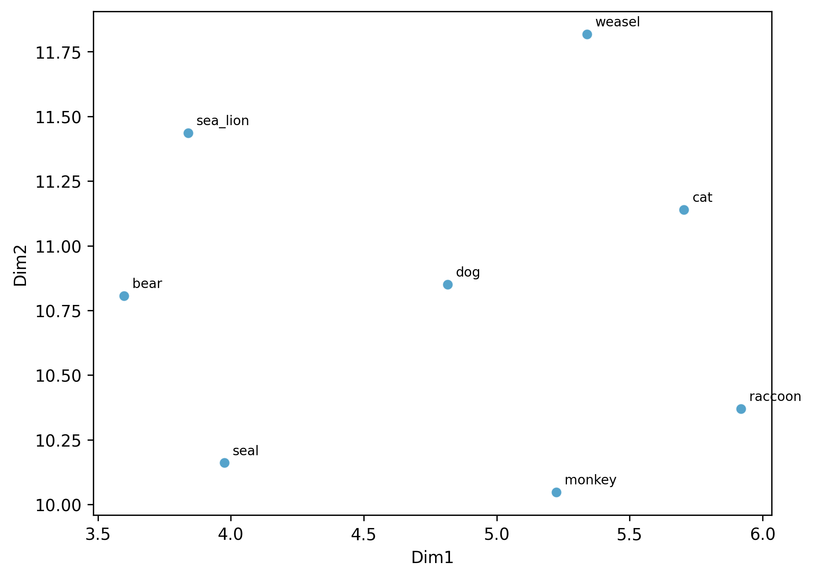

|

.. code-block:: shell

   phykit phylogenetic_ordination -t <tree> -d <trait_data> [--method <pca|tsne|umap>] [--correction <BM|lambda>] [--mode <cov|corr>] [--n-components <int>] [--perplexity <float>] [--n-neighbors <int>] [--min-dist <float>] [--seed <int>] [--plot] [--plot-tree] [--no-plot-tree] [--color-by <col_or_file>] [--tree-color-by <col_or_file>] [--plot-output <path>] [-g <gene_trees>]
       [--fig-width <float>] [--fig-height <float>] [--dpi <int>] [--no-title] [--title <str>]
       [--legend-position <str>] [--ylabel-fontsize <float>] [--xlabel-fontsize <float>]
       [--title-fontsize <float>] [--axis-fontsize <float>] [--colors <str>] [--ladderize] [--cladogram] [--circular] [--color-file <file>] [--json]

Options: |br|
*-t/--tree*: a tree file in Newick format |br|
*-d/--trait_data*: tab-delimited multi-trait file with header row |br|
*--method*: ordination method: ``pca``, ``tsne``, or ``umap`` (default: pca) |br|
*--correction*: phylogenetic correction: ``BM`` or ``lambda`` (default: BM) |br|
*--mode*: PCA mode: ``cov`` or ``corr`` (default: cov; PCA only) |br|
*--n-components*: number of embedding dimensions (default: 2; tsne/umap only) |br|
*--perplexity*: t-SNE perplexity (default: auto) |br|
*--n-neighbors*: UMAP n_neighbors (default: auto) |br|
*--min-dist*: UMAP min_dist (default: 0.1) |br|
*--seed*: random seed for reproducibility |br|
*--plot*: optional argument to save a scatter plot |br|
*--plot-tree*: overlay the phylogeny via ancestral reconstruction (default for tsne/umap; opt-in for pca) |br|
*--no-plot-tree*: disable the phylogeny overlay for tsne/umap plots |br|
*--color-by*: color tip points by a trait; specify a column name from the multi-trait file or a separate tab-delimited file (taxon<tab>value) for continuous or discrete coloring |br|
*--tree-color-by*: color phylogeny edges by a trait; specify a column name or a tab-delimited file (default: distance from root) |br|
*--plot-output*: output path for plot (default: phylo_ordination_plot.png) |br|
*-g/--gene-trees*: optional multi-Newick file of gene trees; when provided, uses a discordance-aware VCV (genome-wide average) instead of the species-tree VCV |br|
*--fig-width*: figure width in inches (auto-scaled if omitted) |br|
*--fig-height*: figure height in inches (auto-scaled if omitted) |br|
*--dpi*: resolution in DPI (default: 300) |br|
*--no-title*: hide the plot title |br|
*--title*: custom title text |br|
*--legend-position*: legend location (e.g., "upper right", "none" to hide) |br|
*--ylabel-fontsize*: font size for y-axis labels; 0 to hide |br|
*--xlabel-fontsize*: font size for x-axis labels; 0 to hide |br|
*--title-fontsize*: font size for the title |br|
*--axis-fontsize*: font size for axis labels |br|
*--colors*: comma-separated colors (hex or named) |br|
*--ladderize*: ladderize (sort) the tree before plotting |br|
*--cladogram*: draw cladogram (equal branch lengths, tips aligned) instead of phylogram |br|
*--circular*: draw circular (radial/fan) phylogram instead of rectangular |br|
*--color-file*: color annotation file for tip labels, clade ranges, and branch colors (iTOL-inspired TSV format) |br|
*--json*: optional argument to print results as JSON

|

.. _cmd-phylogenetic_regression:

Phylogenetic regression (PGLS)
##############################
Function names: phylogenetic_regression; phylo_regression; pgls |br|
Command line interface: pk_phylogenetic_regression; pk_phylo_regression; pk_pgls

Fit a Phylogenetic Generalized Least Squares (PGLS) regression while
accounting for phylogenetic non-independence among species, analogous to
R's ``caper::pgls()``.

The multi-trait input file should be tab-delimited with a header row:
``taxon<tab>trait1<tab>trait2<tab>...``
Lines starting with '#' are treated as comments. If the tree and trait file
have different taxa, the intersection is used and warnings are printed to
stderr.

Two methods are available:

- **BM** (default): Brownian motion with lambda fixed at 1
- **lambda**: jointly estimates Pagel's lambda via maximum likelihood

Output includes coefficient estimates, standard errors, t-values, p-values,
R-squared, adjusted R-squared, F-statistic, log-likelihood, and AIC.

A three-way variance decomposition is also reported: R²_total (variance
explained by phylogeny + predictors combined), R²_pred (predictor contribution
given phylogeny, = standard R²), and R²_phylo (phylogeny's unique contribution).
R²_phylo + R²_pred = R²_total.

The implementation uses the raw phylogenetic variance-covariance (VCV) matrix
for GLS estimation, matching the approach used by R's ``caper::pgls()``.
Note that this differs from ``nlme::gls()`` with ``corBrownian``, which
normalizes the VCV to a correlation matrix (ones on the diagonal). For
non-ultrametric trees the two approaches yield different coefficient estimates;
PhyKIT follows the ``caper`` convention.

All results have been validated against R 4.4.0 using manual GLS with
``ape::vcv()`` (raw VCV). Coefficients, standard errors, t-values, p-values,
R-squared, F-statistic, log-likelihood, and AIC match R to at least four
decimal places for both simple and multiple regression.

.. code-block:: shell

   phykit phylogenetic_regression -t <tree> -d <trait_data> -y <response> -x <predictor1> [predictor2 ...] [-m <method>] [-g <gene_trees>] [--json]

Options: |br|
*-t/--tree*: a tree file in Newick format |br|
*-d/--trait_data*: tab-delimited multi-trait file with header row |br|
*-y/--response*: response (dependent) variable column name |br|
*-x/--predictors*: one or more predictor column names |br|
*-m/--method*: method to use: BM or lambda (default: BM) |br|
*-g/--gene-trees*: optional multi-Newick file of gene trees; when provided, uses a discordance-aware VCV (genome-wide average) instead of the species-tree VCV |br|
*--json*: optional argument to print results as JSON

|

.. _cmd-phylogenetic_signal:

Phylogenetic signal
####################
Function names: phylogenetic_signal; phylo_signal; ps |br|
Command line interface: pk_phylogenetic_signal; pk_phylo_signal; pk_ps

Calculate phylogenetic signal for continuous trait data on a phylogeny.

Two methods are available:

- **Blomberg's K** (Blomberg et al. 2003): measures the degree of phylogenetic
  signal relative to expectation under Brownian motion. K = 1 indicates trait
  variation consistent with BM; K < 1 indicates less phylogenetic signal than
  expected; K > 1 indicates more. P-value is computed via permutation test.
- **Pagel's lambda** (Pagel 1999): a tree-scaling parameter estimated by
  maximum likelihood. Lambda = 0 indicates no phylogenetic signal; lambda = 1
  indicates trait evolution consistent with BM. P-value is computed via
  likelihood ratio test against lambda = 0.

The trait file should be tab-delimited with two columns (taxon_name<tab>trait_value).
Lines starting with '#' are treated as comments. If the tree and trait file have
different taxa, the intersection is used and warnings are printed to stderr.

**Multivariate K_mult** (Adams 2014): When the ``--multivariate`` flag is used,
K_mult is computed instead of single-trait K. This generalizes Blomberg's K to
multivariate data using distances in trait space. The trait file should be a
multi-column TSV with a header row (``taxon<tab>trait1<tab>trait2<tab>...``),
the same format used by ``phylogenetic_ordination`` and ``trait_correlation``.
K_mult only works with Blomberg's K framework; combining ``--multivariate``
with ``--method lambda`` will produce an error.

Output for Blomberg's K: K_value<tab>p_value<tab>R2_phylo |br|
Output for Pagel's lambda: lambda_value<tab>log_likelihood<tab>p_value<tab>R2_phylo |br|
Output for K_mult: K_mult<tab>p_value<tab>n_traits<tab>permutations

R²_phylo reports the fraction of trait variance explained by phylogenetic structure:
``R²_phylo = 1 - (σ²_BM / σ²_WN)``. Values near 1 indicate strong phylogenetic signal;
values near 0 indicate phylogeny explains little trait variance.

Results have been validated against the R package phytools (``phylosig`` function)
across 95 simulated datasets spanning diverse tree sizes (5-50 tips), topologies
(pure-birth, coalescent), trait models (random, Brownian motion, known lambda),
and branch length scales. All metrics show Pearson r > 0.999 with phytools.

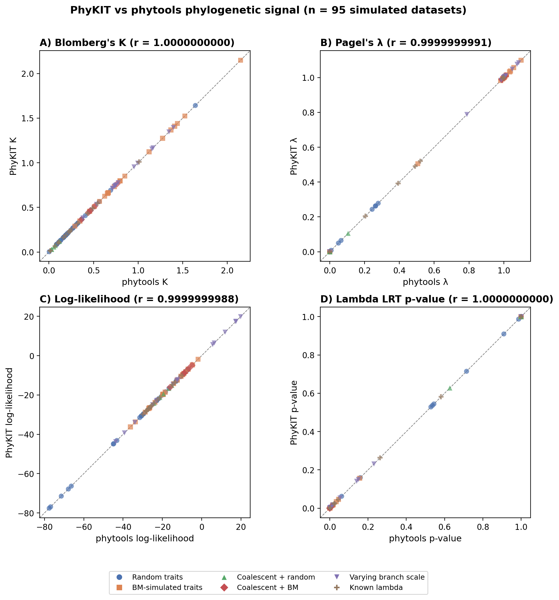

|

.. code-block:: shell

   phykit phylogenetic_signal -t <tree> -d <trait_data> [-m <method>] [-p <permutations>] [-g <gene_trees>] [--multivariate] [--json]

Options: |br|
*-t/--tree*: a tree file in Newick format |br|
*-d/--trait_data*: tab-delimited trait file (taxon_name<tab>trait_value) |br|
*-m/--method*: method to use: ``blombergs_k`` or ``lambda`` (default: blombergs_k) |br|
*-p/--permutations*: number of permutations for Blomberg's K (default: 1000) |br|
*-g/--gene-trees*: optional multi-Newick file of gene trees; when provided, uses a discordance-aware VCV (genome-wide average) instead of the species-tree VCV |br|
*--multivariate*: compute K_mult (Adams 2014) for multivariate traits; the trait file should be a multi-column TSV with header row instead of two-column |br|
*--json*: optional argument to print results as JSON

|

.. _cmd-trait_correlation:

Trait correlation
#################
Function names: trait_correlation; trait_corr; phylo_corr |br|
Command line interface: pk_trait_correlation; pk_trait_corr; pk_phylo_corr

Compute phylogenetic correlations between all pairs of traits and display
them as a heatmap with significance indicators.

Uses GLS-centering via the tree's variance-covariance matrix to account for
phylogenetic non-independence among species. P-values are computed from the
t-distribution and displayed as significance stars on the heatmap cells:

- ``***`` p < 0.001
- ``**`` p < 0.01
- ``*`` p < alpha (default 0.05)

The multi-trait input file should be tab-delimited with a header row:
``taxon<tab>trait1<tab>trait2<tab>...``
At least 2 traits are required. Lines starting with '#' are treated as
comments. If the tree and trait file have different taxa, the intersection
is used and warnings are printed to stderr.

The ``--cluster`` option clusters traits by correlation similarity
(using ``1 - |r|`` as distance) and draws dendrograms alongside the
heatmap.

.. code-block:: shell

   phykit trait_correlation -t <tree> -d <trait_data> -o <output>
       [--alpha 0.05] [--cluster] [-g <gene_trees>] [--json]
       [--fig-width <float>] [--fig-height <float>] [--dpi <int>]
       [--no-title] [--title <str>]

Options: |br|
*-t/--tree*: a tree file in Newick format |br|
*-d/--trait-data*: tab-delimited multi-trait file with header row (at least 2 traits) |br|
*-o/--output*: output figure path (supports .png, .pdf, .svg) |br|
*--alpha*: significance threshold for marking p-values (default: 0.05) |br|
*--cluster*: cluster traits by correlation similarity and display dendrograms |br|
*-g/--gene-trees*: optional multi-Newick file of gene trees for discordance-aware VCV |br|
*--json*: optional argument to print results as JSON

|

.. _cmd-phylomorphospace:

Phylomorphospace
################
Function names: phylomorphospace; phylomorpho; phmo |br|
Command line interface: pk_phylomorphospace; pk_phylomorpho; pk_phmo

Plot a phylomorphospace: two raw traits in trait space with the phylogeny
overlaid via ML-reconstructed ancestral states at internal nodes. This differs
from the ``phylogenetic_ordination --plot-tree`` option, which plots in PC space;
``phylomorphospace`` plots raw trait values directly on the x and y axes.

Tree edges connect species through ML-reconstructed ancestral states and are
colored by distance from root (coolwarm colormap with colorbar). Tip points
default to blue, or can be colored by a continuous or discrete variable using
the ``--color-by`` option.

The multi-trait input file should be tab-delimited with a header row:
``taxon<tab>trait1<tab>trait2<tab>...``
Lines starting with '#' are treated as comments. If the tree and trait file
have different taxa, the intersection is used and warnings are printed to
stderr.

If the trait file has exactly 2 trait columns and ``--trait-x`` / ``--trait-y``
are omitted, the first two columns are selected automatically.

.. image:: ../_static/docs_img/phylomorphospace_plot.png
   :align: center

|

.. code-block:: shell

   phykit phylomorphospace -t <tree> -d <trait_data> [--trait-x <name>] [--trait-y <name>] [--color-by <col_or_file>] [--plot-output <path>]
       [--fig-width <float>] [--fig-height <float>] [--dpi <int>] [--no-title] [--title <str>]
       [--legend-position <str>] [--ylabel-fontsize <float>] [--xlabel-fontsize <float>]
       [--title-fontsize <float>] [--axis-fontsize <float>] [--colors <str>] [--ladderize] [--cladogram] [--circular] [--color-file <file>] [--json]

Options: |br|
*-t/--tree*: a tree file in Newick format |br|
*-d/--trait_data*: tab-delimited multi-trait file with header row |br|
*--trait-x*: column name for x-axis trait |br|
*--trait-y*: column name for y-axis trait |br|
*--color-by*: color tip points by a trait; specify a column name from the multi-trait file or a separate tab-delimited file (taxon<tab>value) for continuous or discrete coloring |br|
*--plot-output*: output path for plot (default: phylomorphospace_plot.png) |br|
*--fig-width*: figure width in inches (auto-scaled if omitted) |br|
*--fig-height*: figure height in inches (auto-scaled if omitted) |br|
*--dpi*: resolution in DPI (default: 300) |br|
*--no-title*: hide the plot title |br|
*--title*: custom title text |br|
*--legend-position*: legend location (e.g., "upper right", "none" to hide) |br|
*--ylabel-fontsize*: font size for y-axis labels; 0 to hide |br|
*--xlabel-fontsize*: font size for x-axis labels; 0 to hide |br|
*--title-fontsize*: font size for the title |br|
*--axis-fontsize*: font size for axis labels |br|
*--colors*: comma-separated colors (hex or named) |br|
*--ladderize*: ladderize (sort) the tree before plotting |br|
*--cladogram*: draw cladogram (equal branch lengths, tips aligned) instead of phylogram |br|
*--circular*: draw circular (radial/fan) phylogram instead of rectangular |br|
*--color-file*: color annotation file for tip labels, clade ranges, and branch colors (iTOL-inspired TSV format) |br|
*--json*: optional argument to print results as JSON

|

.. _cmd-polytomy_test:

Polytomy testing
################
Function names: polytomy_test; polyt_test; polyt; ptt |br|
Command line interface: pk_polytomy_test; pk_polyt_test; pk_polyt; pk_ptt

Conduct a polytomy test for three clades in a phylogeny.

Polytomy tests can be used to identify putative radiations
as well as identify well supported alternative topologies.

The polytomy testing function takes as input a file with
the three groups of taxa to test the relationships for and
a single column file with the names of the desired tree files
to use for polytomy testing. Next, the script examines
support for the grouping of the three taxa using triplets
and gene support frequencies. 

This function can account for uncertainty in gene trees - 
that is, the input phylogenies can have collapsed bipartitions.

Thereafter, a chi-squared test is conducted to determine if there
is evidence to reject the null hypothesis wherein the null 
hypothesis is that the three possible topologies among the three
groups are equally supported. This test is done using gene support
frequencies.

.. code-block:: shell

   phykit polytomy_test -t/--trees <trees> -g/--groups <groups> [--json]

Options: |br|
*-t/--trees <trees>*: single column file with the names of 
phylogenies to use for polytomy testing |br|
*-g/--groups*: a tab-delimited file with the grouping designations
to test. Lines starting with comments are not considered. Names of
individual taxa should be separated by a semi-colon ';' |br|
*--json*: optional argument to print results as JSON

For example, the groups file could look like the following:

.. code-block:: shell

   #label group0  group1  group2
   name_of_test    tip_name_A;tip_name_B   tip_name_C  tip_name_D;tip_name_E

|

.. _cmd-print_tree:

Print tree
##########
Function names: print_tree; print; pt |br|
Command line interface: pk_print_tree; pk_print; pk_pt

Print ascii tree of input phylogeny.

Phylogeny can be printed with or without branch lengths.
By default, the phylogeny will be printed with branch lengths
but branch lengths can be removed using the -r/--remove argument.

.. code-block:: shell

   phykit print_tree <tree> [-r/--remove] [--json]

Options: |br|
*<tree>*: first argument after function name should be a tree file |br|
*-r/--remove*: optional argument to print the phylogeny without branch
lengths |br|
*--json*: optional argument to print results as JSON

|

.. _cmd-prune_tree:

Prune tree
##########
Function names: prune_tree; prune |br|
Command line interface: pk_prune_tree; pk_prune

Prune tips from a phylogeny.

Provide a single column file with the names of the tips
in the input phylogeny you would like to prune from the
tree.

.. code-block:: shell

   phykit prune_tree <tree> <list_of_taxa> [-o/--output <output_file>] [-k/--keep] [--json]

Options: |br|
*<tree>*: first argument after function name should be a tree file |br|
*<list_of_taxa>*: single column file with the names of the tips to remove
from the phylogeny |br|
*-o/--output*: name of output file for the pruned phylogeny. 
Default output will have the same name as the input file but with the suffix 
".pruned" |br|
*-k/--keep*: optional argument. If used instead of pruning taxa in <list_of_taxa>,
keep them |br|
*--json*: optional argument to print results as JSON
|

.. _cmd-quartet_network:

Quartet network
################
Function names: quartet_network; quartet_net; qnet; nanuq |br|
Command line interface: pk_quartet_network; pk_quartet_net; pk_qnet; pk_nanuq

Quartet-based network inference (NANUQ-style) for distinguishing incomplete
lineage sorting (ILS) from hybridization/gene flow using quartet concordance
factors from gene trees.

For each 4-taxon subset, counts how many gene trees display each of the 3
possible unrooted topologies and applies two hypothesis tests:

1. **Star test** (Pearson chi-squared): tests whether the three topology
   counts are consistent with a star tree (equal probabilities 1/3 each).
   If p_star > beta (default 0.95), the quartet is classified as
   *unresolved*.

2. **T3 tree model test** (G-test / likelihood ratio): tests whether the
   counts are consistent with any resolved quartet tree under the
   multispecies coalescent.  If p_tree > alpha (default 0.05), the quartet
   is classified as *tree-like* (conflict is due to ILS).

3. If both tests reject their null hypotheses, the quartet is classified as
   *hybrid* (asymmetric discordance indicating gene flow or hybridization).

This algorithm matches the NANUQ method of Allman, Baños & Rhodes (2019),
implemented in R's MSCquartets package.

Polytomies (collapsed branches) in gene trees are handled conservatively:
bipartitions from polytomous nodes are excluded, so quartets spanning a
polytomy are treated as unresolved rather than misclassified. Trifurcating
roots (standard unrooted Newick) are not affected. This allows gene trees
with collapsed low-support branches to be used directly as input.

Input can be either:
1) a file with one Newick tree per line, or
2) a file with one tree-file path per line.

.. code-block:: shell

   phykit quartet_network -t/--trees <trees> [--alpha 0.05] [--beta 0.95] [--missing-taxa error|shared] [--plot-output <file>]
       [--fig-width <float>] [--fig-height <float>] [--dpi <int>] [--no-title] [--title <str>]
       [--legend-position <str>] [--ylabel-fontsize <float>] [--xlabel-fontsize <float>]
       [--title-fontsize <float>] [--axis-fontsize <float>] [--colors <str>] [--ladderize] [--cladogram] [--circular] [--color-file <file>] [--json]

Options: |br|
*-t/--trees*: file containing trees (one Newick per line) or tree-file paths (one per line) |br|
*--alpha*: significance level for the T3 tree model test (default: ``0.05``) |br|
*--beta*: threshold for the star tree test; quartets with p_star > beta are called unresolved (default: ``0.95``) |br|
*--missing-taxa*: handling strategy for mismatched taxa (``error`` or ``shared``; default: ``error``) |br|
*--plot-output*: output filename for the quartet network plot (optional) |br|
*--fig-width*: figure width in inches (auto-scaled if omitted) |br|
*--fig-height*: figure height in inches (auto-scaled if omitted) |br|
*--dpi*: resolution in DPI (default: 300) |br|
*--no-title*: hide the plot title |br|
*--title*: custom title text |br|
*--legend-position*: legend location (e.g., "upper right", "none" to hide) |br|
*--ylabel-fontsize*: font size for y-axis labels; 0 to hide |br|
*--xlabel-fontsize*: font size for x-axis labels; 0 to hide |br|
*--title-fontsize*: font size for the title |br|
*--axis-fontsize*: font size for axis labels |br|
*--colors*: comma-separated colors (hex or named) |br|
*--ladderize*: ladderize (sort) the tree before plotting |br|
*--cladogram*: draw cladogram (equal branch lengths, tips aligned) instead of phylogram |br|
*--circular*: draw circular (radial/fan) phylogram instead of rectangular |br|
*--color-file*: color annotation file for tip labels, clade ranges, and branch colors (iTOL-inspired TSV format) |br|
*--json*: optional argument to print results as JSON

When ``--plot-output`` is specified, a NANUQ-style splits graph is drawn from
the quartet distance matrix using Neighbor-Joining and circular split
decomposition.  Tree-like relationships appear as simple branching, while
hybridization / reticulation produces characteristic box (parallelogram)
structures — the same style of output produced by R's MSCquartets +
NeighborNet pipeline.

**No hybridization signal** — all quartets are tree-like, so the splits graph
is a clean unrooted tree:

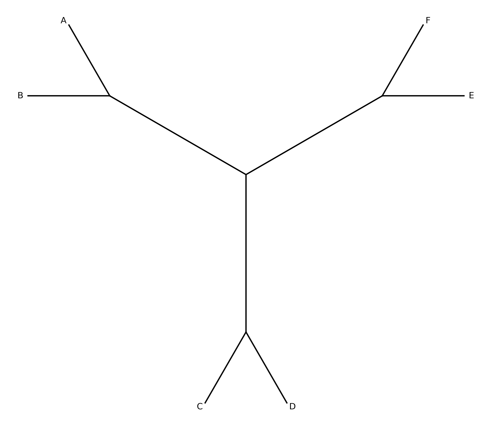

|

**Hybridization signal present** — hybrid quartets introduce conflicting
splits that appear as boxes in the network, indicating reticulation among
C, D, E, and F:

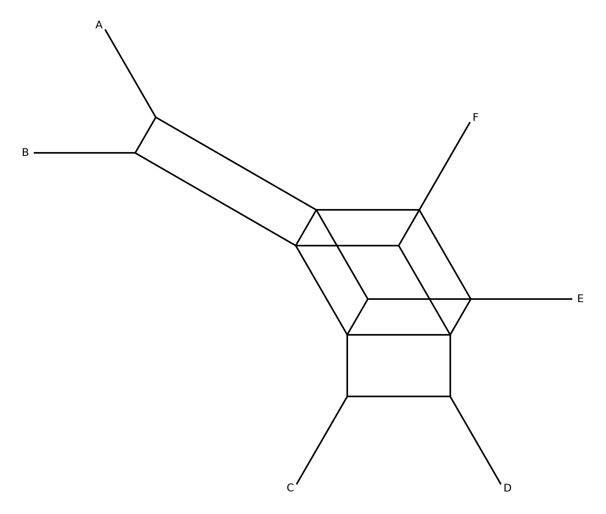

|

.. _cmd-rate_heterogeneity:

Rate heterogeneity test (multi-rate Brownian motion)
####################################################
Function names: rate_heterogeneity; brownie; rh |br|
Command line interface: pk_rate_heterogeneity; pk_brownie; pk_rh

Test for rate heterogeneity across phylogenetic regimes using multi-rate
Brownian motion (O'Meara et al. 2006), analogous to R's
``phytools::brownie.lite()``.

Fits single-rate vs. multi-rate BM models and performs a likelihood ratio
test. Users specify a tree, continuous trait data, and a regime file
mapping tips to regimes (tab-delimited, ``taxon<tab>regime_label``).

Regime assignments to internal branches are inferred via Fitch parsimony.
Per-regime VCV matrices are decomposed and per-regime sigma-squared values
are estimated via maximum likelihood.

Optionally, a parametric bootstrap can be run to compute a simulated
p-value (``-n/--nsim``). A horizontal phylogram with branches colored by
regime can be generated using ``--plot``.

An effect size metric R²_regime is also reported, measuring the variance
reduction from regime-specific rates vs. a single rate, weighted by the
number of tips per regime.

.. code-block:: shell

   phykit rate_heterogeneity -t <tree> -d <trait_data> -r <regime_data> [-n <nsim>] [--seed <seed>] [--plot <output.png>]
       [--fig-width <float>] [--fig-height <float>] [--dpi <int>] [--no-title] [--title <str>]
       [--legend-position <str>] [--ylabel-fontsize <float>] [--xlabel-fontsize <float>]
       [--title-fontsize <float>] [--axis-fontsize <float>] [--colors <str>] [--ladderize] [--cladogram] [--circular] [--color-file <file>] [--json]

Options: |br|
*-t/--tree*: a tree file in Newick format |br|
*-d/--trait_data*: tab-delimited trait file (taxon<tab>value) |br|
*-r/--regime_data*: tab-delimited regime file (taxon<tab>regime_label) |br|
*-n/--nsim*: number of parametric bootstrap simulations (default: 0) |br|
*--seed*: random seed for reproducibility |br|
*--plot*: output plot file path for phylogram with colored branches |br|
*--fig-width*: figure width in inches (auto-scaled if omitted) |br|
*--fig-height*: figure height in inches (auto-scaled if omitted) |br|
*--dpi*: resolution in DPI (default: 300) |br|
*--no-title*: hide the plot title |br|
*--title*: custom title text |br|
*--legend-position*: legend location (e.g., "upper right", "none" to hide) |br|
*--ylabel-fontsize*: font size for y-axis labels; 0 to hide |br|
*--xlabel-fontsize*: font size for x-axis labels; 0 to hide |br|
*--title-fontsize*: font size for the title |br|
*--axis-fontsize*: font size for axis labels |br|
*--colors*: comma-separated colors (hex or named) |br|
*--ladderize*: ladderize (sort) the tree before plotting |br|
*--cladogram*: draw cladogram (equal branch lengths, tips aligned) instead of phylogram |br|
*--circular*: draw circular (radial/fan) phylogram instead of rectangular |br|
*--color-file*: color annotation file for tip labels, clade ranges, and branch colors (iTOL-inspired TSV format) |br|
*--json*: optional argument to print results as JSON

|

.. _cmd-rename_tree_tips:

Rename tree tips
################
Function names: rename_tree_tips; rename_tree; rename_tips |br|
Command line interface: pk_rename_tree_tips; pk_rename_tree; pk_rename_tips

Renames tips in a phylogeny.

Renaming tips will follow the scheme of a tab-delimited
file wherein the first column is the current tip name and the
second column is the desired tip name in the resulting 
phylogeny. 

.. code-block:: shell

   phykit rename_tree_tips <tree> -i/--idmap <idmap.txt> [-o/--output <output_file>] [--json]

Options: |br|
*<tree>*: first argument after function name should be a tree file |br|
*-i/--idmap*: identifier map of current tip names (col1) and desired
tip names (col2) |br|
*-o/--output*: optional argument to write the renamed tree files to. Default
output will have the same name as the input file but with the suffix ".renamed" |br|
*--json*: optional argument to print results as JSON

|

.. _cmd-kf_distance:

Kuhner-Felsenstein distance
###########################
Function names: kuhner_felsenstein_distance; kf_distance; kf_dist; kf |br|
Command line interface: pk_kuhner_felsenstein_distance; pk_kf_distance; pk_kf_dist; pk_kf

Calculate the Kuhner-Felsenstein (KF) branch score distance between two trees.

Unlike Robinson-Foulds distance which only considers topology, KF distance
incorporates both topology and branch length differences. The KF distance
is calculated as KF = sqrt(sum over all splits of (b1_i - b2_i)^2), where
b1_i and b2_i are branch lengths for split i in each tree. Splits absent
from one tree use branch length 0. Both internal and terminal branches are
included.

PhyKIT will print out
col 1: the plain KF distance and
col 2: the normalized KF distance.

KF distances are calculated following Kuhner & Felsenstein, Journal of
Computational Biology (1994), doi: 10.1089/cmb.1994.1.183.

Cross-validated against R's phangorn::KF.dist().

.. code-block:: shell

	phykit kf_distance <tree_file_zero> <tree_file_one> [--json]

Options: |br|
*<tree_file_zero>*: first argument after function name should be a tree file |br|
*<tree_file_one>*: second argument after function name should be a tree file |br|
*--json*: optional argument to print results as JSON

|

.. _cmd-robinson_foulds_distance:

Robinson-Foulds distance
########################
Function names: robinson_foulds_distance; rf_distance; rf_dist; rf |br|
Command line interface: pk_robinson_foulds_distance; pk_rf_distance; pk_rf_dist; pk_rf

Calculate Robinson-Foulds (RF) distance between two trees.

Low RF distances reflect greater similarity between two phylogenies. 
This function prints out two values, the plain RF value and the
normalized RF value, which are separated by a tab. Normalized RF values
are calculated by taking the plain RF value and dividing it by 2(n-3)
where n is the number of tips in the phylogeny. Prior to calculating
an RF value, PhyKIT will first determine the number of shared tips
between the two input phylogenies and prune them to a common set of
tips. Thus, users can input trees with different topologies and 
infer an RF value among subtrees with shared tips.

PhyKIT will print out 
col 1: the plain RF distance and 
col 2: the normalized RF distance.

RF distances are calculated following Robinson & Foulds, Mathematical 
Biosciences (1981), doi: 10.1016/0025-5564(81)90043-2.

.. code-block:: shell

   phykit robinson_foulds_distance <tree_file_zero> <tree_file_one> [--json]

Options: |br|
*<tree_file_zero>*: first argument after function name should be a tree file |br|
*<tree_file_one>*: second argument after function name should be a tree file |br|
*--json*: optional argument to print results as JSON

|

.. _cmd-root_tree:

Root tree
#########
Function names: root_tree; root; rt |br|
Command line interface: pk_root_tree; pk_root; pk_rt

Roots phylogeny using user-specified taxa.

A list of taxa to root the phylogeny on should be specified using the -r
argument. The root_taxa file should be a single-column file with taxa names.
The output file will have the same name as the input tree file but with
the suffix ".rooted".

.. code-block:: shell

   phykit root_tree <tree> -r/--root <root_taxa> [-o/--output <output_file>] [--json]

Options: |br|
*<tree>*: first argument after function name should be a tree file to root |br|
*-r/--root*: single column file with taxa names to root the phylogeny on |br|
*-o/--output*: optional argument to specify the name of the output file |br|
*--json*: optional argument to print results as JSON

|

.. _cmd-spurious_sequence:

Spurious homolog identification
###############################
Function names: spurious_sequence; spurious_seq; ss |br|
Command line interface: pk_spurious_sequence; pk_spurious_seq; pk_ss

Determines potentially spurious homologs using branch lengths.

Identifies potentially spurious sequences and reports
tips in the phylogeny that could possibly be removed
from the associated multiple sequence alignment. PhyKIT
does so by identifying and reporting long terminal branches
defined as branches that are equal to or greater than 20 times the median
length of all branches.

PhyKIT reports the following information
col1: name of tip that is a putatively spurious sequence
col2: length of branch leading to putatively spurious sequence
col3: threshold used to identify putatively spurious sequences
col4: median branch length in the phylogeny

If there are no putatively spurious sequences, "None" is reported.

Using this method to identify potentially spurious sequences
was, to my knowledge, first introduced by Shen et al., (2018)
Cell doi: 10.1016/j.cell.2018.10.023. 

.. code-block:: shell

   phykit spurious_seq <file> -f/--factor [--json]

Options: |br|
*<file>*: first argument after function name should be a tree file |br|
*-f/--factor*: factor to multiply median branch length by to calculate
the threshold of long branches. (Default: 20) |br|
*--json*: optional argument to print results as JSON

|

.. _cmd-stochastic_character_map:

Stochastic character mapping (SIMMAP)
#####################################
Function names: stochastic_character_map; simmap; scm |br|
Command line interface: pk_stochastic_character_map; pk_simmap; pk_scm

Perform Stochastic Character Mapping (SIMMAP) of discrete traits onto a
phylogeny (Huelsenbeck et al. 2003; Bollback 2006), analogous to R's
``phytools::make.simmap()``.

Fits a continuous-time Markov chain (CTMC) rate matrix Q via maximum
likelihood using Felsenstein's pruning algorithm. Three substitution models
are available:

- **ER** (equal rates): 1 free parameter
- **SYM** (symmetric rates): k(k-1)/2 free parameters
- **ARD** (all rates differ): k(k-1) free parameters

The input trait file should be tab-delimited with a header row:
``taxon<tab>trait_column<tab>...``
Lines starting with '#' are treated as comments. If the tree and trait file
have different taxa, the intersection is used and warnings are printed to
stderr.

Output includes the fitted Q matrix, log-likelihood, mean dwelling times,
mean transition counts, and posterior probabilities at internal nodes.

Optionally, a horizontal phylogram plot with branches colored by mapped
character state can be generated using the ``--plot`` argument.

All results have been validated against R 4.4.0 using ``phytools::fitMk``
and ``phytools::make.simmap``. ER log-likelihoods match R to within 0.002
(both optimizers converge to the same flat plateau). For the ARD model,
PhyKIT's multi-start optimizer finds a slightly better local optimum
than R (loglik -8.38 vs -8.43). Dwelling times sum to total tree length
exactly, and Q matrix structural properties (rows sum to zero, model
nesting) are verified.

.. code-block:: shell

   phykit stochastic_character_map -t <tree> -d <trait_data> -c <trait_column> [-m <model>] [-n <nsim>] [--seed <seed>] [--plot <output.png>]
       [--fig-width <float>] [--fig-height <float>] [--dpi <int>] [--no-title] [--title <str>]
       [--legend-position <str>] [--ylabel-fontsize <float>] [--xlabel-fontsize <float>]
       [--title-fontsize <float>] [--axis-fontsize <float>] [--colors <str>] [--ladderize] [--cladogram] [--circular] [--color-file <file>] [--json]

Options: |br|
*-t/--tree*: a tree file in Newick format |br|
*-d/--trait_data*: tab-delimited trait file with header row |br|
*-c/--trait*: column name for discrete character trait |br|
*-m/--model*: substitution model: ER, SYM, or ARD (default: ER) |br|
*-n/--nsim*: number of stochastic mapping simulations (default: 100) |br|
*--seed*: random seed for reproducibility |br|
*--plot*: output plot file path for phylogram with colored branches |br|
*--fig-width*: figure width in inches (auto-scaled if omitted) |br|
*--fig-height*: figure height in inches (auto-scaled if omitted) |br|
*--dpi*: resolution in DPI (default: 300) |br|
*--no-title*: hide the plot title |br|
*--title*: custom title text |br|
*--legend-position*: legend location (e.g., "upper right", "none" to hide) |br|
*--ylabel-fontsize*: font size for y-axis labels; 0 to hide |br|
*--xlabel-fontsize*: font size for x-axis labels; 0 to hide |br|
*--title-fontsize*: font size for the title |br|
*--axis-fontsize*: font size for axis labels |br|
*--colors*: comma-separated colors (hex or named) |br|
*--ladderize*: ladderize (sort) the tree before plotting |br|
*--cladogram*: draw cladogram (equal branch lengths, tips aligned) instead of phylogram |br|
*--circular*: draw circular (radial/fan) phylogram instead of rectangular |br|
*--color-file*: color annotation file for tip labels, clade ranges, and branch colors (iTOL-inspired TSV format) |br|
*--json*: optional argument to print results as JSON

|

.. _cmd-terminal_branch_stats:

Terminal branch statistics
##########################
Function names: terminal_branch_stats; tbs |br|
Command line interface: pk_terminal_branch_stats; pk_tbs

Calculate summary statistics for terminal branch lengths in a phylogeny.

Terminal branch lengths can be useful for phylogeny diagnostics.

To obtain all terminal branch lengths, use the -v/--verbose option.   

.. code-block:: shell

   phykit terminal_branch_stats <tree> [-v/--verbose] [--json]

Options: |br|
*<tree>*: first argument after function name should be a tree file |br|
*-v/--verbose*: optional argument to print all terminal branch lengths |br|
*--json*: optional argument to print results as JSON

|

.. _cmd-threshold_model:

Threshold model
###############
Function names: threshold_model; threshold; thresh; threshbayes; thresh_bayes |br|
Command line interface: pk_threshold_model; pk_threshold; pk_thresh; pk_threshbayes; pk_thresh_bayes

Estimate the evolutionary correlation between two traits using the
Felsenstein (2012) threshold model via MCMC. Binary discrete characters
are modelled as arising from continuous latent "liabilities" that evolve
under Brownian motion and cross a threshold at 0. This lets you estimate
correlations between binary traits (or between a binary and a continuous
trait) using BM rather than Mk transition rates.

This is the Python equivalent of ``phytools::threshBayes`` in R.

The sampler uses a Gibbs / Metropolis-Hastings hybrid:

- **Gibbs step**: sample each discrete tip's liability from a truncated
  normal conditioned on all other values
- **Metropolis step**: update sigma2_1, sigma2_2 (log-normal proposal),
  ancestral values a1, a2 (normal proposal), and the correlation r
  (normal proposal with reflection on [-1, 1])
- **Adaptive tuning**: during burn-in, proposal variances are adjusted
  to target ~23% acceptance

Trait types:

- ``discrete``: binary (0/1). Liabilities < 0 map to state 0,
  liabilities > 0 map to state 1.
- ``continuous``: observed values used directly (no liability needed).

Any combination of two traits is supported: discrete+continuous,
discrete+discrete, or continuous+continuous.

.. code-block:: shell

   phykit threshold_model -t <tree> -d <trait_data> --traits <t1,t2> --types <type1,type2> [--ngen 100000] [--sample 100] [--burnin 0.2] [--seed <int>] [--plot <file>]
       [--fig-width <float>] [--fig-height <float>] [--dpi <int>] [--no-title] [--title <str>]
       [--legend-position <str>] [--ylabel-fontsize <float>] [--xlabel-fontsize <float>]
       [--title-fontsize <float>] [--axis-fontsize <float>] [--colors <str>] [--ladderize] [--cladogram] [--circular] [--color-file <file>] [--json]

Options: |br|
*-t/--tree*: a rooted phylogeny file with branch lengths (required) |br|
*-d/--trait-data*: tab-delimited trait file with header row (required) |br|
*--traits*: comma-separated pair of trait column names (required) |br|
*--types*: comma-separated pair of trait types, each ``discrete`` or ``continuous`` (required) |br|
*--ngen*: number of MCMC generations (default: 100000) |br|
*--sample*: sample frequency (default: 100) |br|
*--burnin*: burn-in fraction (default: 0.2) |br|
*--seed*: random seed for reproducibility |br|
*--plot*: output filename for trace and posterior density plot (3 rows x 2 columns: |br|
left = MCMC trace, right = posterior histogram with 95% HPD shading) |br|
*--fig-width*: figure width in inches (auto-scaled if omitted) |br|
*--fig-height*: figure height in inches (auto-scaled if omitted) |br|
*--dpi*: resolution in DPI (default: 300) |br|
*--no-title*: hide the plot title |br|
*--title*: custom title text |br|
*--legend-position*: legend location (e.g., "upper right", "none" to hide) |br|
*--ylabel-fontsize*: font size for y-axis labels; 0 to hide |br|
*--xlabel-fontsize*: font size for x-axis labels; 0 to hide |br|
*--title-fontsize*: font size for the title |br|
*--axis-fontsize*: font size for axis labels |br|
*--colors*: comma-separated colors (hex or named) |br|
*--ladderize*: ladderize (sort) the tree before plotting |br|
*--cladogram*: draw cladogram (equal branch lengths, tips aligned) instead of phylogram |br|
*--circular*: draw circular (radial/fan) phylogram instead of rectangular |br|
*--color-file*: color annotation file for tip labels, clade ranges, and branch colors (iTOL-inspired TSV format) |br|
*--json*: optional argument to print results as JSON

Output (text mode): |br|
``Trait 1: habitat (discrete, 2 states: 0, 1)`` |br|
``Trait 2: body_mass (continuous)`` |br|
``MCMC: 100000 generations, sampled every 100, burn-in 20%`` |br|
``---`` |br|
``Posterior correlation (r): 0.6234 (95% HPD: 0.312, 0.891)`` |br|
``Posterior sigma2_1: 1.234 (95% HPD: 0.456, 2.345)`` |br|
``Posterior sigma2_2: 0.567 (95% HPD: 0.234, 1.012)`` |br|
``Acceptance rates: r=0.234, sigma2_1=0.312, sigma2_2=0.287, a1=0.241, a2=0.228``

|

**Tutorial: habitat type and body mass in carnivores**

This example uses the classic 8-taxon carnivore tree to test whether
habitat type (a binary trait: 0 = non-arboreal, 1 = arboreal) is
correlated with body mass on the latent liability scale.

*Step 1: Prepare the trait file.*

Create a tab-delimited file with a header row. The first column is
the taxon name, followed by columns for each trait:

.. code-block:: none

   taxon	habitat	body_mass
   raccoon	0	1.04
   bear	0	2.39
   sea_lion	0	2.30
   seal	0	1.88
   monkey	1	0.60
   cat	1	0.56
   weasel	1	-0.30
   dog	0	1.18

*Step 2: Run the threshold model.*

.. code-block:: shell

   phykit threshold_model \
     -t carnivore.tre \
     -d traits.tsv \
     --traits habitat,body_mass \
     --types discrete,continuous \
     --ngen 100000 \
     --seed 42

*Step 3: Examine the trace plots for convergence.*

.. code-block:: shell

   phykit threshold_model \
     -t carnivore.tre \
     -d traits.tsv \
     --traits habitat,body_mass \
     --types discrete,continuous \
     --ngen 100000 \
     --seed 42 \
     --plot trace.png

This generates a 3-row x 2-column figure. The left column shows
MCMC trace plots for r, sigma2_1, and sigma2_2 (check for
stationarity and good mixing). The right column shows posterior
density histograms with red shading for the 95% HPD interval
and a dashed line at the posterior mean.

*Step 4: Get full posterior samples as JSON for custom analysis.*

.. code-block:: shell

   phykit threshold_model \
     -t carnivore.tre \
     -d traits.tsv \
     --traits habitat,body_mass \
     --types discrete,continuous \
     --ngen 100000 \
     --seed 42 \
     --json > posterior.json

The JSON output includes full posterior sample arrays, summary
statistics (mean, median, 95% HPD), and MCMC metadata.

|

.. _cmd-tip_labels:

Tip labels
##########
Function names: tip_labels; tree_labels; labels; tl |br|
Command line interface: pk_tip_labels; pk_tree_labels; pk_labels; pk_tl

Prints the tip labels (or names) of a phylogeny.

.. code-block:: shell

   phykit tip_labels <tree> [--json]

Options: |br|
*<tree>*: first argument after function name should be a tree file |br|
*--json*: optional argument to print results as JSON

|

.. _cmd-tip_to_tip_distance:

Tip-to-tip distance
###################
Function names: tip_to_tip_distance; t2t_dist; t2t |br|
Command line interface: pk_tip_to_tip_distance; pk_t2t_dist; pk_t2t

Calculate distance between two tips (or leaves) in a phylogeny.

Distances are in substitutions per site.

.. code-block:: shell

   phykit tip_to_tip_distance <tree_file> <tip_1> <tip_2> [--json]
   phykit tip_to_tip_distance <tree_file> --all-pairs [--plot] [--plot-output <path>]
       [--fig-width <float>] [--fig-height <float>] [--dpi <int>] [--no-title] [--title <str>]
       [--legend-position <str>] [--ylabel-fontsize <float>] [--xlabel-fontsize <float>]
       [--title-fontsize <float>] [--axis-fontsize <float>] [--colors <str>] [--ladderize] [--cladogram] [--circular] [--color-file <file>] [--json]

Options: |br|
*<tree_file>*: first argument after function name should be a tree file |br|
*<tip_1>*: second argument should be the name of the first tip of interest |br|
*<tip_2>*: third argument should be the name of the second tip of interest |br|
*--all-pairs*: optional argument to report all pairwise tip distances |br|
*--plot*: optional argument to save a clustered distance heatmap (requires ``--all-pairs``) |br|
*--plot-output*: output path for heatmap (default: ``tip_to_tip_distance_heatmap.png``) |br|
*--fig-width*: figure width in inches (auto-scaled if omitted) |br|
*--fig-height*: figure height in inches (auto-scaled if omitted) |br|
*--dpi*: resolution in DPI (default: 300) |br|
*--no-title*: hide the plot title |br|
*--title*: custom title text |br|
*--legend-position*: legend location (e.g., "upper right", "none" to hide) |br|
*--ylabel-fontsize*: font size for y-axis labels; 0 to hide |br|
*--xlabel-fontsize*: font size for x-axis labels; 0 to hide |br|
*--title-fontsize*: font size for the title |br|
*--axis-fontsize*: font size for axis labels |br|
*--colors*: comma-separated colors (hex or named) |br|
*--ladderize*: ladderize (sort) the tree before plotting |br|
*--cladogram*: draw cladogram (equal branch lengths, tips aligned) instead of phylogram |br|
*--circular*: draw circular (radial/fan) phylogram instead of rectangular |br|
*--color-file*: color annotation file for tip labels, clade ranges, and branch colors (iTOL-inspired TSV format) |br|
*--json*: optional argument to print results as JSON

|

.. _cmd-tip_to_tip_node_distance:

Tip-to-tip node distance
########################
Function names: tip_to_tip_node_distance; t2t_node_dist; t2t_nd |br|
Command line interface: pk_tip_to_tip_node_distance; pk_t2t_node_dist; pk_t2t_nd

Calculate distance between two tips (or leaves) in a phylogeny.

Distance is measured by the number of nodes between one tip
and another.

.. code-block:: shell

   phykit tip_to_tip_node_distance <tree_file> <tip_1> <tip_2> [--json]

Options: |br|
*<tree_file>*: first argument after function name should be a tree file |br|
*<tip_1>*: second argument should be the name of the first tip of interest |br|
*<tip_2>*: third argument should be the name of the second tip of interest |br|
*--json*: optional argument to print results as JSON

|

.. _cmd-total_tree_length:

Total tree length
#################
Function names: total_tree_length; tree_len |br|
Command line interface: pk_total_tree_length; pk_tree_len

Calculate total tree length, which is a sum of all branches.

.. code-block:: shell

   phykit total_tree_length <tree> [--json]

Options: |br|
*<tree>*: first argument after function name should be a tree file |br|
*--json*: optional argument to print results as JSON

|

.. _cmd-treeness:

Treeness
########
Function names: treeness; tness |br|
Command line interface: pk_treeness; pk_tness

Calculate treeness statistic for a phylogeny.

Higher treeness values are thought to be desirable because they
represent a higher signal-to-noise ratio.

Treeness is the sum of internal branch lengths divided by the total
tree length. Therefore, values range from 0 to 1. Treeness can be
used as a measure of the signal-to-noise ratio in a phylogeny. 

Calculate treeness (also referred to as stemminess) following
Lanyon, The Auk (1988), doi: 10.1093/auk/105.3.565 and
Phillips and Penny, Molecular Phylogenetics and Evolution
(2003), doi: 10.1016/S1055-7903(03)00057-5.

.. code-block:: shell

   phykit treeness <tree> [--json]

Options: |br|
*<tree>*: first argument after function name should be a tree file |br|
*--json*: optional argument to print results as JSON

|

Alignment- and tree-based functions
-----------------------------------

.. _cmd-relative_rate_test:

Relative rate test
##################
Function names: relative_rate_test; rrt; tajima_rrt |br|
Command line interface: pk_relative_rate_test; pk_rrt; pk_tajima_rrt

Tajima's relative rate test (Tajima, *Genetics*, 1993).

Tests whether two ingroup lineages have evolved at equal rates
since diverging from their common ancestor. The outgroup is
automatically inferred from the rooted tree as the earliest-diverging
taxon (the single taxon on the smaller side of the root split).
All pairwise ingroup combinations are tested with Bonferroni
and Benjamini-Hochberg FDR multiple testing correction.

At each alignment column, the test classifies informative sites:

- **m1**: the first ingroup taxon differs from the outgroup, but the second matches
- **m2**: the second ingroup taxon differs from the outgroup, but the first matches
- Sites where both differ or both match the outgroup are uninformative and skipped
- Sites with gaps or ambiguous characters are skipped

Test statistic: ``chi2 = (m1 - m2)^2 / (m1 + m2)``, with 1 degree of freedom.

**Single alignment mode:**

.. code-block:: shell

   phykit relative_rate_test -a <alignment> -t <rooted_tree> [-v/--verbose]
       [--plot-output <path>] [--fig-width <float>] [--fig-height <float>] [--dpi <int>]
       [--no-title] [--title <str>] [--legend-position <str>] [--ylabel-fontsize <float>]
       [--xlabel-fontsize <float>] [--title-fontsize <float>] [--axis-fontsize <float>]
       [--colors <str>] [--ladderize] [--cladogram] [--circular] [--color-file <file>] [--json]

**Batch mode (multiple alignments, one shared tree):**

.. code-block:: shell

   phykit relative_rate_test -l <alignment_list> -t <rooted_tree> [-v/--verbose]
       [--plot-output <path>] [--fig-width <float>] [--fig-height <float>] [--dpi <int>]
       [--no-title] [--title <str>] [--legend-position <str>] [--ylabel-fontsize <float>]
       [--xlabel-fontsize <float>] [--title-fontsize <float>] [--axis-fontsize <float>]
       [--colors <str>] [--ladderize] [--cladogram] [--circular] [--color-file <file>] [--json]

Options: |br|
*-a/--alignment*: a single alignment file |br|
*-l/--alignment-list*: a file with one alignment path per line (batch mode) |br|
*-t/--tree*: a rooted tree file |br|
*-v/--verbose*: print additional detail |br|
*--plot-output*: save a pairwise p-value heatmap to this path |br|
*--fig-width*: figure width in inches (auto-scaled if omitted) |br|
*--fig-height*: figure height in inches (auto-scaled if omitted) |br|
*--dpi*: resolution in DPI (default: 300) |br|
*--no-title*: hide the plot title |br|
*--title*: custom title text |br|
*--legend-position*: legend location (e.g., "upper right", "none" to hide) |br|
*--ylabel-fontsize*: font size for y-axis labels; 0 to hide |br|
*--xlabel-fontsize*: font size for x-axis labels; 0 to hide |br|
*--title-fontsize*: font size for the title |br|
*--axis-fontsize*: font size for axis labels |br|
*--colors*: comma-separated colors (hex or named) |br|
*--ladderize*: ladderize (sort) the tree before plotting |br|
*--cladogram*: draw cladogram (equal branch lengths, tips aligned) instead of phylogram |br|
*--circular*: draw circular (radial/fan) phylogram instead of rectangular |br|
*--color-file*: color annotation file for tip labels, clade ranges, and branch colors (iTOL-inspired TSV format) |br|
*--json*: optional argument to print results as JSON

Single mode outputs one row per ingroup pair with m1, m2, chi-squared,
raw p-value, Bonferroni-corrected p-value, FDR-corrected p-value, and a
significance indicator. Batch mode aggregates across genes, reporting the
number and percentage of genes rejecting equal rates for each pair.

When ``--plot-output`` is provided, a symmetric heatmap of
-log10(FDR-corrected p-values) is saved. Cells with significant
pairs (FDR < 0.05) are marked with an asterisk. Darker colors
indicate stronger evidence for unequal evolutionary rates.
The dashed line on the colorbar marks the significance threshold
(-log10(0.05) ≈ 1.3); cells above this line are significant.

**Equal rates** — all taxa evolve at similar rates, so no pairwise
comparison reaches significance. The heatmap is uniformly pale with no
asterisks:

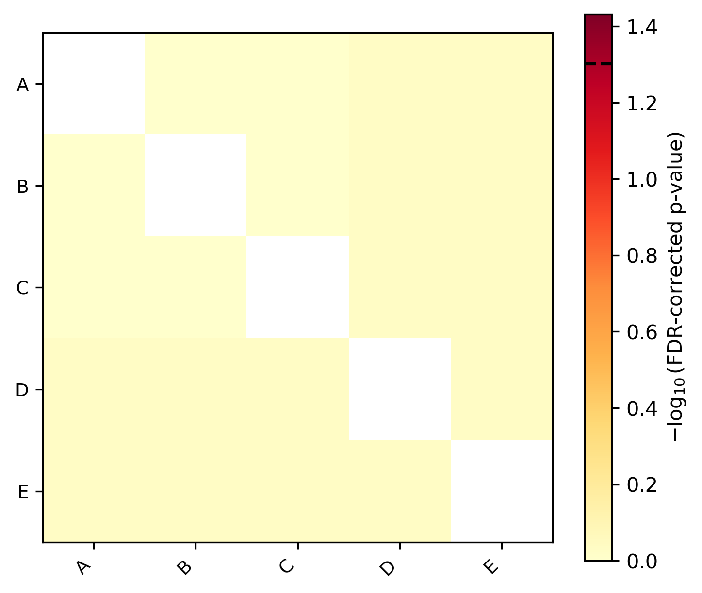

|

**Unequal rates** — taxa B and C have accumulated many more substitutions
than A and D. Significant pairs (dark red, marked with ``*``) indicate
lineages evolving at detectably different rates:

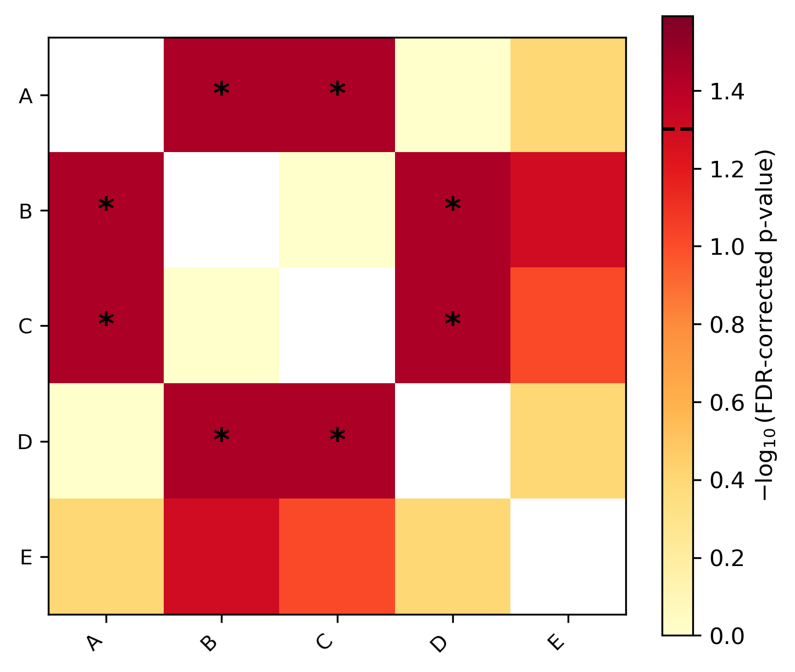

|

Validated against R's ``pegas::rr.test()`` — chi-squared and p-values
match to machine precision.

|

.. _cmd-saturation:

Saturation
##########
Function names: saturation; sat |br|
Command line interface: pk_saturation; pk_sat

Calculate saturation for a given tree and alignment.

Saturation is defined as sequences in multiple sequence
alignments that have undergone numerous substitutions such
that the distances between taxa are underestimated.

Data with no saturation will have a value of 1. The closer
the value is to 1, the less saturated the data.

This function outputs two values (as of v1.19.9). The first
value is the saturation value and the second column is the absolute
value of saturation minus 1. Thus, lower values in the second column
are indicative of values closer to one and, thus, less saturation.

Saturation is calculated following Philippe et al., PLoS 
Biology (2011), doi: 10.1371/journal.pbio.1000602.

.. code-block:: shell

   phykit saturation -a <alignment> -t <tree> [-v/--verbose] [-e/--exclude_gaps] [--plot] [--plot-output <path>]
       [--fig-width <float>] [--fig-height <float>] [--dpi <int>] [--no-title] [--title <str>]
       [--legend-position <str>] [--ylabel-fontsize <float>] [--xlabel-fontsize <float>]
       [--title-fontsize <float>] [--axis-fontsize <float>] [--colors <str>] [--ladderize] [--cladogram] [--circular] [--color-file <file>] [--json]

Options: |br|
*-a/--alignment*: an alignment file |br|
*-t/--tree*: a tree file |br|
*-e/--exclude_gaps*: if a site has a gap, ignore it |br|
*-v/--verbose*: print out patristic distances and uncorrected |br|
distances used to determine saturation |br|
*--plot*: save a saturation scatter plot with fitted slope through origin |br|
*--plot-output*: output path for saturation plot (default: ``saturation_plot.png``) |br|
*--fig-width*: figure width in inches (auto-scaled if omitted) |br|
*--fig-height*: figure height in inches (auto-scaled if omitted) |br|
*--dpi*: resolution in DPI (default: 300) |br|
*--no-title*: hide the plot title |br|
*--title*: custom title text |br|
*--legend-position*: legend location (e.g., "upper right", "none" to hide) |br|
*--ylabel-fontsize*: font size for y-axis labels; 0 to hide |br|
*--xlabel-fontsize*: font size for x-axis labels; 0 to hide |br|
*--title-fontsize*: font size for the title |br|
*--axis-fontsize*: font size for axis labels |br|
*--colors*: comma-separated colors (hex or named) |br|
*--ladderize*: ladderize (sort) the tree before plotting |br|
*--cladogram*: draw cladogram (equal branch lengths, tips aligned) instead of phylogram |br|
*--circular*: draw circular (radial/fan) phylogram instead of rectangular |br|
*--color-file*: color annotation file for tip labels, clade ranges, and branch colors (iTOL-inspired TSV format) |br|
*--json*: optional argument to print results as JSON

.. _cmd-treeness_over_rcv:

Treeness over RCV
#################
Function names: treeness_over_rcv; toverr; tor |br|
Command line interface: pk_treeness_over_rcv; pk_toverr; pk_tor

Calculate treeness/RCV for a given alignment and tree.

Higher treeness/RCV values are thought to be desirable because
they indicate a high signal-to-noise ratio and suggest the data are least susceptible
to composition bias.

PhyKIT reports three tab delimited values:
col1: treeness/RCV
col2: treeness
col3: RCV

Calculate treeness/RCV following Phillips and Penny, Molecular 
Phylogenetics and Evolution (2003), doi: 10.1016/S1055-7903(03)00057-5.

.. code-block:: shell

   phykit treeness_over_rcv -a/--alignment <alignment> -t/--tree <tree> [--json]

Options: |br|
*-a/--alignment*: an alignment file |br|
*-t/--tree*: a tree file |br|
*--json*: optional argument to print results as JSON

.. |br| raw:: html

   
