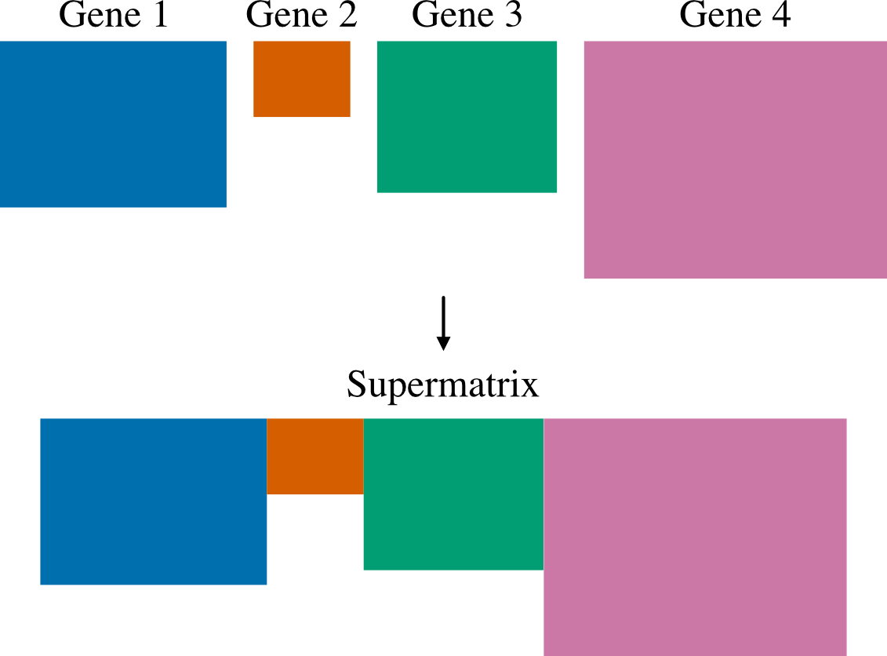

.. _usage:

Usage
=====

PhyKIT helps process and analyze multiple sequence alignments and phylogenies.

Generally, all functions are designed to help understand the contents of alignments
(e.g., gc content or the number of parsimony informative sites) and the shape
of trees (e.g., treeness, degree of violation of a molecular clock).

Some help messages indicate that summary statistics are reported (e.g., 
bipartition_support_stats). Summary statistics include mean, median, 25th percentile,
75th percentile, minimum, maximum, standard deviation, and variance. These functions
typically have a verbose option that allows users to get the underlying data
used to calculate summary statistics. 

|

General usage
-------------

^^^^^

Calling functions
#################

.. code-block:: shell

   phykit <command> [optional command arguments]

Command specific help messages can be viewed by adding a 
-h/\\-\\-help argument after the command. For example, to see the
to see the help message for the command 'treeness', execute:

.. code-block:: shell

   phykit treeness -h 
   # or
   phykit treeness --help

|

Function aliases
################

Each function comes with aliases to save the user some
key strokes. For example, to get the help message for the 'treeness'
function, you can type:

.. code-block:: shell

   phykit tness -h

|

Command line interfaces
#######################

As of version 1.2.0, all functions (including aliases) can be executed using
a command line interface that starts with *pk_*. For example, instead of typing
the previous command to get the help message of the treeness function, you can type:

.. code-block:: shell

   pk_treeness -h
   # or
   pk_tness -h

All possible function names are specified at the top of each function section. 

|

Alignment-based functions
-------------------------

^^^^^

Alignment length
################

Function names: alignment_length; aln_len; al |br|
Command line interface: pk_alignment_length; pk_aln_len; pk_al

Length of an input alignment is calculated using this function.

Longer alignments are associated with strong phylogenetic signal.
   
Association between alignment length and phylogenetic signal
was determined by Shen et al., Genome Biology and Evolution (2016),
doi: 10.1093/gbe/evw179.

.. code-block:: shell

	phykit aln_len <alignment>

Options: |br|
*<alignment>*: first argument after function name should be an alignment file 

|

Alignment length no gaps
########################

Function names: alignment_length_no_gaps; aln_len_no_gaps; alng |br|
Command line interface: pk_alignment_length_no_gaps; pk_aln_len_no_gaps; pk_alng

Calculate alignment length excluding sites with gaps.

Longer alignments when excluding sites with gaps is
associated with strong phylogenetic signal.

PhyKIT reports three tab delimited values:
col1: number of sites without gaps
col2: total number of sites
col3: percentage of sites without gaps

Association between alignment length when excluding sites
with gaps and phylogenetic signal was determined by Shen 
et al., Genome Biology and Evolution (2016), 
doi: 10.1093/gbe/evw179.

.. code-block:: shell

	phykit aln_len_no_gaps <alignment>

Options: |br|
*<alignment>*: first argument after function name should be an alignment file 

|

Alignment recoding 
##################
Function names: alignment_recoding; aln_recoding; recode |br|
Command line interface: pk_alignment_recoding; pk_aln_recoding; bk_recode

Recode alignments using reduced character states.

Alignments can be recoded using established or
custom recoding schemes. Recoding schemes are
specified using the -c/--code argument. Custom
recoding schemes can be used and should be formatted
as a two column file wherein the first column is the
recoded character and the second column is the character
in the alignment.

.. code-block:: shell

	phykit alignment_recoding <fasta> [-c/--code <code>]

Codes for which recoding scheme to use: |br|
**RY-nucleotide** |br|
R = purines (i.e., A and G) |br|
Y = pyrimidines (i.e., T and C) |br|

**SandR-6** |br|
0 = A, P, S, and T |br|
1 = D, E, N, and G |br|
2 = Q, K, and R |br|
3 = M, I, V, and L |br|
4 = W and C |br|
5 = F, Y, and H |br|

**KGB-6** |br|
0 = A, G, P, and S |br|
1 = D, E, N, Q, H, K, R, and T |br|
2 = M, I, and L |br|
3 = W |br|
4 = F and Y |br|
5 = C and V |br|

**Dayhoff-6** |br|
0 = A, G, P, S, and T |br|
1 = D, E, N, and Q |br|
2 = H, K, and R |br|
3 = I, L, M, and V |br|
4 = F, W, and Y |br|
5 = C |br|

**Dayhoff-9** |br|
0 = D, E, H, N, and Q |br|
1 = I, L, M, and V |br|
2 = F and Y |br|
3 = A, S, and T |br|
4 = K and R |br|
5 = G |br|
6 = P |br|
7 = C |br|
8 = W |br|

**Dayhoff-12** |br|
0 = D, E, and Q |br|
1 = M, L, I, and V |br|
2 = F and Y |br|
3 = K, H, and R |br|
4 = G |br|
5 = A |br|
6 = P |br|
7 = S |br|
8 = T |br|
9 = N |br|
A = W |br|
B = C |br|

**Dayhoff-15** |br|
0 = D, E, and Q |br|
1 = M and L |br|
2 = I and V |br|
3 = F and Y |br|
4 = G |br|
5 = A |br|
6 = P |br|
7 = S |br|
8 = T |br|
9 = N |br|
A = K |br|
B = H |br|
C = R |br|
D = W |br|
E = C |br|

**Dayhoff-18** |br|
0 = F and Y |br|
1 = M and L |br|
2 = I |br|
3 = V |br|
4 = G |br|
5 = A |br|
6 = P |br|
7 = S |br|
8 = T |br|
9 = D |br|
A = E |br|
B = Q |br|
C = N |br|
D = K |br|
E = H |br|
F = R |br|
G = W |br|
H = C |br|

Options: |br|
*<alignment>*: first argument after function name should be an alignment file |br|
*-c/\-\-code*: argument to specify the recoding scheme to use 

|

Column score
############

.. image:: ../_static/docs_img/column_score.png 
   :align: center
   :width: 75%

Function names: column_score; cs |br|
Command line interface: pk_column_score; pk_cs

Calculates column score.

Column is an accuracy metric for a multiple alignment relative
to a reference alignment. It is calculated by summing the correctly
aligned columns over all columns in an alignment. Thus, values range
from 0 to 1 and higher values indicate more accurate alignments.

Column score is calculated following Thompson et al., Nucleic
Acids Research (1999), doi: 10.1093/nar/27.13.2682.

.. code-block:: shell

	phykit column_score <alignment> --reference <reference_alignment>

Options: |br|
*<alignment>*: first argument after function name should be a query
fasta alignment file to be scored for accuracy |br|
*-r/\\-\\-reference*: reference alignment to compare the query alignment
to

|

Compositional bias per site
###########################

Function names: compositional_bias_per_site; comp_bias_per_site; cbps |br|
Command line interface: pk_compositional_bias_per_site; pk_compositional_bias_per_site; pk_cbps

Calculates compositional bias per site in an alignment.

Site-wise chi-squared tests are conducted in an alignment to
detect compositional biases. PhyKIT outputs four columns:
col 1: index in alignment
col 2: chi-squared statistic (higher values indicate greater bias)
col 3: multi-test corrected p-value (Benjamini-Hochberg false discovery rate procedure)
col 4: uncorrected p-value

.. code-block:: shell

	phykit comp_bias_per_site <alignment>

Options: |br|
*<alignment>*: first argument after function name should be a query
fasta alignment to calculate the site-wise compositional bias of |br|

|

Create concatenation matrix
###########################

Function names: create_concatenation_matrix, create_concat, cc |br|
Command line interface: pk_create_concatenation_matrix, pk_create_concat, pk_cc

Create a concatenated alignment file. This function is 
used to help in the construction of multi-locus data
matrices.

PhyKIT will output three files:
1) A fasta file with '.fa' appended to the prefix specified with the -p/\\-\\-prefix parameter.
2) A partition file ready for input into RAxML or IQ-tree.
3) An occupancy file that summarizes the taxon occupancy per sequence.

.. code-block:: shell

	phykit create_concat -a <file> -p <string>

Options: |br|
*-a/\\-\\-alignment*: alignment list file. File should contain a single column list of alignment
sequence files to concatenate into a single matrix. Provide path to files relative to
working directory or provide absolute path. |br|
*-p/\\-\\-prefix*: prefix of output files

|

Evolutionary Rate per Site
##########################

Function names: evolutionary_rate_per_site; evo_rate_per_site; erps |br|
Command line interface: pk_evolutionary_rate_per_site; pk_evo_rate_per_site; pk_erps

Estimate evolutionary rate per site.

Evolutionary rate per site is one minus the sum of squared frequency of different
characters at a given site. Values may range from 0 (slow evolving; no diversity
at the given site) to 1 (fast evolving; all characters appear only once).

.. code-block:: shell

	phykit evo_rate_per_site <alignment>

Options: |br|
*<alignment>*: first argument after function name should be a query
fasta alignment to calculate the site-wise evolutionary rate of |br|

|

Faidx
#####

Function names: faidx; get_entry; ge |br|
Command line interface: pk_faidx; pk_get_entry; pk_ge

Extracts sequence entry from fasta file.

This function works similarly to the faidx function 
in samtools, but does not requiring an indexing function.

.. code-block:: shell

	phykit faidx <fasta> -e/--entry <fasta entry>

Options: |br|
*<fasta>*: first argument after function name should be a fasta file |br|
*-v/\\-\\-verbose*: entry name to be extracted from the inputted fasta file
entry

|

Guanine-cytosine (GC) content
#############################

.. image:: ../_static/docs_img/gc_content.png 
   :align: center
   :width: 75%

Function names: gc_content; gc |br|
Command line interface: pk_gc_content; pk_gc

Calculate GC content of a fasta file.

GC content is negatively correlated with phylogenetic signal.

If there are multiple entries, use the -v/\\-\\-verbose option
to determine the GC content of each fasta entry separately.
Association between GC content and phylogenetic signal was
determined by Shen et al., Genome Biology and Evolution (2016), 
doi: 10.1093/gbe/evw179.

.. code-block:: shell

	phykit gc_content <fasta> [-v/--verbose]

Options: |br|
*<fasta>*: first argument after function name should be a fasta file |br|
*-v/\\-\\-verbose*: optional argument to print the GC content of each fasta
entry

|

Pairwise identity
#################

.. image:: ../_static/docs_img/pairwise_identity.png 
   :align: center
   :width: 75%

Function names: pairwise_identity; pairwise_id, pi |br|
Command line interface: pk_pairwise_identity; pk_pairwise_id, pk_pi

Calculate the average pairwise identity among sequences.

Pairwise identities can be used as proxies for the evolutionary rate of sequences.

Pairwise identity is defined as the number of identical
columns (including gaps) between two aligned sequences divided
by the number of columns in the alignment. Summary statistics
are reported unless used with the verbose option in which
all pairwise identities will be reported.

An example of pairwise identities being used as a proxy
for evolutionary rate can be found here: Chen et al. 
Genome Biology and Evolution (2017), doi: 10.1093/gbe/evx147.

.. code-block:: shell

	phykit pairwise_identity <alignment> [-v/--verbose]

Options: |br|
*<alignment>*: first argument after function name should be an alignment file |br|
*-v/\\-\\-verbose*: optional argument to print identity per pair

|

Parsimony informative sites
###########################
Function names: parsimony_informative_sites; pis |br|
Command line interface: pk_parsimony_informative_sites; pk_pis

Calculate the number and percentage of parismony
informative sites in an alignment.

The number of parsimony informative sites in an alignment
is associated with strong phylogenetic signal.

PhyKIT reports three tab delimited values:
col1: number of parsimony informative sites
col2: total number of sites
col3: percentage of parsimony informative sites

Association between the number of parsimony informative
sites and phylogenetic signal was determined by Shen 
et al., Genome Biology and Evolution (2016), 
doi: 10.1093/gbe/evw179 and Steenwyk et al., PLOS Biology
(2020), doi: 10.1371/journal.pbio.3001007.

.. code-block:: shell

	phykit parsimony_informative_sites <alignment>

Options: |br|
*<alignment>*: first argument after function name should be an alignment file

|

Protein-to-nucleotide alignment
###############################
Function names: thread_dna; pal2nal, p2n |br|
Command line interface: pk_thread_dna; pk_pal2nal, pk_p2n

Thread DNA sequence onto a protein alignment to create a
codon-based alignment. 

This function requires input alignments are in fasta format.
Codon alignments are then printed to stdout. Note, sequences
are assumed to occur in the same order in the protein and 
nucleotide alignment.

.. code-block:: shell

   phykit thread_dna -p <file> -n <file> [-s]

Options: |br|
*-p/\\-\\-protein*: protein alignment file |br|
*-n/\\-\\-nucleotide*: nucleotide sequence file |br|
*-c/\\-\\-clipkit_log*: clipkit outputted log file |br|
*-s/\\-\\-stop*: boolean for whether or not stop codons should be kept. 
If used, stop codons will be removed.

|

Relative composition variability
################################
Function names: relative_composition_variability; rel_comp_var; rcv |br|
Command line interface: pk_relative_composition_variability; pk_rel_comp_var; pk_rcv

Calculate RCV (relative composition variability) for an alignment.

Lower RCV values are thought to be desirable because they represent
a lower composition bias in an alignment. Statistically, RCV describes
the average variability in sequence composition among taxa. 

RCV is calculated following Phillips and Penny, Molecular Phylogenetics
and Evolution (2003), doi: 10.1016/S1055-7903(03)00057-5.

.. code-block:: shell

	phykit relative_composition_variability <alignment>

Options: |br|
*<alignment>*: first argument after function name should be an alignment file

|

Relative composition variability, taxon
#######################################
Function names: relative_composition_variability_taxon; rel_comp_var_taxon; rcvt |br|
Command line interface: pk_relative_composition_variability_taxon; pk_rel_comp_var_taxon; pk_rcvt

Calculate RCVT (relative composition variability, taxon) for an alignment.

RCVT is the relative composition variability metric for individual taxa.
This facilitates identifying specific taxa that may have compositional
biases. Lower RCVT values are more desirable because they indicate
a lower composition bias for a given taxon in an alignment.

.. code-block:: shell

	phykit relative_composition_variability_taxon <alignment>

Options: |br|
*<alignment>*: first argument after function name should be an alignment file

|

Rename FASTA entries
####################
Function names: rename_fasta_entries; rename_fasta |br|
Command line interface: pk_rename_fasta_entries; pk_rename_fasta

Renames fasta entries.

Renaming fasta entries will follow the scheme of a tab-delimited
file wherein the first column is the current fasta entry name and
the second column is the new fasta entry name in the resulting 
output alignment. Note, the input fasta file does not need to be
an alignment file.

.. code-block:: shell

	phykit rename_fasta_entries <fasta> -i/--idmap <idmap> [-o/--output <output_file>]

Options: |br|
*<alignment>*: first argument after function name should be an alignment file |br|
*-i/\\-\\-idmap*: identifier map of current FASTA names (col1) and desired FASTA names (col2)

|

Sum-of-pairs score
##################
Function names: sum_of_pairs_score; sops; sop |br|
Command line interface: pk_sum_of_pairs_score; pk_sops; pk_sop

Calculates sum-of-pairs score.

Sum-of-pairs is an accuracy metric for a multiple alignment relative
to a reference alignment. It is calculated by summing the correctly
aligned residue pairs over all pairs of sequences. Thus, values range
from 0 to 1 and higher values indicate more accurate alignments.

Column score is calculated following Thompson et al., Nucleic
Acids Research (1999), doi: 10.1093/nar/27.13.2682.

.. code-block:: shell

	phykit sum_of_pairs_score <alignment> --reference <reference_alignment>

Options: |br|
*<alignment>*: first argument after function name should be a query
fasta alignment file to be scored for accuracy |br|
*-r/\\-\\-reference*: reference alignment to compare the query alignment
to

|

Variable sites
##############
Function names: variable_sites; vs |br|
Command line interface: pk_variable_sites; pk_vs

Calculate the number of variable sites in an alignment.

The number of variable sites in an alignment is 
associated with strong phylogenetic signal.
PhyKIT reports three tab delimited values:
col1: number of variable sites
col2: total number of sites
col3: percentage of variable sites

Association between the number of variable sites and
phylogenetic signal was determined by Shen et al.,
Genome Biology and Evolution (2016), 
doi: 10.1093/gbe/evw179.

.. code-block:: shell

   phykit variable_sites <alignment>

Options: |br|
*<alignment>*: first argument after function name should be an alignment file

|

Tree-based functions
--------------------

^^^^^

Bipartition support statistics
##############################
Function names: bipartition_support_stats; bss |br|
Command line interface: pk_bipartition_support_stats; pk_bss

Calculate summary statistics for bipartition support.

High bipartition support values are thought to be desirable because
they are indicative of greater certainty in tree topology.

To obtain all bipartition support values, use the -v/\\-\\-verbose option.

.. code-block:: shell

   phykit bipartition_support_stats <tree> [-v/--verbose]

Options: |br|
*<alignment>*: first argument after function name should be a tree file |br|
*-v/\\-\\-verbose*: optional argument to print all bipartition support values

|

Branch length multiplier
########################
Function names: branch_length_multiplier; blm |br|
Command line interface: pk_branch_length_multiplier; pk_blm

Multiply branch lengths in a phylogeny by a given factor.
                
This can help modify reference trees when conducting simulations
or other analyses.  

.. code-block:: shell

   phykit branch_length_multiplier <tree> -f n [-o--output <output_file>]

Options: |br|
*<alignment>*: first argument after function name should be a tree file |br|
*-f/\\-\\-factor*: factor to multiply branch lengths by |br|
*-o/\\-\\-output*: optional argument to name the outputted tree file. Default 
output will have the same name as the input file but with the suffix ".factor_(n).tre"

|

Collapse bipartitions
#####################
Function names: collapse_branches, collapse, cb |br|
Command line interface: pk_collapse_branches, pk_collapse, pk_cb

Collapse branches on a phylogeny according to bipartition support.

Bipartitions will be collapsed if they are less than the user specified
value.    

.. code-block:: shell

   phykit collapse_branches <tree> -s/--support n [-o/--output <output_file>]

Options: |br|
*<alignment>*: first argument after function name should be a tree file |br|
*-s/\\-\\-support*: bipartitions with support less than this value will be 
collapsed |br|
*-o/\\-\\-output*: optional argument to name the outputted tree file. Default 
output will have the same name as the input file but with the suffix 
".collapsed_(support).tre"

|

Covarying evolutionary rates
############################
Function names: covarying_evolutionary_rates; cover |br|
Command line interface: pk_covarying_evolutionary_rates; pk_cover

Determine if two genes have a signature of covariation with one another.
Genes that have covarying evolutionary histories tend to have 
similar functions and expression levels.

Input two phylogenies and calculate the correlation among relative 
evolutionary rates between the two phylogenies. The two input trees 
do not have to have the same taxa. This function will first prune both
trees to have the same tips. To transform branch lengths into relative
rates, PhyKIT uses the putative species tree's branch lengths, which is
inputted by the user. As recommended by the original method developers,
outlier branche lengths are removed. Outlier branches have a relative 
evolutionary rate greater than five.

PhyKIT reports two tab delimited values:
col1: correlation coefficient
col2: p-value

Method is empirically evaluated by Clark et al., Genome Research
(2012), doi: 10.1101/gr.132647.111. Normalization method using a 
species tree follows Sato et al., Bioinformatics (2005), doi: 
10.1093/bioinformatics/bti564.  

.. code-block:: shell

   phykit covarying_evolutionary_rates <tree_file_zero> <tree_file_one> -r/--reference <reference_tree_file> [-v/--verbose] 

Options: |br|
*<tree_file_zero>*: first argument after function name should be an alignment file |br|
*<tree_file_one>*: first argument after function name should be an alignment file |br| 
*-r/\\-\\-reference*: a tree to correct branch lengths by in the two input trees. Typically, 
this is a putative species tree. |br|
*-v/\\-\\-verbose*: print out corrected branch lengths shared between tree 0 and tree 1

|

Degree of violation of the molecular clock
##########################################
Function names: degree_of_violation_of_a_molecular_clock, dvmc |br|
Command line interface: pk_degree_of_violation_of_a_molecular_clock, pk_dvmc

Calculate degree of violation of a molecular clock (or DVMC) in a phylogeny.

Lower DVMC values are thought to be desirable because they are indicative
of a lower degree of violation in the molecular clock assumption.

Typically, outgroup taxa are not included in molecular clock analysis. Thus,
prior to calculating DVMC from a single gene tree, users may want to prune
outgroup taxa from the phylogeny. To prune tips from a phylogeny, see the 
prune_tree function. 

Calculate DVMC in a tree following Liu et al., PNAS (2017), doi: 10.1073/pnas.1616744114.

.. code-block:: shell

   phykit degree_of_violation_of_a_molecular_clock <tree>

Options: |br|
*<tree>*: input file tree name

|

Evolutionary rate
#################
Function names: evolutionary_rate, evo_rate |br|
Command line interface: pk_evolutionary_rate, pk_evo_rate

Calculate a tree-based estimation of the evolutionary rate of a gene.

Evolutionary rate is the total tree length divided by the number
of terminals.

Calculate evolutionary rate following Telford et al., Proceedings
of the Royal Society B (2014). 

.. code-block:: shell

   phykit evolutionary_rate <tree>

Options: |br|
*<tree>*: input file tree name

|

Hidden paralogy check
#####################
Function names: hidden_paralogy_check, clan_check |br|
Command line interface: pk_hidden_paralogy_check, pk_clan_check

Scan tree for evidence of hidden paralogy.

This analysis can be used to identify hidden paralogy. 
Specifically, this method will examine if a set of
well known monophyletic taxa are, in fact, monophyletic.
If they are not, the evolutionary history of the gene may
be subject to hidden paralogy. This analysis is typically
done with single-copy orthologous genes.

Requires a clade file, which species which monophyletic
lineages to check for. Multiple monophyletic
lineages can be specified. Each lineage should
be specified on a single line and each tip name 
(or taxon name) should be separated by a space.
For example, if it is anticipated that tips
"A", "B", and "C" are monophyletic and "D",
"E", and "F" are expected to be monophyletic, the
clade file should be formatted as follows: |br|
" |br|
A B C |br|
D E F |br|
"

The output will report if the specified taxa were monophyletic
or not. The number of rows will reflect how many groups of taxa
were checked for monophyly. For example,
if there were three rows of clades in the -c file, there will be
three rows in the output
where the first row in the output corresponds to the 
results of the first row in the clade file. |br|

The concept behind this analysis follows
Siu-Ting et al., Molecular Biology and Evolution (2019),
doi: 10.1093/molbev/msz067.

.. code-block:: shell

   phykit hidden_paralogy_check <tree> -c/--clade <clade_file>

Options: |br|
*-t/\\-\\-tree*: input file tree name
*-c/\\-\\-clade*: clade file detailing which monophyletic lineages should
be scanned for

|

Internal branch statistics
##########################
Function names: internal_branch_stats; ibs |br|
Command line interface: pk_internal_branch_stats; pk_ibs

Calculate summary statistics for internal branch lengths in a phylogeny.

Internal branch lengths can be useful for phylogeny diagnostics.

To obtain all internal branch lengths, use the -v/\\-\\-verbose option.   

.. code-block:: shell

   phykit internal_branch_stats <tree> [-v/--verbose]

Options: |br|
*<tree>*: first argument after function name should be a tree file |br|
*-v/\\-\\-verbose*: optional argument to print all internal branch lengths

|

Internode labeler
#################
Function names: internode_labeler; il |br|
Command line interface: pk_internode_labeler; pk_il

Appends numerical identifiers to bipartitions in place of support values.
This is helpful for pointing to specific internodes in supplementary files
or otherwise.  

.. code-block:: shell

   phykit internode_labeler <file> [-o/--output <file>]

Options: |br|
*<tree>*: first argument after function name should be a tree file |br|
*-o/\\-\\-output*: optional argument to name the outputted tree file

|

Last common ancestor subtree
############################
Function names: last_common_ancestor_subtree; lca_subtree |br|
Command line interface: pk_last_common_ancestor_subtree; pk_lca_subtree

Obtains subtree from a phylogeny by getting the last common ancestor
from a list of taxa.

.. code-block:: shell

   phykit last_common_ancestor_subtree <file> <list_of_taxa> [-o/--output <file>]

Options: |br|
*<tree>*: first argument after function name should be a tree file |br|
*<list_of_taxa>*: second argument after function name should be a single column
file with the list of taxa to get the last common ancestor subtree for
*-o/\\-\\-output*: optional argument to print all LB score values

|

Long branch score
#################
Function names: long_branch_score; lb_score; lbs |br|
Command line interface: pk_long_branch_score; pk_lb_score; pk_lbs

Calculate long branch (LB) scores in a phylogeny.

Lower LB scores are thought to be desirable because
they are indicative of taxa or trees that likely do
not have issues with long branch attraction.

LB score is the mean pairwise patristic distance of
taxon i compared to all other taxa over the average 
pairwise patristic distance. 

PhyKIT reports summary statistics. To obtain LB scores
for each taxa, use the -v/--verbose option. 

LB scores are calculated following Struck, Evolutionary 
Bioinformatics (2014), doi: 10.4137/EBO.S14239.  

.. code-block:: shell

   phykit long_branch_score <tree> [-v/--verbose]

Options: |br|
*<tree>*: first argument after function name should be a tree file |br|
*-v/\\-\\-verbose*: optional argument to print all LB score values

|

Monophyly check
###############
Function names: monophyly_check; is_monophyletic |br|
Command line interface: pk_monophyly_check; pk_is_monophyletic

This analysis can be used to determine if a set of 
taxa are exclusively monophyletic. By exclusively monophyletic,
if other taxa are in the same clade, the lineage will not be
considered exclusively monophyletic.

Requires a taxa file, which species which tip names
are expected to be monophyletic. File format is a
single column file with tip names. Tip names not
present in the tree will not be considered when
examining monophyly.

The output will have six columns.
col 1: if the clade was or wasn't monophyletic
col 2: average bipartition support value in the clade of interest
col 3: maximum bipartition support value in the clade of interest
col 4: minimum bipartition support value in the clade of interest
col 5: standard deviation of bipartition support values in the clade of interest
col 6: tip names of taxa monophyletic with the lineage of interest excluding those that are listed in the taxa_of_interest file

.. code-block:: shell

   phykit monophyly_check <tree> <list_of_taxa>

Options: |br|
*<tree>*: first argument after function name should be a tree file |br|
*<list_of_taxa>*: single column file with list of tip names to 
examine the monophyly of

|

Nearest neighbor interchange
############################
Function names: nearest_neighbor_interchange; nni |br|
Command line interface: pk_nearest_neighbor_interchange; pk_nni

Generate all nearest neighbor interchange moves for a binary
rooted tree.

By default, the output file will have the same name as the input
file but with the suffix ".nnis"

The output file will also include the original phylogeny.

.. code-block:: shell

   phykit nearest_neighbor_interchange <tree> [-o/--output]

Options: |br|
*<tree>*: first argument after function name should be a tree file |br|
*-o/\\-\\-output*: optional argument to specify output file name

|

Patristic distances
###################
Function names: patristic_distances; pd |br|
Command line interface: pk_patristic_distances; pk_pd

Calculate summary statistics among patristic distances in a phylogeny.

Patristic distances are all tip-to-tip distances in a phylogeny.

To obtain all patristic distances, use the -v/--verbose option.
With the -v option, the first column will have two taxon names
separated by a '-' followed by the patristic distance. Features
will be tab separated. 

.. code-block:: shell

   phykit patristic_distances <tree> [-v/--verbose]

Options: |br|
*<tree>*: first argument after function name should be a tree file |br|
*-o/\\-\\-output*: optional argument to print all tip-to-tip distances

|

Polytomy testing
################
Function names: polytomy_test; polyt_test; polyt; ptt |br|
Command line interface: pk_polytomy_test; pk_polyt_test; pk_polyt; pk_ptt

Conduct a polytomy test for three clades in a phylogeny.

Polytomy tests can be used to identify putative radiations
as well as identify well supported alternative topologies.

The polytomy testing function takes as input a file with
the three groups of taxa to test the relationships for and
a single column file with the names of the desired tree files
to use for polytomy testing. Next, the script to examine
support for the grouping of the three taxa using triplets
and gene support frequencies. 

This function can account for uncertainty in gene trees - 
that is, the input phylogenies can have collapsed bipartitions.

Thereafter, a chi-squared test is conducted to determine if there
is evidence to reject the null hypothesis wherein the null 
hypothesis is that the three possible topologies among the three
groups are equally supported. This test is done using gene support
frequencies.

.. code-block:: shell

   phykit polytomy_test -t/--trees <trees> -g/--groups <groups>

Options: |br|
*-t/\\-\\-trees <trees>*: single column file with the names of 
phylogenies to use for polytomy testing |br|
*-g/\\-\\-groups*: a tab-delimited file with the grouping designations
to test. Lines starting with commetns are not considered. Names of
individual taxa should be separated by a semi-colon ';'

For example, the groups file could look like the following:

.. code-block:: shell

   #label group0  group1  group2
   name_of_test    tip_name_A;tip_name_B   tip_name_C  tip_name_D;tip_name_E

|

Print tree
##########
Function names: print_tree; print; pt |br|
Command line interface: pk_print_tree; pk_print; pk_pt

Print ascii tree of input phylogeny.

Phylogeny can be printed with or without branch lengths.
By default, the phylogeny will be printed with branch lengths
but branch lengths can be removed using the -r/--remove argument.

.. code-block:: shell

   phykit print_tree <tree> [-r/--remove]

Options: |br|
*<tree>*: first argument after function name should be a tree file |br|
*-r/\\-\\-remove*: optional argument to print the phylogeny without branch
lengths

|

Prune tree
##########
Function names: prune_tree; prune |br|
Command line interface: pk_prune_tree; pk_prune

Prune tips from a phylogeny.

Provide a single column file with the names of the tips
in the input phylogeny you would like to prune from the
tree.

.. code-block:: shell

   phykit prune_tree <tree> <list_of_taxa> [-o/--output <output_file>
   -k/--keep]

Options: |br|
*<tree>*: first argument after function name should be a tree file |br|
*<list_of_taxa>*: single column file with the names of the tips to remove
from the phylogeny |br|
*-o/\\-\\-output*: name of output file for the pruned phylogeny. 
Default output will have the same name as the input file but with the suffix 
".pruned" 
*-k/--keep*: optional argument. If used instead of pruning taxa in <list_of_taxa>,
keep them 
|

Rename tree tips
################
Function names: rename_tree; rename_tips |br|
Command line interface: pk_rename_tree; pk_rename_tips

Renames tips in a phylogeny.

Renaming tip files will follow the scheme of a tab-delimited
file wherein the first column is the current tip name and the
second column is the desired tip name in the resulting 
phylogeny. 

.. code-block:: shell

   phykit rename_tree_tips <tree> -i/--idmap <idmap.txt> [-o/--output <output_file>] 

Options: |br|
*<tree>*: first argument after function name should be a tree file |br|
*-i/\\-\\-idmap*: identifier map of current tip names (col1) and desired
tip names (col2) |br|
*-o/\\-\\-output*: optional argument to write the renamed tree files to. Default
output will have the same name as the input file but with the suffix ".renamed"

|

Robinson-Foulds distance
########################
Function names: robinson_foulds_distance; rf_distance; rf_dist; rf |br|
Command line interface: pk_robinson_foulds_distance; pk_rf_distance; pk_rf_dist; pk_rf

Calculate Robinson-Foulds (RF) distance between two trees.

Low RF distances reflect greater similarity between two phylogenies. 
This function prints out two values, the plain RF value and the
normalized RF value, which are separated by a tab. Normalized RF values
are calculated by taking the plain RF value and dividing it by 2(n-3)
where n is the number of tips in the phylogeny. Prior to calculating
an RF value, PhyKIT will first determine the number of shared tips
between the two input phylogenies and prune them to a common set of
tips. Thus, users can input trees with different topologies and 
infer an RF value among subtrees with shared tips.

PhyKIT will print out 
col 1; the plain RF distance and 
col 2: the normalized RF distance.

RF distances are calculated following Robinson & Foulds, Mathematical 
Biosciences (1981), doi: 10.1016/0025-5564(81)90043-2.

.. code-block:: shell

   phykit robinson_foulds_distance <tree_file_zero> <tree_file_one>

Options: |br|
*<tree_file_zero>*: first argument after function name should be a tree file
*<tree_file_one>*: second argument after function name should be a tree file 

|

Root tree
#########
Function names: root_tree; root; rt |br|
Command line interface: pk_root_tree; pk_root; pk_rt

Roots phylogeny using user-specified taxa.

A list of taxa to root the phylogeny on should be specified using the -r
argument. The root_taxa file should be a single-column file with taxa names.
The outputted file will have the same name as the inputted tree file but with
the suffix ".rooted".

.. code-block:: shell

   phykit root_tree <tree> -r/--root <root_taxa> [-o/--output <output_file>] 

Options: |br|
*<tree>*: first argument after function name should be a tree file to root|br|
*-r/\\-\\-root*: single column file with taxa names to root the phylogeny on|br|
*-o/\\-\\-output*: optional argument to specify the name of the output file

|

Spurious homolog identification
###############################
Function names: spurious_sequence; spurious_seq; ss |br|
Command line interface: pk_spurious_sequence; pk_spurious_seq; pk_ss

Determines potentially spurious homologs using branch lengths.

Identifies potentially spurious sequences and reports
tips in the phylogeny that could possibly be removed
from the associated multiple sequence alignment. PhyKIT
does so by identifying and reporting long terminal branches
defined as branches that are equal to or 20 times the median
length of all branches.

PhyKIT reports the following information
col1: name of tip that is a putatively spurious sequence
col2: length of branch leading to putatively spurious sequence
col3: threshold used to identify putatively spurious sequences
col4: median branch length in the phylogeny

If there are no putatively spurious sequences, "None" is reported.

Using this method to identify potentially spurious sequences
was, to my knowledge, first introduced by Shen et al., (2018)
Cell doi: 10.1016/j.cell.2018.10.023. 

.. code-block:: shell

   phykit spurious_seq <file> -f/\\-\\-factor

Options: |br|
*<file>*: first argument after function name should be a tree file
*-f/\\-\\-factor*: factor to multiply median branch length by to calculate
the threshold of long branches. (Default: 20)

|

Terminal branch statistics
##########################
Function names: terminal_branch_stats; tbs |br|
Command line interface: pk_terminal_branch_stats; pk_tbs

Calculate summary statistics for terminal branch lengths in a phylogeny.

Terminal branch lengths can be useful for phylogeny diagnostics.

To obtain all terminal branch lengths, use the -v/\\-\\-verbose option.   

.. code-block:: shell

   phykit terminal_branch_stats <tree> [-v/--verbose]

Options: |br|
*<tree>*: first argument after function name should be a tree file |br|
*-v/\\-\\-verbose*: optional argument to print all terminal branch lengths

|

Tip labels
##########
Function names: tip_labels; tree_labels; labels; tl |br|
Command line interface: pk_tip_labels; pk_tree_labels; pk_labels; pk_tl

Prints the tip labels (or names) a phylogeny.

.. code-block:: shell

   phykit tip_labels <tree>

Options: |br|
*<tree>*: first argument after function name should be a tree file

|

Tip-to-tip distance
###################
Function names: tip_to_tip_distance; t2t_dist; t2t |br|
Command line interface: pk_tip_to_tip_distance; pk_t2t_dist; pk_t2t

Calculate distance between two tips (or leaves) in a phylogeny.

Distances are in substitutions per site.

.. code-block:: shell

   phykit tip_to_tip_distance <tree_file> <tip_1> <tip_2>

Options: |br|
*<tree_file>*: first argument after function name should be a tree file |br|
*<tip_1>*: second argument should be the name of the first tip of interest |br|
*<tip_2>*: third argument should be the name of the second tip of interest

|

Tip-to-tip node distance
########################
Function names: tip_to_tip_node_distance; t2t_node_dist; t2t_nd |br|
Command line interface: pk_tip_to_tip_node_distance; pk_t2t_node_dist; pk_t2t_nd

Calculate distance between two tips (or leaves) in a phylogeny.

Distance is measured by the number of nodes between one tip
and another.

.. code-block:: shell

   phykit tip_to_tip_node_distance <tree_file> <tip_1> <tip_2>

Options: |br|
*<tree_file>*: first argument after function name should be a tree file |br|
*<tip_1>*: second argument should be the name of the first tip of interest |br|
*<tip_2>*: third argument should be the name of the second tip of interest

|

Total tree length
#################
Function names: total_tree_length; tree_len |br|
Command line interface: pk_total_tree_length; pk_tree_len

Calculate total tree length, which is a sum of all branches.

.. code-block:: shell

   phykit total_tree_length <tree>

Options: |br|
*<tree>*: first argument after function name should be a tree file

|

Treeness
########
Function names: treeness; tness |br|
Command line interface: pk_treeness; pk_tness

Calculate treeness statistic for a phylogeny.

Higher treeness values are thought to be desirable because they
represent a higher signal-to-noise ratio.

Treeness describes the proportion of the tree distance found on
internal branches. Treeness can be used as a measure of the 
signal-to-noise ratio in a phylogeny. 

Calculate treeness (also referred to as stemminess) following
Lanyon, The Auk (1988), doi: 10.1093/auk/105.3.565 and
Phillips and Penny, Molecular Phylogenetics and Evolution
(2003), doi: 10.1016/S1055-7903(03)00057-5.

.. code-block:: shell

   phykit treeness <tree>

Options: |br|
*<tree>*: first argument after function name should be a tree file

|

Alignment- and tree-based functions
-----------------------------------

^^^^^

Saturation
##########
Function names: saturation; sat |br|
Command line interface: pk_saturation; pk_sat

Calculate saturation for a given tree and alignment.

Saturation is defined as sequences in multiple sequence
alignments that have undergone numerous substitutions such
that the distances between taxa are underestimated.

Data with no saturation will have a value of 1. Completely
saturated data will have a value of 0.  

Saturation is calculated following Philippe et al., PLoS 
Biology (2011), doi: 10.1371/journal.pbio.1000602.

.. code-block:: shell

   phykit saturation -a <alignment> -t <tree> [-v/--verbose]

Options: |br|
*-a/\\-\\-alignment*: an alignment file |br|
*-t/\\-\\-tree*: a tree file |br|
*-v/\\-\\-verbose*: print out patristic distances and uncorrected |br|
distances used to determine saturation 

Treeness over RCV
#################
Function names: treeness_over_rcv; toverr; tor |br|
Command line interface: pk_treeness_over_rcv; pk_toverr; pk_tor

Calculate treeness/RCV for a given alignment and tree.

Higher treeness/RCV values are thought to be desirable because
they harbor a high signal-to-noise ratio are least susceptible
to composition bias.

PhyKIT reports three tab delimited values:
col1: treeness/RCV
col2: treeness
col3: RCV

Calculate treeness/RCV following Phillips and Penny, Molecular 
Phylogenetics and Evolution (2003), doi: 10.1016/S1055-7903(03)00057-5.

.. code-block:: shell

   phykit treeness_over_rcv -a/--alignment <alignment> -t/--tree <tree>

Options: |br|
*-a/\\-\\-alignment*: an alignment file |br|
*-t/\\-\\-tree*: a tree file

.. |br| raw:: html

   
